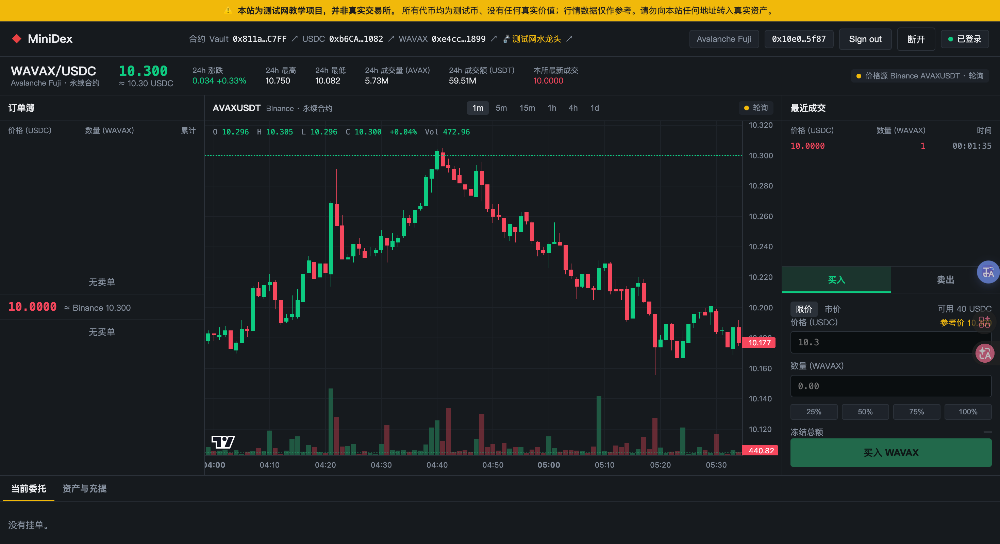
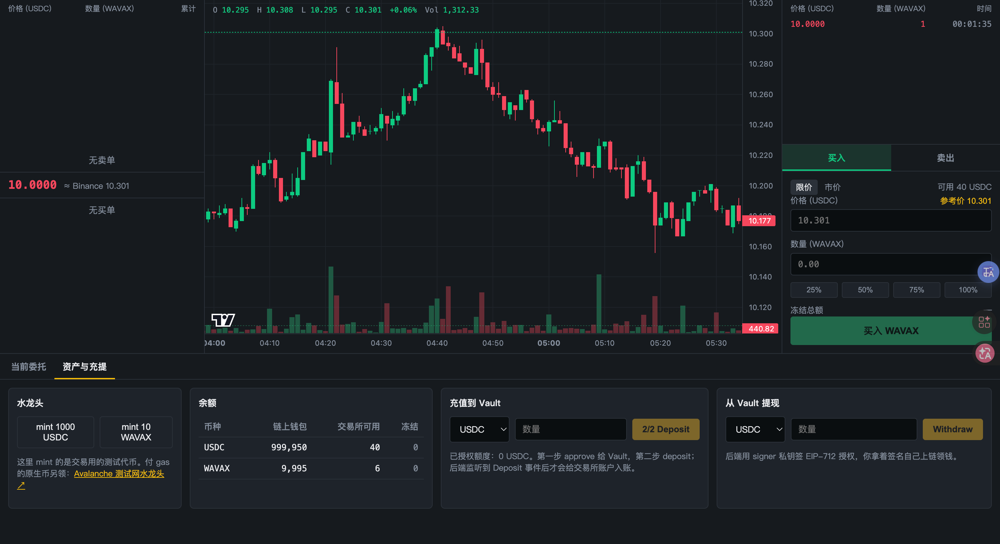
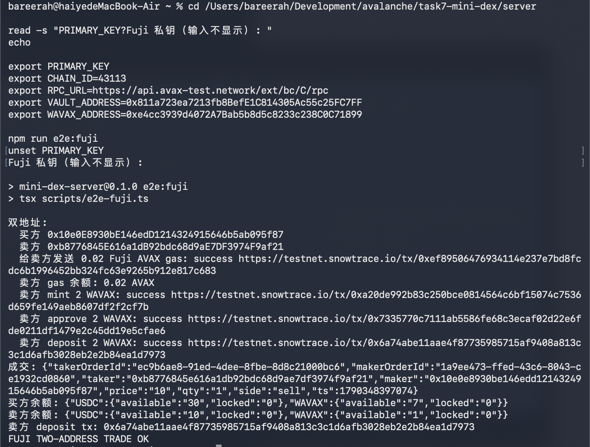

# Task 7 Mini-DEX：基础 60 分提交材料

> 网络：Avalanche Fuji C-Chain（Chain ID `43113`）<br>
> 主测试地址：`0x10e0E8930bE146edD1214324915646b5ab095f87`

## 完成情况

| 必做项 | 分值 | 结果 |
|---|---:|---|
| 1. 撮合引擎 | 20 | ✅ `npm test` 全部通过，已覆盖时间优先和拒绝 self-trade |
| 2. Fuji 合约部署 | 20 | ✅ `forge test` 全部通过，3 个合约已部署，deposit 已上链 |
| 3. 端到端演示 | 20 | ✅ MetaMask 登录、余额、双地址成交、withdraw 均已完成 |
| **总计** | **60** | **✅ 基础必做项全部完成** |

---

## 1. 撮合引擎（20 分）

### 测试结果

```text
Test Files  5 passed
Tests       31 passed
Failures    0
```

复现命令：

```bash
cd server
npm test
npm run typecheck
```

### 时间优先

- 测试位置：`server/src/engine/orderbook.test.ts`
- 同一价格的挂单严格按 FIFO 顺序成交。
- 先挂入订单簿的 maker 会先被撮合。

### 拒绝 self-trade（自成交）

- 当 taker 的实际撮合路径会命中自己的 maker 单时，整单原子拒绝。
- 拒绝后不产生成交，不修改原挂单。
- 路由层会在冻结资金之前拒绝，因此不会留下错误的 locked 余额。
- 相关测试：`server/src/engine/orderbook.test.ts` 和 `server/src/routes.test.ts`。

---

## 2. 合约部署到 Fuji（20 分）

### Forge 测试

```text
Ran 13 tests for test/Vault.t.sol:VaultTest
Suite result: ok. 13 passed; 0 failed; 0 skipped
```

复现命令：

```bash
cd contracts
forge test -vv
```

### 3 个 Fuji 合约地址

| 合约 | 地址 | 部署交易 |
|---|---|---|
| Vault | [`0x811a723ea7213fb8BefE1C814305Ac55c25FC7FF`](https://testnet.snowtrace.io/address/0x811a723ea7213fb8BefE1C814305Ac55c25FC7FF) | [`0xa392a71a331fd9ed687fdbba8a32856fcc5524600910e0b731777601d44b40b9`](https://testnet.snowtrace.io/tx/0xa392a71a331fd9ed687fdbba8a32856fcc5524600910e0b731777601d44b40b9) |
| Mock USDC | [`0xb6CA0f4E1F4F82AFBFBc39aCFd8DfaBdE34E1082`](https://testnet.snowtrace.io/address/0xb6CA0f4E1F4F82AFBFBc39aCFd8DfaBdE34E1082) | [`0x0056b0b171a6be8f070a34691c3d582233237fd0f7cecd59aa2f58a745f4aad6`](https://testnet.snowtrace.io/tx/0x0056b0b171a6be8f070a34691c3d582233237fd0f7cecd59aa2f58a745f4aad6) |
| Mock WAVAX | [`0xe4cc3939d4072A7Bab5b8d5c8233c238C0C71899`](https://testnet.snowtrace.io/address/0xe4cc3939d4072A7Bab5b8d5c8233c238C0C71899) | [`0x65323e06fb4f39ed46bc577f8409a467e4ada3c5c9cc408d44a7908520445ba4`](https://testnet.snowtrace.io/tx/0x65323e06fb4f39ed46bc577f8409a467e4ada3c5c9cc408d44a7908520445ba4) |

### Deposit 交易

- 操作：deposit 100 USDC
- 交易哈希：[`0x6915f24f038f2a5ec6f94a943471b4c23ed437c4401e0974e739f4337ab921f2`](https://testnet.snowtrace.io/tx/0x6915f24f038f2a5ec6f94a943471b4c23ed437c4401e0974e739f4337ab921f2)
- 状态：`success`

补充的 WAVAX deposit：

- 操作：deposit 5 WAVAX
- 交易哈希：[`0x1c2813428aabb7fc5f30165fd8a6da2b3c4e02be785eae1180707b64bb3808d4`](https://testnet.snowtrace.io/tx/0x1c2813428aabb7fc5f30165fd8a6da2b3c4e02be785eae1180707b64bb3808d4)
- 状态：`success`

---

## 3. 端到端演示（20 分）

### 3.1 MetaMask 登录成功

- 钱包：MetaMask
- 网络：Avalanche Fuji
- 地址：`0x10e0E8930bE146edD1214324915646b5ab095f87`
- 页面右上角显示“已登录”。
- Wagmi connector 已显式指定 `metaMask`，同时安装 Core 时不会误跳转到 Core。



### 3.2 余额显示

截图中的交易所可用余额：

| 币种 | 链上钱包 | 交易所可用 | 冻结 |
|---|---:|---:|---:|
| USDC | 999,950 | 40 | 0 |
| WAVAX | 9,995 | 6 | 0 |



### 3.3 两个不同地址完成成交

| 角色 | 地址 | 行为 |
|---|---|---|
| Maker / 买方 | `0x10e0E8930bE146edD1214324915646b5ab095f87` | 买入 1 WAVAX @ 10 USDC |
| Taker / 卖方 | `0xb8776845E616a1dB92bdc68d9aE7DF3974F9af21` | 卖出 1 WAVAX @ 10 USDC |

成交内容：

```json
{
  "maker": "0x10e0e8930be146edd1214324915646b5ab095f87",
  "taker": "0xb8776845e616a1db92bdc68d9ae7df3974f9af21",
  "price": "10",
  "qty": "1",
  "side": "sell"
}
```

成交后余额：

- 买方：30 USDC / 7 WAVAX。
- 卖方：10 USDC / 1 WAVAX。
- 脚本最终校验：`FUJI TWO-ADDRESS TRADE OK`。

卖方链上准备交易：

| 操作 | Fuji 交易哈希 |
|---|---|
| 转入 0.02 AVAX gas | [`0xef89506476934114e237e7bd8fcdc6b1996452bb324fc63e9265b912e817c683`](https://testnet.snowtrace.io/tx/0xef89506476934114e237e7bd8fcdc6b1996452bb324fc63e9265b912e817c683) |
| mint 2 WAVAX | [`0xa20de992b83c250bce0814564c6bf15074c7536d650fe149aeb8607df2f2cf7b`](https://testnet.snowtrace.io/tx/0xa20de992b83c250bce0814564c6bf15074c7536d650fe149aeb8607df2f2cf7b) |
| approve 2 WAVAX | [`0x7335770c7111ab5586fe68c3ecaf02d22e6fde0211df1479e2c45dd19e5cfae6`](https://testnet.snowtrace.io/tx/0x7335770c7111ab5586fe68c3ecaf02d22e6fde0211df1479e2c45dd19e5cfae6) |
| deposit 2 WAVAX | [`0x6a74abe11aae4f87735985715af9408a813c3c1d6afb3028eb2e2b84ea1d7973`](https://testnet.snowtrace.io/tx/0x6a74abe11aae4f87735985715af9408a813c3c1d6afb3028eb2e2b84ea1d7973) |



### 3.4 Withdraw 交易

- 操作：withdraw 50 USDC
- 交易哈希：[`0x21105720a03dc001ad97fd7caa281885b1b80bb18436ee3a59112c9ffe4cd4c4`](https://testnet.snowtrace.io/tx/0x21105720a03dc001ad97fd7caa281885b1b80bb18436ee3a59112c9ffe4cd4c4)
- 状态：`success`
- 提现前后链上 USDC 余额增加 `50,000,000` 最小单位，即 50 USDC。

---

## 4. 代码与提交记录

主要提交：

| Commit | 说明 |
|---|---|
| `8b2433f` | `feat: complete task 7 base requirements` |
| `783db7b` | `docs: record task 7 implementation commit` |
| `c6195e7` | `fix: target MetaMask wallet connector` |
| `5b22dc3` | `docs: record MetaMask connection verification` |

关键实现：

- `server/src/engine/orderbook.ts`：撮合、时间优先和 self-trade prevention。
- `server/src/engine/orderbook.test.ts`：时间优先和自成交拒绝测试。
- `server/src/routes.test.ts`：自成交在资金冻结前拒绝的回归测试。
- `server/scripts/e2e-fuji.ts`：Fuji 双地址成交自动化证明。
- `web/src/lib/chains.ts`：显式锁定 MetaMask connector。

---

## 5. 基础 60 分提交清单

- [x] 代码仓库和提交记录。
- [x] `npm test`：31 passed / 0 failed。
- [x] 时间优先测试。
- [x] 拒绝 self-trade 测试。
- [x] `forge test`：13 passed / 0 failed。
- [x] 3 个 Fuji 合约地址。
- [x] deposit 交易哈希。
- [x] withdraw 交易哈希。
- [x] MetaMask 登录成功截图。
- [x] 余额显示截图。
- [x] 两个不同地址成交截图和链上证明。

## 结论

Task 7 的三个基础必做项均已完成，测试、Fuji 部署、deposit / withdraw 交易、MetaMask 登录、余额展示和双地址成交证据齐全，对应基础部分 **60 / 60 分**。
