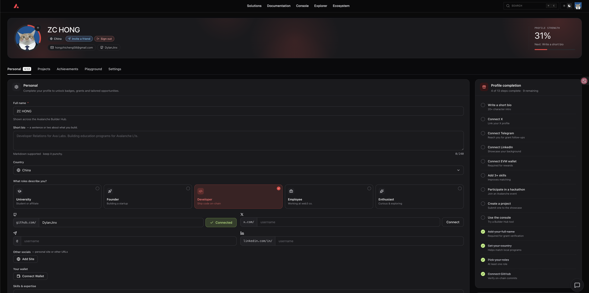
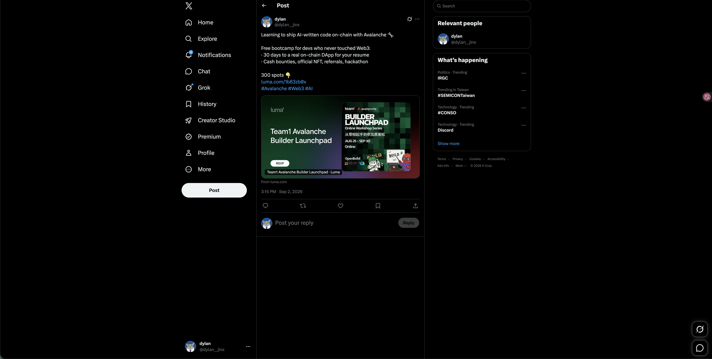

# Task 1：第一章 Avalanche 零基础入门知识

> 对应课程：第一章
> 截止提交：9月6日 24:00:00 (UTC+8)

## 任务一：注册 BuilderHub

注册地址：https://build.avax.network/?ref=ZETMV&utm_source=team1

## 任务二：转发课程报名链接

报名链接：https://luma.com/1b83zb0x
转发平台：推特 / X
推文地址：https://x.com/dylan__jinx/status/2095047882697240812

## 学习收获

Avalanche 的核心是 **Primary Network 三链分工 + 可自定义 L1** 这套架构：

- **P-Chain** 负责验证者注册、质押和 L1 的创建管理
- **X-Chain** 负责资产的发行与转移
- **C-Chain** 是 EVM 兼容的合约链，Solidity 开发都在这里

因为 C-Chain 完全兼容 EVM，以太坊那一套工具（Foundry、MetaMask、OpenZeppelin）可以直接复用，切换成本几乎为零 —— 只要把 RPC 换成 `https://api.avax-test.network/ext/bc/C/rpc`、chainId 换成 `43113` 就能在 Fuji 测试网上开发。

而真正让 Avalanche 区别于其他 EVM 链的是**自定义 L1**：验证者集合、Gas 代币、Gas 机制、合约部署白名单都可以在链级别定制。这解释了为什么 RWA、支付和传统金融机构会选它 —— 这些场景对合规和准入有硬性要求，公开无许可的链满足不了，而在 Avalanche 上可以直接把这些约束写进链的配置里。
