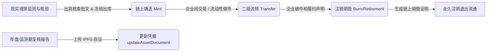
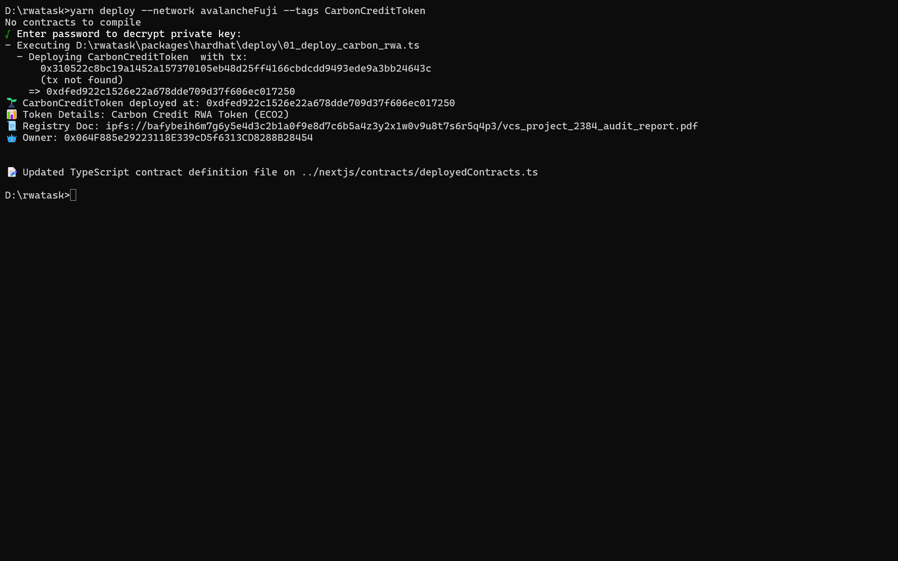
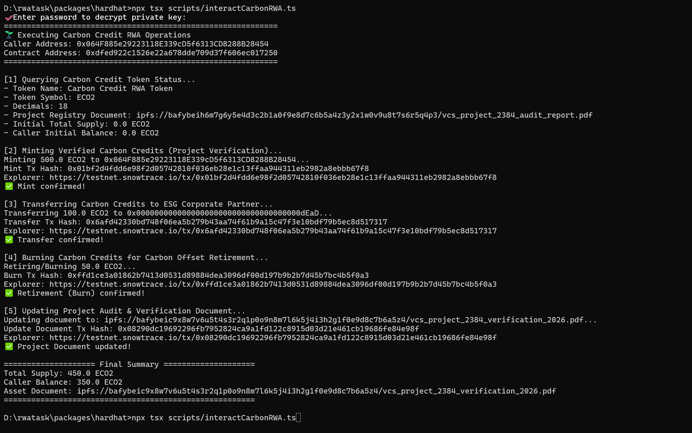

# Avalanche RWA 实战作业报告：核证碳减排信用代币化 (CarbonCreditToken)

## 1. 基础信息

- **学员 GitHub**：`EzraSheep`
- **项目仓库**：`https://github.com/EzraSheep/rwatask`
- **运行网络**：Avalanche Fuji Testnet (Chain ID: `43113`)
- **原生代币**：`AVAX`
- **合约名称**：`CarbonCreditToken`
- **代币代号**：`ECO2`
- **精度规范**：`18 Decimals` (兼容标准 ERC-20 生态)
- **部署合约地址**：[`0xdfed922c1526e22a678dde709d37f606ec017250`](https://testnet.snowtrace.io/address/0xdfed922c1526e22a678dde709d37f606ec017250)

---

## 2. 业务模型：自愿碳减排资产 (VCU) 的链上映射方案

### 2.1 标的现实资产与托管机制
- **资产标的**：经全球权威自愿碳标准机构（如 Verra VCS / Gold Standard）核验签发的自愿碳减排指标（Verified Carbon Units, 简称 VCU）。该指标代表现实世界中经认证的林业碳汇、湿地保护或大型清洁能源发电项目实际避免或消除的温室气体排放。
- **价值锚定标准**：
  $$1\text{ ECO2} = 1.000\text{ 公吨二氧化碳当量减排量 } (1\text{ tCO}_2\text{e})$$
  采用 18 位精度设计，支持精确到 $10^{-18}$ 吨的微量碳汇交易与零售级碳中和抵消。
- **资产托管与审计方**：
  - **登记托管主体**：由 Verra Registry 等国际公认自愿减排注册登记簿维护资产底册，锁定链下实体指标对应的项目序列号（Serial Numbers）。
  - **第三方核验机构**：由受联合国清洁发展机制（CDM）或国家认监委认可的指定经营实体（DOE，如 DNV GL、TÜV SÜD 等）执行周期性现场监测与核查，出具减排量核证报告。

### 2.2 核心业务行为与状态机转换
代币合约严格映射了现实自愿碳市场的完整资产流转闭环：



1. **信用增发 (`mint`)**：
   - 当林业或清洁能源项目通过核验机构的年度审核并获得核证减排量签发时，在链下完成指标序列号锁定的前提下，授权管理员（Registry Admin）调用 `mint()` 向项目业主或初始认购账户发行相应额度的 ECO2。
2. **市场流通 (`transfer`)**：
   - 跨国企业、ESG 投资基金与绿色金融机构在二级市场中转移 ECO2 代币，代表碳减排指标法定持有权益的实时低摩擦交付。
3. **抵消注销 (`burn`)**：
   - 当企业需要冲抵自身生产经营所产生的碳足迹以达成“碳中和 / Net-Zero”履约目标时，调用 `burn()` 将指定数量的 ECO2 永久销毁。该行为在链上留下不可篡改的“碳注销凭证”，彻底杜绝了该笔减排额度被二次转卖或重复计算（Double Counting）的风险。
4. **凭据溯源更新 (`updateAssetDocument`)**：
   - 碳信用具有监测期属性。进入新的核验阶段或完成再审时，合规人员上传更新后的核查报告，并在链上记录新哈希/URI，实现穿透式监管。

---

## 3. 智能合约设计与实现

代码文件：`packages/hardhat/contracts/CarbonCreditToken.sol`

### 3.1 架构要点
- 基于 OpenZeppelin Contracts v5 编写，采用标准继承方式复用工业级安全基底：
  - `ERC20`: 标准代币接口与账本记录。
  - `ERC20Burnable`: 提供合规的代币自主注销能力。
  - `Ownable`: 明确登记机构角色边界。
- 引入自定义 Error（`InvalidRecipient`、`InvalidAmount`、`InvalidAssetDocument`），优化 Gas 开销并提升异常诊断透明度。
- 为关键的凭据更新操作提供独立事件 `AssetDocumentUpdated(string oldDoc, string newDoc, address indexed admin)`，确保链下索引系统（如 The Graph 或后端监控）可实时侦测凭证版本更迭。

### 3.2 关键接口规范
```solidity
// 铸造核证碳信用：仅限所有者/登记机构执行
function mint(address to, uint256 amount) external onlyOwner;

// 注销抵消碳信用：持币主体自行调用，达成自愿碳中和
function burn(uint256 amount) public override;

// 资产证明更新：变更 IPFS 报告指针并触发事件
function updateAssetDocument(string calldata newDocument) external onlyOwner;

// 资产证明读取：公开读取项目当前权威文档 URI
function assetDocument() external view returns (string memory);
```

---

## 4. 本地测试与场景验证

测试文件：`packages/hardhat/test/CarbonCreditToken.ts`

针对 RWA 代币的所有核心边界条件设计了 5 个测试模块，共 18 项自动化测试，涵盖：
- 合约部署与 ERC-20 元数据完整性。
- 非空初始资产证明校验与非法部署回退。
- 管理员铸造权限判定与非授权调用拦截（自定义错误断言）。
- 零地址及零数量防御机制。
- 二级市场转账一致性与超额转账回退。
- 持有者碳注销销毁与总供应量实时削减。
- 资产证明文档多版本迭代与非法更新拦截。

### 运行结果
```bash
  CarbonCreditToken (RWA Carbon Offset Test Suite)
    1. Contract Deployment & Metadata Verification
      ✔ Should deploy successfully to a valid address (182ms)
      ✔ Should configure correct name, symbol, and 18 decimals
      ✔ Should initialize with zero total supply and assign the correct administrator
      ✔ Should store initial verification & registry document URI
      ✔ Should reject deployment if asset document is empty string
    2. Carbon Credit Minting & Authorization Controls
      ✔ Should allow authorized owner to mint carbon credits and update balances
      ✔ Should prevent non-owner account from minting carbon credits
      ✔ Should revert minting to zero address
      ✔ Should revert minting zero tokens
    3. Secondary Market Transfers
      ✔ Should permit token holders to transfer carbon credits to peers
      ✔ Should reject transfer when sender has insufficient balance
    4. Carbon Offset Retirement (Token Burning)
      ✔ Should allow credit holder to burn tokens for carbon neutrality retirement
      ✔ Should reject burning more tokens than the holder balance
    5. Registry Document & Audit Lifecycle
      ✔ Should allow owner to update registry audit report and emit AssetDocumentUpdated
      ✔ Should prevent unauthorized account from updating registry document
      ✔ Should reject updating registry document with empty string

  18 passing (429ms)
```

---

## 5. Avalanche Fuji 测试网实测数据

### 5.1 部署与初始参数
- **部署账户 (Owner)**：`0x064F885e29223118E339cD5f6313CD8288B28454`
- **合约部署交易 Hash**：[`0x310522c8bc19a1452a157370105eb48d25ff4166cbdcdd9493ede9a3bb24643c`](https://testnet.snowtrace.io/tx/0x310522c8bc19a1452a157370105eb48d25ff4166cbdcdd9493ede9a3bb24643c)
- **初始资产证明 URI**：  
  `ipfs://bafybeih6m7g6y5e4d3c2b1a0f9e8d7c6b5a4z3y2x1w0v9u8t7s6r5q4p3/vcs_project_2384_audit_report.pdf`

### 5.2 链上交互跟踪实录
通过交互脚本 `packages/hardhat/scripts/interactCarbonRWA.ts` 完成以下完整业务调用：

| 序号 | 操作类型 | 业务参数与描述 | 链上交易 Hash | 区块浏览器详情 |
| :---: | :--- | :--- | :--- | :---: |
| **01** | **铸造发行 (Mint)** | 减排核证入库，为管理账户铸造 `500.0 ECO2` (对应 500 吨减排量) | `0x01bf2d4fdd6e98f2d05742810f036eb28e1c13ffaa944311eb2982a8ebbb67f8` | [查看交易](https://testnet.snowtrace.io/tx/0x01bf2d4fdd6e98f2d05742810f036eb28e1c13ffaa944311eb2982a8ebbb67f8) |
| **02** | **二级流转 (Transfer)** | 场外企业采购，向目标账户转让 `100.0 ECO2` | `0x6afd42330bd748f06ea5b279b43aa74f61b9a15c47f3e10bdf79b5ec8d517317` | [查看交易](https://testnet.snowtrace.io/tx/0x6afd42330bd748f06ea5b279b43aa74f61b9a15c47f3e10bdf79b5ec8d517317) |
| **03** | **注销抵消 (Burn)** | 企业声明年度碳抵消，永久注销出库 `50.0 ECO2` | `0xffd1ce3a01862b7413d0531d89884dea3096df00d197b9b2b7d45b7bc4b5f0a3` | [查看交易](https://testnet.snowtrace.io/tx/0xffd1ce3a01862b7413d0531d89884dea3096df00d197b9b2b7d45b7bc4b5f0a3) |
| **04** | **更新凭证 (Update Doc)** | 上传最新监测期核查报告，更新为 Q4 报告 URI | `0x08290dc19692296fb7952824ca9a1fd122c8915d03d21e461cb19686fe84e98f` | [查看交易](https://testnet.snowtrace.io/tx/0x08290dc19692296fb7952824ca9a1fd122c8915d03d21e461cb19686fe84e98f) |

#### 终态校验：
- **总供应量 (Total Supply)**: $500 - 50 = 450.0\text{ ECO2}$
- **调用者余额 (Balance)**: $500 - 100 - 50 = 350.0\text{ ECO2}$
- **最新资产文档 URI**:  
  `ipfs://bafybeic9x8w7v6u5t4s3r2q1p0o9n8m7l6k5j4i3h2g1f0e9d8c7b6a5z4/vcs_project_2384_verification_2026.pdf`

---

## 6. 运行成果与验证截图


### Avalanche Fuji 测试网部署过程与合约初始化
编译部署全过程、网络交互确认、合约部署地址与初始配置输出。


### 自动化交互脚本全流程实测记录
从初始状态读取、Mint 铸造入库、Transfer 交易、Burn 碳注销到 Update Document 的 4 笔链上交易执行 Hash 及终态对账输出。


---

## 7. 风险评估与现实世界边界思考

1. **预言机与链下双花风险 (Registry Double Spending & Oracles)**：
   - 链上能够确保 Token 在 Web3 账户体系内的守恒与透明流转，但无法凭空制约链下中心化登记簿。若项目方在链下向第三方传统买家私自转移已上链额度，将引发“碳双花”。在生产方案中，应当推动链下登记簿（如 Verra API）与链上智能合约建立双向原子锁定（Two-way Bridge），配合去中心化预言机网络实时推送准备金证明（Proof of Reserve）。
2. **逆转风险与缓冲池机制 (Permanence & Buffer Pools)**：
   - 现实中的林业造林项目可能因森林火灾、病虫害等意外导致已固定的碳再次释放。传统碳标准通过设立未分配的“缓冲池（Buffer Pool）”吸收损失。RWA 智能合约后续可扩展出“惩罚扣减（Slashing）”或“保险准备金金库”机制，提升链上代币抵御现实自然灾害的稳健性。
