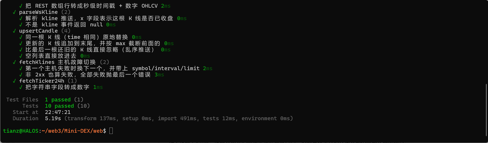
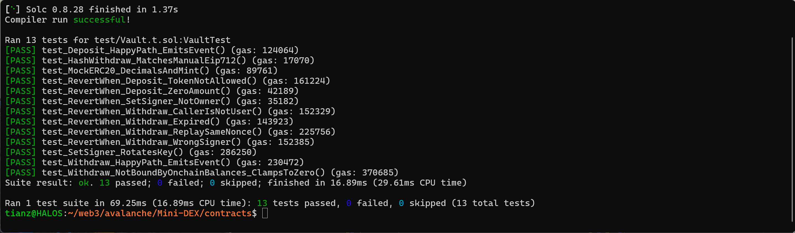
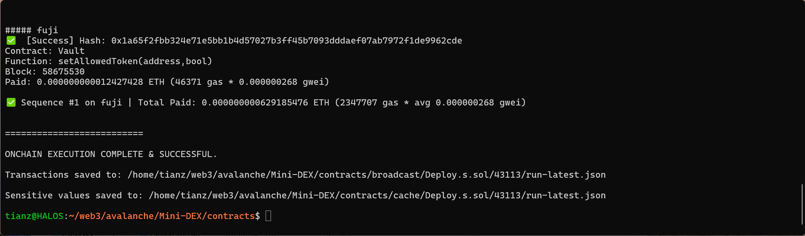
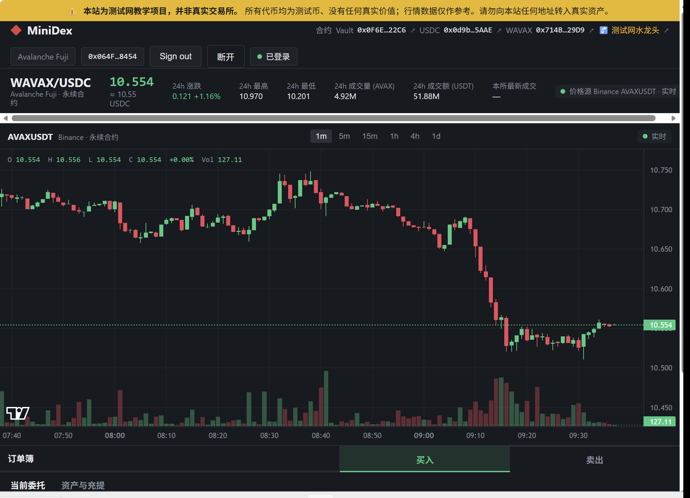
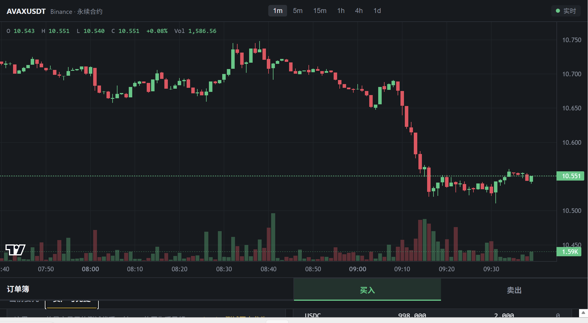
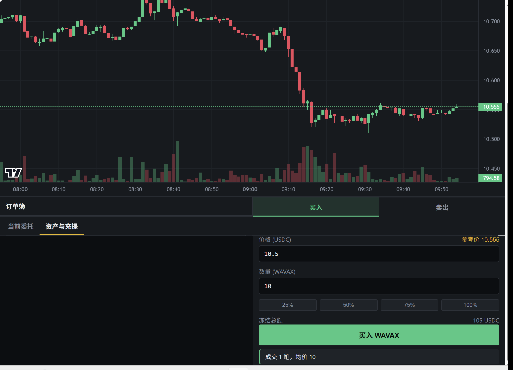

提交物清单
- npm test 与 forge test 全绿的证明。

  - 3 个 Fuji 合约地址。
* VAULT_ADDRESS=0x0F6E783fa2eD1741EBF3003A3fA22080CA2c22C6                                                                                            
* USDC_ADDRESS=0x0d9b618b3E1d443E0bA65918859E700566C95AAE                                                                                             
* WAVAX_ADDRESS=0x714B71aC82029f37FadB38C893Ffb192541629D9                                                                                            

- deposit 和 withdraw 的交易哈希。
#### deposit 
https://testnet.snowtrace.io/tx/0x03acf2627066be8b08b3c374b553d5686895fa58a566893297c0f9737c78d5d2?__cf_chl_rt_tk=oD1mUMGenEIq5SlZAcUZ.5KFTeq1Md0lGmP.Szn60Ww-1790414033-1.0.1.1-xXL7MM3GaPUTfm89Lhet7Uj8u6jq4ScUMDa7HpYBjxI

#### withdraw 
https://testnet.snowtrace.io/tx/0x078568555fb0a4bf432fe81f8fc61b0a30322cf67cd03034d740278d73bf2d94

- 登录、余额、两地址成交的截图。

