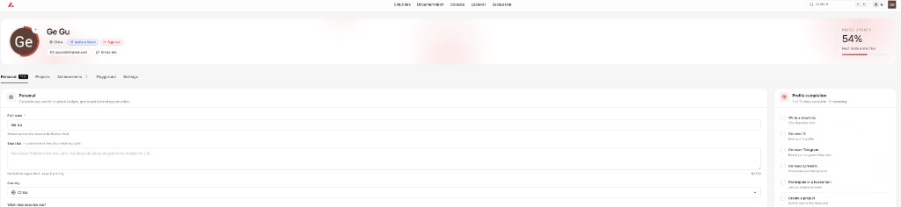
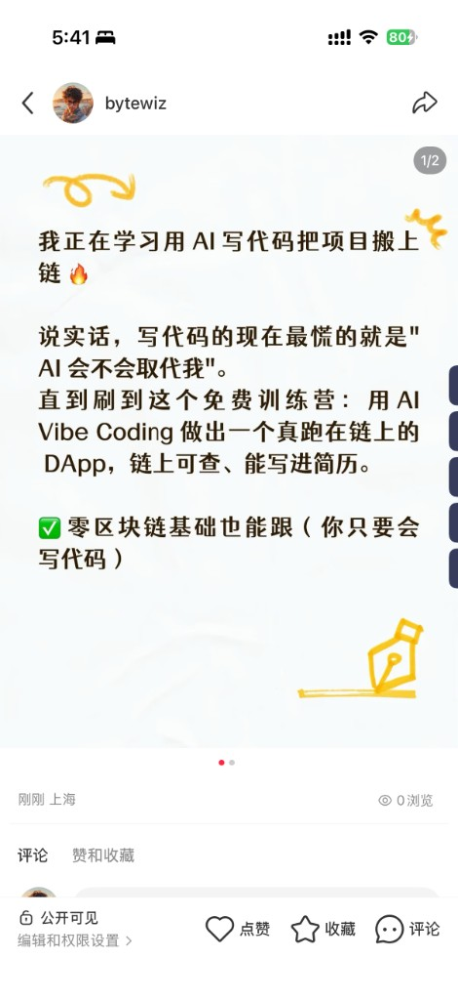

# Task 1：<第一章 Avalanche零基础入门知识>

> 对应课程：第一章
> 截止提交：<9月6日> 24:00:00 (UTC+8)
> 提交人：Groos-dev

## 任务目标

任务一：截图：注册完成 [BuilderHub](https://build.avax.network/?ref=ZETMV&utm_source=team1) 的截图

任务二：转发本 [课程报名链接](https://luma.com/1b83zb0x) 至小红书/推特/200+微信社群/微信朋友圈，并截图保存提交

已转发到小红书。

## 提交方式

1. 复制本文件到 `learn/<YourName>/task1.md`。
2. 在文件中**补充你的答案、代码或截图**。
3. 在群内接龙 已完成并附上本 PR 链接。
4. 提交 PR 到本仓库，**标题格式**：`[Task1] <YourName>`。

## 截止时间

<9月6日> 24:00:00 (UTC+8)。截止后提交的作业没有奖励。
