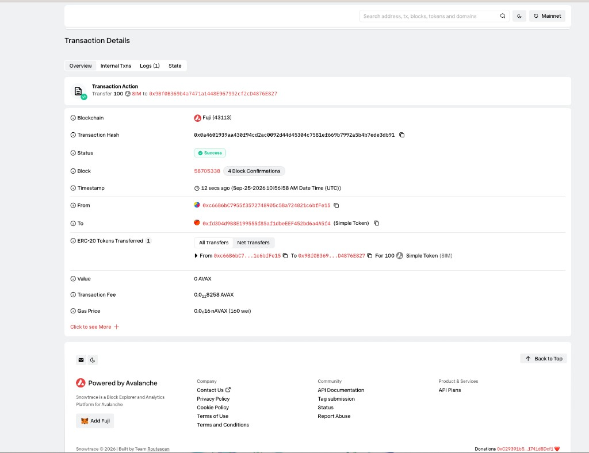

# Task 2：第二章 Vibe Coding 开发你的第一个 DApp

> 提交人：Groos-dev

## 任务成果

用 Scaffold-ETH 2 在 Avalanche Fuji 测试网部署 ERC20 合约 `SimpleErc20`。

| 项目 | 内容 |
| --- | --- |
| 网络 | Avalanche Fuji 测试网（chainId `43113`） |
| 合约名 | `SimpleErc20` |
| 代币 | Simple Token（SIM） |
| 初始供应量 | 1000 SIM（18 位小数） |
| 合约地址 | [`0xfd3d4d9b8e199555f85af1dbeeef452bd6a4a5f4`](https://testnet.snowtrace.io/address/0xfd3d4d9b8e199555f85af1dbeeef452bd6a4a5f4) |
| 部署者 | `0xc66B6bC7955f3572748905c5Ba724021c6bfFe15` |
| 转账交易 | [`0x0a4601939aa430f94cd2ac0092d44d45304c7581ef669b7992a5b4b7ede3db91`](https://testnet.snowtrace.io/tx/0x0a4601939aa430f94cd2ac0092d44d45304c7581ef669b7992a5b4b7ede3db91) |
| 收款地址 | `0x9Bf0B369b4a7471a1448E967992cf2cD4876E827` |

部署后先由部署者持有 1000 个 SIM。随后转出 100 个，部署者剩 900 个，收款地址有 100 个。

