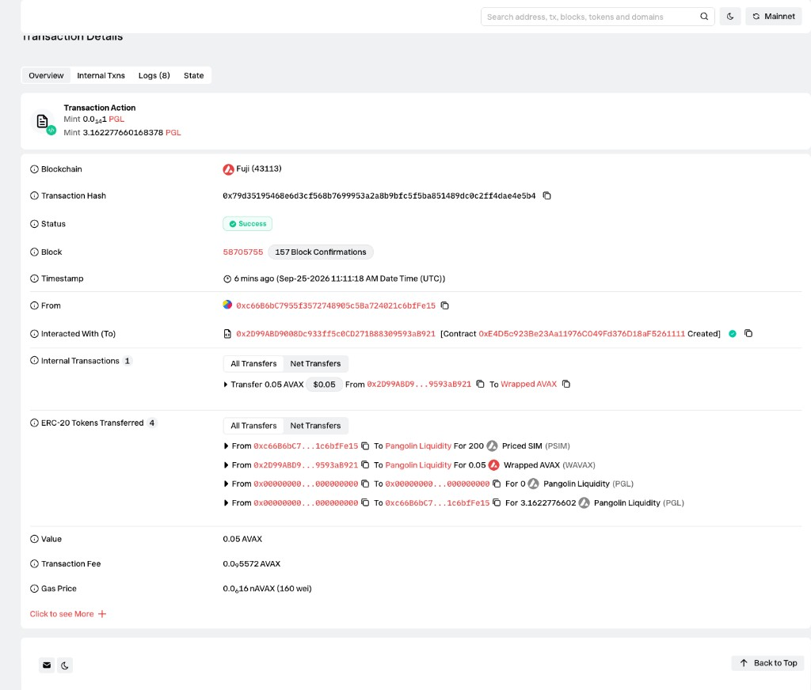
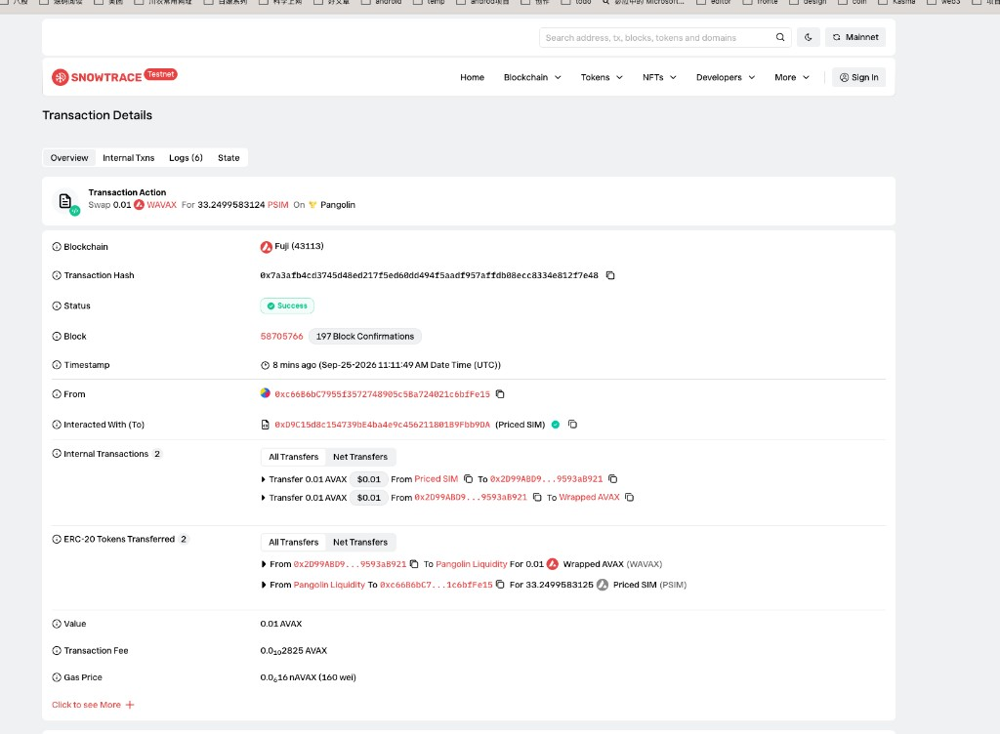

# Task 3：使用 DEX Oracle 获取代币价格

> 提交人：Groos-dev
> 网络：Avalanche Fuji 测试网（chainId `43113`）

## 使用的去中心化交易所

Pangolin V2。价格来自交易对储备，通过路由合约 `getAmountsOut` 读取。

| 组件 | 地址 |
| --- | --- |
| Pangolin Router | [`0x2D99ABD9008Dc933ff5c0CD271B88309593aB921`](https://testnet.snowtrace.io/address/0x2D99ABD9008Dc933ff5c0CD271B88309593aB921) |
| Pangolin Factory | [`0xE4A575550C2b460d2307b82dCd7aFe84AD1484dd`](https://testnet.snowtrace.io/address/0xE4A575550C2b460d2307b82dCd7aFe84AD1484dd) |
| WAVAX | [`0xd00ae08403B9bbb9124bB305C09058E32C39A48c`](https://testnet.snowtrace.io/address/0xd00ae08403B9bbb9124bB305C09058E32C39A48c) |

## 两种代币和交易对

| 角色 | 名称 | 地址 |
| --- | --- | --- |
| Token A | Priced SIM（PSIM） | [`0xd9c15d8c154739be4ba4e9c456211801b9fbb9da`](https://testnet.snowtrace.io/address/0xd9c15d8c154739be4ba4e9c456211801b9fbb9da) |
| Token B | WAVAX | [`0xd00ae08403B9bbb9124bB305C09058E32C39A48c`](https://testnet.snowtrace.io/address/0xd00ae08403B9bbb9124bB305C09058E32C39A48c) |
| 交易对 | PSIM / WAVAX | [`0xE4D5c923Be23Aa11976C049Fd376D18aF5261111`](https://testnet.snowtrace.io/address/0xE4D5c923Be23Aa11976C049Fd376D18aF5261111) |

部署了带授权和定价函数的 PSIM。部署交易：[`0x44d176e80f21b20006cd594dd57c55819fe699b92060d890527bd4798812b681`](https://testnet.snowtrace.io/tx/0x44d176e80f21b20006cd594dd57c55819fe699b92060d890527bd4798812b681)。

授权 Pangolin 使用 200 个 PSIM：[`0x2a6afec3c164c3451dd72919bebe3aee47d67bbbbe9dcfafeb5837465d2e1da0`](https://testnet.snowtrace.io/tx/0x2a6afec3c164c3451dd72919bebe3aee47d67bbbbe9dcfafeb5837465d2e1da0)。

放入流动性（200 个 PSIM 和 0.05 个测试币）：[`0x79d35195468e6d3cf568b7699953a2a8b9bfc5f5ba851489dc0c2ff4dae4e5b4`](https://testnet.snowtrace.io/tx/0x79d35195468e6d3cf568b7699953a2a8b9bfc5f5ba851489dc0c2ff4dae4e5b4)。



购买之后，交易对储备约为 0.06 个 WAVAX 和 166.75 个 PSIM。

## 获取价格的代码

`previewBuy` 向 Pangolin 路由询问：付出一定数量的测试币，能换回多少 PSIM。

```solidity
function previewBuy(uint256 avaxIn) public view returns (uint256 simOut) {
    address[] memory path = new address[](2);
    path[0] = wavax;
    path[1] = address(this);
    simOut = router.getAmountsOut(avaxIn, path)[1];
}
```

## 业务里使用这个价格

`buy` 先读报价，再按这个数量通过路由成交。成交数量写入 `Bought` 事件。

```solidity
function buy(uint256 minSimOut) external payable {
    require(msg.value > 0, "no avax");
    uint256 quoted = previewBuy(msg.value);
    require(quoted >= minSimOut, "slippage");
    address[] memory path = new address[](2);
    path[0] = wavax;
    path[1] = address(this);
    uint256[] memory amounts = router.swapExactAVAXForTokens{value: msg.value}(
        minSimOut, path, msg.sender, block.timestamp + 10 minutes
    );
    emit Bought(msg.sender, msg.value, quoted, amounts[1]);
}
```

## 购买结果

购买交易：[`0x7a3afb4cd3745d48ed217f5ed60dd494f5aadf957affdb08ecc8334e812f7e48`](https://testnet.snowtrace.io/tx/0x7a3afb4cd3745d48ed217f5ed60dd494f5aadf957affdb08ecc8334e812f7e48)



| 项目 | 结果 |
| --- | --- |
| 状态 | 成功 |
| 调用者 | `0xc66B6bC7955f3572748905c5Ba724021c6bfFe15` |
| 付出 | 0.01 个测试币 |
| 报价 | 33.249958312489578122 个 PSIM |
| 实际收到 | 33.249958312489578122 个 PSIM |

报价和实际收到的数量相同，说明买入数量来自 Pangolin，不是合约里写死的数字。

源码见同目录的 `PricedSim.sol`。
