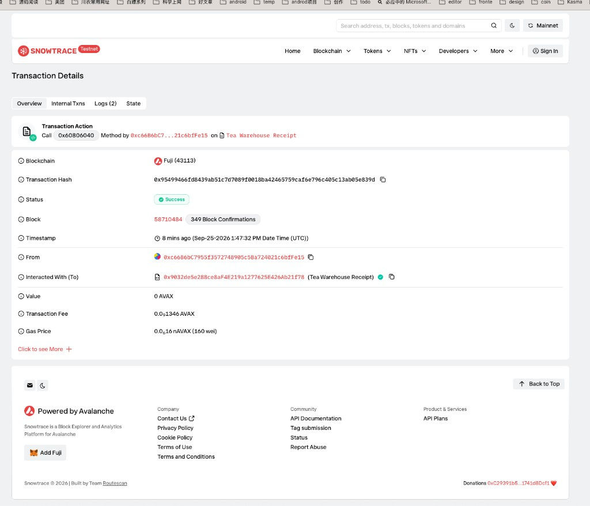
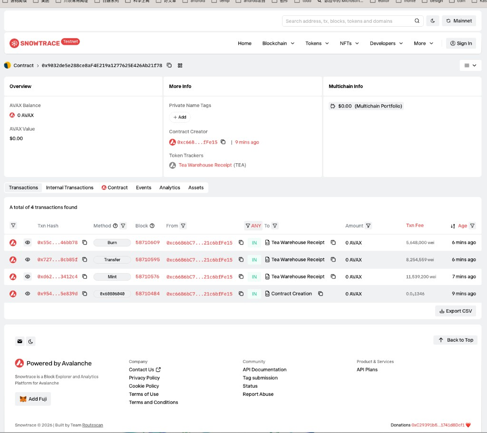
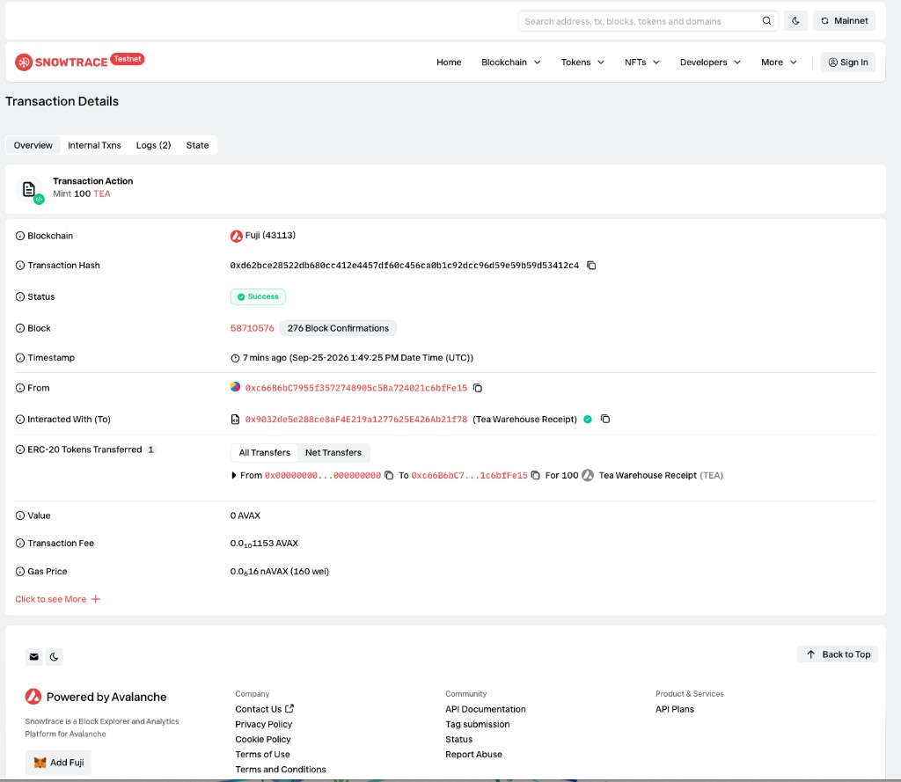
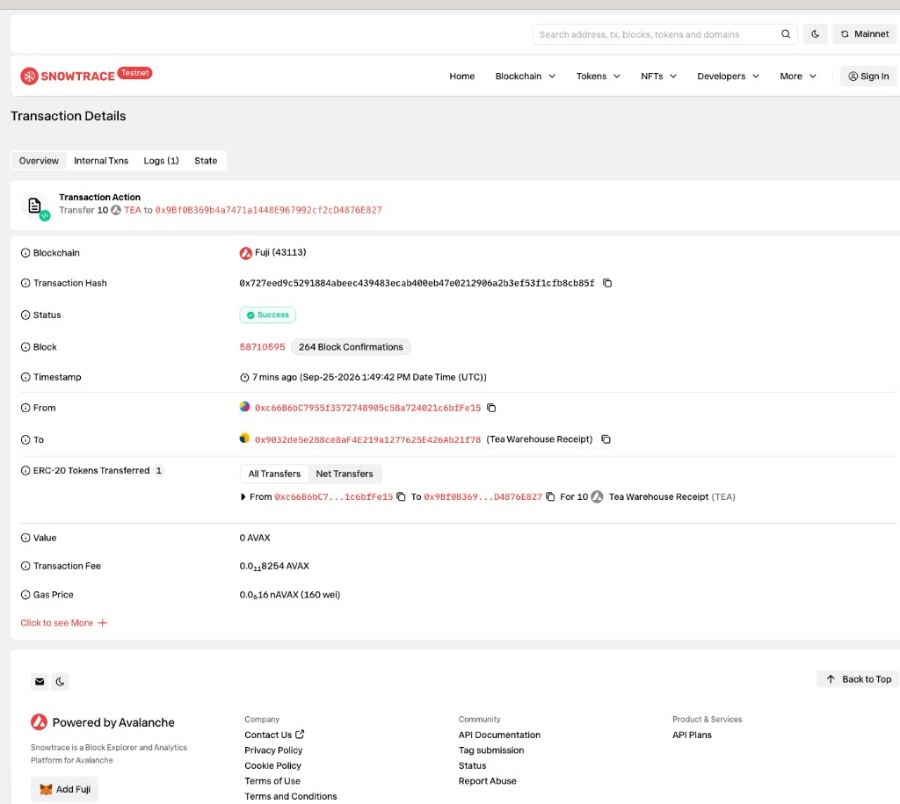
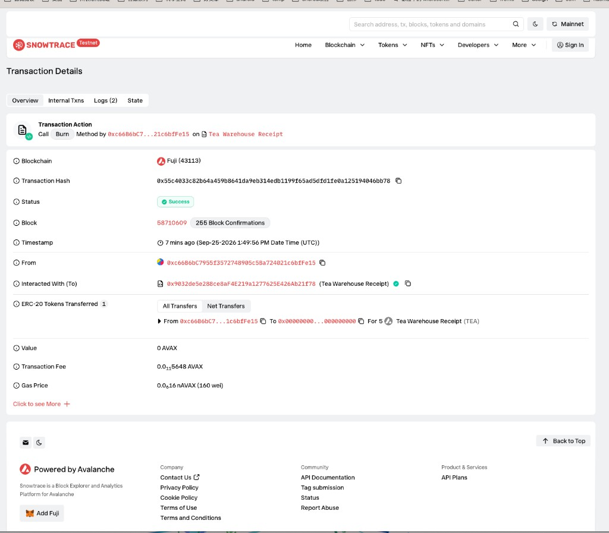

# Task 5：茶叶仓单代币

本作业只用于技术学习和业务模拟，不涉及真实茶叶、资产募集或金融产品发行。

## 1. 学员信息

- GitHub 用户名：Groos-dev
- 作业仓库：https://github.com/Groos-dev/Avalanche-101-Bootcamp
- 合约代码：同仓库 `learn/Groos-dev/task5/TeaWarehouseReceipt.sol`
- 测试代码：同仓库 `learn/Groos-dev/task5/TeaWarehouseReceipt.test.ts`

## 2. 项目说明

合约名称是 Tea Warehouse Receipt，符号是 TEA。1 个 TEA 代表 1 公斤已经放入监管仓库的茶叶。代币本身不是茶叶，只是这批货的提取凭证。

| 项目 | 说明 |
| --- | --- |
| 现实资产 | 存放在监管仓库里的茶叶 |
| 资产权益 | 按公斤提取这批茶叶的权利 |
| 对应关系 | 1 TEA = 1 公斤茶叶 |
| 托管方 | 部署合约的仓库管理员 `0xc66B6bC7955f3572748905c5Ba724021c6bfFe15` |
| 资产证明 | 仓单编号 `WH-TEA-2026-001`，保存在合约的 `assetDocument` |

仓单编号在真实项目里可以换成仓库出具的文件地址或文件哈希，用来说明这批代币对应哪一张线下凭证。这次没有连接真实仓库，编号只作为模拟证明。只有仓库管理员能修改它。

| 链上动作 | 业务含义 |
| --- | --- |
| 发行 | 茶叶入库，按公斤签发仓单 |
| 转账 | 仓单转让给别人，提货权一起转移 |
| 销毁 | 持有人提货出库，对应凭证注销 |
| 修改仓单编号 | 仓库更换这批货的证明文件 |

风险边界：链上记录不能证明仓库里真的有茶叶。如果线下货物短少、重复开单，或者管理员私钥丢失，合约不会自动发现。销毁只减少代币，不会通知真实仓库出库。

## 3. 合约信息

- 网络：Avalanche Fuji 测试网，链标识 `43113`
- 合约地址：[`0x9032de5e288ce8aF4E219a1277625E426Ab21f78`](https://testnet.snowtrace.io/address/0x9032de5e288ce8aF4E219a1277625E426Ab21f78)
- 部署交易：[`0x95499466fd8439ab51c7d7089f0018ba42465759caf6e796c405c13ab05e839d`](https://testnet.snowtrace.io/tx/0x95499466fd8439ab51c7d7089f0018ba42465759caf6e796c405c13ab05e839d)

合约继承 OpenZeppelin 的同质化代币和所有者权限。部署后名称为 Tea Warehouse Receipt，符号为 TEA，小数位 18，总供应量为 0，所有者是部署者。

## 4. 功能说明

- 发行 `mint`：只有仓库管理员可以调用。
- 销毁 `burn`：持有人销毁自己的余额。余额不足时交易失败。
- 转账 `transfer`：持有人把仓单转给其他地址。
- 余额 `balanceOf`、总供应量 `totalSupply` 可以查询。
- 仓单编号 `assetDocument` 可以读取。`updateAssetDocument` 只有仓库管理员可以调用。
- 发行、销毁和修改编号都会写出事件。

本地测试覆盖了这些情况：部署后的名称和空供应量、管理员可以发行、其他地址不能发行、持有人可以转账和销毁、供应量和余额同步变化、其他地址不能修改仓单编号、超额销毁会被拒绝。4 项测试通过。

## 5. 测试网结果

| 步骤 | 交易 | 结果 |
| --- | --- | --- |
| 部署 | [`0x95499466…`](https://testnet.snowtrace.io/tx/0x95499466fd8439ab51c7d7089f0018ba42465759caf6e796c405c13ab05e839d) | 成功，创建合约 |
| 发行 100 TEA | [`0xd62bce28…`](https://testnet.snowtrace.io/tx/0xd62bce28522db680cc412e4457df60c456ca0b1c92dcc96d59e59b59d53412c4) | 从零地址铸给仓库管理员 |
| 转账 10 TEA | [`0x727eed9c…`](https://testnet.snowtrace.io/tx/0x727eed9c5291884abeec439483ecab400eb47e0212906a2b3ef53f1cfb8cb85f) | 转到 `0x9Bf0B369b4a7471a1448E967992cf2cD4876E827` |
| 销毁 5 TEA | [`0x55c4033c…`](https://testnet.snowtrace.io/tx/0x55c4033c82b64a459b8641da9eb314edb1199f65ad5dfd1fe0a125194046bb78) | 仓库管理员的 5 个 TEA 烧掉 |

完成后链上状态：总供应量 95 TEA，仓库管理员余额 85 TEA，第二个钱包余额 10 TEA，仓单编号仍是 `WH-TEA-2026-001`。

## 6. 截图

部署成功：

区块浏览器中的合约：

发行 100 个 TEA：

转账 10 个 TEA：

销毁 5 个 TEA：

