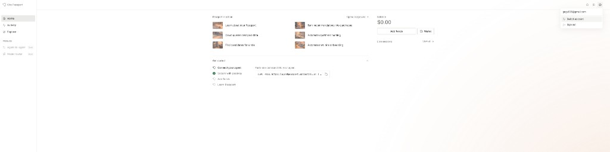

# Task 6：Kite Agent Passport

> 提交人：Groos-dev

这一份是当前进度。注册、领取测试币和命令行安装已经完成。网页练习场里没有招聘智能体，买家确认交付并释放资金这一步还没有做。

## 注册并登录

站点：https://passport-web.dev.gokite.ai/

登录账号：`groos1@gmail.com`

## 钱包和测试币

钱包地址：`0x094b141Ade317EB512FB06796b2c6FCf2011AE5A`

在 Circle 水龙头领取，代币是 USDC，网络是 Arc Testnet。领取交易：

https://testnet.arcscan.app/tx/0xf08f3732ec52922b2712e39a283c413fe4e6e07bce80a1ece78406747a0e8091

这笔交易状态成功。地址收到 20 个测试 USDC。上面的首页截图是到账前拍的，页面上当时还显示 `$0.00`。

## 命令行

已安装 Kite Passport 命令行，版本 `kpass 1.10.1`，路径 `/Users/groos/.kpass/bin/kpass`。

命令行当前没有登录，也还没有创建买家智能体。它默认连接的是正式环境 `https://passport.prod.gokite.ai`，和网页上的开发测试环境不是同一个余额。

## 还没有完成的部分

网页左侧现在是 Home、Activity、Explorer，没有作业说明里的 Playground，也没有 Recruiting Agent (SDK)。所以下面三项还没有截图：

- 发起招聘交互
- 对方返回结果
- 买家接受交付并释放资金
