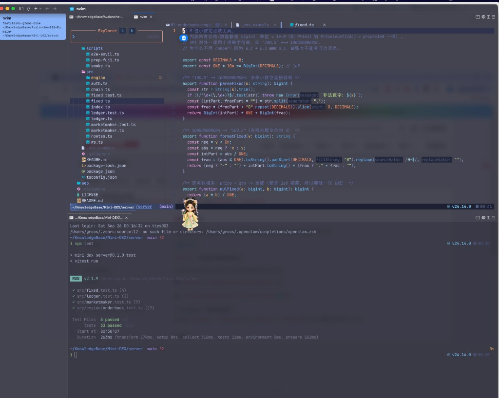
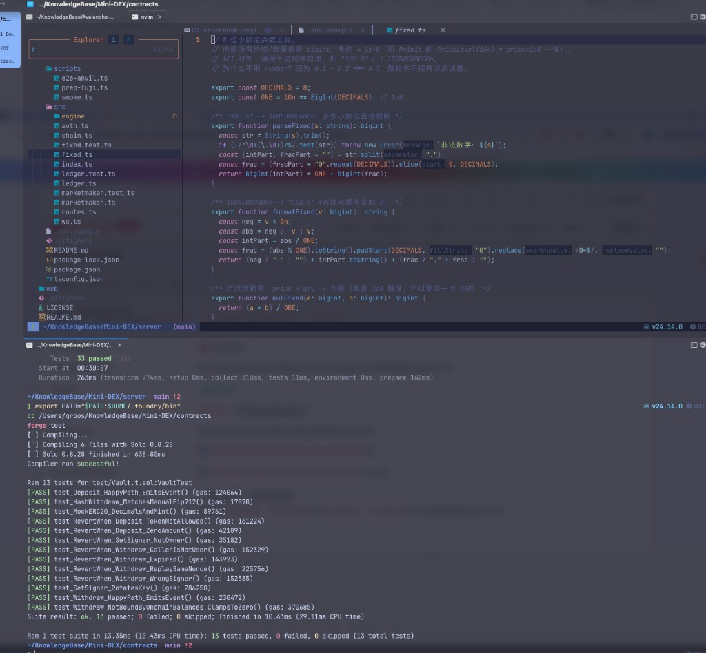
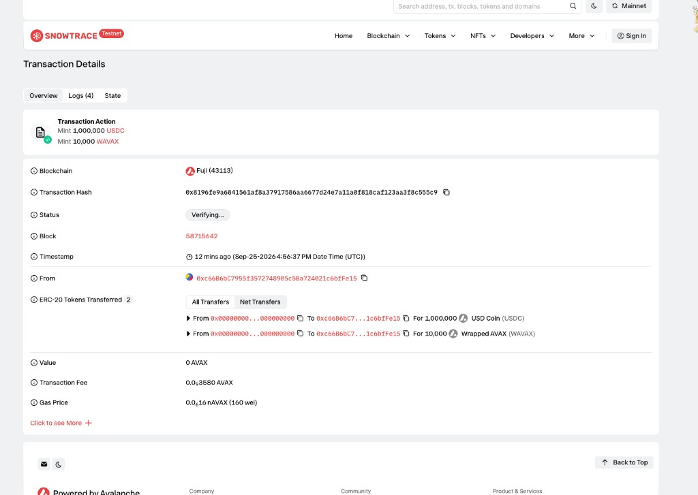
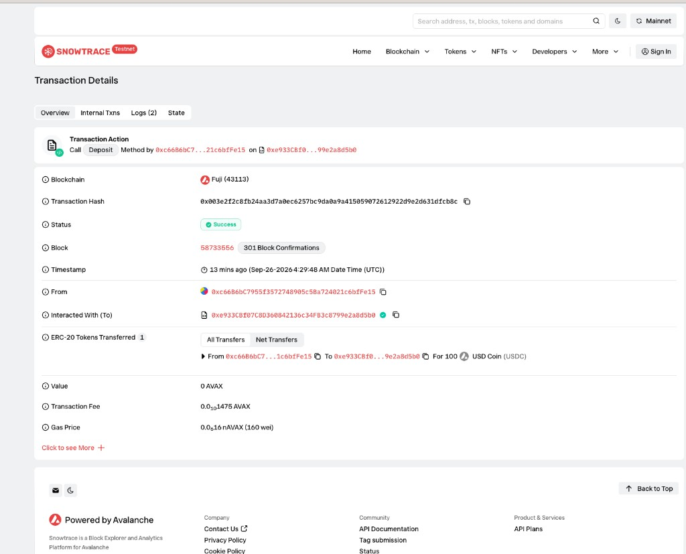
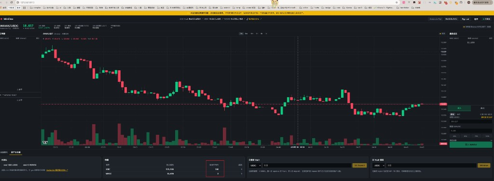
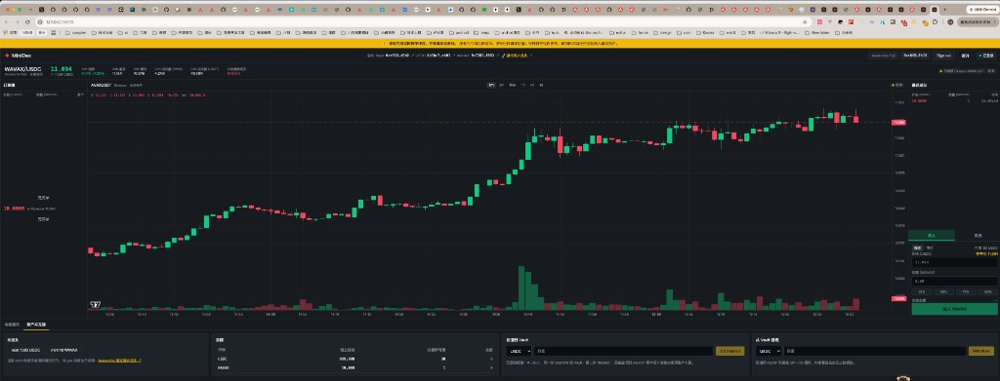
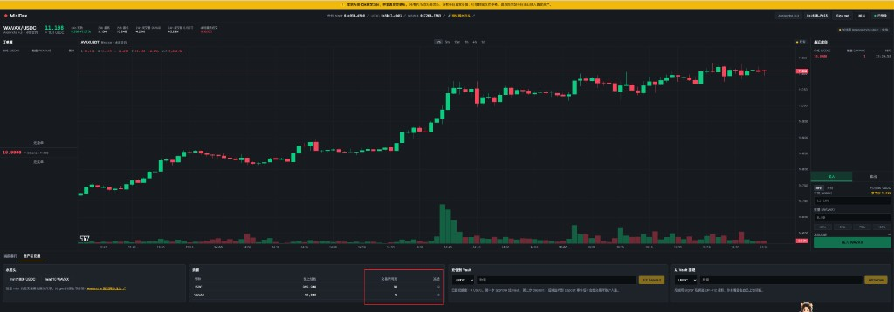
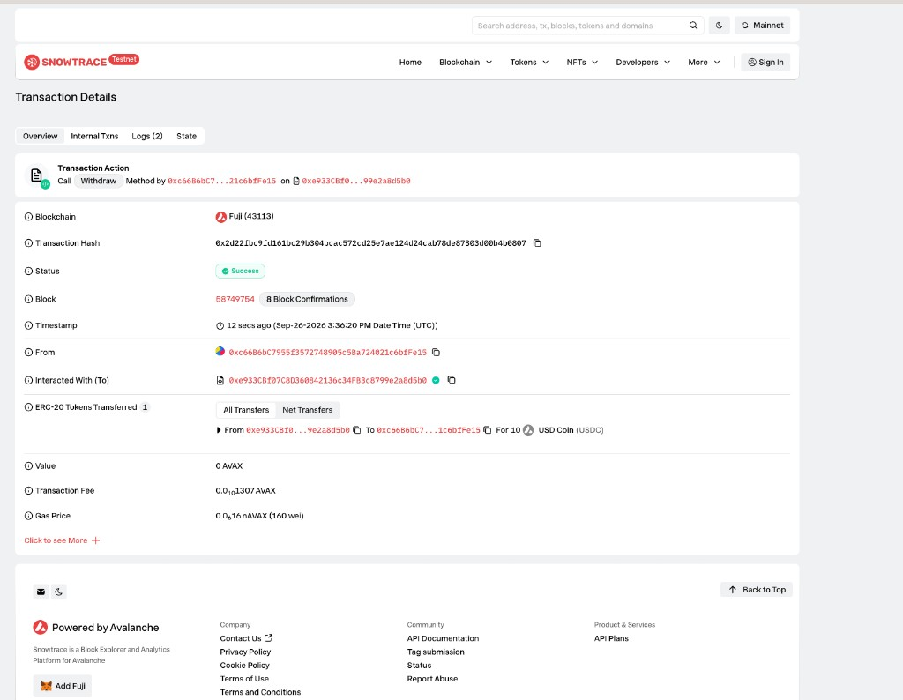

# Task 7 Mini-DEX

必做三项都已完成：撮合引擎、Fuji 部署、端到端演示。进阶项没有做。

代码改动在本目录的 `code/`。合约来自 [tubexchat/Mini-DEX](https://github.com/tubexchat/Mini-DEX)。部署时私钥留在 MetaMask 里，由钱包签名。

## 1. 撮合引擎

`server` 目录执行 `npm test`：4 个测试文件、33 个用例全部通过。其中 `orderbook.test.ts` 有 17 个用例。

时间优先：同价时按提交顺序成交。卖侧原有用例「时间优先：同价 FIFO」。本次补了买侧用例「时间优先：买侧同价按提交顺序成交」。成交价取挂单方的价格。

拒绝自己和自己成交，补了 4 个用例：

- 同地址的挂单不会被自己成交
- 市价单也不会吃自己的挂单
- 整档都是自己的单时，继续看下一档
- 同一档里跳过自己的单，其他人仍按时间优先

实现在 `code/orderbook.ts`。撮合按价格档和档内订单逐个看。对手单的地址和吃单地址相同就跳过。一整档都是自己的单时，不停止撮合，继续下一档。

## 2. Fuji 部署

`contracts` 目录执行 `forge test`：Vault 测试 13 个用例全部通过。

三个合约部署在 Avalanche Fuji，链编号 43113。一次钱包签名通过 `code/MiniDexDeployer.sol` 完成部署，并给部署者铸造了 1,000,000 个测试 USDC 和 10,000 个测试 WAVAX。

| 合约 | 地址 |
|---|---|
| Vault | `0xe933CBf07C8D360842136c34FB3c8799e2a8d5b0` |
| USDC | `0x5BC72142d889aA6B445869DeB22b3C1dfa3deB01` |
| WAVAX | `0x7265f459Bf5EC81F280b2bcbADE3E090cb4Ff863` |

部署交易：[`0x8196fe9a6841561af8a37917586aa6677d24e7a11a0f818caf123aa3f8c555c9`](https://testnet.snowtrace.io/tx/0x8196fe9a6841561af8a37917586aa6677d24e7a11a0f818caf123aa3f8c555c9)，区块 58715642。回执状态成功。部署者是 `0xc66B6bC7955f3572748905c5Ba724021c6bfFe15`。

充值交易：[`0x003e2f2c8fb24aa3d7a0ec6257bc9da0a9a415059072612922d9e2d631dfcb8c`](https://testnet.snowtrace.io/tx/0x003e2f2c8fb24aa3d7a0ec6257bc9da0a9a415059072612922d9e2d631dfcb8c)，区块 58733556。`0xc66B…fFe15` 向金库充入 100 个 USDC，状态 Success。

## 3. 端到端演示

登录 `0xc66B…fFe15` 后，交易所可用 USDC 为 100。

两个地址成交：

1. `0xc66B…fFe15` 挂限价买单，价格 10 USDC，数量 1 WAVAX。
2. `0x9Bf0B369b4a7471a1448E967992cf2cD4876E827` 向金库充入 5 个 WAVAX，再以同样价格卖出 1 个 WAVAX。

成交价 10，数量 1。成交后第二个地址的交易所余额是 USDC 10、WAVAX 4。

第一个地址成交后的交易所余额是 USDC 90、WAVAX 1。

提现交易：[`0x2d22fbc9fd161bc29b304bcac572cd25e7ae124d24cab78de87303d00b4b0807`](https://testnet.snowtrace.io/tx/0x2d22fbc9fd161bc29b304bcac572cd25e7ae124d24cab78de87303d00b4b0807)，区块 58749754。`0xc66B…fFe15` 从金库取出 10 个 USDC，状态 Success。

