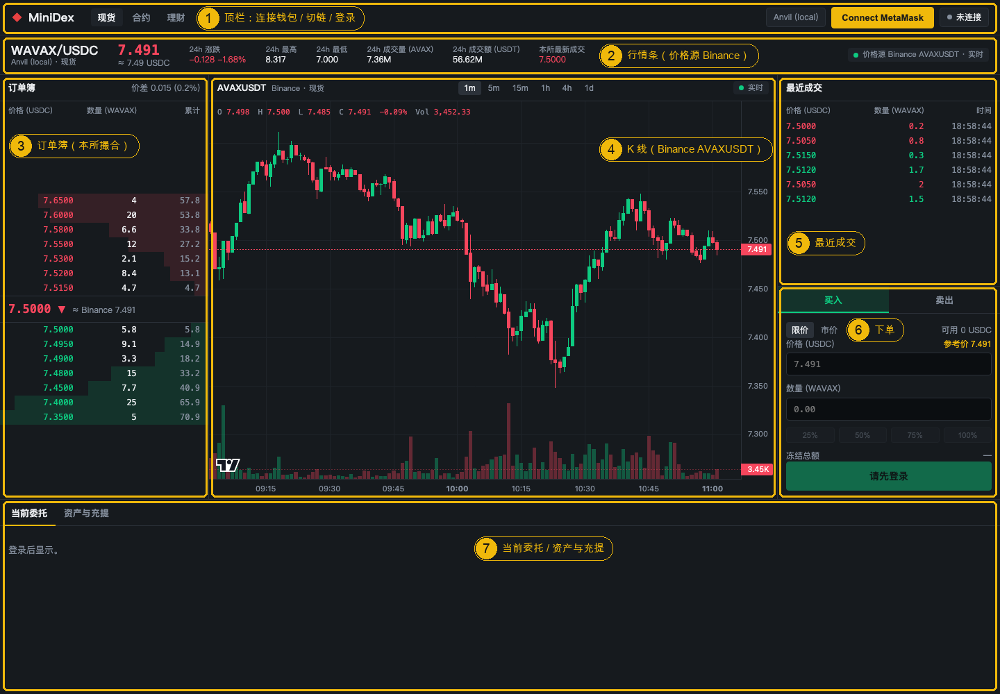
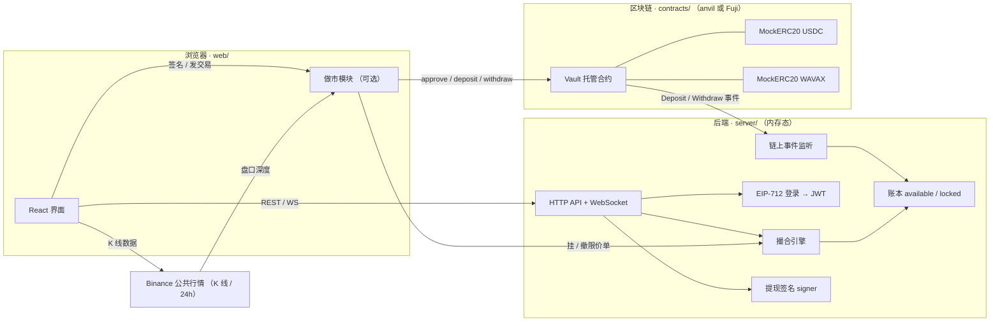
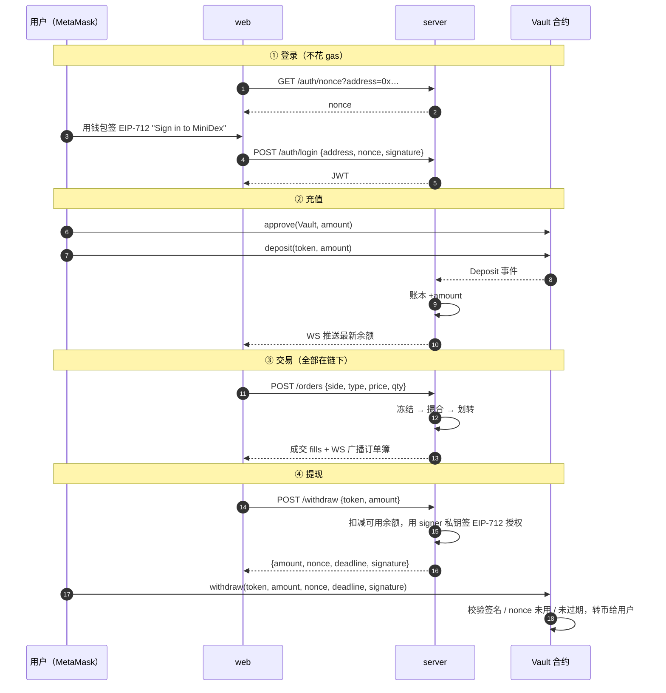

<h1 align="center">Mini-DEX</h1>

<p align="center">
  一个<b>能跑起来、看得懂、改得动</b>的迷你订单簿交易所 —— 《用 Vibe Coding 做一个简易交易所》课程配套项目
</p>

<p align="center">
  <a href="./LICENSE"></a>
  
  
  
  
  
  
</p>

<p align="center">
  <a href="#-快速开始">快速开始</a> ·
  <a href="#-第一笔交易手把手">第一笔交易</a> ·
  <a href="#-架构">架构</a> ·
  <a href="#-api-速查">API</a> ·
  <a href="#-常见问题faq">FAQ</a> ·
  <a href="#-课程与作业">课程与作业</a>
</p>

---

## 📖 这是什么

一句话：**资金在链上托管，撮合在链下进行** —— 和 Binance、OKX 这类中心化交易所（CEX）以及 Primit.io 这类混合交易所同一个套路，只是砍到了最小可运行的规模。

如果你是第一次接触交易所项目，先记住三个词：

| 词 | 意思 | 在本项目里对应 |
|---|---|---|
| **订单簿（Order Book）** | 买单和卖单按价格排队的"账本"，撮合引擎在里面配对 | `server/src/engine/orderbook.ts` |
| **托管（Custody）** | 用户先把币存进交易所，交易所再替你记账 | `contracts/src/Vault.sol` |
| **签名登录（EIP-712）** | 用钱包签一段文字证明"我是这个地址"，不用密码、不花 gas | `server/src/auth.ts` + `web/src/lib/useAuth.ts` |

项目由三个包组成，各自可以单独运行和测试：

| 包 | 技术栈 | 职责 |
|---|---|---|
| [`contracts/`](./contracts) | Solidity 0.8.28 · Foundry · OpenZeppelin 5 | `Vault` 托管合约 + `MockERC20` 测试代币 |
| [`server/`](./server) | Node 22 · TypeScript · Hono · viem · ws | 撮合引擎、内存账本、EIP-712 登录、链上事件监听、提现签名 |
| [`web/`](./web) | Vite · React 18 · wagmi · viem · lightweight-charts | 仿现货交易所界面，K 线价格同步 Binance |

## 🖥 界面预览



| 编号 | 区域 | 说明 |
|:---:|---|---|
| ① | 顶栏 | 连接 MetaMask → 切换到目标链 → 签名登录；中间是 Vault / USDC / WAVAX 三个合约地址（来自后端 `/config`，Fuji 上可点开 snowtrace 查看已验证源码）和测试网水龙头链接；右侧圆点表示登录状态。顶栏上方还有一条常驻的黄色声明条：本站为测试网教学项目，并非真实交易所 |
| ② | 行情条 | 最新价、24h 涨跌 / 最高 / 最低 / 成交量（**价格源：Binance `AVAXUSDT`**），以及本所最新成交价 |
| ③ | 订单簿 | 本所撮合引擎的买卖 12 档，深度条按累计数量绘制；点任意一档把价格填进下单表单。开启做市后右上角显示"流动性镜像 Binance AVAXUSDT"，簿上的单来自做市账户，可直接成交 |
| ④ | K 线 | TradingView 开源库 `lightweight-charts`，支持 1m ~ 1d 切换，右上角显示行情源状态（实时 / 轮询） |
| ⑤ | 最近成交 | 本所成交记录，绿色为买方主动成交、红色为卖方主动成交 |
| ⑥ | 下单 | 买 / 卖、限价 / 市价、可用余额、25% ~ 100% 快捷填数量、"参考价"一键填入 Binance 最新价 |
| ⑦ | 底部 Tab | 当前委托（撤单）；资产与充提（余额、测试币水龙头、充值、提现） |

> 💡 K 线和行情条的价格来自 Binance，仅作参考；订单簿、成交、余额都来自本项目自己的撮合引擎。两者是两套独立的数据源，初学者最容易混淆。

## ✨ 特性

- **完整闭环**：连接钱包 → 签名登录 → 充值 → 挂单 / 吃单 → 提现，每一步都能在界面上看到结果。
- **三种运行模式**：离线（不连链，5 分钟跑通）、本地 anvil 链（完整流程）、Avalanche Fuji 测试网（公开演示）。只改 `.env`，代码不动。
- **真实交易所的撮合规则**：价格 - 时间优先，成交价取挂单方（maker）价格；下单先冻结、成交再划转、撤单解冻，账本永远守恒。
- **链上托管 + 链下签名提现**：后端用 EIP-712 签发提现授权，用户自己上链领币，带 nonce 防重放和 deadline 过期。
- **重启可恢复充提**：启动时从部署区块回放 `Deposit` / `Withdraw` 事件重建余额（Primit `block_sync_state` 游标的极简版）。
- **订单簿有真实流动性（可选）**：内置做市模块把 Binance `AVAXUSDT` 的盘口镜像到本所订单簿（每 2 秒增量刷新），用户下市价单能真的成交；一个环境变量开关。
- **行情源容错**：Binance WS 主机按顺序故障切换，全部不可用时自动退化为 REST 轮询，界面上有状态提示。
- **测试齐全**：合约 13 个、后端 28 个、前端 10 个用例，外加一条一键端到端联调脚本。

## 🏗 架构

### 组件关系



### 资金流转（重点看这张）



## 📦 目录结构

```
mini-dex/
├── contracts/                 Foundry 项目
│   ├── src/Vault.sol          托管合约：deposit / withdraw(EIP-712 授权)
│   ├── src/MockERC20.sol      测试代币（公开 mint 水龙头）
│   ├── test/Vault.t.sol       13 个合约测试
│   ├── script/Deploy.s.sol    部署脚本（打印可直接粘贴到 .env 的地址）
│   └── abi/                   给 server / web 用的 ABI
├── server/                    Node + TypeScript 后端
│   ├── src/engine/orderbook.ts  撮合引擎（价格 - 时间优先）
│   ├── src/ledger.ts          内存账本
│   ├── src/auth.ts            EIP-712 登录 → JWT
│   ├── src/chain.ts           监听 Deposit / Withdraw，签提现授权
│   ├── src/routes.ts          HTTP API
│   ├── src/ws.ts              WebSocket 广播
│   └── scripts/               smoke / e2e-anvil / prep-fuji 脚本
├── web/                       Vite + React 前端
│   ├── src/components/        Header · TickerBar · Chart · OrderBook · OrderForm · Trades · BottomPanel · Wallet …
│   └── src/lib/               api · ws · binance（行情源） · useAuth · chains …
├── prompts/                   课上直接粘给 AI 的 prompt，按章节编号
├── scripts/e2e-anvil.sh       一键端到端联调
└── docs/images/               README 配图
```

## 🚀 快速开始

### 第 0 步：准备环境

| 工具 | 版本 | 安装 | 验证命令 |
|---|---|---|---|
| Node.js | ≥ 22 | <https://nodejs.org> 或 `nvm install 22` | `node -v` → `v22.x.x` |
| Foundry（forge / anvil） | ≥ 1.5 | `curl -L https://foundry.paradigm.xyz \| bash && foundryup` | `forge --version` |
| MetaMask | 最新 | 浏览器扩展 <https://metamask.io> | 浏览器右上角出现狐狸图标 |
| Git | 任意 | — | `git --version` |

> ⏱ 首次 `forge build` 会下载 solc 0.8.28（约 10 MB），国内网络可能需要几分钟，属正常现象。

### 第 1 步：克隆并安装依赖

```bash
git clone git@github.com:tubexchat/Mini-DEX.git
cd Mini-DEX

# 后端
cd server && npm install && cp .env.example .env && cd ..
# 前端
cd web && npm install && cp .env.example .env && cd ..
# 合约（依赖已随仓库提供，不需要 forge install）
cd contracts && forge build && cd ..
```

### 第 2 步：选一种模式运行

三种模式只有 `server/.env` 不同，**初学者建议按 A → B → C 的顺序体验**。

<details open>
<summary><b>模式 A · 离线模式（最快，5 分钟，不需要区块链）</b></summary>

适合先看懂"撮合"和"登录"。`server/.env` 里 `VAULT_ADDRESS` 留空即为离线模式，后端会开放一个测试水龙头直接给账本加钱。

```bash
# 终端 1
cd server && npm run dev
# 看到这两行说明启动成功：
# [chain] 离线模式：VAULT_ADDRESS 为空，不监听链上事件，开放 POST /dev/faucet
# [server] http://localhost:8787  ws://localhost:8787/ws  chainId=31337

# 终端 2
cd web && npm run dev
# ➜  Local:   http://localhost:5173/
```

打开 <http://localhost:5173>：Connect MetaMask → Sign in → 底部"资产与充提" Tab 里点 **领取测试余额** → 回到右侧下单。

想让订单簿一开始就有单可吃，在 `server/.env` 里加一行 `MARKET_MAKER=1` 再启动：后端会用一个做市账户把 Binance `AVAXUSDT` 的前 10 档盘口镜像到本所（数量按 5% 缩放），你下市价单就能立刻成交。

> MetaMask 此时连任何网络都可以（离线模式不发链上交易），但登录签名会带上 chainId 31337，建议先按模式 B 的说明添加 Anvil 网络。

</details>

<details>
<summary><b>模式 B · 本地链 anvil（完整流程，推荐课前排练）</b></summary>

**B1. 启动本地链**

```bash
# 终端 1
anvil
# 会打印 10 个测试账户（每个 10000 ETH），助记词是公开的 "test test … junk"
```

**B2. 部署合约**（anvil 账户 #0 部署，账户 #1 作为后端 signer）

```bash
# 终端 2
cd contracts
PRIVATE_KEY=0xac0974bec39a17e36ba4a6b4d238ff944bacb478cbed5efcae784d7bf4f2ff80 \
SIGNER_ADDRESS=0x70997970C51812dc3A010C7d01b50e0d17dc79C8 \
forge script script/Deploy.s.sol --rpc-url http://127.0.0.1:8545 --broadcast
```

脚本最后会打印一段内容，**原样粘贴到 `server/.env`**：

```
# ---- mini-dex deployed: copy the lines below into server/.env and web/.env ----
CHAIN_ID=31337
VAULT_ADDRESS=0x5FbDB2315678afecb367f032d93F642f64180aa3
USDC_ADDRESS=0x…
WAVAX_ADDRESS=0x…
SIGNER_ADDRESS=0x70997970C51812dc3A010C7d01b50e0d17dc79C8
```

再把 `DEPOSIT_FROM_BLOCK=0`（anvil 从 0 开始），`BACKEND_SIGNER_PRIVATE_KEY` 保持 `.env.example` 默认值（anvil 账户 #1 私钥）。

**B3. 启动后端和前端**

```bash
cd server && npm run dev     # 终端 2，日志应出现 [chain] 链上模式：chainId=31337 vault=0x…
cd web && npm run dev        # 终端 3
```

**B4. 配置 MetaMask**

1. 设置 → 网络 → 添加网络（手动）：

   | 字段 | 值 |
   |---|---|
   | 网络名称 | `Anvil (local)` |
   | RPC URL | `http://127.0.0.1:8545` |
   | 链 ID | `31337` |
   | 货币符号 | `ETH` |

2. 导入账户 → 私钥，粘贴 anvil 账户 #0：
   `0xac0974bec39a17e36ba4a6b4d238ff944bacb478cbed5efcae784d7bf4f2ff80`
3. 想模拟"对手盘"，再导入账户 #2：
   `0x5de4111afa1a4b94908f83103eb1f1706367c2e68ca870fc3fb9a804cdab365a`

> ⚠️ anvil 重启后区块高度归零，MetaMask 会报 nonce 错误：设置 → 高级 → **清除活动和 nonce 数据**。

</details>

<details>
<summary><b>模式 C · Avalanche Fuji 测试网（公开演示 / 录课）</b></summary>

1. 准备一个**专门的测试钱包**，到 <https://core.app/tools/testnet-faucet/> 领取 AVAX（付 gas 用）。
2. 部署（`SIGNER_ADDRESS` 填后端真正使用的那把钥匙的地址，**不要再用 anvil 公开私钥**）：

   ```bash
   cd contracts
   PRIVATE_KEY=0x<你的 Fuji 钱包私钥> SIGNER_ADDRESS=0x<后端 signer 地址> \
   forge script script/Deploy.s.sol --rpc-url https://api.avax-test.network/ext/bc/C/rpc --broadcast
   ```

3. `server/.env`：`CHAIN_ID=43113`、`RPC_URL=https://api.avax-test.network/ext/bc/C/rpc`、三个合约地址、`DEPOSIT_FROM_BLOCK=<部署区块>`、`BACKEND_SIGNER_PRIVATE_KEY=<signer 私钥>`。
4. `npm run dev`（server / web），MetaMask 切到 Fuji（chainId 43113，顶栏会出现 "Switch to Avalanche Fuji" 按钮，点一下自动添加）。
5. 区块浏览器：<https://testnet.snowtrace.io>。

课前可用脚本验证全链路：

```bash
cd server
USER_KEY=<账户私钥> npm run prep:fuji -- deposit   # approve + deposit 100 USDC + 5 WAVAX → 提 50 USDC
USER_KEY=<账户私钥> npm run prep:fuji -- check     # 只登录查余额
```

</details>

### 第 3 步：一键验证三个包接口一致（可选）

```bash
./scripts/e2e-anvil.sh
```

脚本会自动：起 anvil → 部署 → 起 server（链上模式）→ 两个账户 mint / approve / deposit → 后端入账 → 挂单 / 吃单 → 提现签名 → `Vault.withdraw` 上链 → 重放被拒。**最后一行应为 `E2E OK`。**

## 🧭 第一笔交易（手把手）

以模式 B 为例，按界面编号走一遍：

| 步骤 | 操作 | 你应该看到 |
|:---:|---|---|
| 1 | ① 顶栏点 **Connect MetaMask** | 弹出 MetaMask 授权；顶栏出现你的地址缩写 |
| 2 | 如果出现 **Switch to Anvil (local)**，点它 | MetaMask 切换网络；按钮消失 |
| 3 | 点 **Sign in** | MetaMask 弹出签名请求（**不花 gas**）；状态圆点变绿"已登录" |
| 4 | ⑦ 切到 **资产与充提** → 点 **mint 1000 USDC** | MetaMask 确认交易；几秒后"链上钱包"列 USDC 变为 1,000 |
| 5 | 充值到 Vault：选 USDC，输入 `500`，点 **1/2 Approve** | 确认交易后按钮变成 **2/2 Deposit** |
| 6 | 点 **2/2 Deposit** | 提示"等待后端入账…"，随后"交易所可用"列变成 500 |
| 7 | ⑥ 下单：买入 / 限价，点 **参考价** 填价格，点 **25%**，点 **买入 WAVAX** | ③ 订单簿出现你的绿色买单；⑦ 当前委托里出现这条挂单 |
| 8 | 用第二个账户（anvil #2）登录并 mint WAVAX → 充值 → 以相同价格 **卖出** | ⑤ 最近成交出现一条记录；两边余额同时变化 |
| 9 | 提现：资产与充提 → 选 USDC 输入金额 → **Withdraw** | 先"申请签名…"，再弹 MetaMask 确认 `withdraw` 交易；链上钱包余额增加 |

> 第 8 步如果没有对手盘，市价单会提示"簿上没有流动性"，这是正常的 —— 交易所必须有两边的人。

## 🔌 API 速查

后端默认监听 `http://localhost:8787`。金额一律是**十进制字符串**（如 `"100.5"`），内部用 `bigint × 1e8` 定点数。需要登录的接口带 `Authorization: Bearer <JWT>`。

| 方法 | 路径 | 鉴权 | 说明 |
|---|---|---|---|
| GET | `/` | — | 健康检查，返回 `mode: "offline" \| "chain"` |
| GET | `/config` | — | chainId、Vault / 代币地址、WS 地址（前端不写死任何地址，都从这里取） |
| GET | `/auth/nonce?address=0x…` | — | 一次性 nonce，5 分钟有效 |
| POST | `/auth/login` | — | `{address, nonce, signature}` → `{token}`（JWT 24h） |
| GET | `/me` | ✅ | 当前登录地址 |
| GET | `/balances` | ✅ | `{USDC: {available, locked}, WAVAX: {…}}` |
| GET | `/orderbook?depth=10` | — | `{bids: [[price, qty]…], asks: […]}` |
| GET | `/trades?limit=50` | — | 最近成交 |
| GET | `/orders` | ✅ | 我的挂单 |
| POST | `/orders` | ✅ | `{side, type, price?, qty}` → `{order, fills}` |
| DELETE | `/orders/:id` | ✅ | 撤单并解冻 |
| POST | `/withdraw` | ✅ | `{token, amount}` → 提现授权 `{amount, nonce, deadline, signature, vault}`（离线模式返回 400） |
| POST | `/dev/faucet` | ✅ | **仅离线模式**：给当前账户 +10000 USDC +100 WAVAX |

**WebSocket** `ws://localhost:8787/ws`：连上即收到 `{"type":"orderbook"}` 快照；之后推送 `orderbook` / `trade`；发送 `{"type":"auth","token":"<JWT>"}` 后才会收到自己的 `balance`。

EIP-712 登录域：`{ name: "MiniDex", version: "1", chainId }`，类型 `Login(address, nonce, statement)`，statement 固定为 `Sign in to MiniDex`。合约接口与提现授权的 EIP-712 定义见 [`contracts/README.md`](./contracts/README.md)。

## ⚙️ 配置项

`server/.env`（完整示例见 [`server/.env.example`](./server/.env.example)）：

| 变量 | 默认值 | 说明 |
|---|---|---|
| `PORT` | `8787` | HTTP / WS 端口 |
| `JWT_SECRET` | `dev-secret-change-me` | JWT 签名密钥，上线必改 |
| `CHAIN_ID` | `31337` | 31337 = anvil，43113 = Fuji |
| `RPC_URL` | `http://127.0.0.1:8545` | 节点地址 |
| `VAULT_ADDRESS` / `USDC_ADDRESS` / `WAVAX_ADDRESS` | 空 | 留空 = 离线模式；填上 = 链上模式 |
| `DEPOSIT_FROM_BLOCK` | 空 | 启动时从该区块回放 Deposit / Withdraw 重建余额；留空只监听新事件 |
| `BACKEND_SIGNER_PRIVATE_KEY` | anvil #1 | 签提现授权的私钥，**必须与 `Vault.signer` 一致**；Fuji 请换新钥匙 |
| `MARKET_MAKER` | 空 | `1` = 开启做市，把 Binance 盘口镜像到本所订单簿 |
| `MM_SYMBOL` / `MM_LEVELS` / `MM_SCALE` / `MM_INTERVAL_MS` | `AVAXUSDT` / `10` / `0.05` / `2000` | 镜像哪个交易对、每边几档、数量缩放、刷新间隔 |
| `MM_ADDRESS` | anvil #9 | 做市账户地址（账本里的普通地址） |
| `MM_SEED_USDC` / `MM_SEED_WAVAX` | `100000` / `10000` | 启动时给做市账户的虚拟余额；设 `0` 则只用它真实 deposit 的钱 |

`web/.env`：

| 变量 | 默认值 | 说明 |
|---|---|---|
| `VITE_API_URL` | `http://localhost:8787` | 后端地址 |
| `VITE_WS_URL` | `ws://localhost:8787/ws` | 后端 WebSocket |
| `VITE_BINANCE_SYMBOL` | `AVAXUSDT` | K 线 / 行情条的 Binance 交易对 |

## 🧪 测试

```bash
cd contracts && forge test            # 13 个用例：deposit / withdraw / 签名校验 / nonce 重放 / deadline
cd server && npm test                 # 28 个用例：撮合引擎 / 定点数 / 账本守恒 / 做市增量计划
cd web && npm test                    # 10 个用例：Binance K 线解析、合并、主机故障切换
cd web && npm run typecheck && npm run build
./scripts/e2e-anvil.sh                # 端到端：最后一行 E2E OK
```

## ❓ 常见问题（FAQ）

| 现象 | 原因 | 解决 |
|---|---|---|
| 页面顶部红条"连不上后端 http://localhost:8787" | server 没启动，或 `web/.env` 地址写错 | 先 `cd server && npm run dev`，再刷新 |
| 顶栏显示"链错误"/ 出现 Switch 按钮 | MetaMask 当前网络 ≠ 后端 `CHAIN_ID` | 点 Switch；或手动添加 Anvil / Fuji 网络 |
| Sign in 后提示 401 / "nonce 不存在或已使用" | nonce 5 分钟过期，或 server 重启过 | 重新点 Sign in |
| 充值后"等待后端入账…"一直不动 | server 没连上链，或 `VAULT_ADDRESS` 与部署地址不一致 | 看 server 日志有没有 `[chain] Deposit …`；核对 `.env` 三个地址 |
| anvil 重启后 MetaMask 报 nonce 错误 | 本地链归零，MetaMask 缓存了旧 nonce | MetaMask → 设置 → 高级 → 清除活动和 nonce 数据 |
| `Vault.withdraw` 报 `invalid signature` | `BACKEND_SIGNER_PRIVATE_KEY` 对应地址 ≠ `Vault.signer` | server 启动日志会打印 signer 地址，和部署时的 `SIGNER_ADDRESS` 对比 |
| K 线右上角显示"轮询"而不是"实时" | 当前网络连不上 Binance WS（部分地区 `stream.binance.com` 返回 451） | 正常现象，已自动退化为 2 秒 REST 轮询；不影响交易 |
| K 线显示"行情源不可用" | REST 和 WS 都连不上 Binance | 检查网络 / 代理；交易功能不受影响 |
| Fuji 上 viem 估 gas 报 `exceeds block gas limit` | 公共 RPC 的 gas 估算不准 | 脚本里已显式传 `gas`；浏览器走 MetaMask 自己估算，不受影响 |
| server 重启后挂单和成交不见了 | 后端是内存态 | 设计如此：只有充提余额会通过事件回放恢复（见下方"已知简化"） |
| 订单簿是空的，市价单提示"簿上没有流动性" | 没人挂单 | `server/.env` 加 `MARKET_MAKER=1` 开启做市，或用第二个账户手动挂对手单 |
| 日志出现 `[mm] 拉取 Binance 深度失败` | 当前网络连不上 Binance REST | 做市会自动重试，恢复后继续；不影响已有挂单和其他功能 |

## 🔒 安全须知

- 仓库里出现的所有私钥（`0xac09…ff80`、`0x59c6…690d` 等）都是 **anvil 公开测试私钥**，全世界都知道，只能用于本地链。**绝对不要往这些地址转真钱。**
- `server/.env`、`contracts/.env` 已被 `.gitignore` 忽略，只提交 `.env.example`。Fuji 模式的 signer 私钥、部署私钥请自行保管。
- `BACKEND_SIGNER_PRIVATE_KEY` 就是金库钥匙：提现不受链上 `balances` 硬限制，生产环境必须用 HSM / 多签 + 限额。
- 做市账户的 `MM_SEED_*` 是**虚拟注资**（没有链上抵押）。链上模式下用户和做市账户成交后提现，实际从 Vault 的存量里转币——测试网教学可以接受，真实环境必须让做市账户真实 deposit（把 `MM_SEED_*` 设为 0）。

### 已知简化（课上会口头说明）

| 简化点 | 生产做法 | 对应作业 |
|---|---|---|
| 账本内存态，重启靠事件回放恢复充提，成交 / 挂单丢失 | TimescaleDB / PostgreSQL 落库 | 进阶 B |
| `Vault.withdraw` 不用链上 `balances` 做硬上限 | 链上记账 + 限额 | 进阶 A |
| `/withdraw` 先扣余额再签名，不跟踪 in-flight | 记录 nonce 状态，监听 `Withdraw` 事件对账 | — |
| 允许自成交（self-trade） | 撮合时拒绝同一账户对手盘 | 必做 1.3 |

## 🎓 课程与作业

- [`prompts/`](./prompts)：课上直接粘给 AI 编程助手的 prompt，按章节编号（`00-project-spec` → `05-debug-patterns`）。原则是 **先给边界（spec），再要代码；先要测试，再要实现**。
- 各包更细的说明：[`contracts/README.md`](./contracts/README.md) · [`server/README.md`](./server/README.md) · [`web/README.md`](./web/README.md)。

## 🤝 贡献

欢迎提 Issue 和 PR。提交前请确保：

1. `forge test`、`server npm test`、`web npm test && npm run typecheck` 全部通过；
2. 不要提交任何 `.env` 文件或真实私钥；
3. 新增接口同步更新本 README 的 [API 速查](#-api-速查)。

## 📄 License

[MIT](./LICENSE) © 2026 tubexchat
