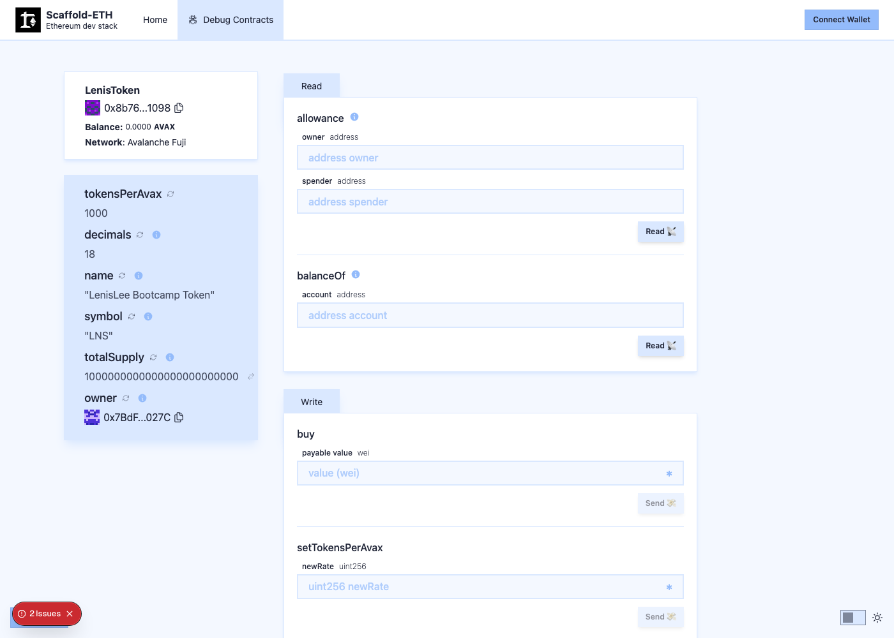

# Task 2：第二章 Vibe Coding 开发你的第一个 DApp

> 对应课程：第二章
> 截止提交：9 月 6 日 24:00:00 (UTC+8)

## 任务目标

掌握 Vibe Coding 技巧，用 Scaffold-ETH 部署 ERC20 合约到 Avalanche Fuji 测试网。

## 部署结果

| 项目 | 内容 |
| --- | --- |
| 合约名称 | LenisLee Bootcamp Token |
| 代币符号 | LNS |
| 精度 | 18 |
| 初始供应量 | 1,000,000 LNS |
| **合约地址** | `0x8b76E48760a04Af751A80caf2b98b3c581C51098` |
| 部署交易 | `0xda30764cda9807339f88a37b56dbc030dc80e5c0efacd0d8953adc58d5194ad2` |
| 部署账号 | `0x7BdFB9727228CC4CBcfc764Ff666fe152a99027C` |
| 网络 | Avalanche Fuji Testnet (chainId 43113) |
| 区块高度 | 58300954 |
| Gas 消耗 | 847,110 |

**区块浏览器：**

- 合约：https://testnet.snowtrace.io/address/0x8b76E48760a04Af751A80caf2b98b3c581C51098
- 部署交易：https://testnet.snowtrace.io/tx/0xda30764cda9807339f88a37b56dbc030dc80e5c0efacd0d8953adc58d5194ad2

## 部署成功输出

```
- Executing packages/hardhat/deploy/00_deploy_your_contract.ts
  - Deploying LenisToken  with tx:
      0xda30764cda9807339f88a37b56dbc030dc80e5c0efacd0d8953adc58d5194ad2
      (type 0x2, maxFeePerGas: 162, maxPriorityFeePerGas: 150)
    => 0x8b76e48760a04af751a80caf2b98b3c581c51098
🪙 Token: LenisLee Bootcamp Token (LNS)
📦 Total supply: 1000000000000000000000000
💰 tokensPerAvax: 1000 (写死的价格，Task 3 将改为 DEX 报价)

📝 Updated TypeScript contract definition file on ../nextjs/contracts/deployedContracts.ts
```

## 截图：Scaffold-ETH DApp 读取链上合约

部署完成后 Scaffold-ETH 自动把 ABI 生成给前端，Debug 页面直接渲染出合约的全部读写函数。
下图左侧可见合约地址 `0x8b76...1098`、网络 `Avalanche Fuji`，以及从链上实时读回的
`name` / `symbol` / `decimals` / `totalSupply` / `owner` / `tokensPerAvax`：



## 核心代码

### 合约（`packages/hardhat/contracts/LenisToken.sol`）

继承 OpenZeppelin 的 `ERC20` 与 `Ownable`，在标准代币之外加了一个用 AVAX 购买代币的业务逻辑：

```solidity
contract LenisToken is ERC20, Ownable {
    /// @notice 1 AVAX 能买到多少枚 LNS（写死的价格，Task 3 将改为 DEX 报价）
    uint256 public tokensPerAvax = 1000;

    constructor(address initialOwner) ERC20("LenisLee Bootcamp Token", "LNS") Ownable(initialOwner) {
        _mint(initialOwner, 1_000_000 * 10 ** decimals());
    }

    /// @notice 用 AVAX 购买 LNS，按当前价格铸造给买家
    function buy() external payable {
        require(msg.value > 0, "LNS: no AVAX sent");
        uint256 amount = msg.value * tokensPerAvax;
        _mint(msg.sender, amount);
        emit TokensPurchased(msg.sender, msg.value, amount);
    }
}
```

> `msg.value` 单位是 wei（18 位），LNS 也是 18 位小数，两边精度一致时直接相乘即可。

### 网络配置（`packages/hardhat/hardhat.config.ts`）

Scaffold-ETH 默认没有 Avalanche，需要自己加：

```typescript
avalancheFuji: {
  type: 'http',
  chainId: 43113,
  url: 'https://api.avax-test.network/ext/bc/C/rpc',
  accounts: [deployerPrivateKey]
},
```

前端 `packages/nextjs/scaffold.config.ts` 同步把 `targetNetworks` 切到 `chains.avalancheFuji`。

## 链上验证

不依赖部署脚本的输出，直接连 Fuji RPC 回读合约状态：

```
合约字节码长度 : 5862 ✅ 有代码
交易状态       : ✅ 成功
name()         : LenisLee Bootcamp Token
symbol()       : LNS
decimals()     : 18
totalSupply()  : 1000000.0 LNS
tokensPerAvax(): 1000
owner()        : 0x7BdFB9727228CC4CBcfc764Ff666fe152a99027C
owner 余额     : 1000000.0 LNS
```

## 实现过程与踩坑

1. **用 `npx create-eth@latest` 生成 Scaffold-ETH 2 项目**，选 Hardhat 作为 Solidity 框架。

2. **Scaffold-ETH 预置了十几条链，唯独没有 Avalanche**，需要在 `hardhat.config.ts` 的 `networks` 里手动加 Fuji（chainId 43113），前端 `scaffold.config.ts` 也要同步改，否则 Debug 页面连不上。

3. **部署需要一个能自动签名的账号。** `yarn generate` 会生成一个 burner 钱包，私钥用密码加密后存进 `packages/hardhat/.env`。这里用 burner 而不是自己的主钱包，是因为脚本部署必须让程序拿到私钥 —— 用一个只装测试币的一次性账号，泄露也没有真实损失。

4. **水龙头只打给已连接的钱包**，不能填任意地址。所以实际流程是：BuilderHub 水龙头 → 主钱包（Core，需开 Testnet Mode）→ 转 0.2 AVAX 给 burner。

   > 坑：Core 不开 Testnet Mode 时只显示主网，水龙头会提示 `Faucet is only available on testnet`；钱包弹窗里的 "Avalanche (C-Chain)" 是**主网**不是 Fuji。另外 C 链和 P 链的 AVAX 是两条链上的两笔钱，部署合约只能用 **C 链**的。

5. **部署耗时约 10 秒，实付手续费极低**（847,110 gas，gasPrice 仅 160 wei）。0.2 AVAX 足够反复部署很多次。

6. **价格特意写死。** Task 3 要求「将原本手动填写或写死的价格改为使用 DEX 获取的价格」，所以这里保留 `tokensPerAvax = 1000` 作为下一章的改造起点。
