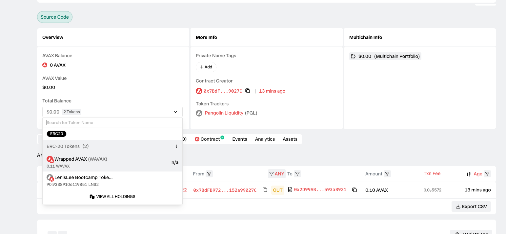
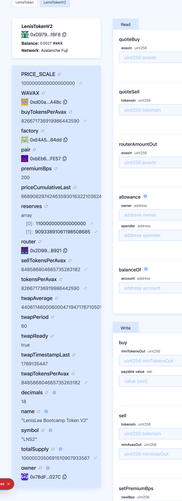

# Task 3：使用 DEX Oracle 获取代币价格

> 对应课程：第三章 Solidity 合约实战
> 学员：LenisLee ｜ 网络：Avalanche Fuji C-Chain（chainId `43113`）

---

## 零、这个任务到底在解决什么

Task 2 我交的 `LenisToken` 里，价格是一行常量：

```solidity
uint256 public tokensPerAvax = 1000;   // 1 AVAX = 1000 LNS
```

这一行的问题不是「不准」，是**它根本不是价格**——它是我的一个断言。没人验证过，没人用真金白银在这个数字上站过队。

Task 3 就是把这行常量删掉，换成市场用真实流动性投票出来的数字。本次提交把它换成了**三条互相独立的链上价格通道**，并让买卖业务逻辑真正消费它们。

---

## 一、使用的 DEX

| 项目 | 内容 |
| --- | --- |
| DEX 名称 | **Pangolin Exchange**（Uniswap V2 架构） |
| 网络 | Avalanche Fuji C-Chain（`43113`） |
| Factory | `0xE4A575550C2b460d2307b82dCd7aFe84AD1484dd` |
| Router | `0x2D99ABD9008Dc933ff5c0CD271B88309593aB921` |

> 这两个地址不是抄来的，是上链核对过的：`Router.factory()` 返回值正好等于上面的 Factory，`Router.WAVAX()` 返回值正好等于下面的 WAVAX。三者互相指认一致才敢用。

---

## 二、Token A 与 Token B

| Token | 名称（Symbol） | 合约地址 | Decimals |
| --- | --- | --- | --- |
| Token A | LenisLee Bootcamp Token V2（`LNS2`） | `0xD979AcB889B523630919EF6F3bA247347F90f8F8` | 18 |
| Token B | Wrapped AVAX（`WAVAX`） | `0xd00ae08403B9bbb9124bB305C09058E32C39A48c` | 18 |

**关于 decimals**：两者都是 18 位，所以储备比值可以直接相除。为了不让「18 位精度」这件事变成隐式假设，合约里所有价格统一定义为

```
tokensPerAvax = (LNS2 储备 × 1e18) / WAVAX 储备      // 含义：1 AVAX 能换多少枚 LNS2，放大 1e18 倍
```

并把 `1e18` 显式命名为 `PRICE_SCALE` 常量，后续所有乘除都围着它转，避免精度在中间某一步被悄悄吃掉。

---

## 三、交易对与流动性

| 项目 | 内容 |
| --- | --- |
| 交易对 | LNS2 / WAVAX |
| **交易对地址** | `0xbEb6f2a42D845999873cF4daBfA561e3d00DFE57` |
| token0 | `0xd00ae08403B9bbb9124bB305C09058E32C39A48c`（WAVAX） |
| token1 | `0xD979AcB889B523630919EF6F3bA247347F90f8F8`（LNS2） |
| approve Router 的 Tx | `0x18829bc6752b12a3ea88dc710d3bc94a40dfbc9d2d8a6683bc7e923932bb29da` |
| **添加流动性 Tx** | `0xe4ad0bc338ba23f8774726e01b72c409b3c5c903abcaa895622d60228e3a1f69` |
| 区块 | `58319822` |
| 初始注入 | **0.1 AVAX + 100 LNS2** |
| 初始隐含价 | **1 AVAX = 1000.0000 LNS2** |
| 拿到的 LP | `3.162277660168378331`（= √(0.1 × 100)，恒定乘积的几何平均，符合 Uniswap V2 首次铸 LP 的公式） |

初始比例是**故意**设成 1:1000 的——它正好等于 Task 2 里那行写死的 `tokensPerAvax = 1000`。这样后面价格一旦漂移，就能一眼看出「常量」和「市场价」从哪一刻开始分道扬镳。

区块浏览器：

- 交易对：https://testnet.snowtrace.io/address/0xbEb6f2a42D845999873cF4daBfA561e3d00DFE57
- 添加流动性 Tx：https://testnet.snowtrace.io/tx/0xe4ad0bc338ba23f8774726e01b72c409b3c5c903abcaa895622d60228e3a1f69

**添加流动性 / 创建交易对的执行记录：**

```text
操作账号: 0x7BdFB9727228CC4CBcfc764Ff666fe152a99027C

① approve Router 花费 100.0 LNS2 ...
   tx: 0x18829bc6752b12a3ea88dc710d3bc94a40dfbc9d2d8a6683bc7e923932bb29da
   allowance = 100.0 LNS2

② addLiquidityAVAX: 100.0 LNS2 + 0.1 AVAX ...
   tx: 0xe4ad0bc338ba23f8774726e01b72c409b3c5c903abcaa895622d60228e3a1f69
   ✅ 区块 58319822 | gas used 3482955

③ 交易对地址: 0xbEb6f2a42D845999873cF4daBfA561e3d00DFE57
   token0 = 0xd00ae08403B9bbb9124bB305C09058E32C39A48c (WAVAX)
   储备   : 0.1 WAVAX  + 100.0 LNS2
   隐含价 : 1 AVAX = 1000.0000 LNS2
   LP 余额: 3.162277660168378331 / 总量 3.162277660168379331
```



截图里有三处值得对照：

| 截图上的信息 | 说明了什么 |
| --- | --- |
| **Token Trackers: `Pangolin Liquidity (PGL)`** | Snowtrace 自己认出这是 Pangolin Factory 造出来的 LP 合约，不是我随手部署的东西 |
| **Total Balance 展开：`0.11 WAVAX` + `90.93389106119851 LNS2`** | 池子里真实存在的两侧流动性 |
| Contract Creator `0x7BdF...9027C` ／ 唯一一笔交易 Block `58319822`、`0.10 AVAX` → `0x2D99AB...593aB921` | 池子由本人的部署账号经 Pangolin Router 创建，区块号与上表的添加流动性 Tx 一致 |

**交叉验证**：区块浏览器显示的储备是 `0.11 WAVAX + 90.93389106119851 LNS2`，而合约 `reserves()` 在链上读到的是 `110000000000000000` 和 `90933891061198508685`（即 0.11 与 90.933891061198508685）——两个独立来源完全一致，说明合约算价格时读的确实是这个池子。

---

## 四、获取 Swap / Oracle 价格的核心代码

合约里**没有任何价格常量**。交易对地址也没写死——因为建池必须先有代币地址，存在先有鸡还是先有蛋的问题，所以改成每次向 Factory 现查：

```solidity
/// @notice 本代币与 WAVAX 的 Pangolin 交易对；未建池时返回 0 地址
function pair() public view returns (address) {
    return factory.getPair(address(this), WAVAX);
}
```

### 通道 ①：Pair 储备现货价

恒定乘积做市商里，边际价格就是两侧储备之比。这个函数**沿用了 Task 2 那个变量的名字**，但它已经从一个常量变成了一次链上读取：

```solidity
function tokensPerAvax() public view returns (uint256) {
    (uint256 rAvax, uint256 rLns) = reserves();
    require(rAvax > 0 && rLns > 0, "LNS2: no liquidity");
    return (rLns * PRICE_SCALE) / rAvax;
}
```

### 通道 ②：Pair 价格累加器 → TWAP（真正的 Oracle）

现货价有个致命弱点：**一笔闪电贷就能在同一个区块里把它拉到任意值**。Uniswap V2 为此在 Pair 里埋了价格累加器 `price0CumulativeLast`——它累积的是「价格 × 持续秒数」。两次采样相减再除以间隔，得到的是时间加权均价，想操纵它就必须把价格**维持**一段时间，成本高到得不偿失。

```solidity
function updateTwap() external {
    address p = pair();
    require(p != address(0), "LNS2: pair not created");

    (uint256 cumulative, uint32 ts) = _currentCumulativePrice(p);

    if (twapTimestampLast == 0) {          // 第一次只记基准点
        priceCumulativeLast = cumulative;
        twapTimestampLast = ts;
        emit TwapUpdated(0, ts, 0);
        return;
    }

    uint32 timeElapsed;
    unchecked { timeElapsed = ts - twapTimestampLast; }
    require(timeElapsed >= twapPeriod, "LNS2: twap period not elapsed");

    unchecked { twapAverage = uint224((cumulative - priceCumulativeLast) / timeElapsed); }
    priceCumulativeLast = cumulative;
    twapTimestampLast = ts;

    emit TwapUpdated(twapAverage, ts, timeElapsed);
}

/// @notice 时间加权均价：1 AVAX 能换多少 LNS2（放大 1e18 倍）
function twapTokensPerAvax() public view returns (uint256) {
    require(twapAverage != 0, "LNS2: twap not ready");
    return (uint256(twapAverage) * PRICE_SCALE) >> 112;   // UQ112x112 定点数解码
}
```

这里有两个坑必须自己处理：

**坑 1：Pair 只在有人交易时才更新累加器。** 如果最近十分钟没人交易，直接读到的累加值停留在十分钟前，算出来的均价是错的。所以要补上「从上次更新到现在，价格一直没变」这段时间的积分——Uniswap 官方 Oracle 库把这叫做「反事实（counterfactual）累加」：

```solidity
function _currentCumulativePrice(address p) internal view returns (uint256 priceCumulative, uint32 blockTimestamp) {
    blockTimestamp = uint32(block.timestamp % 2 ** 32);
    bool wavaxIsToken0 = IPangolinPair(p).token0() == WAVAX;

    // price0 = reserve1 / reserve0。WAVAX 是 token0 时，price0 正好是「1 AVAX 换多少 LNS2」
    priceCumulative = wavaxIsToken0
        ? IPangolinPair(p).price0CumulativeLast()
        : IPangolinPair(p).price1CumulativeLast();

    (uint112 r0, uint112 r1, uint32 lastTs) = IPangolinPair(p).getReserves();
    if (lastTs != blockTimestamp) {
        uint32 timeElapsed;
        unchecked { timeElapsed = blockTimestamp - lastTs; }
        uint224 price = wavaxIsToken0 ? _fraction(r1, r0) : _fraction(r0, r1);
        unchecked { priceCumulative += uint256(price) * timeElapsed; }   // 补上这一段
    }
}
```

**坑 2：token0 / token1 的顺序不由我决定。** Uniswap V2 按地址大小排序，谁在前是地址决定的。本次建池后实测 `token0 == WAVAX`，所以该读 `price0CumulativeLast`；但合约不能靠「实测结果」写死，必须每次判断——否则换个代币地址部署一遍，价格就会整个倒过来。

**坑 3：UQ112x112 定点数。** 累加器里存的不是普通整数，是把小数左移 112 位的定点数。所以解码要 `>> 112`，编码要 `<< 112`，而且这些运算必须放进 `unchecked` —— 累加器**设计上就是会溢出回绕的**，Solidity 0.8 的自动溢出检查在这里反而会误伤。

```solidity
/// @dev 把 numerator/denominator 编码成 UQ112x112 定点数（小数部分 112 位）
function _fraction(uint112 numerator, uint112 denominator) internal pure returns (uint224) {
    require(denominator > 0, "LNS2: division by zero");
    return uint224((uint256(numerator) << 112) / denominator);
}
```

### 通道 ③：Router Quoter —— 成交价

前两条是「标价」，这条是「如果真去换，到手多少」，含 0.3% 手续费和这笔交易自身造成的滑点：

```solidity
function routerAmountOut(uint256 avaxIn) public view returns (uint256) {
    address[] memory path = new address[](2);
    path[0] = WAVAX;
    path[1] = address(this);
    uint256[] memory amounts = router.getAmountsOut(avaxIn, path);
    return amounts[1];
}
```

---

## 五、价格被业务逻辑实际使用的核心代码

光能读出价格不算数，要真的花在业务上。这里做了一个取舍：**买卖两边都取对协议不利的那个价格**，被操纵时协议不吃亏。

```solidity
/// @notice 买入计价：取 min(现货, TWAP) —— 给出的代币更少
function buyTokensPerAvax() public view returns (uint256) {
    uint256 spot = tokensPerAvax();
    if (twapAverage == 0) return spot;
    uint256 avg = twapTokensPerAvax();
    return spot < avg ? spot : avg;
}

/// @notice 卖出计价：取 max(现货, TWAP) —— 付出的 AVAX 更少
function sellTokensPerAvax() public view returns (uint256) {
    uint256 spot = tokensPerAvax();
    if (twapAverage == 0) return spot;
    uint256 avg = twapTokensPerAvax();
    return spot > avg ? spot : avg;
}
```

业务函数：

```solidity
/// @notice 用 AVAX 铸造 LNS2，铸造数量由 DEX 价格决定
function buy(uint256 minTokensOut) external payable {
    require(msg.value > 0, "LNS2: no AVAX sent");
    uint256 price = buyTokensPerAvax();                                       // ← 来自 DEX
    uint256 amount = (((msg.value * price) / PRICE_SCALE) * (BPS - premiumBps)) / BPS;
    require(amount > 0, "LNS2: amount too small");
    require(amount >= minTokensOut, "LNS2: price moved, slippage");           // ← 滑点保护

    _mint(msg.sender, amount);
    emit TokensPurchased(msg.sender, msg.value, amount, price);               // ← 价格上链留痕
}

/// @notice 销毁 LNS2 换回 AVAX，付出的 AVAX 由 DEX 价格决定
function sell(uint256 tokensIn, uint256 minAvaxOut) external {
    require(tokensIn > 0, "LNS2: nothing to sell");
    uint256 price = sellTokensPerAvax();                                      // ← 来自 DEX
    uint256 avaxOut = (((tokensIn * PRICE_SCALE) / price) * (BPS - premiumBps)) / BPS;
    require(avaxOut > 0, "LNS2: amount too small");
    require(avaxOut >= minAvaxOut, "LNS2: price moved, slippage");
    require(address(this).balance >= avaxOut, "LNS2: treasury empty");

    _burn(msg.sender, tokensIn);
    (bool ok, ) = msg.sender.call{ value: avaxOut }("");
    require(ok, "LNS2: AVAX transfer failed");

    emit TokensSold(msg.sender, tokensIn, avaxOut, price);
}
```

`premiumBps = 200`（2%）是协议价差。注意它是**加在 DEX 价格之上的**，不是价格本身——价格依然 100% 来自链上。

---

## 六、部署结果

| 项目 | 内容 |
| --- | --- |
| **合约地址** | `0xD979AcB889B523630919EF6F3bA247347F90f8F8` |
| 部署 Tx | `0xdcff34c2572ae5bac4055ea1bf3cd3578662d41e1c4aacab9a07fda119443ef5` |
| 部署区块 | `58319807` |
| gasUsed | `1,971,675` |
| 链上字节码 | `7994` bytes |
| 部署账号 / owner | `0x7BdFB9727228CC4CBcfc764Ff666fe152a99027C` |
| 初始供应 | 1,000,000 LNS2 |
| 构造参数 | `(owner, PangolinRouter)`，Factory 与 WAVAX 由合约自己向 Router 问出来 |

区块浏览器：https://testnet.snowtrace.io/address/0xD979AcB889B523630919EF6F3bA247347F90f8F8

```text
- Deploying LenisTokenV2  with tx: 0xdcff34c2572ae5bac4055ea1bf3cd3578662d41e1c4aacab9a07fda119443ef5
    => 0xd979acb889b523630919ef6f3ba247347f90f8f8
🪙 Token   : LenisLee Bootcamp Token V2
🔤 Symbol  : LNS2
📦 Supply  : 1000000000000000000000000
🧭 Router  : 0x2D99ABD9008Dc933ff5c0CD271B88309593aB921
🏭 Factory : 0xE4A575550C2b460d2307b82dCd7aFe84AD1484dd
💧 WAVAX   : 0xd00ae08403B9bbb9124bB305C09058E32C39A48c
🔗 Pair    : 0x0000000000000000000000000000000000000000 (建池前为 0 地址，属正常)
```

Router / Factory / WAVAX 这三个地址是**部署后从链上回读**出来的，不是我填进文档的——说明构造函数确实去问了 Router。

---

## 七、成功读取并使用价格的证据

### 7.1 DApp 前端实时读取（链上 view 调用）



截图里可以直接核对：

| 字段 | 值 | 含义 |
| --- | --- | --- |
| `pair` | `0xbEb6...FE57` | 交易对，合约自己从 Factory 查到的 |
| `reserves` | `[110000000000000000, 90933891061198508685]` | 0.11 WAVAX + 90.93 LNS2 |
| `tokensPerAvax` | `826671736919986442590` | 现货价 1 AVAX = **826.6717** LNS2 |
| `twapTokensPerAvax` | `848586804665735283182` | 均价 1 AVAX = **848.5868** LNS2 |
| `buyTokensPerAvax` | `826671736919986442590` | = min(现货, TWAP) |
| `sellTokensPerAvax` | `848586804665735283182` | = max(现货, TWAP) |
| `twapReady` | `true` | TWAP 已完成两次采样 |
| `premiumBps` | `200` | 协议价差 2% |

**注意 826.67 这个数字**——它不再是 1000 了。Task 2 那行常量永远是 1000，而这个数字是池子被交易推动之后的真实结果。

### 7.2 完整链上验证流程

```text
① 三条价格通道（全部来自 Pangolin 交易对，合约里没有任何写死价格）
交易对          : 0xbEb6f2a42D845999873cF4daBfA561e3d00DFE57
池子储备        : 0.1 WAVAX  + 100.0 LNS2
① Pair 现货价   : 1 AVAX = 1000.0000 LNS2   <- tokensPerAvax()
③ Router 成交价 : 0.01 AVAX 可换 9.066108938801491315 LNS2（含 0.3% 手续费+滑点）
② TWAP 是否就绪 : false

② updateTwap() 第一次 —— 只记录基准点
tx: 0x449d0f50d6a964f72a2fb7aa68d5e7aaaaabe2de9692dc0b13426164ad8697ac
区块 58319832 | twapAverage = 0 (仍为 0，需要第二次采样)

③ 去 Pangolin 真实成交一笔，把池子价格推走
swapExactAVAXForTokens 0.01 AVAX -> LNS2
tx: 0xe99417cb35b6e07c9226a09546c13ff984c68ab5258d2dc3dedd150d54adcf9c
区块 58319833
新储备          : 0.11 WAVAX  + 90.933891061198508685 LNS2
新现货价        : 1 AVAX = 826.6717 LNS2   <- 价格真的动了

④ 等 65 秒（twapPeriod = 60s），再采样一次
tx: 0xa9a18288dc0483ae1dadd44a831afcfd5411c1f3dc18d187d0585d9e52251d60
区块 58319856
twapAverage(UQ112x112 原始值) = 4406114600060004719471767105014969422

⑤ 现在三条通道齐活，业务价格由它们推导
现货价 spot     : 1 AVAX = 826.6717 LNS2
均价   twap     : 1 AVAX = 848.5868 LNS2
买入价 min(两者): 1 AVAX = 826.6717 LNS2  <- 少给币，协议保守
卖出价 max(两者): 1 AVAX = 848.5868 LNS2  <- 少付 AVAX，协议保守

⑥ buy() —— 业务逻辑真的消费了 DEX 价格
quoteBuy(0.005 AVAX) 预估 = 4.050691510907933567 LNS2
tx: 0x23182da1f0bf489e7af6d5f189880611e4c3a0b36343263ac14a706577476650
区块 58319860 | 实际到账 = 4.050691510907933567 LNS2

⑦ sell() —— 反方向同样用 DEX 价格计价
quoteSell(2 LNS2) 预估 = 0.002309722457647757 AVAX
tx: 0x997213f60c42762d4ca7040ca73e99768d1153ae42ada640fcb40eaad0cef8a1
区块 58319862 | 钱包 AVAX 净变化 = 0.002309722457647757
```

`quoteBuy` 预估 `4.050691510907933567`，`buy()` 实际到账 `4.050691510907933567`——**一位不差**。这说明链下预览和链上执行走的是同一套价格计算。

### 7.3 合约事件（最硬的证据：价格被写进了链上日志）

```text
[block 58319832] TwapUpdated      twapAverage=0                                       timeElapsed=0s
[block 58319856] TwapUpdated      twapAverage=4406114600060004719471767105014969422   timeElapsed=87s
[block 58319860] TokensPurchased  buyer=0x7BdF...027C  avaxIn=0.005  tokensOut=4.050691510907933567  priceUsed=1AVAX→826.6717 LNS2
[block 58319862] TokensSold       seller=0x7BdF...027C tokensIn=2.0  avaxOut=0.002309722457647757    priceUsed=1AVAX→848.5868 LNS2
```

每一笔交易都把**当时用的价格**作为 `priceUsed` 记进了事件——任何人都可以事后翻出这个区块，拿 Pair 的历史储备复算一遍，验证这个价格确实来自 DEX 而不是我编的。

---

## 八、实现过程简要说明

1. **先验地址，再写代码。** 网上流传的 Fuji DEX 地址很多已经失效。我先用 `eth_getCode` 确认 Pangolin 的 Factory / Router / WAVAX 都有字节码，再调 `Router.factory()` 和 `Router.WAVAX()` 看它们是否互相指认一致。三者对上了才动手。
2. **解决先有鸡还是先有蛋。** 建池需要代币地址，代币合约又想知道池子地址。解法是构造函数只收 Router，Factory 和 WAVAX 向 Router 问，池子地址每次用 `factory.getPair()` 现查——建池前返回 0 地址，建池后自动生效，合约一行都不用改。
3. **部署 → 建池 → 注入流动性。** `approve` Router 100 LNS2，再 `addLiquidityAVAX` 投入 0.1 AVAX + 100 LNS2，Pangolin 自动创建 Pair 并铸 LP 给我。
4. **激活 TWAP。** 调一次 `updateTwap()` 记基准点，去 DEX 真实成交一笔把价格推走，等过了 `twapPeriod`（60 秒）再调一次——这时才算得出均价。
5. **跑通业务。** `buy()` 投 0.005 AVAX，`sell()` 卖 2 LNS2，两笔都用 DEX 价格结算，事件里留下 `priceUsed`。

### 踩到的坑

| 坑 | 现象 | 解法 |
| --- | --- | --- |
| token0/token1 顺序 | 按地址大小排，不由我决定 | 每次 `token0() == WAVAX` 判断，不写死 |
| 累加器不实时 | 没人交易时累加值停在过去 | 补「反事实累加」那一段积分 |
| UQ112x112 溢出 | Solidity 0.8 自动溢出检查会误伤 | 累加器运算包进 `unchecked`（它设计上就会回绕） |
| TWAP 需要两次采样 | 首次调用后 `twapAverage` 仍是 0 | 首次只记基准，业务代码用 `twapAverage == 0` 退回现货价 |
| 池子太浅 | 0.1 AVAX 的池子，0.01 AVAX 的交易就把价格砸掉 17% | 这次是**特意**的，用来演示价格确实会动；生产环境必须靠深度 + TWAP |

### 已知的简化（不藏着）

- `buy()` 是**增发**而非从池子里买，所以铸币价和池子价之间存在套利空间。要消掉它，正确做法是让 `buy()` 直接走 Router 去池子里换，或者用国库存量代币兑付而不是 `_mint`。
- `twapPeriod` 只设了 60 秒，是为了演示方便。真实场景至少 10 分钟起步——窗口越长，操纵成本越高。
- 单一 DEX 单一数据源。生产环境应该再叠一层独立预言机（如 Chainlink）做交叉验证，两个源偏离超过阈值就拒绝交易。

---

## 九、一句话总结

Task 2 交的是 `tokensPerAvax = 1000`，一个我自己编的数字。
Task 3 交的是 `tokensPerAvax()`，一个市场用 0.1 AVAX 真实流动性投票、被 87 秒时间加权、并写进链上事件的数字。

中间隔着的不是代码量，是**这个数字凭什么可信**。
