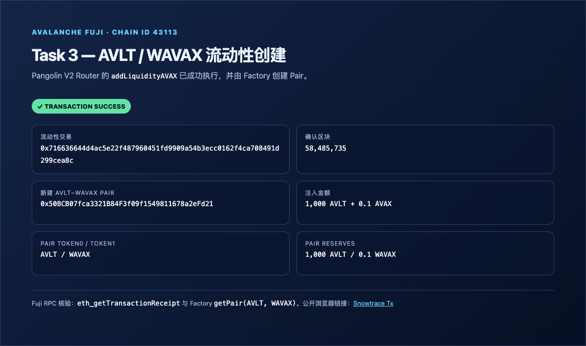
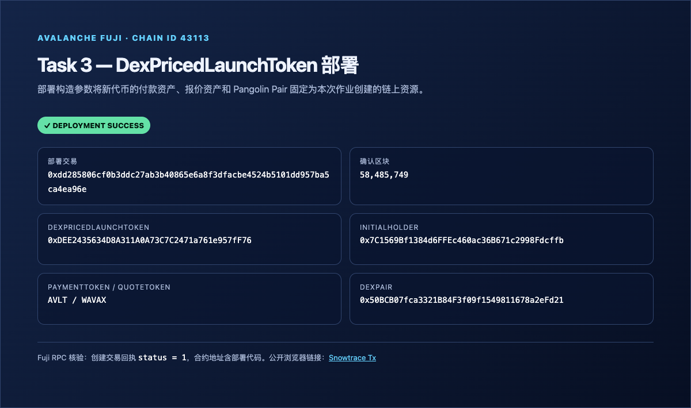
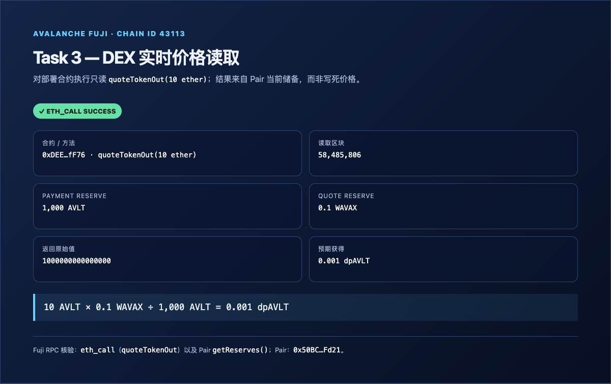
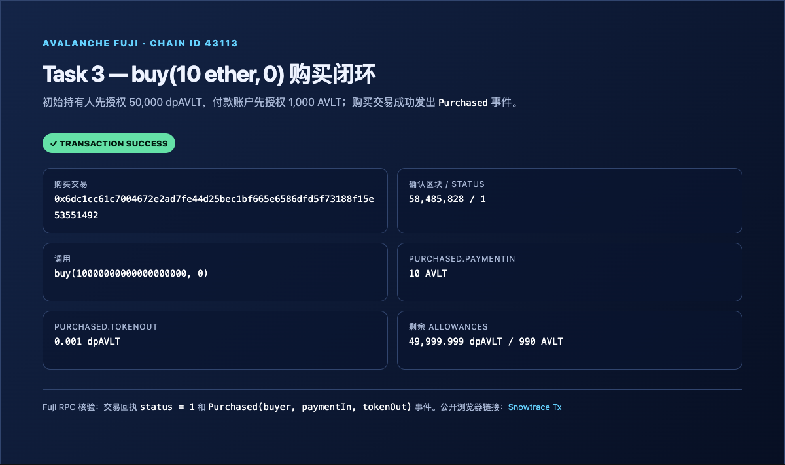

# Task 3：使用 DEX Oracle 获取代币价格

> 对应课程：第三章 Solidity 合约实战
> 目标网络：Avalanche Fuji Testnet（Chain ID `43113`）

---

## 1. 使用的 DEX

本任务选用 **Pangolin V2 DEX**（Uniswap-V2 标准架构），在 Avalanche Fuji 测试网通过官方合约创建真实流动性交易对，并通过 Pair 合约的储备金（Reserves）比例获取实时链上报价。

- **DEX 名称**：Pangolin V2
- **Pangolin V2 Router**：[`0x2D99ABD9008Dc933ff5c0CD271B88309593aB921`](https://testnet.snowtrace.io/address/0x2D99ABD9008Dc933ff5c0CD271B88309593aB921)
- **Pangolin V2 Factory**：[`0xE4A575550C2b460d2307b82dCd7aFe84AD1484dd`](https://testnet.snowtrace.io/address/0xE4A575550C2b460d2307b82dCd7aFe84AD1484dd)

---

## 2. Token A 和 Token B

| 项目 | Token A（自建代币） | Token B（生态原生封装代币） |
| --- | --- | --- |
| **代币名称** | Avalanche Launch Token | Wrapped AVAX |
| **代币符号** | AVLT | WAVAX |
| **精度 (Decimals)** | 18 | 18 |
| **合约地址** | [`0x2e13c18fabf0085fa57dc3094b7a877a80585058`](https://testnet.snowtrace.io/address/0x2e13c18fabf0085fa57dc3094b7a877a80585058) | [`0xd00ae08403B9bbb9124bB305C09058E32C39A48c`](https://testnet.snowtrace.io/address/0xd00ae08403B9bbb9124bB305C09058E32C39A48c) |

> 注：`AVLT` 为 Task 2 部署的标准 ERC20 代币，初始发行量为 100,000 AVLT。

---

## 3. 交易对与流动性注入

- **交易对 (Pair) 地址**：[`0x50BCB07fca3321B84F3f09f1549811678a2eFd21`](https://testnet.snowtrace.io/address/0x50BCB07fca3321B84F3f09f1549811678a2eFd21)
- **Pair token0 / token1**：`AVLT / WAVAX`
- **初始储备金**：`1,000 AVLT / 0.1 WAVAX`
- **初始流动性注入**：
  - AVLT 注入量：`1,000 AVLT`
  - AVAX (WAVAX) 注入量：`0.1 AVAX`
  - 注入流动性交易：[`0x716636644d4ac5e22f487960451fd9909a54b3ecc0162f4ca708491d299cea8c`](https://testnet.snowtrace.io/tx/0x716636644d4ac5e22f487960451fd9909a54b3ecc0162f4ca708491d299cea8c)（区块 `58,485,735`，`status = 1`）

### 流动性添加成功截图


---

## 4. 核心合约代码

### 4.1 获取 DEX 储备金实时价格 (`quoteTokenOut`)

合约通过直接读取 Uniswap-V2 标准交易对的 `getReserves()` 方法，按储备金比率计算实时兑换数量，且具备零流动性保护（`EmptyLiquidity` 错误）：

```solidity
function quoteTokenOut(uint256 paymentIn) public view returns (uint256 tokenOut) {
    if (paymentIn == 0) revert InvalidAmount();

    (uint112 reserve0, uint112 reserve1,) = dexPair.getReserves();
    (uint256 paymentReserve, uint256 quoteReserve) = dexPair.token0() == address(paymentToken)
        ? (uint256(reserve0), uint256(reserve1))
        : (uint256(reserve1), uint256(reserve0));
    if (paymentReserve == 0 || quoteReserve == 0) revert EmptyLiquidity();

    return (paymentIn * quoteReserve) / paymentReserve;
}
```

### 4.2 在业务逻辑中使用该价格 (`buy`)

购买逻辑杜绝任何手动写死价格，强制依据实时 DEX 预言机计算出的 `tokenOut` 执行交割，并提供用户滑点保护（`minTokenOut`）：

```solidity
function buy(uint256 paymentIn, uint256 minTokenOut) external returns (uint256 tokenOut) {
    tokenOut = quoteTokenOut(paymentIn);
    if (tokenOut < minTokenOut || tokenOut == 0) revert InvalidAmount();

    require(paymentToken.transferFrom(msg.sender, initialHolder, paymentIn), "payment transfer failed");
    _spendAllowance(initialHolder, address(this), tokenOut);
    _transfer(initialHolder, msg.sender, tokenOut);

    emit Purchased(msg.sender, paymentIn, tokenOut);
}
```

---

## 5. 合约部署结果

- **合约名称**：`DexPricedLaunchToken` (`dpAVLT`)
- **部署网络**：Avalanche Fuji Testnet
- **部署账户**：[`0x7c1569bf1384d6ffec460ac36b671c2998fdcffb`](https://testnet.snowtrace.io/address/0x7c1569bf1384d6ffec460ac36b671c2998fdcffb)
- **部署合约地址**：[`0xDEE2435634D8A311A0A73C7C2471a761e957fF76`](https://testnet.snowtrace.io/address/0xDEE2435634D8A311A0A73C7C2471a761e957fF76)
- **部署交易**：[`0xdd285806cf0b3ddc27ab3b40865e6a8f3dfacbe4524b5101dd957ba5ca4ea96e`](https://testnet.snowtrace.io/tx/0xdd285806cf0b3ddc27ab3b40865e6a8f3dfacbe4524b5101dd957ba5ca4ea96e)（区块 `58,485,749`，`status = 1`）
- **构造参数**：`initialHolder = 0x7C15...cffb`、`paymentToken = AVLT`、`quoteToken = WAVAX`、`dexPair = 0x50BC...Fd21`

### 合约部署成功截图


---

## 6. 链上交互验证

### 6.1 价格读取验证
- 在区块 `58,485,806` 对 `0xDEE2...fF76` 执行只读调用：`quoteTokenOut(10 ether)`。
- Pair 储备为 `1,000 AVLT / 0.1 WAVAX`，返回原始值为 `1000000000000000`，即 **`0.001 dpAVLT`**。
- 验证公式：`10 AVLT × 0.1 WAVAX ÷ 1,000 AVLT = 0.001 dpAVLT`。


### 6.2 实际购买业务验证
- 初始持有人先授权 `50,000 dpAVLT`，付款账户先授权 `1,000 AVLT` 给部署合约。
- 调用 `buy(10 ether, 0)` 成功执行链上付款与交割逻辑；交易回执 `status = 1`，并发出 `Purchased(buyer, 10 AVLT, 0.001 dpAVLT)` 事件。
- 购买交易：[`0x6dc1cc61c7004672e2ad7fe44d25bec1bf665e6586dfd5f73188f15e53551492`](https://testnet.snowtrace.io/tx/0x6dc1cc61c7004672e2ad7fe44d25bec1bf665e6586dfd5f73188f15e53551492)（区块 `58,485,828`）。
- 本次购买者与 `initialHolder` 是同一地址，因此 AVLT 付款转账和 dpAVLT 交割转账均为同地址转账，净余额不变；以交易回执、减少后的授权量和 `Purchased` 事件作为业务完成凭据。


---

## 7. 实现过程简述

1. **流动性构建**：在 Avalanche Fuji 上，利用官方已部署的 Pangolin V2 Router 合约的 `addLiquidityAVAX` 方法，将 `0x7c15...` 账户持有的 `AVLT` 与 `0.1 AVAX` 配对添加到底层流动性池中，由 Factory 自动创建 `AVLT-WAVAX` Pair 合约。
2. **动态定价合约**：设计并编译 `DexPricedLaunchToken.sol`，合约在初始化时绑定此 Pair 合约及两端代币地址。
3. **消除价格硬编码**：合约内部通过 `dexPair.getReserves()` 实时读取底池储备金，按两侧储备金比率换算兑换数量，完全依赖去中心化预言机储备定价。
4. **钱包签名与测试**：交易 calldata 由独立 Node.js 脚本编码并由 MetaMask 钱包逐笔签名；`DexPricedLaunchToken` 的两个针对性单元测试（实时询价/购买、零流动性拒绝）均通过。

---

## 8. 链上交易回执汇总

| 步骤 | 交易 | 结果 |
| --- | --- | --- |
| 授权 Router | [`approve(5,000 AVLT)`](https://testnet.snowtrace.io/tx/0x162e98a86c210e8dcf9310b25c6bf2f18741418f8032564637a1feab6273ab21) | `status = 1`，区块 `58,485,719` |
| 添加流动性 | [`addLiquidityAVAX(1,000 AVLT, 0.1 AVAX)`](https://testnet.snowtrace.io/tx/0x716636644d4ac5e22f487960451fd9909a54b3ecc0162f4ca708491d299cea8c) | `status = 1`，Pair 已创建 |
| 部署合约 | [`DexPricedLaunchToken`](https://testnet.snowtrace.io/tx/0xdd285806cf0b3ddc27ab3b40865e6a8f3dfacbe4524b5101dd957ba5ca4ea96e) | `status = 1` |
| 授权 dpAVLT | [`approve(50,000 dpAVLT)`](https://testnet.snowtrace.io/tx/0x1f59ae9bf96f0f05a6196f9bbad436599833f0464ba43b2041e34dcbfb780357) | `status = 1`，区块 `58,485,787` |
| 授权付款 AVLT | [`approve(1,000 AVLT)`](https://testnet.snowtrace.io/tx/0xd8619e66504b2ad77fe3ab3adf08ffd7a4660ba00cd32bd87cfe3ae7f0da5d45) | `status = 1`，区块 `58,485,801` |
| 购买 | [`buy(10 ether, 0)`](https://testnet.snowtrace.io/tx/0x6dc1cc61c7004672e2ad7fe44d25bec1bf665e6586dfd5f73188f15e53551492) | `status = 1`，`Purchased` 事件已验证 |

> 四张截图均由 Playwright 无头浏览器生成，并基于 Fuji RPC 对交易回执、`getReserves()` 和 `quoteTokenOut()` 的链上回读；每项同时附有公开 Snowtrace 链接以便复核。
