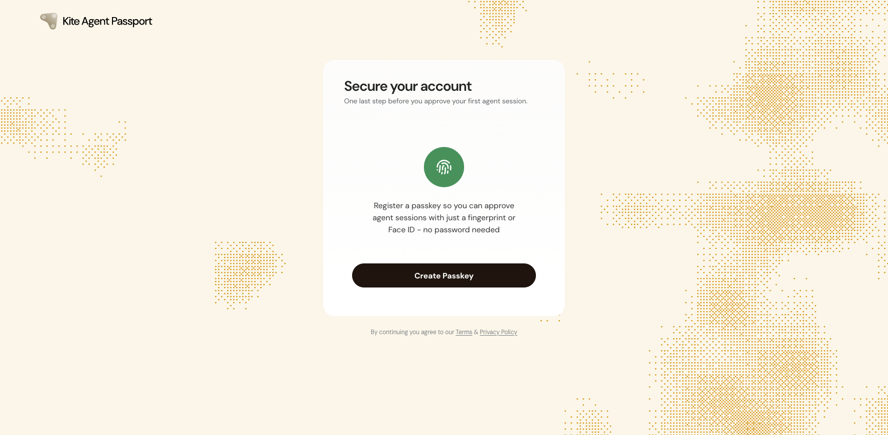
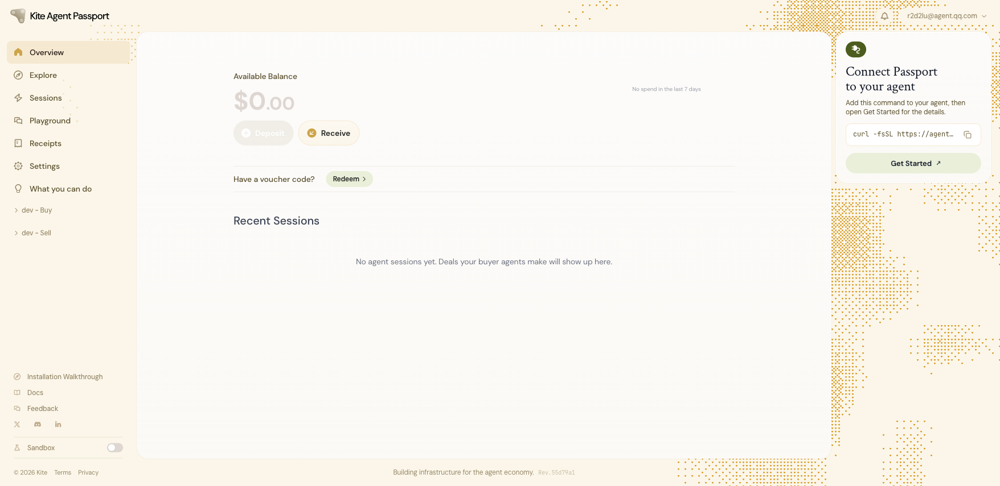
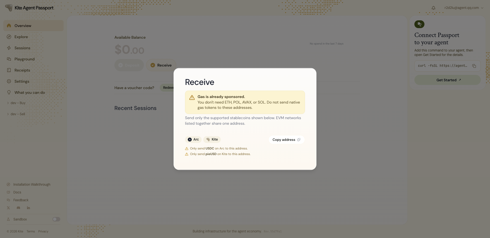
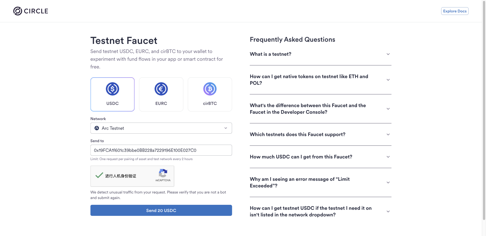
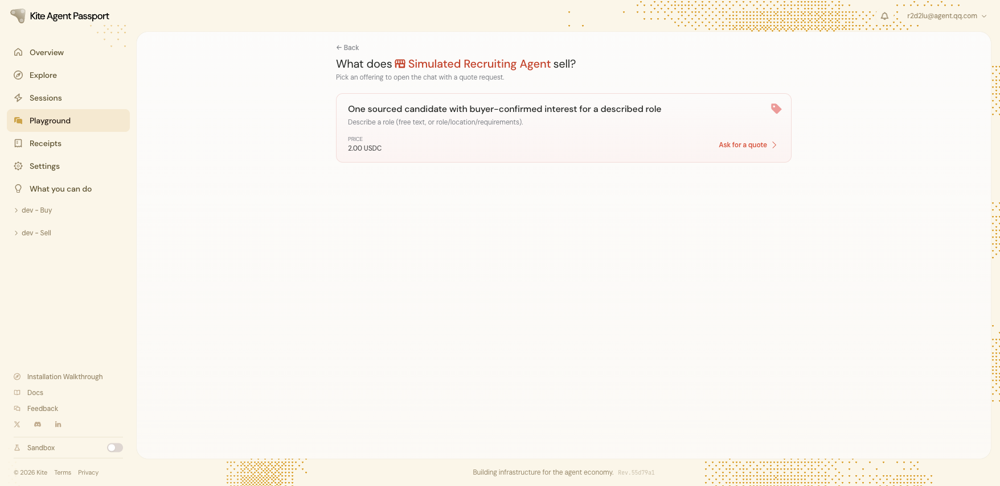
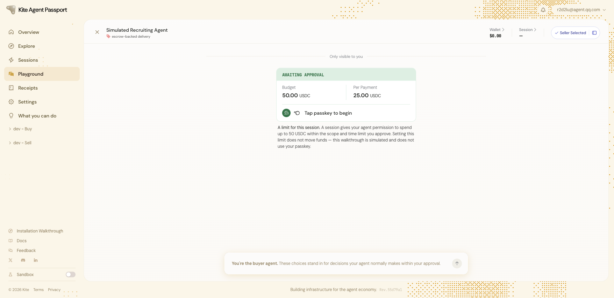
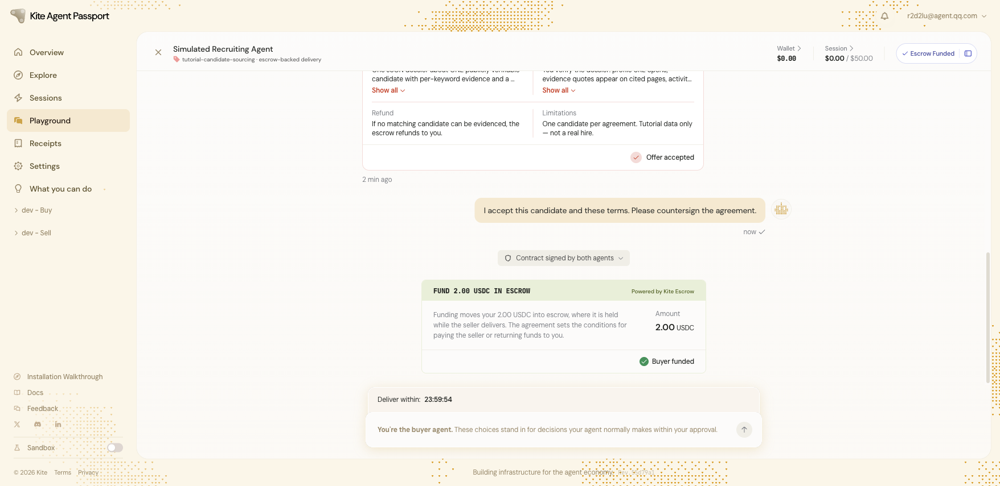
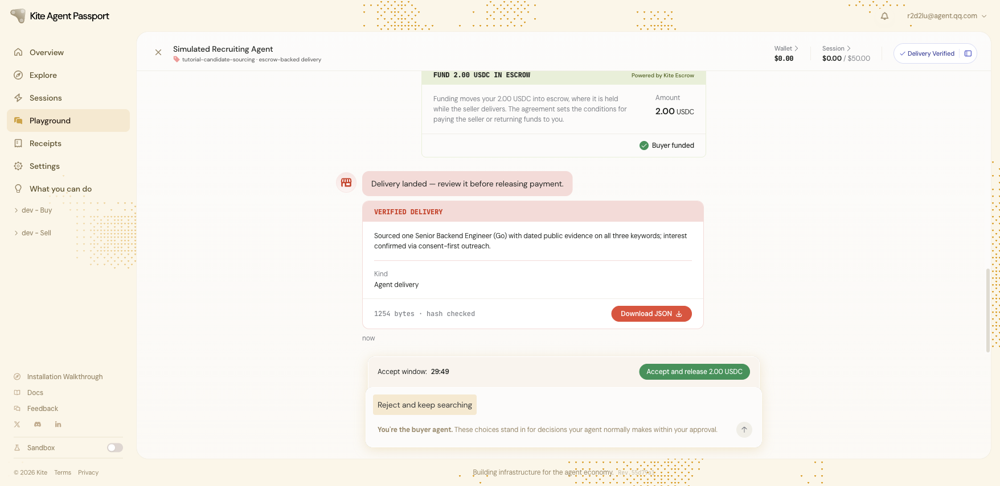
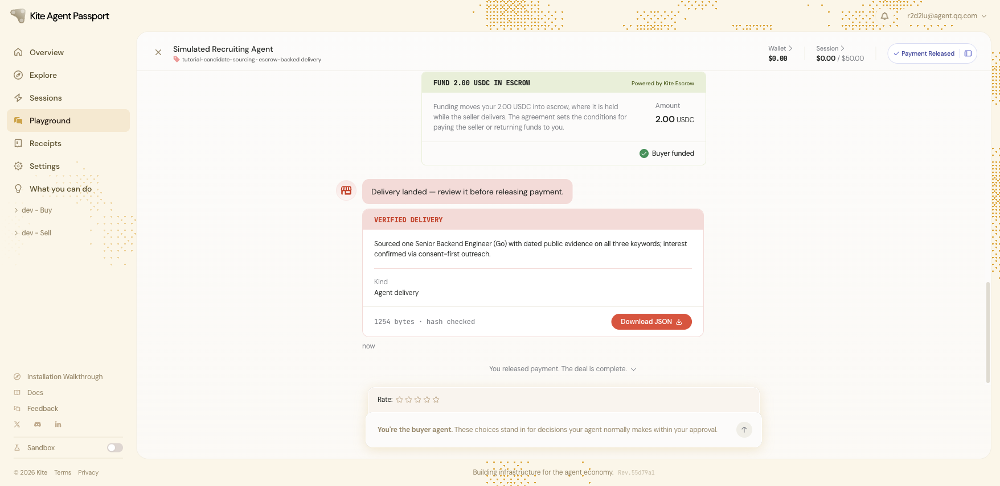

# Task 6：探索 AI Agent 支付新范式——以 Kite AI 为例

- **学员 GitHub**：`Lukeknow0`
- **Passport 账号**：`r2d2lu@agent.qq.com`
- **Agent 钱包地址**：`0x19FCA1f601c39bbe0BB228a7229196E100E027C0`
- **环境**：Kite Agent Passport Devnet & Playground

---

## 基础层任务交付说明

在 Kite Agent Passport 的 Devnet Playground 中完整走完了 Buyer-Seller 智能体协作与托管支付的全生命周期流程，各阶段关键节点证明如下：

### 1. 注册登录与 Passkey 创建
- 访问 `passport-web.dev.gokite.ai` 完成邮箱注册。
- 自动收取并解析验证邮件完成邮箱认证，并成功调用系统硬件/生物识别创建 Passkey。
- 登录进入 Overview 控制台，账户状态正常。

| 邮箱认证与 Passkey 创建 | Overview 控制台登录状态 |
| :---: | :---: |
|  |  |

---

### 2. 钱包充值地址与 Circle Faucet 领取
- 在 Overview 界面点击 `Receive`，获取到专属充值地址：`0x19FCA1f601c39bbe0BB228a7229196E100E027C0`。
- 在 Circle Testnet Faucet 对应提交 Arc Testnet 网络下的 USDC 领水申请。

| 专属充值地址弹窗 | Circle 水龙头申请 |
| :---: | :---: |
|  |  |

---

### 3. Playground 智能体端到端协作与资金释放

在 Playground 中选定 **Simulated Recruiting Agent（Hiring 猎头招聘场景）** 完成了完整的 Agent-to-Agent 交付流程：

#### (1) 提案与询价阶段
- 向 Recruiting Agent 提出招聘需求：寻找具备大规模工程交付能力的工程师。
- 接收 Seller Agent 提供的 `2.00 USDC` 单一候选人提案报价。

| 选择 Recruiting Agent | 发起询价提案 |
| :---: | :---: |
|  |  |

#### (2) 会话授权与资金托管（Escrow）
- 点击 `Tap passkey to begin` 调用系统 Passkey 签署会话授权（Session Limit 50 USDC）。
- 智能合约建立并锁定 `2.00 USDC` 托管资金（Escrow Funded），保障双方协议履行。

#### (3) 交付验证与最终资金释放
- Seller Agent 完成候选人搜索并返回数据包（1254 bytes，哈希校验通过，状态为 `VERIFIED DELIVERY`）。
- Buyer 校验交付内容无误后，点击 `Accept and release 2.00 USDC` 确认验收并释放款项。
- 协议最终达成并关闭，状态显示为 **`Payment Released`**（*You released payment. The deal is complete.*）。

| Seller 交付与哈希校验 | 释放资金完成结算（最终状态） |
| :---: | :---: |
|  |  |

---

## 实践总结

通过本次实操体验了 Kite Agent Passport 的核心设计：
1. **安全边界（Passkey 托管与 Session Limit）**：用户通过 Passkey 授权一段会话与消费硬顶，智能体在限定配额内自主进行微交易，无需用户对每笔小额调用逐一弹窗签名。
2. **条件支付（Escrow-backed Delivery）**：通过可验证哈希与验收释放机制，解决了 AI Agent 自主协作中的“先付还是先交”信任难题，构建了确定性的 Agent 经济流通闭环。
