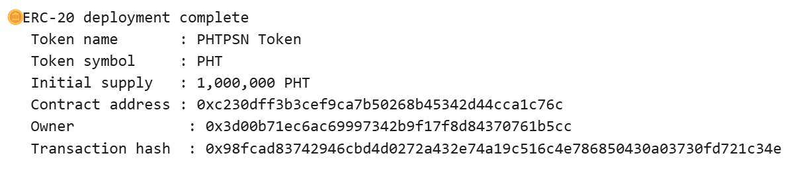
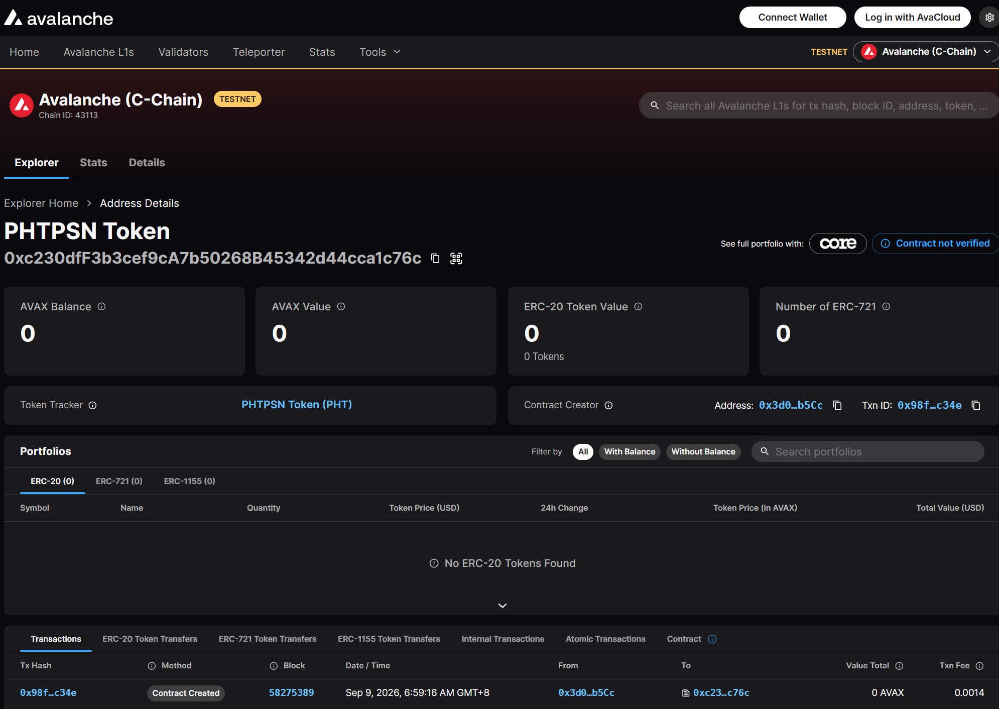

# Task 2：第二章 Vibe Coding 开发你的第一个 DApp

> 对应课程：第二章
> 目标网络：Avalanche Fuji Testnet（Chain ID `43113`）

## 任务目标

使用 Scaffold-ETH 2 和 Hardhat 开发 ERC-20 应用，并把合约部署至 Avalanche Fuji 测试网。

## 提交内容

### 链上合约信息

| 项目 | 内容 |
| --- | --- |
| 网络 | Avalanche Fuji Testnet |
| Chain ID | `43113` |
| 合约名称 | `SE2Token` |
| 代币名称 | PHTPSN Token |
| 代币符号 | PHT |
| 精度 | 18 |
| 初始发行量 | 1,000,000 PHT |
| 合约地址 | `0xc230dff3b3cef9ca7b50268b45342d44cca1c76c` |
| 部署交易 | `0x98fcad83742946cbd4d0272a432e74a19c516c4e786850430a03730fd721c34e` |
| 部署账户 | `0x3d00b71ec6ac69997342b9f17f8d84370761b5cc` |
| 部署区块 | `58275389` |
| 交易状态 | 成功（`0x1`） |
| 区块浏览器 | [查看 Fuji 合约](https://subnets-test.avax.network/c-chain/address/0xc230dff3b3cef9ca7b50268b45342d44cca1c76c) |
| 部署交易详情 | [查看 Fuji 交易](https://subnets-test.avax.network/c-chain/tx/0x98fcad83742946cbd4d0272a432e74a19c516c4e786850430a03730fd721c34e) |

### 部署成功截图





## 开发过程

### 1. 创建 ERC-20 项目

在训练营仓库之外创建独立的 Scaffold-ETH 2 项目，避免把完整应用、依赖项和生成文件加入作业 PR。

```bash
npx create-eth@latest -e erc-20
```

项目名称选择 `phtpsn-erc20-dapp`，Solidity 开发框架选择 Hardhat。

### 2. 设计 ERC-20 合约

模板生成的 `SE2Token` 允许任何地址免费增发代币。为了避免无限公开增发，合约改为使用 OpenZeppelin Contracts v5.7.0 提供的标准组件：

- `ERC20`：实现 ERC-20 标准接口和转账逻辑；
- `ERC20Burnable`：允许持币者销毁自己的代币；
- `Ownable`：提供合约所有权和 `onlyOwner` 权限控制。

最终规则如下：

- 部署时向部署账户发行 1,000,000 PHT；
- 代币使用标准 18 位精度；
- 只有合约所有者可以调用 `mint` 增发；
- 持币者可以调用 `burn` 销毁自己的代币。

核心合约代码：

```solidity
// SPDX-License-Identifier: MIT
pragma solidity >=0.8.0 <0.9.0;

import {Ownable} from "@openzeppelin/contracts/access/Ownable.sol";
import {ERC20} from "@openzeppelin/contracts/token/ERC20/ERC20.sol";
import {ERC20Burnable} from "@openzeppelin/contracts/token/ERC20/extensions/ERC20Burnable.sol";

contract SE2Token is ERC20, ERC20Burnable, Ownable {
    uint256 public constant INITIAL_SUPPLY = 1_000_000 ether;

    constructor(address initialOwner) ERC20("PHTPSN Token", "PHT") Ownable(initialOwner) {
        _mint(initialOwner, INITIAL_SUPPLY);
    }

    function mint(address to, uint256 amount) public onlyOwner {
        _mint(to, amount);
    }
}
```

### 3. 配置 Avalanche Fuji

在 `packages/hardhat/hardhat.config.ts` 中增加 Fuji 网络：

```ts
avalancheFuji: {
  type: "http",
  url: "https://api.avax-test.network/ext/bc/C/rpc",
  chainId: 43113,
  accounts: [deployerPrivateKey],
},
```

在 `packages/nextjs/scaffold.config.ts` 中加入 `chains.avalancheFuji`，使前端能够连接 Fuji：

```ts
targetNetworks: [chains.hardhat, chains.avalancheFuji],
burnerWalletMode: "allNetworks",
```

### 4. 更新部署脚本

生成器提供的部署脚本使用旧版 Hardhat 2 API `hre.getNamedAccounts()`，但当前项目安装的是 Hardhat 3，因此本地部署时出现 `hre.getNamedAccounts is not a function`。

根据项目已安装的 `hardhat-deploy` / Rocketh API，把脚本改为使用 `deployScript`、`namedAccounts` 和编译生成的 `artifacts.SE2Token`。部署时将部署账户作为构造函数的 `initialOwner`，并输出代币信息、合约地址、所有者地址和交易哈希。

### 5. 编译合约

```bash
yarn compile
```

编译结果：Solidity 0.8.30 编译成功，EVM target 为 Prague。

### 6. 本地验证部署

先在 Hardhat 模拟网络验证部署脚本和构造函数：

```bash
yarn deploy --network hardhat --tags SE2Token
```

本地部署成功，得到以下测试结果：

```text
Token name       : PHTPSN Token
Token symbol     : PHT
Initial supply   : 1,000,000 PHT
Contract address : 0x5fbdb2315678afecb367f032d93f642f64180aa3
Owner             : 0xf39fd6e51aad88f6f4ce6ab8827279cfffb92266
```

以上地址属于每次启动后会重置的 Hardhat 本地模拟网络，不是最终提交的 Fuji 地址。

### 7. 准备 Fuji 部署账户

生成新的独立部署账户：

```bash
yarn generate
```

私钥由密码加密后保存在 `packages/hardhat/.env`，该文件已被 Git 忽略，不会提交到仓库。不要使用模板内公开的 Hardhat 测试私钥向公共网络部署。

随后从 Avalanche Faucet 领取 Fuji 测试 AVAX，用于支付部署交易的 gas（链上计算费用）。

### 8. 部署至 Fuji

```bash
yarn deploy --network avalancheFuji --tags SE2Token
```

部署成功，终端输出如下：

```text
Token name       : PHTPSN Token
Token symbol     : PHT
Initial supply   : 1,000,000 PHT
Contract address : 0xc230dff3b3cef9ca7b50268b45342d44cca1c76c
Owner             : 0x3d00b71ec6ac69997342b9f17f8d84370761b5cc
Transaction hash  : 0x98fcad83742946cbd4d0272a432e74a19c516c4e786850430a03730fd721c34e
```

随后通过 Avalanche Fuji 公共 RPC 进行只读验证：交易状态为成功，合约地址存在已部署字节码，代币名称为 `PHTPSN Token`、符号为 `PHT`、精度为 18、总供应量为 1,000,000 PHT，合约所有者与部署账户一致。

### 9. 提交截图

最终保存两张截图：

1. `task2-PHTPSN-deploy.png`：终端中的 Fuji 部署成功输出；
2. `task2-PHTPSN-explorer.png`：Fuji 区块浏览器中的合约页面。

## 验证记录

| 检查项 | 结果 |
| --- | --- |
| Solidity 编译 | 通过 |
| 前端 TypeScript 检查 | 通过 |
| Hardhat 本地部署 | 通过 |
| Fuji 正式部署 | 通过 |
| Fuji 交易状态 | 成功（区块 `58275389`） |
| Fuji 合约字节码 | 已确认存在 |
| 代币元数据与总供应量 | 已通过 Fuji RPC 确认 |

## 参考资料

- [Scaffold-ETH 2](https://scaffoldeth.io/)
- [Scaffold-ETH 2 GitHub](https://github.com/scaffold-eth/scaffold-eth-2)
- [Avalanche Fuji Faucet](https://build.avax.network/console/primary-network/faucet)
