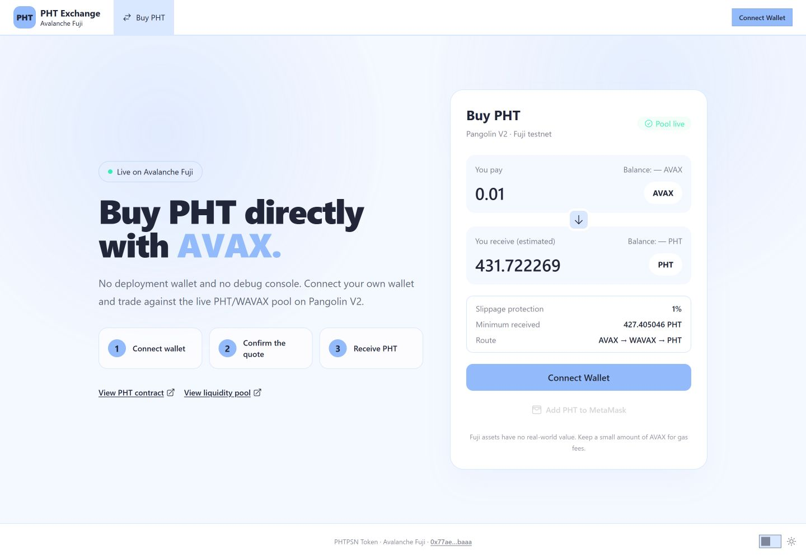
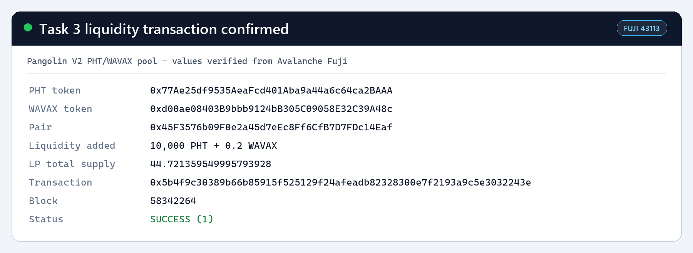
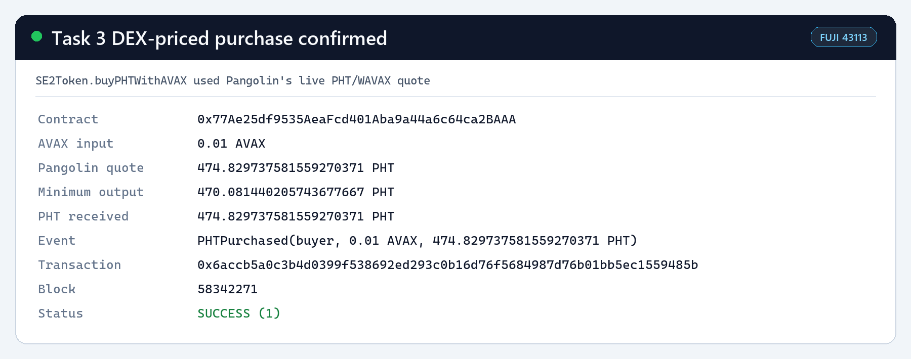

# Task 3：使用 DEX 获取代币价格

> 对应课程：第三章 Solidity 合约实战
> 目标网络：Avalanche Fuji Testnet（Chain ID `43113`）

## 实现概览

本任务选择 **Pangolin V2**，为新部署的 Task 3 版 PHT 创建 `PHT/WAVAX` 交易对并添加真实测试网流动性。`SE2Token` 通过 Pangolin Router 的 `getAmountsOut` 读取实时兑换报价，并在 `buyPHTWithAVAX` 业务函数中使用该报价完成 AVAX 购买 PHT 的交易。

Task 3 使用的是新代币地址 `0x77Ae25df9535AeaFcd401Aba9a44a6c64ca2BAAA`，没有复用 Task 2 的代币地址。

## DEX 与合约信息

| 项目 | 内容 |
| --- | --- |
| DEX | Pangolin V2 |
| 网络 | Avalanche Fuji Testnet |
| Pangolin Factory | `0xE4A575550C2b460d2307b82dCd7aFe84AD1484dd` |
| Pangolin Router | `0x2D99ABD9008Dc933ff5c0CD271B88309593aB921` |
| Token A | PHTPSN Token（PHT，18 decimals） |
| Token A 地址 | `0x77Ae25df9535AeaFcd401Aba9a44a6c64ca2BAAA` |
| Token B | Wrapped AVAX（WAVAX，18 decimals） |
| Token B 地址 | `0xd00ae08403B9bbb9124bB305C09058E32C39A48c` |
| PHT/WAVAX Pair | `0x45F3576b09F0e2a45d7eEc8Ff6CfB7D7FDc14Eaf` |

Pangolin 官方文档：[Avalanche V2 合约地址](https://docs.pangolin.exchange/developers/contracts-and-integration-reference/avalanche-v2)

## 公开交易前端

- 在线站点：[PHT Exchange](https://mon-phtpsn.github.io/phtpsn-swap-ui/)
- 前端源码：[mon-PHTPSN/phtpsn-swap-ui](https://github.com/mon-PHTPSN/phtpsn-swap-ui)

用户可以在站点中连接自己的 MetaMask 钱包，切换到 Avalanche Fuji，输入希望支付的 AVAX 数量，查看 Pangolin 实时报价并调用 Task 3 合约的 `buyPHTWithAVAX` 完成购买。交易由用户自己的钱包签名并支付测试网 Gas，买到的 PHT 直接发送给该用户；整个过程不需要部署账户参与。

该站点是由 GitHub Pages 托管的静态前端。部署完成后，它只依赖用户钱包、Avalanche Fuji 公共 RPC、已部署的 Task 3 PHT 合约和 Pangolin V2 链上合约，不依赖本地 Hardhat 节点、部署脚本或持续运行的私人服务器。README 中记录了使用方法、合约地址、本地复用方式和部署结构。

桌面版界面展示了公开站点、Fuji 网络状态、实时 Pangolin 报价、滑点保护、交易路径以及钱包连接入口：



## Task 3 合约部署

| 项目 | 内容 |
| --- | --- |
| 合约名称 | `SE2Token` |
| 代币名称 / 符号 | PHTPSN Token / PHT |
| 初始发行量 | 1,000,000 PHT |
| 合约地址 | `0x77Ae25df9535AeaFcd401Aba9a44a6c64ca2BAAA` |
| 部署账户 | `0x3d00B71EC6aC69997342B9f17f8d84370761b5Cc` |
| 部署交易 | `0xe1f26c2882f2edf326b63eaa920211a6d8a37cdee6771e5a6ccb916ad10df5c2` |
| 部署区块 | `58342255` |
| 交易状态 | 成功（`1`） |
| 区块浏览器 | [查看 Task 3 PHT 合约](https://subnets-test.avax.network/c-chain/address/0x77Ae25df9535AeaFcd401Aba9a44a6c64ca2BAAA) |
| 部署交易详情 | [查看部署交易](https://subnets-test.avax.network/c-chain/tx/0xe1f26c2882f2edf326b63eaa920211a6d8a37cdee6771e5a6ccb916ad10df5c2) |

构造函数将 Pangolin Router 和 Fuji WAVAX 地址保存为不可变变量，避免后续由管理员手动修改价格来源：

```solidity
IPangolinRouter public immutable pangolinRouter;
address public immutable wavax;

constructor(
    address initialOwner,
    address routerAddress,
    address wavaxAddress
) ERC20("PHTPSN Token", "PHT") Ownable(initialOwner) {
    if (routerAddress == address(0) || wavaxAddress == address(0)) {
        revert InvalidDexAddress();
    }

    pangolinRouter = IPangolinRouter(routerAddress);
    wavax = wavaxAddress;
    _mint(initialOwner, INITIAL_SUPPLY);
}
```

## 创建交易对并添加流动性

部署完成后，先授权 Pangolin Router 使用 10,000 PHT，再调用 Router 的 `addLiquidityAVAX`。Router 将 AVAX 封装为 WAVAX，并通过 Factory 自动创建新的 `PHT/WAVAX` Pair。

| 项目 | 内容 |
| --- | --- |
| 初始 PHT 流动性 | 10,000 PHT |
| 初始 WAVAX 流动性 | 0.2 WAVAX |
| 获得的 LP Token | 约 44.721359549995792928 |
| 授权交易 | `0x97006a93b6f9815d2cb54a92be1346574b3a05f4ee81612b7ccbda6839b8e76e` |
| 添加流动性交易 | `0x5b4f9c30389b66b85915f525129f24afeadb82328300e7f2193a9c5e3032243e` |
| 区块 | `58342264` |
| 交易状态 | 成功（`1`） |
| Pair 浏览器 | [查看 PHT/WAVAX Pair](https://subnets-test.avax.network/c-chain/address/0x45F3576b09F0e2a45d7eEc8Ff6CfB7D7FDc14Eaf) |
| 流动性交易详情 | [查看添加流动性交易](https://subnets-test.avax.network/c-chain/tx/0x5b4f9c30389b66b85915f525129f24afeadb82328300e7f2193a9c5e3032243e) |



## 从 Pangolin 获取 Swap 价格

合约没有保存或写死 PHT 的价格。`quotePHTForAVAX` 构造 `WAVAX -> PHT` 路径，并直接调用 Pangolin Router 的 `getAmountsOut`。返回值由 Pair 的实时储备量、Pangolin V2 AMM 公式、交易费和输入数量共同决定。

```solidity
interface IPangolinRouter {
    function getAmountsOut(uint256 amountIn, address[] calldata path)
        external
        view
        returns (uint256[] memory amounts);

    function swapExactAVAXForTokens(
        uint256 amountOutMin,
        address[] calldata path,
        address to,
        uint256 deadline
    ) external payable returns (uint256[] memory amounts);
}

function quotePHTForAVAX(uint256 avaxAmount)
    public
    view
    returns (uint256 phtAmount)
{
    if (avaxAmount == 0) revert ZeroAVAXAmount();

    address[] memory path = _phtPurchasePath();
    uint256[] memory amounts = pangolinRouter.getAmountsOut(avaxAmount, path);
    return amounts[1];
}

function _phtPurchasePath() private view returns (address[] memory path) {
    path = new address[](2);
    path[0] = wavax;
    path[1] = address(this);
}
```

## 在实际业务逻辑中使用价格

`buyPHTWithAVAX` 使用调用者发送的 AVAX 数量读取 Pangolin 报价。若实时报价低于用户指定的 `minPHTOut`，交易会立即回滚；通过检查后，合约调用同一 Pangolin Router 执行兑换，并把 PHT 直接发送给购买者。`minPHTOut` 用于滑点保护，`deadline` 防止过期交易执行。

```solidity
function buyPHTWithAVAX(
    uint256 minPHTOut,
    uint256 deadline
) external payable nonReentrant returns (uint256 phtAmount) {
    if (msg.value == 0) revert ZeroAVAXAmount();

    uint256 quotedAmount = quotePHTForAVAX(msg.value);
    if (quotedAmount < minPHTOut) {
        revert QuoteBelowMinimum(quotedAmount, minPHTOut);
    }

    address[] memory path = _phtPurchasePath();
    uint256[] memory amounts = pangolinRouter.swapExactAVAXForTokens{
        value: msg.value
    }(minPHTOut, path, msg.sender, deadline);

    phtAmount = amounts[1];
    emit PHTPurchased(msg.sender, msg.value, phtAmount);
}
```

## 链上价格使用证明

通过 Task 3 合约执行了一次 `0.01 AVAX` 的真实 Fuji 测试网购买：

| 项目 | 内容 |
| --- | --- |
| 调用函数 | `buyPHTWithAVAX` |
| AVAX 输入 | 0.01 AVAX |
| 交易前 Pangolin 报价 | 474.829737581559270371 PHT |
| 最小可接受输出 | 470.081440205743677667 PHT（报价的 99%） |
| 实际收到 | 474.829737581559270371 PHT |
| 业务事件 | `PHTPurchased(buyer, 0.01 AVAX, 474.829737581559270371 PHT)` |
| 购买交易 | `0x6accb5a0c3b4d0399f538692ed293c0b16d76f5684987d76b01bb5ec1559485b` |
| 区块 | `58342271` |
| 交易状态 | 成功（`1`） |
| 交易详情 | [查看 DEX 定价购买交易](https://subnets-test.avax.network/c-chain/tx/0x6accb5a0c3b4d0399f538692ed293c0b16d76f5684987d76b01bb5ec1559485b) |



购买后链上储备量变为约 `9,525.170262418440729629 PHT` 和 `0.21 WAVAX`。再次读取 `0.01 AVAX` 的报价得到约 `431.722269019920234915 PHT`，证明报价会随真实交易造成的 Pair 储备变化而变化，并非合约中的固定值。

## 实现与验证过程

1. 保留 Task 2 的 ERC-20 转账、持币者销毁、所有者增发和 1,000,000 PHT 初始供应量。
2. 为 Task 3 增加 Pangolin Router/WAVAX 不可变配置、DEX 报价函数和 AVAX 购买业务函数。
3. 使用新 Task 3 PHT 地址部署合约，再创建 `PHT/WAVAX` Pair；没有使用旧 Task 2 地址。
4. 添加 10,000 PHT 和 0.2 WAVAX 的测试网流动性。
5. 通过合约执行 0.01 AVAX 购买，验证 Router 报价、实际输出和 `PHTPurchased` 事件一致。
6. 使用 Fuji 公共 RPC 重新读取合约配置、Pair 地址、储备、LP 余额、事件和四笔交易收据。

本地命令：

```bash
yarn compile
yarn hardhat:test
yarn deploy --network avalancheFuji --tags SE2TokenTask3
yarn workspace @se-2/hardhat task3:liquidity
yarn workspace @se-2/hardhat task3:purchase
yarn workspace @se-2/hardhat task3:verify
```

验证结果：

| 检查项 | 结果 |
| --- | --- |
| Solidity 0.8.30 编译 | 通过 |
| Hardhat 测试 | 4 项全部通过 |
| Task 3 部署交易 | 成功 |
| Router 的 Factory/WAVAX 配置 | 与 Pangolin Fuji 官方地址一致 |
| PHT/WAVAX Pair 和流动性 | 已确认存在且储备非零 |
| `getAmountsOut` 报价 | 成功读取 |
| `buyPHTWithAVAX` 实际兑换 | 成功 |
| `PHTPurchased` 事件 | 已通过交易收据确认 |
| 公开交易前端 | GitHub Pages 已上线并通过页面及静态资源访问验证 |

> 注意：`getAmountsOut` 提供的是当前 AMM 储备计算出的现货报价，不是时间加权平均价格（TWAP）。本任务按要求使用 DEX Router 报价，并通过最小输出量和截止时间降低滑点风险；生产环境中的高价值定价业务还应考虑 TWAP 和抗价格操纵设计。
