Task 3：使用 DEX Oracle 获取代币价格

对应课程：第三章 Solidity 合约实战

任务目标

学习如何通过测试网 DEX 的交易对获取代币价格，并将该价格应用到自己的智能合约业务中。

任务要求

1. 在 Avalanche 测试网选择一个 DEX。
2. 自行创建或添加一个 Token 交易对，并提供一定流动性。
3. 通过该交易对的 Oracle、Pair、Router 或 Quoter 等方式获取 Swap 价格。
4. 修改此前的代币合约，将原本手动填写或写死的价格改为使用 DEX 获取的价格。
5. 在合约的实际业务逻辑中使用该价格，例如：
  - 计算购买数量
  - 计算兑换数量
  - 计算支付金额
  - 作为代币出售或铸造的定价依据
6. 将修改后的合约部署到 Avalanche Fuji 测试网。
7. 提供能够证明价格来自 DEX、并被合约实际使用的材料。

提交内容

请在 learn/<YourName>/task3.md 中提交：

- 使用的 DEX 名称
PancakeSwap V2（自部署 Factory/Router/Pair）
- Token A 和 Token B 的名称及合约地址

- Token A: DappLinkToken (DLK) — 0xb221f664ea3E60E0cFD65aeEC533E114a5cc2619
- Token B: Test USDT (USDT, 6 位小数) — 0xB58618AF39D1B44743e3dBC4108725580270fC7A
- 交易对地址
0x73bC9ADb93eA6B081253c543dBE09173B0A4F029
- 添加流动性或创建交易对的截图
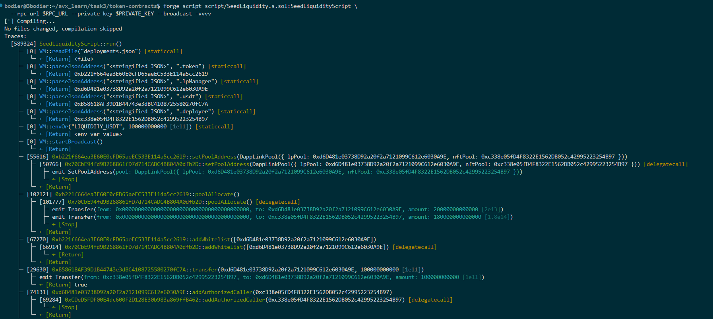
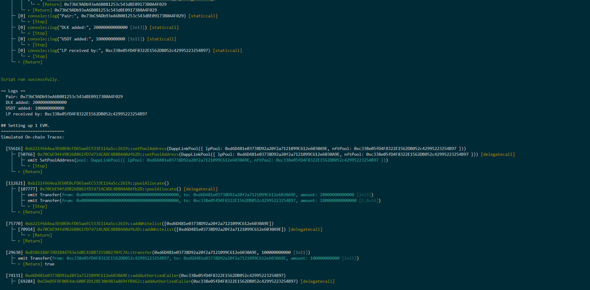 
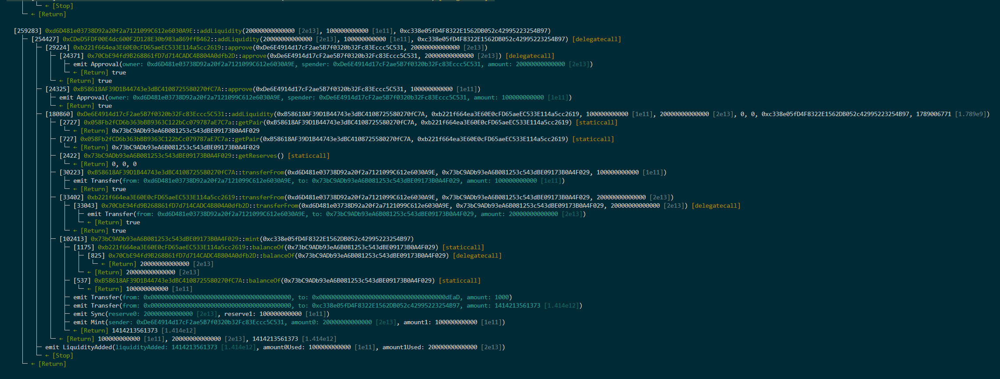 
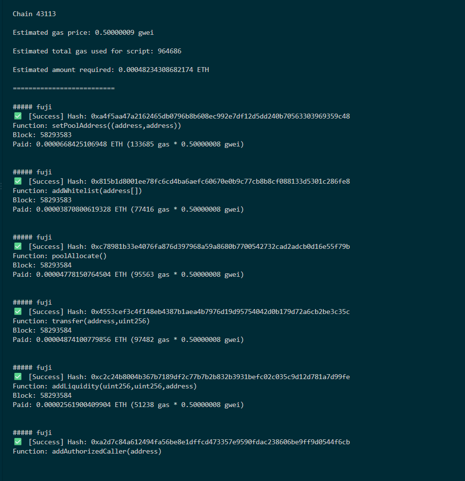
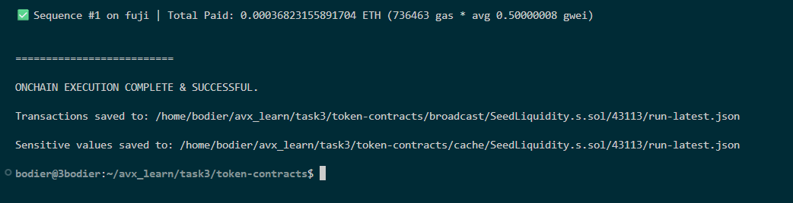
- 获取 Swap/Oracle 价格的核心代码
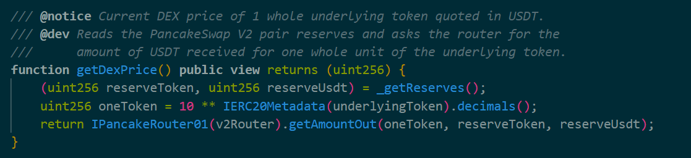
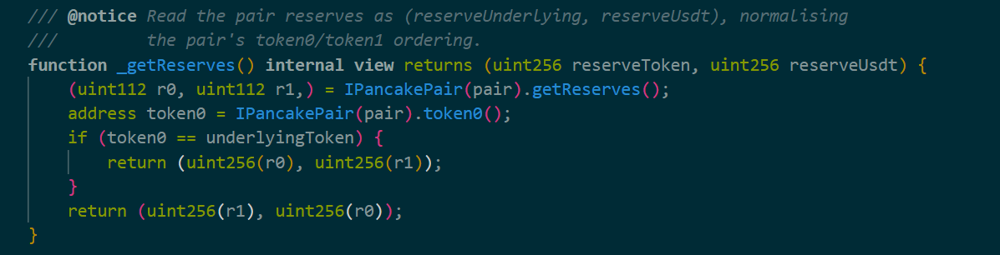
- 使用价格的合约核心代码
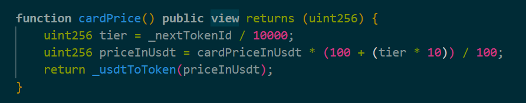
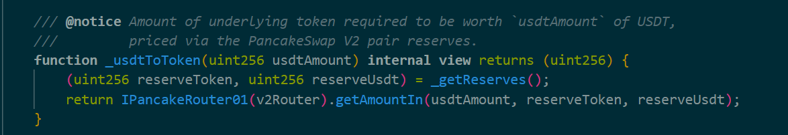
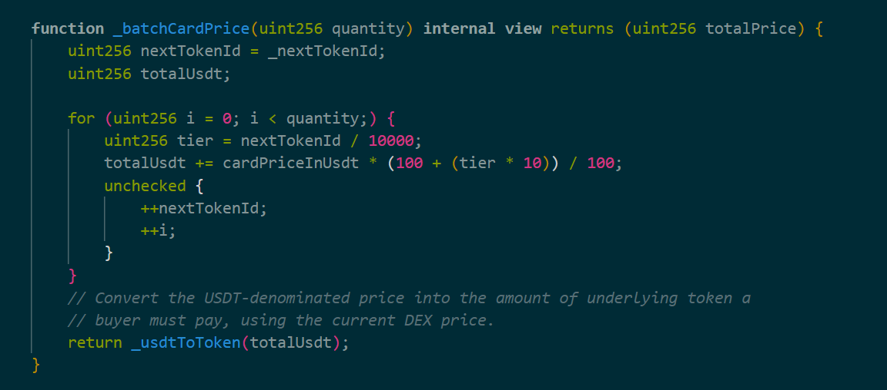
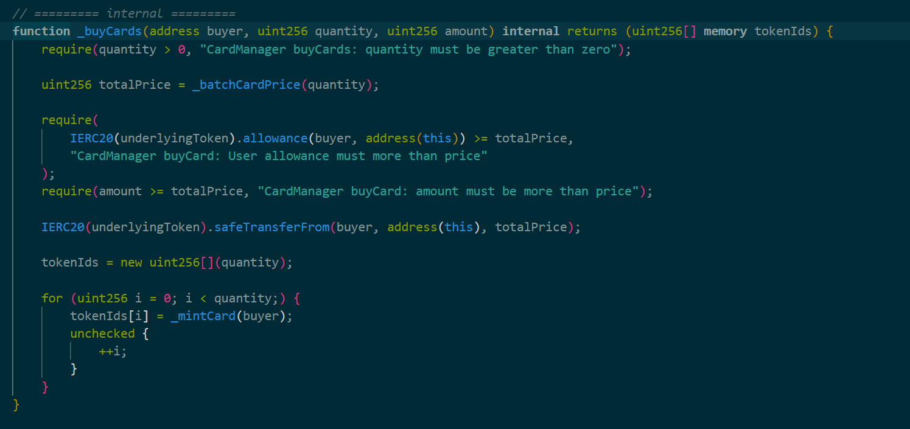
- 部署后的合约地址

PancakeV2Factory: 0x058Fb2fCD6b363bBB9363C122bCc079787aE7C7a
PancakeV2Router: 0xDe6E4914d17cF2ae5B7f0320b32Fc83Eccc5C531
Test USDT (Token B): 0xB58618AF39D1B44743e3dBC4108725580270fC7A
DappLinkToken (Token A, proxy): 0xb221f664ea3E60E0cFD65aeEC533E114a5cc2619
DLK/USDT Pair: 0x73bC9ADb93eA6B081253c543dBE09173B0A4F029
CardManager (proxy): 0xd0aF5737F29953E18D6b3F9E9AbE486e68435a8f
LpManager (proxy): 0xd6D481e03738D92a20f2a7121099C612e6030A9E

- 区块浏览器链接
合约地址链接
合约	链接
CardManager（核心，部署后的合约）	https://testnet.snowtrace.io/address/0xd0aF5737F29953E18D6b3F9E9AbE486e68435a8f
交易对 Pair	https://testnet.snowtrace.io/address/0x73bC9ADb93eA6B081253c543dBE09173B0A4F029
全套合约地址链接
合约	链接
PancakeV2Factory	https://testnet.snowtrace.io/address/0x058Fb2fCD6b363bBB9363C122bCc079787aE7C7a
PancakeV2Router	https://testnet.snowtrace.io/address/0xDe6E4914d17cF2ae5B7f0320b32Fc83Eccc5C531
Test USDT（Token B）	https://testnet.snowtrace.io/address/0xB58618AF39D1B44743e3dBC4108725580270fC7A
DappLinkToken（Token A）	https://testnet.snowtrace.io/address/0xb221f664ea3E60E0cFD65aeEC533E114a5cc2619
DLK/USDT Pair	https://testnet.snowtrace.io/address/0x73bC9ADb93eA6B081253c543dBE09173B0A4F029
CardManager	https://testnet.snowtrace.io/address/0xd0aF5737F29953E18D6b3F9E9AbE486e68435a8f
LpManager	https://testnet.snowtrace.io/address/0xd6D481e03738D92a20f2a7121099C612e6030A9E
关键交易哈希链接
交易	链接
addLiquidity（加流动性铁证）	https://testnet.snowtrace.io/tx/0xc2c24b8004b367b7189df2c77b7b2b832b3931befc02c035c9d12d781a7d99fe
transfer（USDT 转 LpManager）	https://testnet.snowtrace.io/tx/0x4553cef3c4f148eb4387b1aea4b7976d19d95754042d0b179d72a6cb2be3c35c
poolAllocate（分配 DLK）	https://testnet.snowtrace.io/tx/0xc78981b33e4076fa876d397968a59a8680b7700542732cad2adcb0d16e55f79b

- 成功读取或使用价格的截图

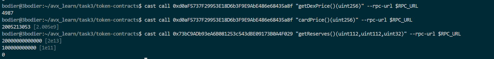
- 对实现过程的简要说明
在 Avalanche Fuji 测试网上自部署了一套 PancakeSwap V2（Uniswap-V2 风格）协议：PancakeV2Factory（创建交易对）、PancakeV2Router（报价/加流动性/兑换）和 PancakeV2Pair（常数乘积 AMM，0.25% 手续费）。部署 DappLinkToken 时自动创建了 DLK/USDT 交易对（USDT 为 6 位小数的测试代币），随后通过 LpManager 向该交易对注入了约 10 万 USDT + 2000 万 DLK 的初始流动性。

然后修改 CardManager：把原先写死的购卡价格 minAmount = 100 * 10**18 改为「以 USDT 标价 + 通过 DEX 实时换算」——getDexPrice() 读取交易对储备并调用 Router 的 getAmountOut 得到 1 DLK 的 USDT 价格，cardPrice()/_batchCardPrice() 再通过 getAmountIn 把 USDT 卡价换算成买家实际要支付的 DLK 数量，并在 buyCard/buyCards 的转账逻辑中实际使用。

部署后可验证：getDexPrice() 返回 4987（1 DLK ≈ 0.004987 USDT），cardPrice() 返回 2005213053（约 2005.21 DLK 买一张 10 USDT 的卡），getReserves() 显示交易对有非零储备，证明价格确实来自 DEX 且被合约业务使用。

合格标准

满足以下条件即可视为完成：

- 测试网上存在真实交易对，并且有可用流动性
- 价格来自 DEX 交易对或相关 Oracle 机制，而不是手动写入
- 获取到的价格被合约的实际业务逻辑使用
- 合约成功部署到 Avalanche Fuji 测试网
- 提交交易对地址、合约地址、代码或截图等可验证材料
  

注意事项

- 不允许仅在合约中写死一个固定价格。
- 不允许只在前端展示模拟价格而不在合约中使用。
- 请注意 Token decimals 对价格计算的影响。
- 如果交易对没有流动性，无法正常获取价格，需要先添加流动性。
- 可以自由选择 DEX 和具体实现方式。