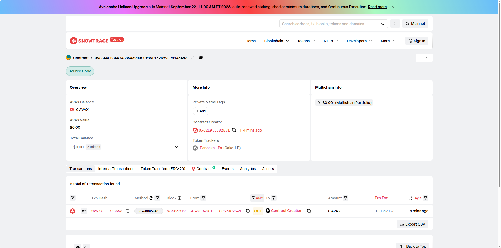
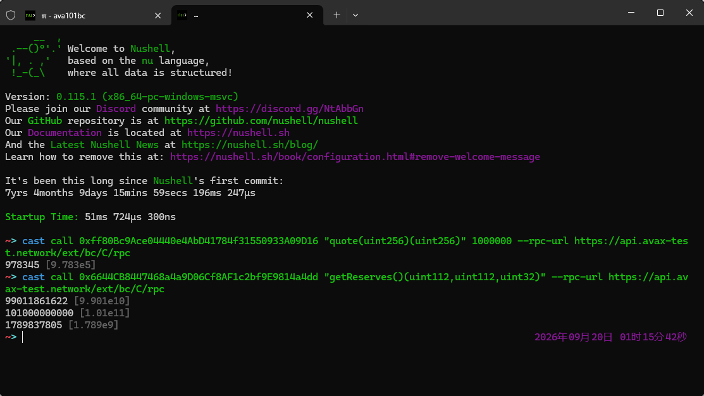

# Task 3：使用 DEX Oracle 获取代币价格

> 对应课程：第三章 Solidity 合约实战
> 提交人：RoooyHe

## 使用的 DEX

**PancakeSwap V2**（AMM，XY=K 模型，Core/Periphery 全套自部署到 Avalanche Fuji 测试网）

## Token 信息

| 项目 | 名称 | 合约地址 |
| --- | --- | --- |
| Token A | DappLink Token (DLK, decimals=6, ERC1967 代理) | `0xff80Bc9Ace04440e4AbD41784f31550933A09D16` |
| Token B | Mock USDT (decimals=6) | `0x3fa8CffDB2a61C435C66F991Bf7d6d13732407a6` |

### 基础设施合约（自部署 PancakeSwap V2）

| 合约 | 地址 |
| --- | --- |
| PancakeFactory (solc 0.5.16) | `0xd08217C8c3556F9959649f0CfC07F1a20217366d` |
| PancakeRouter02 (solc 0.6.6) | `0x9F0bcdE21E42cd5190440158503e048aFC7194fd` |
| WAVAX (WETH9) | `0xEF21281498DE79e841F9a6DB3469CdA3e84e3Ab7` |

## 交易对地址

- **DLK/USDT Pair**：`0x6644CB8447468a4a9D06Cf8AF1c2bf9E9814a4dd`
- 由 `IPancakeFactory.createPair(USDT, DLK)` 在代币合约 `initialize` 中自动创建
- 当前流动性：约 99,011.86 USDT / 101,000 DLK（6 decimals），LP Token 由部署者持有

## 创建交易对与添加流动性

交易对在代币合约 `initialize` 中自动创建：

```solidity
mainPair = IPancakeFactory(_v2Factory).createPair(USDT, address(this));
```

添加流动性核心代码（`SwapHelper.addLiquidityV2`，调用 `router.addLiquidity`，滑点保护 80%）：

```solidity
function addLiquidityV2(
    address router, address token0, address token1,
    uint256 amount0, uint256 amount1, address to
) internal returns (uint256 liquidityAdded, uint256 amount0Used, uint256 amount1Used) {
    IERC20(token0).approve(router, amount0);
    IERC20(token1).approve(router, amount1);
    (amount0Used, amount1Used, liquidityAdded) = IPancakeRouter02(router).addLiquidity(
        token0, token1, amount0, amount1,
        (amount0 * 80) / 100, (amount1 * 80) / 100,
        to, block.timestamp + 300
    );
}
```



## 获取 Swap 价格的核心代码

通过 Pair 读取 reserves，再用 Router 的 `getAmountOut`（Uniswap V2 AMM 公式）计算价格：

```solidity
function quote(uint256 amount) public view returns (uint256) {
    (uint256 rOther, uint256 rThis, , ) = getReserves(mainPair, address(this));
    return IPancakeRouter02(v2Router).getAmountOut(amount, rThis, rOther);
}

// 链上更新基准价（由 operator 调用，价格直接来自 DEX 池子）
function updateChoPrice() external onlyOperator {
    (uint256 rOther, uint256 rThis, , ) = getReserves(mainPair, address(this));
    latestChoPrice = IPancakeRouter02(v2Router).getAmountOut(1000000, rThis, rOther);
    emit UpdateChoPrice(block.timestamp, block.number, latestChoPrice);
}
```

注意 decimals：DLK 与 USDT 均为 6 位小数，`quote(1000000)` 即"用 1 个 DLK 能换回多少 USDT（单位 10^-6）"。

## 在业务逻辑中使用 DEX 价格

1. **动态下跌税**：卖出时用 `quote()` 获取当前 DEX 实时价格，与基准价 `latestChoPrice` 比较，跌幅 ≥3% 收 10%、≥6% 收 20% 的税——价格完全来自池子，不是写死的：

```solidity
function getDeclineTaxRate(uint256 value, bool isSell) internal returns (uint256 sellTax) {
    if (!isSell || latestChoPrice == 0 || value == 0) return 0;
    uint256 currentPrice = quote(1000000);          // ← DEX 实时价格
    if (currentPrice >= latestChoPrice) return 0;
    uint256 declineRate = ((latestChoPrice - currentPrice) * BPS_DENOMINATOR) / latestChoPrice;
    if (declineRate >= PRICE_DROP_6_BPS)      sellTax = (value * DOWN_TAX_6_BPS) / BPS_DENOMINATOR;
    else if (declineRate >= PRICE_DROP_3_BPS) sellTax = (value * DOWN_TAX_3_BPS) / BPS_DENOMINATOR;
    ...
}
```

2. **手续费自动兑换**：卖出手续费的 30% 通过 `SwapHelper.swapV2`（`swapExactTokensForTokensSupportingFeeOnTransferTokens`）按 DEX 价格自动换成 USDT 打给 treasury：

```solidity
require(SwapHelper.swapV2(v2Router, address(this), USDT, platformBalance, 0, treasureAddress) > 0, "swap failed");
```

## 部署信息

- 部署后的代币合约（Proxy）：`0xff80Bc9Ace04440e4AbD41784f31550933A09D16`
- 交易对：`0x6644CB8447468a4a9D06Cf8AF1c2bf9E9814a4dd`
- 区块浏览器：
  - DLK: https://testnet.snowtrace.io/address/0xff80Bc9Ace04440e4AbD41784f31550933A09D16
  - Pair: https://testnet.snowtrace.io/address/0x6644CB8447468a4a9D06Cf8AF1c2bf9E9814a4dd

## 成功读取价格证明（Fuji 链上实测，截图见下）

```
$ cast call $PAIR "getReserves()(uint112,uint112,uint32)"
99011861622        # USDT reserve（6 decimals ≈ 99,011.86）
101000000000       # DLK reserve（6 decimals ≈ 101,000）
$ cast call $DLK "quote(uint256)(uint256)" 1000000
978345             # 1 DLK ≈ 0.978 USDT（swap 1000 DLK 之后，价格随池子下跌）
$ cast call $DLK "latestChoPrice()(uint256)"
997990             # swap 前基准价 0.998 USDT（updateChoPrice 从池子读取）
```

swap 1000 DLK 前后：`quote(1000000)` 从 **997990 → 978345**，reserves 同步变化，
证明价格来自 DEX 交易对实时状态，并被合约业务逻辑（下跌税基准价）实际使用。



## 实现过程说明

1. **自部署 PancakeSwap V2**：将 `pancake-swap-core`（solc 0.5.16）/ `pancake-swap-periphery`（solc 0.6.6）编译并部署到 Fuji，另部署 WETH9 供 Router 构造使用。
2. **同步 init code hash**：Router 通过 CREATE2 预测 pair 地址，`PancakeLibrary.pairFor` 里硬编码的 PancakeSwap 主网 hash 与本地编译的 `PancakePair` 字节码不一致，部署 Factory 后从链上读取 `INIT_CODE_PAIR_HASH()`（`0xb00db23a70a63f58abf4927ed719ad367b20ddf6af43f17b2aa80ed222ac9103`）回填到 Library，否则 Router 找不到交易对。
3. **部署 MockUSDT**（6 decimals，与主网 USDT 一致）作为计价代币。
4. **通过 ERC1967 代理部署 `DappLinkToken`**，`initialize` 中自动调用 `createPair(USDT, DLK)` 创建交易对。
5. `poolAllocate` 铸币后（白名单 + 开启交易，否则向 pair 转 DLK 会被判定为 sell 而 revert），用 `addLiquidityV2` 注入 100,000 DLK + 100,000 USDT 初始流动性，池子开始定价（1 DLK = 1 USDT）。
6. `quote()` 读取 `getReserves()` 并用 Router `getAmountOut` 计算实时 Swap 价格；`updateChoPrice()` 把 DEX 价格写入 `latestChoPrice` 作为基准。
7. 业务逻辑（卖出下跌税、手续费换 USDT）均以该 DEX 价格为依据，无任何写死价格。
8. **踩坑记录**：
   - 两个代币 decimals 均为 6，价格计算统一按最小单位（10^6）处理，避免精度错误；
   - deadline 用 `block.timestamp` 在广播延迟时会报 `EXPIRED`，改为 `block.timestamp + 300`；
   - Router 编译产物超过 24.5KB（EIP-170），需开启 optimizer。

## 截止时间

9月13日 24:00:00 (UTC+8)
