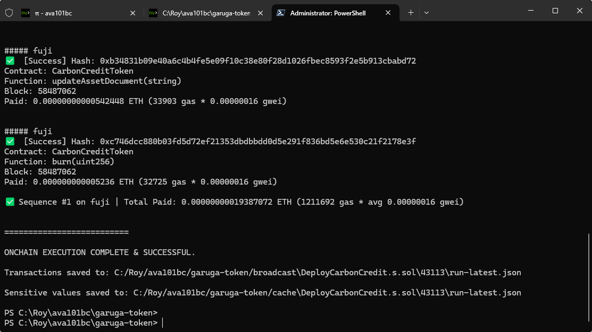
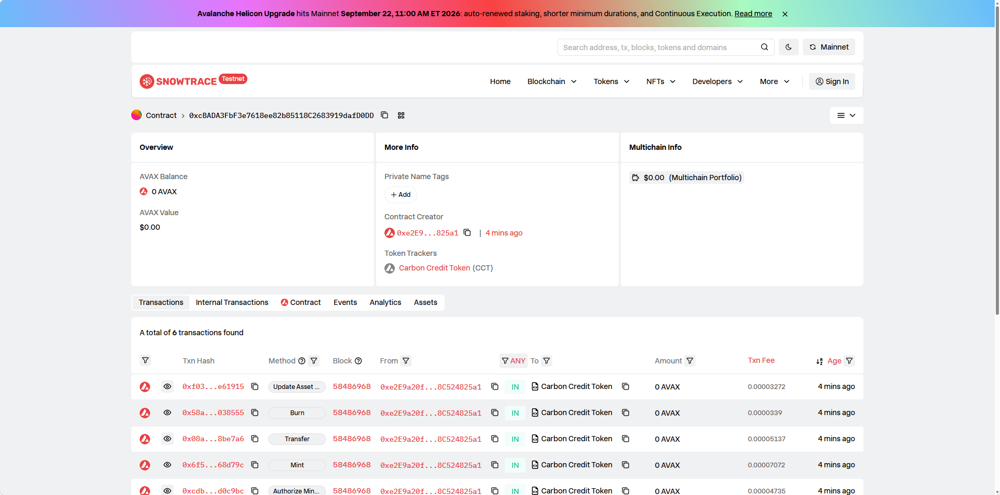
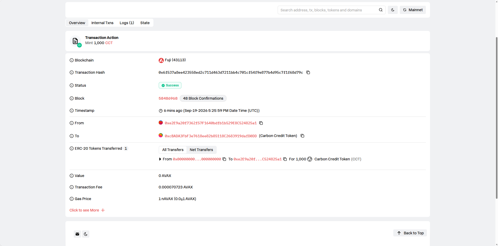
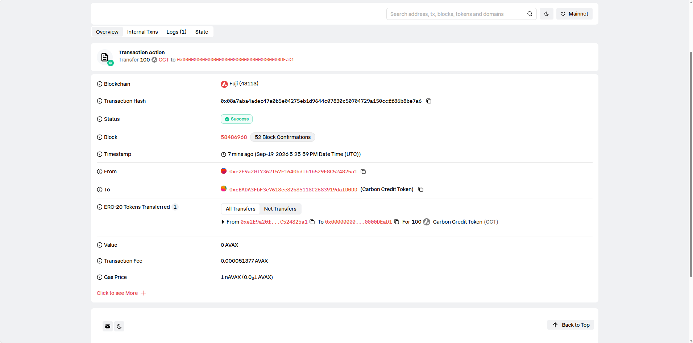

# Task5：Avalanche RWA Token 合约实战 —— 碳积分 Carbon Credit Token

> 提交人：RoooyHe
> 对应课程：第五章
> ⚠️ 本作业仅用于技术学习和业务模拟，不涉及真实资产募集、投资建议或金融产品发行。

## 1. 学员信息

- GitHub 用户名：RoooyHe
- 作业代码仓库：本仓库 `garuga-token`（合约在 `src/task5/CarbonCreditToken.sol`，测试在 `test/CarbonCreditToken.t.sol`，部署脚本在 `script/DeployCarbonCredit.s.sol`）

## 2. 项目说明：RWA 业务场景

**场景选择：碳积分 / 碳排放配额（Carbon Credit）**

| 设计要素 | 说明 |
| --- | --- |
| 现实资产 | 经第三方机构核证的碳减排量（如林地碳汇、清洁能源项目产生的 CCER/VER 配额） |
| 资产托管 | 项目方负责线下资产登记，核查机构出具核证报告；核证报告哈希上链 |
| Token 对应关系 | 1 CCT = 1 吨 CO₂ 排放配额（演示中 decimals=18，仅技术演示） |
| 发行 (mint) | 新一批核证减排量入库并上链登记，仅托管方/授权账户可操作 |
| 转让 (transfer) | 碳配额在企业间交易流转，或用于履约清缴 |
| 销毁 (burn) | 配额被企业履约清缴或自愿抵消，退出流通，总量永久减少 |
| assetDocument | 资产证明（IPFS 链接 + 核证报告哈希）。真实 RWA 项目中，审计方通过核对链上哈希与线下凭证一致性，实现"资产-Token"锚定的可验证性 |

## 3. 合约信息

- 合约源码：`src/task5/CarbonCreditToken.sol`（基于 OpenZeppelin ERC20 + Ownable）
- **部署地址（Avalanche Fuji Testnet）：`0xcbada3fbf3e7618ee82b85118c2683919dafd0dd`**
- 部署交易：`0x6f537a8ee423558ed2c711d463d7211bb4c701cf54f9e877b4d95c7f1f68d79c`
- 区块浏览器：https://testnet.snowtrace.io/address/0xcbada3fbf3e7618ee82b85118c2683919dafd0dd
- 网络：Avalanche Fuji Testnet，**Chain ID: 43113**

## 4. 功能说明

| 功能 | 实现 | 权限 |
| --- | --- | --- |
| Token 发行 `mint(to, amount)` | ✅ | 仅 owner 或 `authorizeMinter` 授权账户 |
| Token 销毁 `burn(amount)` | ✅ | 持有人销毁自己的余额 |
| Token 转账 `transfer` | ✅ | ERC20 标准 |
| 余额查询 `balanceOf` | ✅ | 公开 |
| 总供应量 `totalSupply` | ✅ | 公开 |
| 发行权限控制 | ✅ `authorizeMinter` / `revokeMinter` | 仅 owner |
| 资产证明更新 `updateAssetDocument` | ✅ 带 `AssetDocumentUpdated` 事件 | 仅 owner |
| 关键操作事件 | ✅ Transfer / MinterAuthorized / AssetDocumentUpdated 等 | - |

## 5. 测试

`forge test --match-contract CarbonCreditTokenTest` —— **15 个测试全部通过**，覆盖任务要求的全部场景：

- ✅ 合约部署成功 / 初始 Token 信息正确（name/symbol/supply/owner/document）
- ✅ 授权账户可以发行 Token（minter + owner）
- ✅ 非授权账户不能发行 Token
- ✅ 持有人可以转账（且转账不改变总供应量）
- ✅ Token 可以被销毁（余额与总供应量同步减少）
- ✅ 总供应量和账户余额变化正确
- ✅ 非授权账户不能修改资产证明信息
- ✅ 错误操作被拒绝（超额转账/超额销毁/无权限授权）
- ✅ 事件正确触发（Transfer / AssetDocumentUpdated）

## 6. 链上演示（Fuji 实测）

部署脚本按顺序执行：mint 1000 → transfer 100 → burn 50 → updateAssetDocument，链上验证结果：

```
$ cast call $TOKEN "totalSupply()(uint256)"
950000000000000000000        # 1000 - 100 转出 - 50 销毁 = 950 ✅
$ cast call $TOKEN "balanceOf(address)(uint256)" $OWNER
850000000000000000000        # 1000 - 100 = 850 ✅
$ cast call $TOKEN "balanceOf(address)(uint256)" $DEAD1
100000000000000000000        # 转入 100 ✅
$ cast call $TOKEN "assetDocument()(string)"
"ipfs://QmCarbonAssetDocDemoV2"   # 资产证明已更新 ✅
```

## 7. 截图材料

- 合约部署成功截图：
- 区块浏览器合约页面：
- Token 发行截图：
- Token 转账截图：
- Token 销毁截图：
