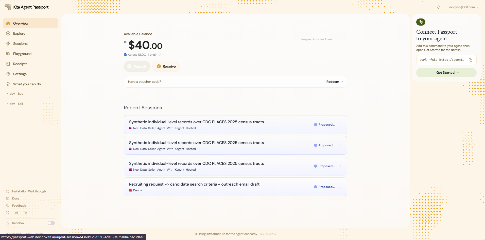
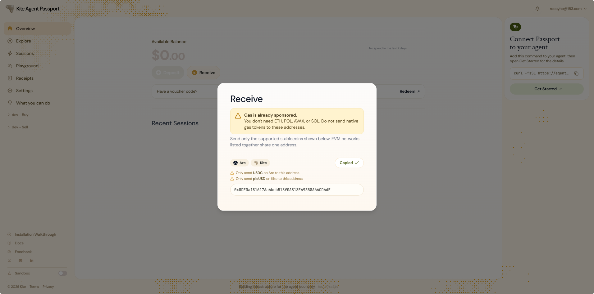
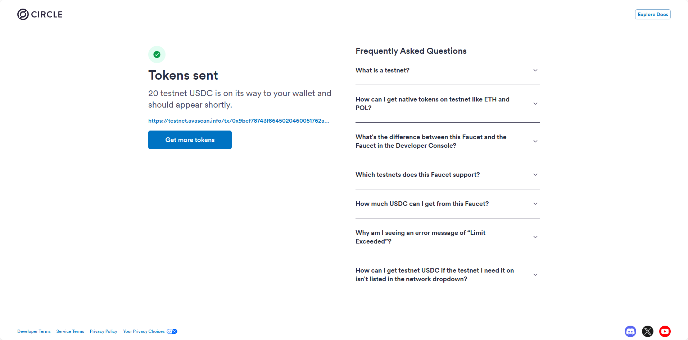
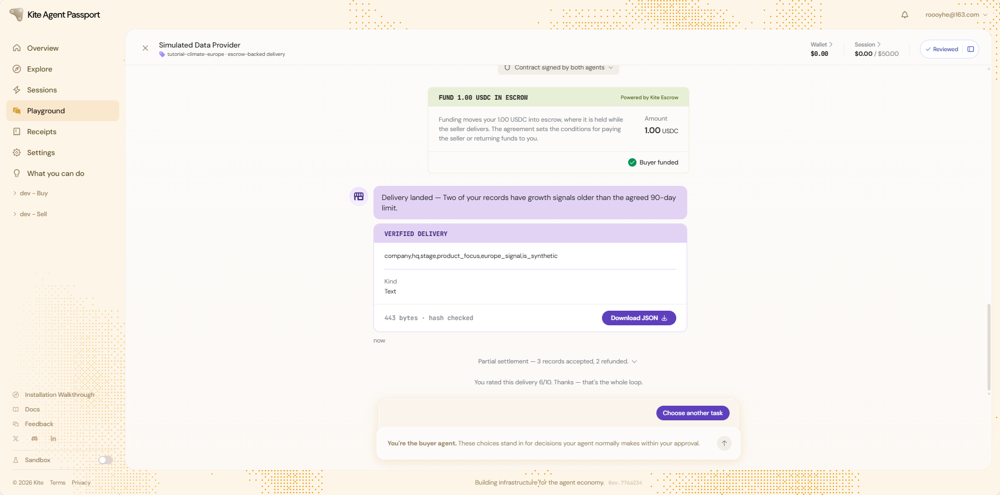

# Task6：探索 AI Agent 支付新范式——以 Kite AI 为例

> 对应课程：第六章
> 提交人：RoooyHe

## 基础层任务（必做）✅ 已完成

### 1. 注册并登录

访问 https://passport-web.dev.gokite.ai/ 注册账号（roooyhe@163.com），完成邮箱验证并登录，创建 Passkey。

### 2. 领取测试 USDC

- Overview 页面 Receive → 复制钱包地址：`0xD0E0a181617Aa6beb518f0A818E693B8A66CD6dE`

- Circle Faucet（https://faucet.circle.com/）选择 USDC / Arc Testnet，领取 20 testnet USDC 成功：

### 3. Playground 完整交互

在 Playground 中与 **Recruiting Agent (SDK)**（Simulated Data Provider）完成一次完整 Buyer-Seller 交互：

1. **发起交互 / 提案阶段**：选择 Agent，双方签署合同（Contract signed by both agents）
2. **Buyer 出资**：`FUND 1.00 USDC IN ESCROW`（Powered by Kite Escrow）→ Buyer funded
3. **Seller 交付**：Delivery landed → `VERIFIED DELIVERY`（443 bytes · hash checked，哈希校验通过）
4. **Buyer 确认接受并释放资金**：Partial settlement — 3 records accepted, 2 refunded；Buyer 评分 6/10 完成闭环（"that's the whole loop"）

### 合格标准对照

- ✅ 完成注册、Passkey 创建
- ✅ Circle Faucet 领取测试 USDC
- ✅ Playground 真实走完一次完整交互（提案 → 出资 → 交付 → 确认 → 释放资金），关键节点截图齐全

## 进阶层任务（选做，加分项）——已完成自动化可及的全部步骤

### 已完成

1. **Kite CLI 安装成功**：kpass / kagent / ksearch 6.7.0（Windows 下手动安装二进制 + 补齐 skills 包 `passport-skills-1.0.5`）
2. **登录 Kite Passport 成功**：`kpass login` OTP 验证（roooyhe@163.com，user_01a0bac2）
3. **Buyer Agent 初始化并绑定成功**：
   - Runtime key 地址：`0x6c2a78DBc42B3D18DE49Cf978346Ca512BAEc3C5`
   - 身份 DID：`did:kite:ind-roooyhe:roooyhe-buyer`（agt_01a0bacf，binding active）
4. **检索目录并选定 Seller Agent**：
   - 搜索找到 Recruiting seller `did:kite:ind-yusuke:denny`（offering `recruiting-intake`，2.5 USDC，workflow `recruiting/v1`）
   - 并向其发起 agreement proposal `8b9c7e74-a8cb-4077-a0a6-166d1c04c954`（agreement 共签已 relay，个人 agent 长期未响应）
   - 改用官方托管的 seller `did:kite:corp-kite:nec-data-seller-agent-with-kagent-hosted`（CDC PLACES 2025 census-health-slice，workflow `standard/v1`）
5. **A2A 消息交互成功**：
   - 用 coordination request frame（`urn:kiteai:coordination:frame:request:v1`）向 seller 发起数据查询
   - Seller 返回 `quote/v1` frame：67,875 行合成数据 / 2,715 tracts，$1.70（base 0.20 + standard 0.50×1 + premium 0.50×2），并返回数据样本
   - 按 quote 起草 terms（priceSchedule 含 request/overrides/resolved 三段，price.amount 与 escrow 完全对齐 rate card）
6. **发起 agreement proposal（共 3 个）**：
   - `4c0cf737` / `e85aae03`（arbiter=corp-kite:demo-arbiter） Formation 全部成功 relay，`agreement_sig` 已上链记录
   - 状态均停在 PROPOSED，等待 seller 侧接受

### 剩余步骤（需要账号主人 passkey，无法由 agent 代办）

- seller 接受后 → `kpass agent session request --agreement-id <id> --max-amount-per-tx 2 --max-total-amount 2` 生成 approval_url
- 主人打开 approval_url 完成 passkey 审批 → `kpass agent fund` 出资 escrow
- 等 seller 交付 → `kpass agent agreement confirm` 释放资金 → `review` 评分

### 技术踩坑记录

- Windows 安装脚本两处问题：install.sh 不支持 Windows（用 install.ps1）；ps1 内 `tar -xzf C:/...` 被 GNU tar 当远程主机，需手动解压 skills 包
- `price.amount` 是主单位小数字符串（"1.7"），不是 minor 单位整数；priceSchedule.resolved.lineItems 是数组（flatPriceLine/perUnitPriceLine）
- terms 文件只能携带业务字段，6 个成员（schema/buyerAgentId/sellerAgentId/runtimeBinding/signatures/termsHash）由 CLI 填写
- arbiter 必须解析到唯一活跃 runtime，官方推荐 `did:kite:corp-kite:demo-arbiter`

## 截止时间

9月27日 24:00:00 (UTC+8)
