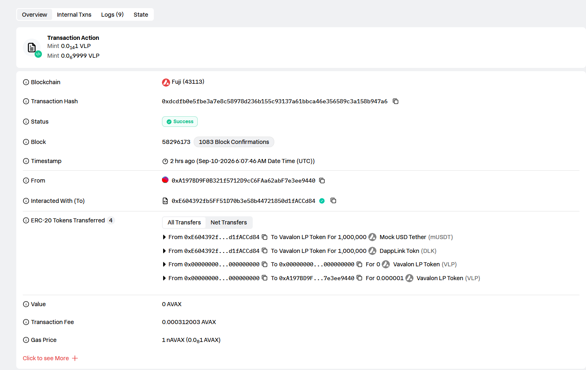
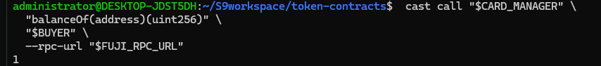
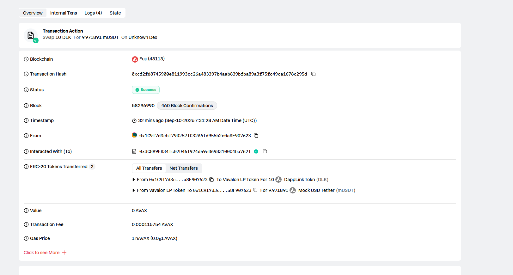
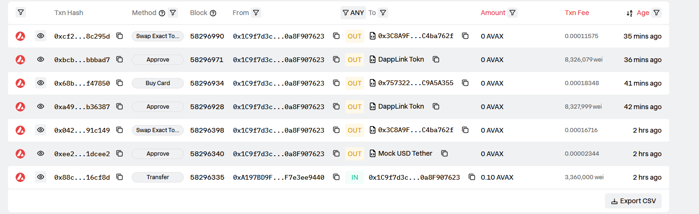

# Task 3：使用 DEX Oracle 获取代币价格

## 1. 使用的 DEX

本次任务选择的 DEX：

**PancakeSwap V2**

部署网络：

**Avalanche Fuji Testnet**

Chain ID：

```text
43113
```

本次实验通过 PancakeSwap V2 的交易对储备量（Pair Reserves）以及 Router 的 `getAmountOut()` 获取代币 Swap 价格。

---

## 2. Token A 和 Token B

### Token A：DappLink Token（DLK）

```text
名称：DappLink Tokn
符号：DLK
Decimals：6

合约地址：
0x7BB9247b48Ae7433707F6DdE195e208E4d3c46c3
```

### Token B：Mock USD Tether（mUSDT）

```text
名称：Mock USD Tether
符号：mUSDT
Decimals：6

合约地址：
0x85ceaf4Dd0157Fb8cda6d2CF6BE3a6Ccf6524ccd
```

本次使用的两个 Token 都采用 6 位 decimals，因此在进行价格计算时，需要按照 6 位精度处理 Token 数量。

---

## 3. 创建交易对并添加流动性

创建的 PancakeSwap V2 交易对：

```text
DLK / mUSDT
```

Pair 地址：

```text
0x2e475DbBd840429BB143797Dab8C554F4a757709
```

PancakeSwap Router：

```text
0x3C8A9FB34fc02D46f924d59eD6983100C4ba762f
```

实验中向交易对提供了：

```text
1,000,000 DLK
+
1,000,000 mUSDT
```

即初始流动性约为：

```text
1 DLK ≈ 1 mUSDT
```

添加流动性的交易：

```text
0xdcdfb0e5fbe3a7e8c58978d236b155c93137a61bbca46e356589c3a158b947a6
```

区块：

```text
58296173
```

### 截图




---

## 4. 通过 DEX 获取 Swap 价格

本项目没有在业务合约中写死 DLK 的价格，而是通过 PancakeSwap Pair 的储备量计算 Swap 价格。

核心代码位于 `DappLinkToken.sol`：

```solidity
function quote(uint256 amount) public view returns (uint256) {
    (uint256 rOther, uint256 rThis,,) =
        getReserves(mainPair, address(this));

    return IPancakeRouter01(v2Router)
        .getAmountOut(amount, rThis, rOther);
}
```

另外，针对“USDT → DLK”的报价，使用：

```solidity
function quoteThis(uint256 amount) public view returns (uint256) {
    (uint256 rOther, uint256 rThis,,) =
        getReserves(mainPair, address(this));

    return IPancakeRouter01(v2Router)
        .getAmountOut(amount, rOther, rThis);
}
```

其中：

```text
quote()
```

用于获取 DLK → mUSDT 的 Swap 报价。

```text
quoteThis()
```

用于获取 mUSDT → DLK 的 Swap 报价。

Router 的 `getAmountOut()` 根据 Pair 当前储备量和 AMM 公式计算实际 Swap 数量，因此价格来源于 DEX 的流动性池，而不是合约中手动设置的固定价格。

---

## 5. 将 DEX 价格应用到实际业务逻辑

本次任务没有只在前端读取价格，而是将 DEX 报价直接用于 `CardManager` 的 NFT 购买业务。

### CardManager 获取 DEX 价格

核心代码：

```solidity
function cardPrice() public view returns (uint256) {
    uint256 dlkPrice =
        IDappLinkToken(underlyingToken)
            .quoteThis(baseCardPriceInUsdt);

    uint256 tier = _nextTokenId / 10000;

    return dlkPrice * (100 + (tier * 10)) / 100;
}
```

实际购买逻辑：

```solidity
function _buyCards(
    address buyer,
    uint256 quantity,
    uint256 maxDlkAmount
) internal returns (uint256[] memory tokenIds) {

    require(quantity > 0, "CardManager buyCards: quantity must be greater than zero");

    uint256 totalPrice = _batchCardPrice(quantity);

    require(
        totalPrice <= maxDlkAmount,
        "CardManager: DEX price exceeded max"
    );

    require(
        IERC20(underlyingToken).allowance(
            buyer,
            address(this)
        ) >= totalPrice,
        "CardManager buyCard: User allowance must more than price"
    );

    IERC20(underlyingToken).safeTransferFrom(
        buyer,
        address(this),
        totalPrice
    );

    // Mint NFT
    ...
}
```

其中 `_batchCardPrice()` 再次通过 DEX 获取价格：

```solidity
function _batchCardPrice(uint256 quantity)
    internal
    view
    returns (uint256 totalPrice)
{
    uint256 baseDlkPrice =
        IDappLinkToken(underlyingToken)
            .quoteThis(baseCardPriceInUsdt);

    require(
        baseDlkPrice > 0,
        "CardManager: invalid DEX quote"
    );

    uint256 nextTokenId = _nextTokenId;

    for (uint256 i = 0; i < quantity;) {
        uint256 tier = nextTokenId / 10000;

        totalPrice +=
            baseDlkPrice *
            (100 + (tier * 10)) /
            100;

        unchecked {
            ++nextTokenId;
            ++i;
        }
    }

    return totalPrice;
}
```

因此实际业务流程为：

```text
PancakeSwap Pair
       ↓
getReserves()
       ↓
Router.getAmountOut()
       ↓
DappLinkToken.quoteThis()
       ↓
CardManager._batchCardPrice()
       ↓
计算 NFT 购买所需 DLK
       ↓
BUYER 支付 DLK
       ↓
Mint NFT
```

---

## 6. 部署到 Avalanche Fuji Testnet

### DappLinkToken

```text
0x7BB9247b48Ae7433707F6DdE195e208E4d3c46c3
```

### CardManager

```text
0x757322cc3004CC38A7A16FE40e242E7EC9A5A355
```

### LpManager

```text
0xE604392fb5FF51D70b3e58b44721850d1fACCd84
```

### DLK / mUSDT Pair

```text
0x2e475DbBd840429BB143797Dab8C554F4a757709
```

### PancakeSwap Router

```text
0x3C8A9FB34fc02D46f924d59eD6983100C4ba762f
```

---

## 7. 成功读取和使用 DEX 价格

首先通过：

```bash
cast call "$TOKEN" \
  "quoteThis(uint256)(uint256)" \
  100000000 \
  --rpc-url "$FUJI_RPC_URL"
```

获取 100 mUSDT 对应的 DLK 数量。

实验结果：

```text
99670156
```

因为 DLK 有 6 位 decimals，因此：

```text
100 mUSDT
=
99.670156 DLK
```

随后读取：

```bash
cast call "$CARD_MANAGER" \
  "cardPrice()(uint256)" \
  --rpc-url "$FUJI_RPC_URL"
```

结果同样为：

```text
99670156
```

因此：

```text
quoteThis(100 mUSDT)
=
cardPrice()
=
99.670156 DLK
```

这证明 CardManager 的业务价格直接来源于 DEX 报价。

### 截图


---

## 8. 实际业务测试

使用 BUYER 调用：

```solidity
buyCard(200000000)
```

交易成功。

交易哈希：

```text
0x68bac1b732ca68a4e2cc3104be223a709c0ac92f1fe065a404b8e353e5f47850
```

区块：

```text
58296934
```

实际支付：

```text
99,670,156 DLK
=
99.670156 DLK
```

BUYER 的 NFT 数量从：

```text
0
```

变成：

```text
1
```

同时 CardManager 收到了对应的 DLK。

这说明 DEX 获取的价格不是只用于前端显示，而是实际参与了 NFT 的购买定价和支付。

### 截图



---

## 9. 动态价格变化测试

为了进一步证明价格来自 DEX，而不是固定写死，在第一次购买之后，让 BUYER 在 PancakeSwap 上卖出 10 DLK。

交易成功：

```text
交易哈希：
0xcf2fd8745900e811993cc26a483397b4aab839bfba89a3f75fc49ca1678c295d

区块：
58296990
```

卖出操作改变了 DLK / mUSDT Pair 的储备量。

再次查询：

```bash
cast call "$TOKEN" \
  "quoteThis(uint256)(uint256)" \
  100000000 \
  --rpc-url "$FUJI_RPC_URL"
```

得到：

```text
99672147
```

即：

```text
100 USDT
≈
99.672147 DLK
```

再次查询：

```bash
cast call "$CARD_MANAGER" \
  "cardPrice()(uint256)" \
  --rpc-url "$FUJI_RPC_URL"
```

得到：

```text
99672147
```

因此：

```text
quoteThis()
=
99.672147 DLK

cardPrice()
=
99.672147 DLK
```

而变化之前：

```text
quoteThis()
=
99.670156 DLK

cardPrice()
=
99.670156 DLK
```

DEX 价格发生变化之后，CardManager 的业务价格也随之变化。

这进一步证明：

**CardManager 的价格是根据 PancakeSwap 交易对的实时储备量动态计算，而不是在合约中写死一个固定价格。**

### 截图





---

## 10. 区块浏览器

Avalanche Fuji Testnet 使用 SnowTrace / Avalanche Explorer 查看合约和交易。

需要提交的主要链上地址：

```text
DappLinkToken:
0x7BB9247b48Ae7433707F6DdE195e208E4d3c46c3

CardManager:
0x757322cc3004CC38A7A16FE40e242E7EC9A5A355

DLK/mUSDT Pair:
0x2e475DbBd840429BB143797Dab8C554F4a757709

LP Manager:
0xE604392fb5FF51D70b3e58b44721850d1fACCd84
```


---

## 11. 实现过程简要说明

本次任务选择 PancakeSwap V2 作为 Avalanche Fuji 测试网的 DEX，并创建了自己的 DLK/mUSDT 交易对。

首先部署 DappLinkToken 和 MockUSDT，然后通过 PancakeSwap Factory 创建交易对，并向 Pair 添加 1,000,000 DLK 和 1,000,000 mUSDT 的流动性。

之后在 DappLinkToken 中实现 `quote()` 和 `quoteThis()`，通过 PancakeSwap Pair 的储备量以及 Router 的 `getAmountOut()` 获取 Swap 报价。

为了满足任务要求，没有在业务合约中直接写死 DLK 价格，而是在 CardManager 中调用：

```solidity
IDappLinkToken(underlyingToken).quoteThis(baseCardPriceInUsdt)
```

动态计算购买 NFT 所需的 DLK 数量。

随后在 Avalanche Fuji 测试网实际调用 `buyCard()`。BUYER 成功支付根据 DEX 报价计算出的 DLK，并成功获得 NFT。

最后通过 PancakeSwap 进行一次 DLK → mUSDT 的交易，使交易对储备量发生变化。变化之后再次读取 `quoteThis()` 和 `cardPrice()`，两个价格同步发生变化并保持一致。

因此，本次实验完整证明了：

```text
DEX Pair
   ↓
DEX 储备量
   ↓
Router.getAmountOut()
   ↓
DappLinkToken.quoteThis()
   ↓
CardManager.cardPrice()
   ↓
buyCard()
   ↓
实际支付 DLK + NFT 铸造
```

满足 Task 3 对“DEX 获取价格并将价格应用于智能合约实际业务逻辑”的要求。

---

## 12. 最终结论

本次 Task 3 已完成以下要求：

* [x] 在 Avalanche Fuji 测试网选择 PancakeSwap
* [x] 创建 DLK/mUSDT 交易对
* [x] 向交易对提供流动性
* [x] 通过 Pair/Router 获取 DEX Swap 价格
* [x] 将原来的固定价格逻辑修改为 DEX 动态报价
* [x] 在 CardManager NFT 购买业务中使用 DEX 价格
* [x] 合约成功部署到 Avalanche Fuji
* [x] 成功读取 DEX 价格
* [x] 成功使用 DEX 价格完成实际业务交易
* [x] 通过改变 DEX 储备量验证业务价格会随 DEX 价格变化
* [x] 提供交易哈希、合约地址以及测试结果作为链上验证材料

最终证明：

> **本项目的业务价格来自 Avalanche Fuji 测试网上 PancakeSwap DLK/mUSDT 交易对，而不是手动写死的固定价格，并且该价格被 CardManager 的实际 NFT 购买业务使用。**
