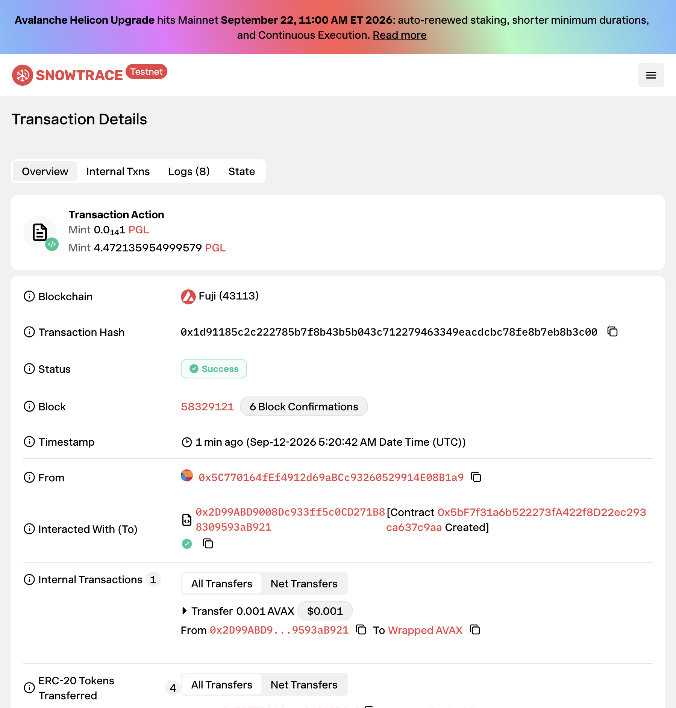
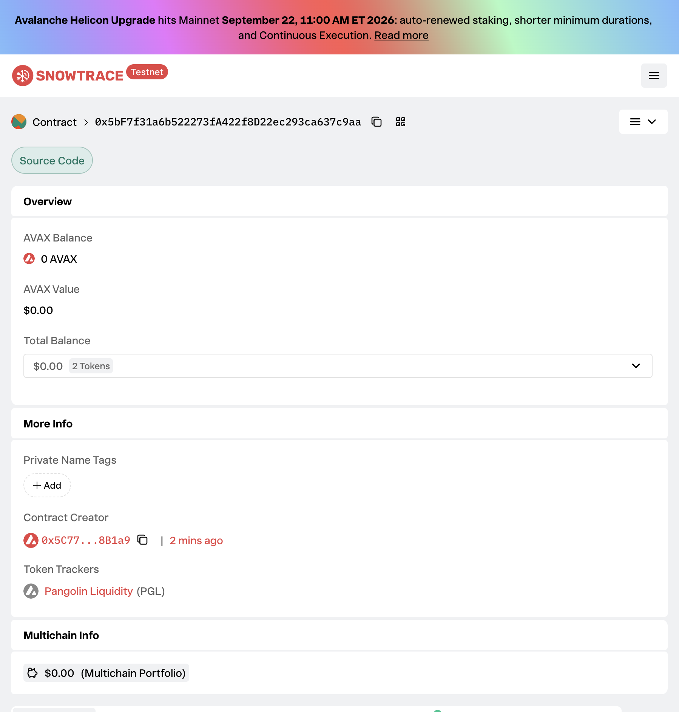
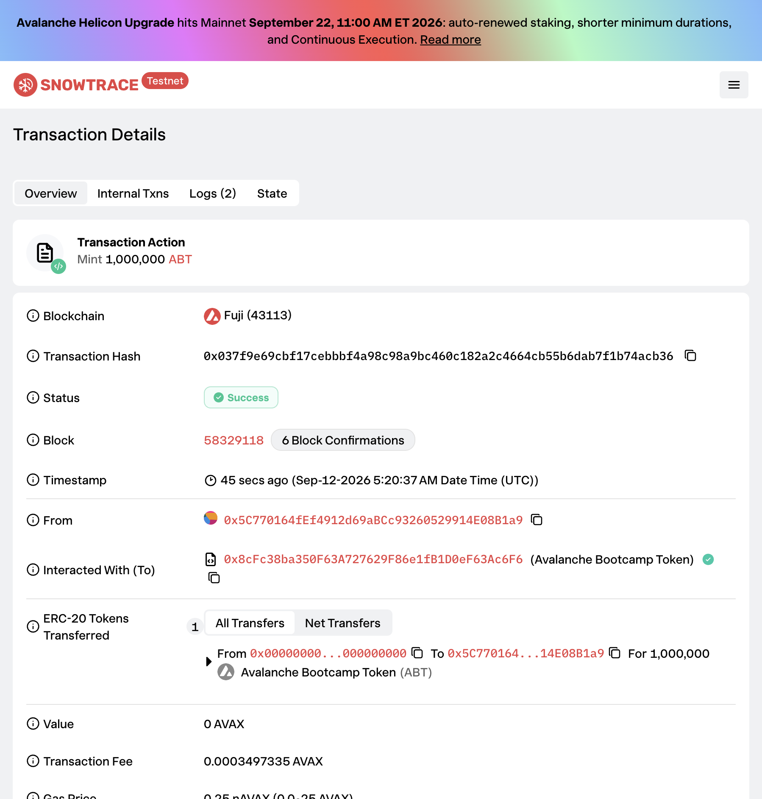
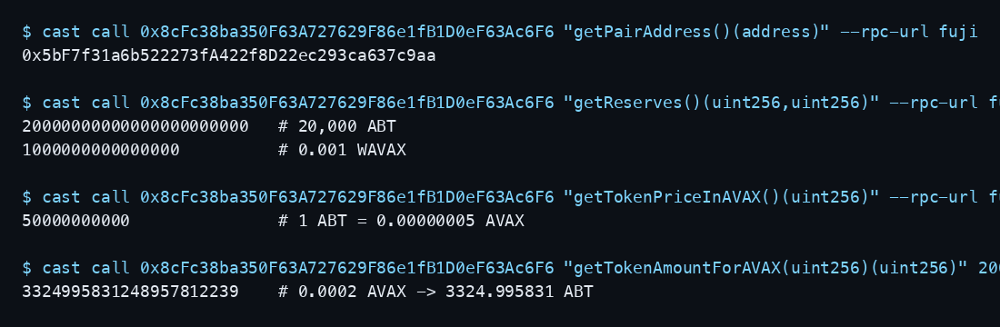
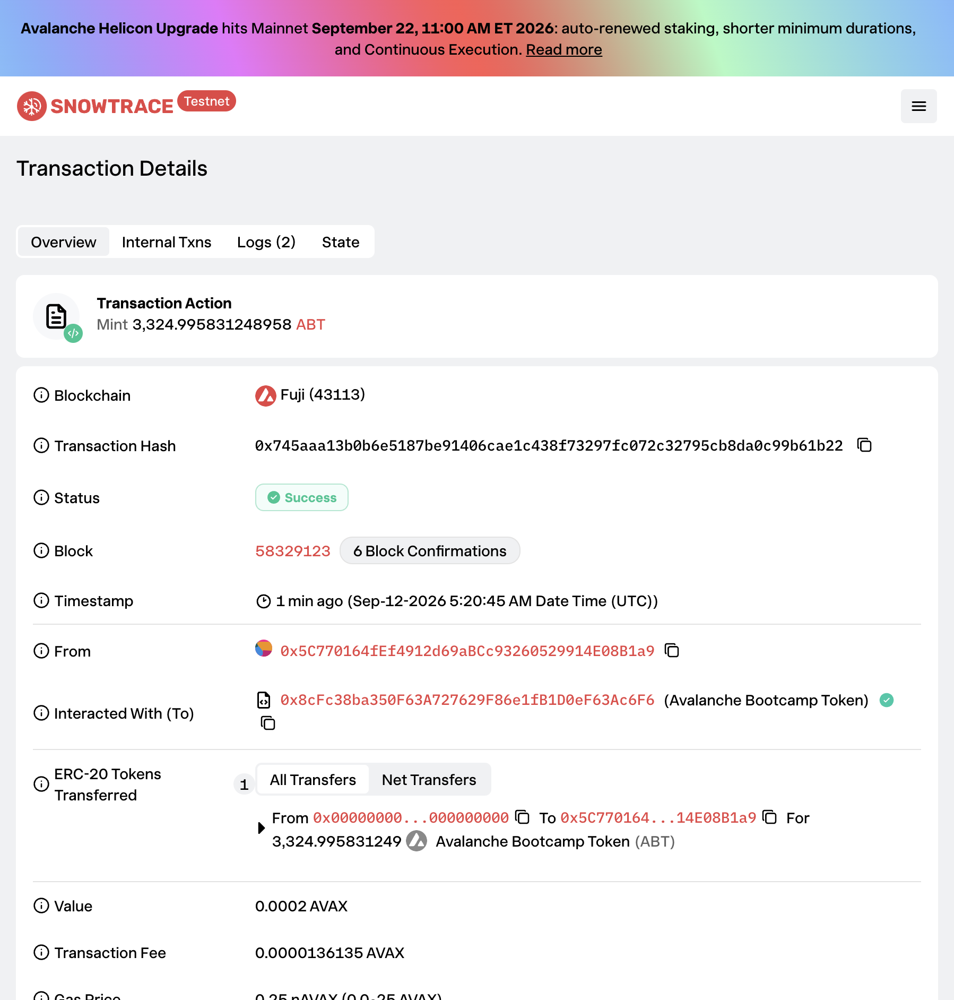

# Task 3：使用 DEX Oracle 获取代币价格

> 对应课程：第三章 Solidity 合约实战  
> 学员：alanyoungcy  
> 源码：`task/task3`（Foundry）

## 使用的 DEX

| 项目 | 内容 |
| --- | --- |
| DEX 名称 | Pangolin Exchange（Uniswap V2） |
| 网络 | Avalanche Fuji C-Chain (`43113`) |
| Factory | `0xE4A575550C2b460d2307b82dCd7aFe84AD1484dd` |
| Router | `0x2D99ABD9008Dc933ff5c0CD271B88309593aB921` |

## Token A 和 Token B

| Token | 名称 | 合约地址 | Decimals |
| --- | --- | --- | --- |
| Token A | Avalanche Bootcamp Token (`ABT`) | [`0x8cFc38ba350F63A727629F86e1fB1D0eF63Ac6F6`](https://testnet.snowtrace.io/address/0x8cFc38ba350F63A727629F86e1fB1D0eF63Ac6F6) | 18 |
| Token B | Wrapped AVAX (`WAVAX`) | [`0xd00ae08403B9bbb9124bB305C09058E32C39A48c`](https://testnet.snowtrace.io/address/0xd00ae08403B9bbb9124bB305C09058E32C39A48c) | 18 |

两者都是 18 位精度，价格计算无需额外换算。

## 交易对

| 项目 | 内容 |
| --- | --- |
| 交易对 | ABT / WAVAX |
| 交易对地址 | [`0x5bF7f31a6b522273fA422f8D22ec293ca637c9aa`](https://testnet.snowtrace.io/address/0x5bF7f31a6b522273fA422f8D22ec293ca637c9aa) |
| 添加流动性 Tx | [`0x1d91185c2c222785b7f8b43b5b043c712279463349eacdcbc78fe8b7eb8b3c00`](https://testnet.snowtrace.io/tx/0x1d91185c2c222785b7f8b43b5b043c712279463349eacdcbc78fe8b7eb8b3c00) |
| 初始流动性 | **20,000 ABT + 0.001 AVAX** |
| 隐含现货价 | 1 ABT = 0.00000005 AVAX（`5e10` wei） |

## 添加流动性或创建交易对的截图

Router `addLiquidityAVAX` 创建 Pangolin pair，并注入 20,000 ABT + 0.001 WAVAX：



交易对合约：



## 获取 Swap/Oracle 价格的核心代码

价格全部来自 Pangolin Pair 储备量和 Router `getAmountsOut`，合约内没有写死汇率。

```solidity
function getTokenPriceInAVAX() public view returns (uint256) {
    (uint256 reserveToken, uint256 reserveWAVAX) = getReserves();
    require(reserveToken > 0 && reserveWAVAX > 0, "no liquidity");
    return (reserveWAVAX * 1 ether) / reserveToken;
}

function getTokenAmountForAVAX(uint256 avaxAmount) public view returns (uint256) {
    require(avaxAmount > 0, "zero AVAX");
    address[] memory path = new address[](2);
    path[0] = wavax();
    path[1] = address(this);
    return IPangolinRouter(dexRouter).getAmountsOut(avaxAmount, path)[1];
}

function getAVAXAmountForToken(uint256 tokenAmount) public view returns (uint256) {
    require(tokenAmount > 0, "zero token");
    address[] memory path = new address[](2);
    path[0] = address(this);
    path[1] = wavax();
    return IPangolinRouter(dexRouter).getAmountsOut(tokenAmount, path)[1];
}
```

完整实现：`task/task3/src/AvalancheBootcampToken.sol`。

## 使用价格的合约核心代码

`buyTokensWithAVAX` 的铸造数量完全由 Router 实时报价决定；`sellTokensForAVAX` 的退款同样走 DEX quote。

```solidity
function buyTokensWithAVAX() external payable nonReentrant returns (uint256 tokensBought) {
    require(msg.value > 0, "send AVAX");
    tokensBought = getTokenAmountForAVAX(msg.value);
    require(tokensBought > 0, "zero output");
    _mint(msg.sender, tokensBought);
    emit TokensPurchased(msg.sender, msg.value, tokensBought);
}

function sellTokensForAVAX(uint256 tokenAmount) external nonReentrant returns (uint256 avaxRefund) {
    require(tokenAmount > 0, "zero token");
    avaxRefund = getAVAXAmountForToken(tokenAmount);
    require(address(this).balance >= avaxRefund, "insufficient AVAX");
    _burn(msg.sender, tokenAmount);
    (bool ok,) = msg.sender.call{ value: avaxRefund }("");
    require(ok, "AVAX transfer failed");
    emit TokensSold(msg.sender, tokenAmount, avaxRefund);
}
```

## 部署后的合约地址

| 项目 | 地址 / 哈希 | Explorer |
| --- | --- | --- |
| ABT 业务合约 | `0x8cFc38ba350F63A727629F86e1fB1D0eF63Ac6F6` | [Snowtrace](https://testnet.snowtrace.io/address/0x8cFc38ba350F63A727629F86e1fB1D0eF63Ac6F6) |
| ABT/WAVAX Pair | `0x5bF7f31a6b522273fA422f8D22ec293ca637c9aa` | [Snowtrace](https://testnet.snowtrace.io/address/0x5bF7f31a6b522273fA422f8D22ec293ca637c9aa) |
| 部署 Tx | `0x037f9e69cbf17cebbbf4a98c98a9bc460c182a2c4664cb55b6dab7f1b74acb36` | [Snowtrace](https://testnet.snowtrace.io/tx/0x037f9e69cbf17cebbbf4a98c98a9bc460c182a2c4664cb55b6dab7f1b74acb36) |
| 部署区块 | `58329118` | |
| 部署者 | `0x5C770164fEf4912d69aBCc93260529914E08B1a9` | [Snowtrace](https://testnet.snowtrace.io/address/0x5C770164fEf4912d69aBCc93260529914E08B1a9) |



## 成功读取或使用价格的截图

链上 `cast call` 读取 Pair / 现货价 / Router 报价：



`buyTokensWithAVAX` 支付 **0.0002 AVAX**，按 Pangolin AMM 铸造 **3,324.995831248958 ABT**：



公式核对（含 0.3% 手续费）：

\[
\Delta y = \frac{20000 \times 0.0002 \times 0.997}{0.001 + 0.0002 \times 0.997} \approx 3324.995831
\]

链上铸造数量与 DEX 报价一致，说明价格来自交易对，而不是手动填写。

## 实现过程简要说明

1. 在 Fuji 上选用 Pangolin V2 Router/Factory，Token B 使用官方 WAVAX。
2. 把 Task 2 的 `AvalancheBootcampToken`（ABT）扩展为 DEX 定价：用 Pair 储备量做现货价，用 Router `getAmountsOut` 做购买/赎回数量。
3. 用 Foundry mock 池子做了 6 个本地测试，确认购买数量等于 AMM 公式。
4. 在 `task/task3` 部署到 Fuji，通过 Router `addLiquidityAVAX` 创建 ABT/WAVAX 交易对并注入流动性。
5. 调用 `buyTokensWithAVAX()`，链上按 DEX 报价铸造 ABT，Snowtrace 显示 Mint 3324.995831 ABT。
