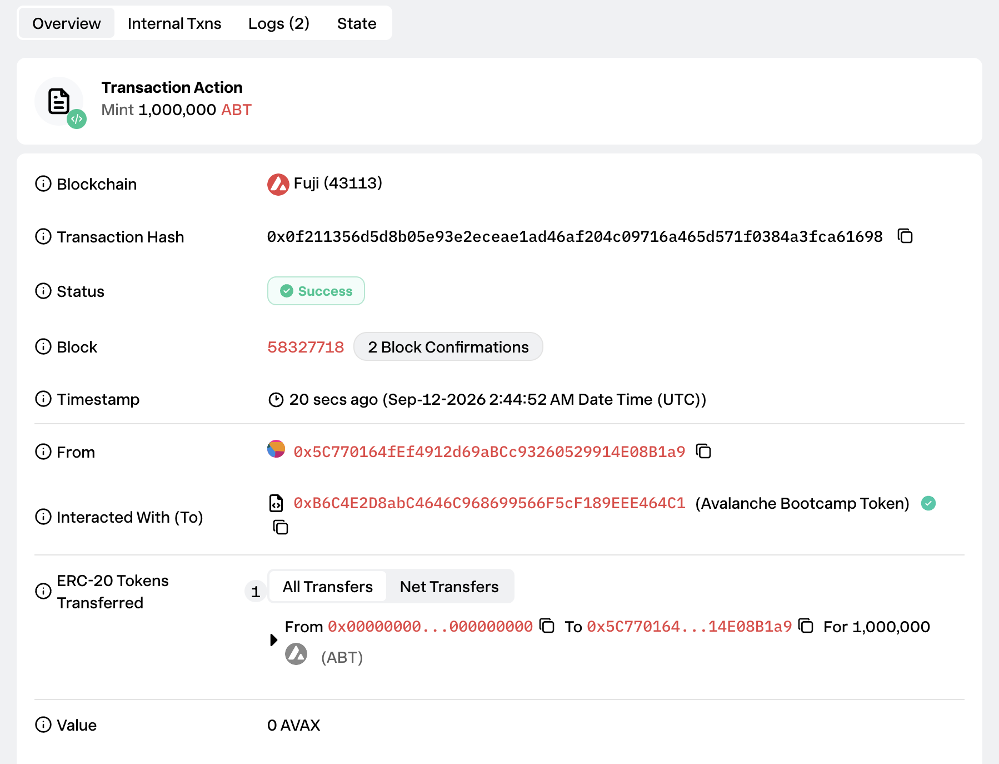

# Task 2：第二章 Vibe Coding开发你的第一个DApp

> 对应课程：第二章
> 截止提交：9月6日 24:00:00 (UTC+8)

## 任务目标

掌握 Vibe Coding 技巧，用 Scaffold-ETH 自己部署 ERC20 合约的应用。

## 成果

使用 Scaffold-ETH 2（Hardhat）在 Avalanche Fuji 测试网部署 ERC20 合约 `AvalancheBootcampToken`（ABT）。项目源码在仓库 `task/task2/scaffold-eth-2`。

| 项目 | 内容 |
| --- | --- |
| 网络 | Avalanche Fuji 测试网（chainId `43113`） |
| 合约名 | `AvalancheBootcampToken` |
| 代币 | Avalanche Bootcamp Token（ABT），18 位小数 |
| 初始供应量 | 1,000,000 ABT |
| **合约地址** | [`0xB6C4E2D8abC4646C968699566F5cF189EEE464C1`](https://testnet.snowtrace.io/address/0xB6C4E2D8abC4646C968699566F5cF189EEE464C1) |
| 部署交易 | [`0x0f211356d5d8b05e93e2eceae1ad46af204c09716a465d571f0384a3fca61698`](https://testnet.snowtrace.io/tx/0x0f211356d5d8b05e93e2eceae1ad46af204c09716a465d571f0384a3fca61698) |
| 部署区块 | `58327718` |
| 部署者 / Owner | `0x5C770164fEf4912d69aBCc93260529914E08B1a9` |

## 合约功能

- 部署时向 Owner 铸造 1,000,000 ABT
- Owner 可以通过 `mint(address,uint256)` 增发
- 持币者可以通过 `burn(uint256)` 销毁自己的代币

## 部署成功截图



## 本地测试

```text
AvalancheBootcampToken
  ✔ mints the initial supply to the owner
  ✔ allows only the owner to mint
  ✔ allows holders to burn their tokens

3 passing
```
