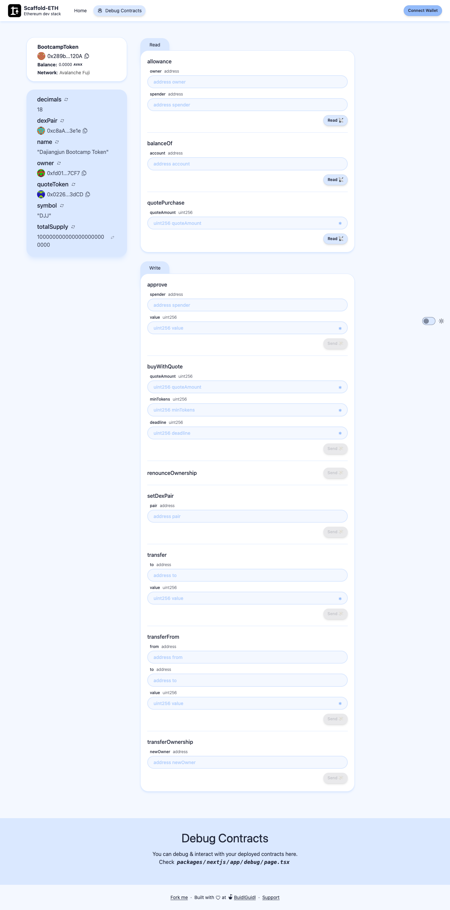
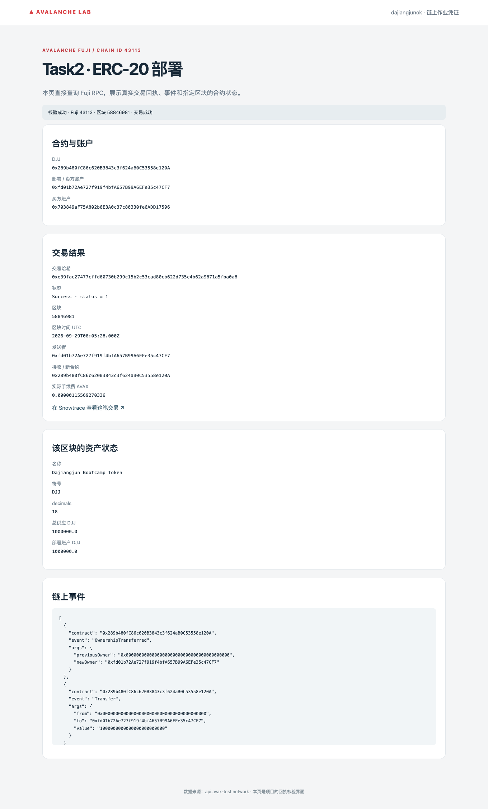

# Task2：ERC-20 DApp

使用官方 Scaffold-ETH 2 模板，发行 **Dajiangjun Bootcamp Token（DJJ）**：18 位精度，初始供应 1,000,000，支持转账、授权和余额查询。已部署到 **Avalanche Fuji（43113）**，并接入 Scaffold-ETH Debug Contracts。

- [合约代码](projects/avalanche-lab/contracts/BootcampToken.sol) · [Scaffold-ETH 初始化](projects/avalanche-lab/task2/setup-scaffold.mjs) · [项目运行说明](projects/avalanche-lab/README.md)
- 合约地址：[0x289b480fC86c620B3843c3f624aB0C53558e120A](https://testnet.snowtrace.io/address/0x289b480fC86c620B3843c3f624aB0C53558e120A)
- 部署交易：[0xe39fac27477cffd60730b299c15b2c53cad80cb622d735c4b62a9871a5fba0a8](https://testnet.snowtrace.io/tx/0xe39fac27477cffd60730b299c15b2c53cad80cb622d735c4b62a9871a5fba0a8)
- 验证：本地 Token/DEX 13 项测试通过；Fuji 回执 status=1，可读取名称、供应量及余额。

查看 Fuji 截图

