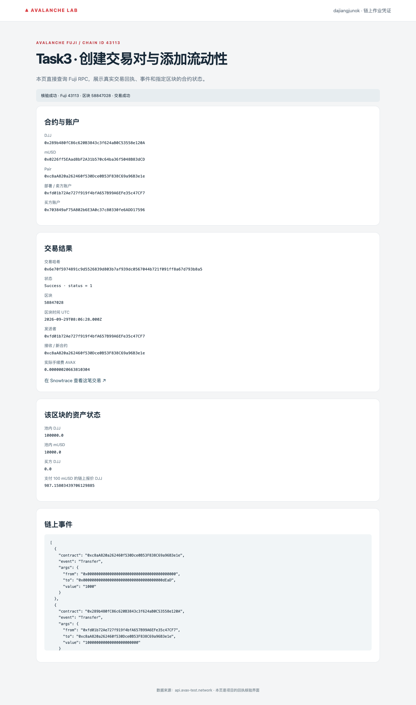
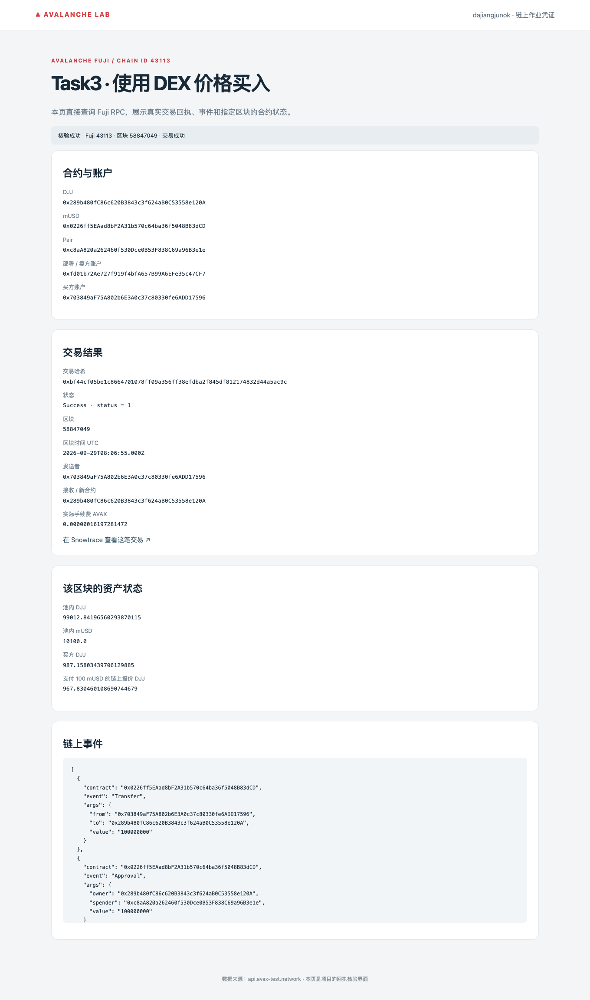

# Task3：使用 DEX 价格购买代币

DEX：**Learning DEX**，自行部署的常数乘积 AMM，支持加池、移除流动性和双向 swap。已在 Fuji 注入 **100,000 DJJ + 10,000 mUSD** 并完成买入；mUSD 是测试代币，不是 Circle USDC。

| 项目 | Fuji 合约地址 |
| --- | --- |
| DJJ（18 decimals）/ 购买业务合约 | [0x289b480fC86c620B3843c3f624aB0C53558e120A](https://testnet.snowtrace.io/address/0x289b480fC86c620B3843c3f624aB0C53558e120A) |
| mUSD（6 decimals） | [0x0226ff5EAad8bF2A31b570c64ba36f5048B83dCD](https://testnet.snowtrace.io/address/0x0226ff5EAad8bF2A31b570c64ba36f5048B83dCD) |
| DJJ/mUSD Pair | [0xc8aA820a262460f530Dce0B53F838C69a96B3e1e](https://testnet.snowtrace.io/address/0xc8aA820a262460f530Dce0B53F838C69a96B3e1e) |

价格从 Pair 的实际储备计算，包含 0.3% 手续费和价格影响。核心代码：

```solidity
uint256 amountWithFee = amountIn * 997;
return Math.mulDiv(amountWithFee, rOut, rIn * 1000 + amountWithFee);

// BootcampToken.buyWithQuote 中实际调用 DEX 并将买到的 DJJ 转给用户
received = dexPair.swap(address(quoteToken), quoteAmount, minTokens, msg.sender, deadline);
```

[Pair 完整代码](projects/avalanche-lab/contracts/LearningPair.sol) · [购买业务代码](projects/avalanche-lab/contracts/BootcampToken.sol)。输入按 mUSD 的 `10^6`、输出按 DJJ 的 `10^18` 换算；使用最小输出与过期时间保护交易。本示例是现货报价，不作为抗操纵借贷预言机。

- 加流动性：[0x6e70f5974891c9d5526839d803b7af939dc0567044b721f091ff8a67d793b8a5](https://testnet.snowtrace.io/tx/0x6e70f5974891c9d5526839d803b7af939dc0567044b721f091ff8a67d793b8a5)
- 使用价格买入：[0xbf44cf05be1c8664701078ff09a356ff38efdba2f845df812174832d44a5ac9c](https://testnet.snowtrace.io/tx/0xbf44cf05be1c8664701078ff09a356ff38efdba2f845df812174832d44a5ac9c)
- 支付 100 mUSD，实际收到 **987.158034 DJJ**；买入后同额报价下降，证明价格来自变化的池子储备。

<details>
<summary>查看 Fuji 截图</summary>





</details>
