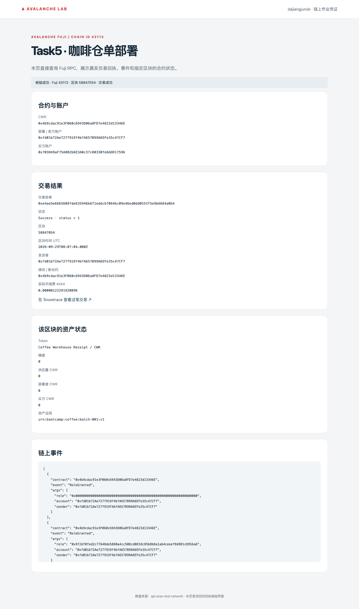
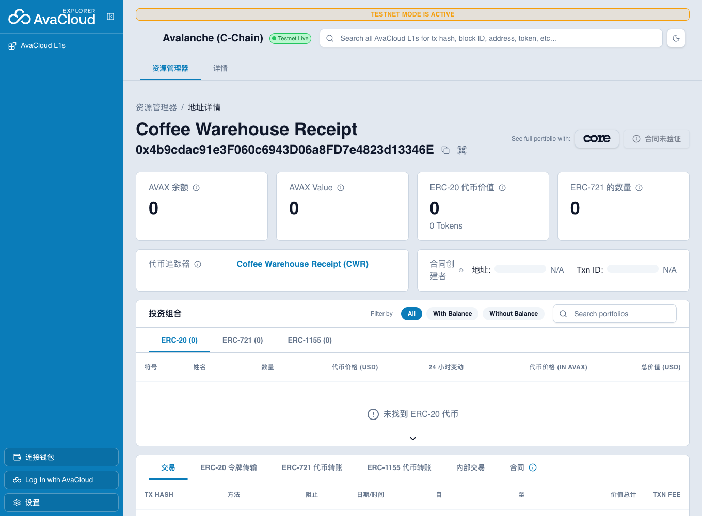
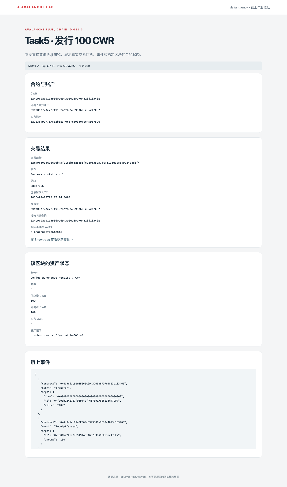
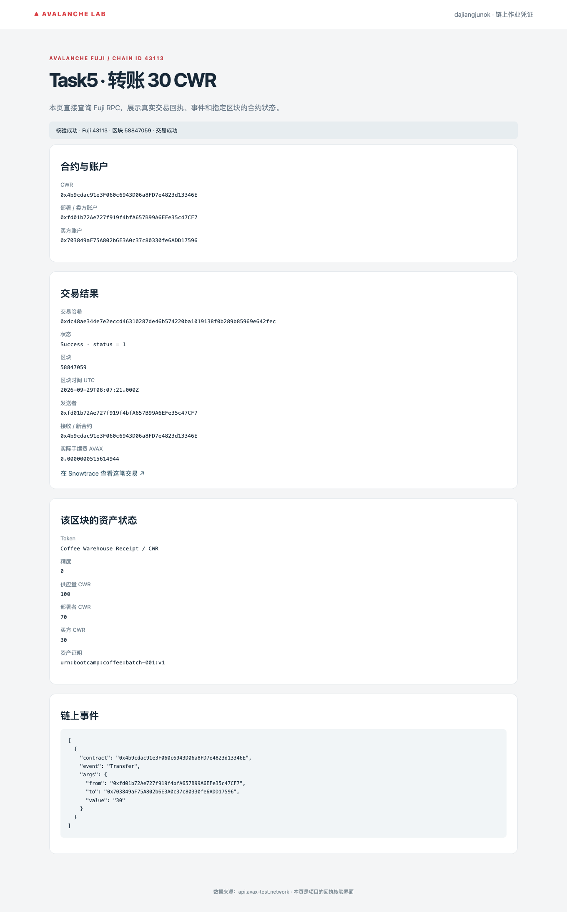
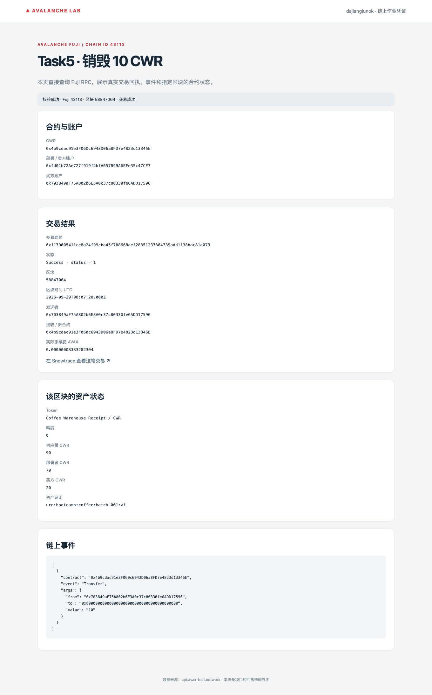

# Task5：咖啡仓单 RWA Token

学员：**dajiangjunok** · [代码仓库](https://github.com/dajiangjunok/Avalanche-101-Bootcamp) · [合约源代码](projects/avalanche-lab/task5/contracts/CoffeeWarehouseReceipt.sol)

## 业务与功能

以模拟咖啡库存为资产，**1 CWR = 1 kg 咖啡仓单权益**，不可再分割，供应上限 10,000。模拟仓库负责托管，核验方提供批次及数量证明；不存在真实资产募集或托管承诺。

发行表示核验入库，转账表示权益转移，销毁表示模拟核销。链上销毁不自动证明线下交货。凭证为 `urn:bootcamp:coffee:batch-001:v1`，对应[模拟资产说明](projects/avalanche-lab/task5/asset-document.md)。

合约提供 `mint / burn / transfer / balanceOf / totalSupply / assetDocument / updateAssetDocument`；发行限定 `MINTER_ROLE`，凭证修改限定 `DOCUMENT_ROLE`，关键操作发出事件。管理员可授予和撤销权限。

## Fuji 部署与验证

[官方测试网浏览器](https://explorer-test.avax.network/c-chain/address/0x4b9cdac91e3F060c6943D06a8FD7e4823d13346E)（截图使用该浏览器）。

- 网络：**Avalanche Fuji C-Chain，43113**。
- 合约：[0x4b9cdac91e3F060c6943D06a8FD7e4823d13346E](https://testnet.snowtrace.io/address/0x4b9cdac91e3F060c6943D06a8FD7e4823d13346E)
- 部署：[0xe4ae5e6665609fde635946b6f1eddcb7064bc09e46ed0dd0553f5e9b6684a0b4](https://testnet.snowtrace.io/tx/0xe4ae5e6665609fde635946b6f1eddcb7064bc09e46ed0dd0553f5e9b6684a0b4)
- 发行 100：[0xc49c30d4ca6cb6b45fb1e8bc5a5555f6a20f35b57fcf11a5edb86a9a24c4d6f4](https://testnet.snowtrace.io/tx/0xc49c30d4ca6cb6b45fb1e8bc5a5555f6a20f35b57fcf11a5edb86a9a24c4d6f4)
- 转账 30：[0xdc48ae344e7e2eccd46310287de46b574220ba1019138f0b289b85969e642fec](https://testnet.snowtrace.io/tx/0xdc48ae344e7e2eccd46310287de46b574220ba1019138f0b289b85969e642fec)
- 接收方销毁 10：[0x1139005411ce8a24f99cba45f788668aef28351237864739add1138bac81a079](https://testnet.snowtrace.io/tx/0x1139005411ce8a24f99cba45f788668aef28351237864739add1138bac81a079)

最终总供应 **90 CWR**，部署者 **70**、接收者 **20**。[16 项 RWA 测试](projects/avalanche-lab/test/RWA.t.sol)覆盖权限、转账、销毁、供应量、凭证更新及错误操作；[测试结果](public/evidence/forge-test.txt)全部通过。

查看 Fuji 截图

