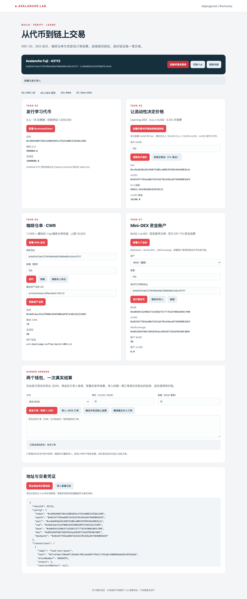
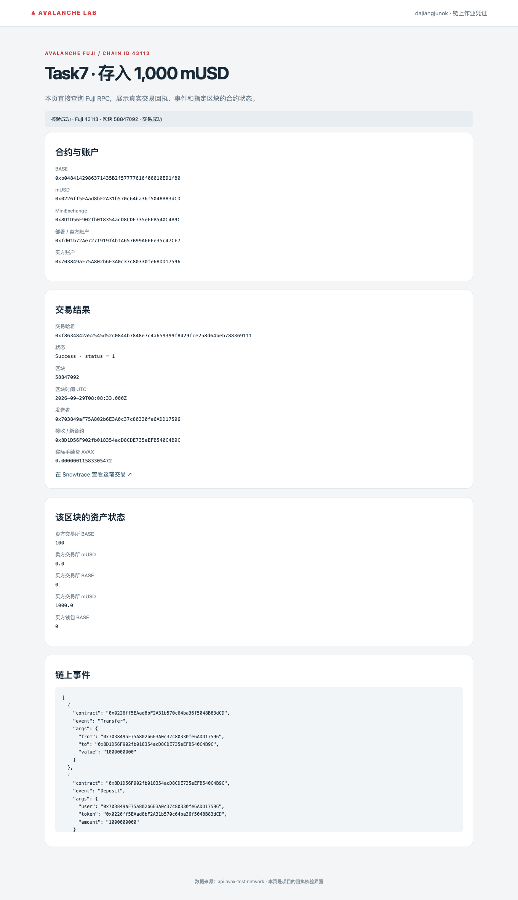
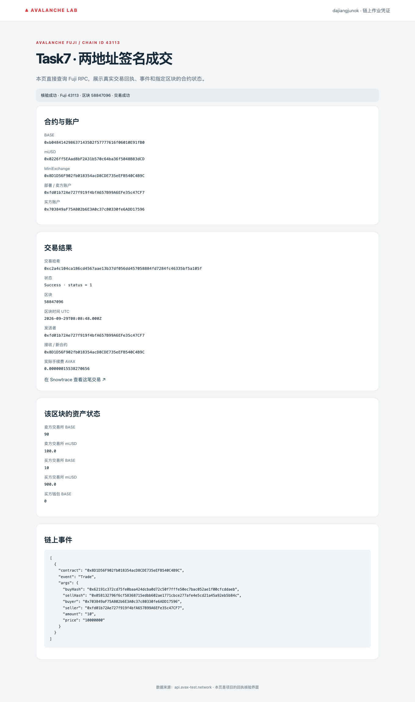
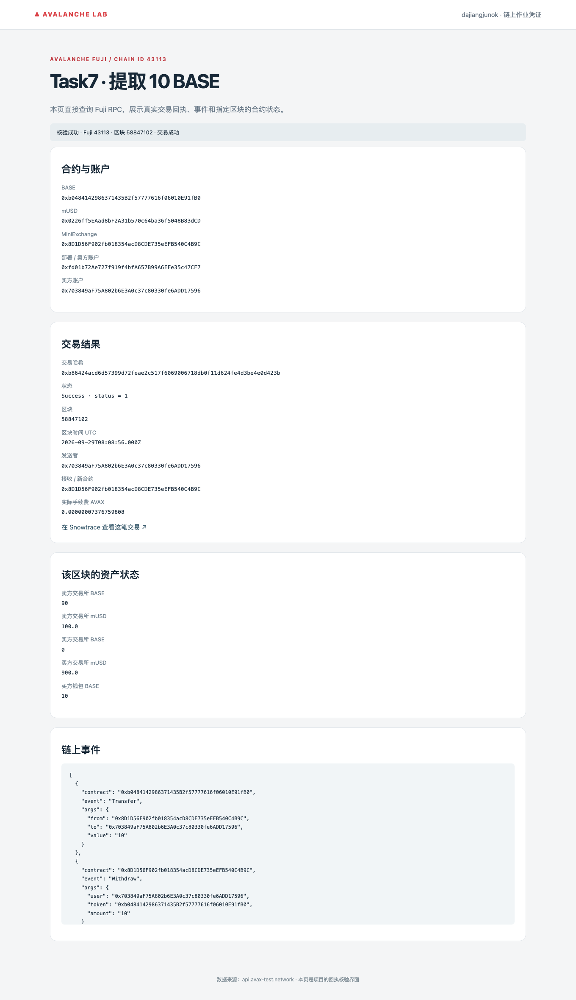

# Task7：Mini-DEX 撮合与结算

实现 **BASE/mUSD 现货 Mini-DEX**：价格优先、时间优先、拒绝自成交，链上以双方 EIP-712 签名完成结算，支持 deposit、withdraw、撤单和余额硬上限。

> 课程任务仅写了“Mini-DEX”名称，未提供仓库 URL。本次是独立实现，尚未与课程原代码核对；不包含永续合约的保证金、资金费率和清算。

## 代码与测试

[撮合引擎](projects/avalanche-lab/task7/engine.mjs) · [时间优先 / 自成交测试](projects/avalanche-lab/task7/test/engine.test.mjs) · [结算合约](projects/avalanche-lab/contracts/MiniExchange.sol)

`npm test` **15 项通过**，`forge test` **43 项通过**，证明见 [npm 日志](public/evidence/npm-test.txt)和 [Foundry 日志](public/evidence/forge-test.txt)。进阶实现了链上存款硬上限、引擎层 IOC/FOK，并提供[安全自查](projects/avalanche-lab/task7/SECURITY_REVIEW.md)；IOC/FOK 不代表多笔链上结算具有原子性。

## Fuji 合约

| 合约 | 地址 |
| --- | --- |
| BaseAsset（BASE，0 decimals） | [0xb0484142986371435B2f57777616f06010E91fB0](https://testnet.snowtrace.io/address/0xb0484142986371435B2f57777616f06010E91fB0) |
| MockUSDC（mUSD，6 decimals） | [0x0226ff5EAad8bF2A31b570c64ba36f5048B83dCD](https://testnet.snowtrace.io/address/0x0226ff5EAad8bF2A31b570c64ba36f5048B83dCD) |
| MiniExchange | [0x8D1D56F902fb018354acD8CDE735eEFB540C4B9C](https://testnet.snowtrace.io/address/0x8D1D56F902fb018354acD8CDE735eEFB540C4B9C) |

卖方：`0xfd01b72Ae727f919f4bfA657B99A6EFe35c47CF7`；买方：`0x703849aF75A802b6E3A0c37c80330fe6ADD17596`。两者均为本次本地控制的测试账户。

- 买方 deposit 1,000 mUSD：[0xf8634842a52545d52c0844b7848e7c4a659399f8429fce258d64beb788369111](https://testnet.snowtrace.io/tx/0xf8634842a52545d52c0844b7848e7c4a659399f8429fce258d64beb788369111)
- 两地址成交 10 BASE，成交价 10 mUSD/BASE：[0xc2a4c104ca186cd4567aae13b37df056dd457058884fd7284fc46335bf5a105f](https://testnet.snowtrace.io/tx/0xc2a4c104ca186cd4567aae13b37df056dd457058884fd7284fc46335bf5a105f)
- 买方 withdraw 10 BASE：[0xb86424acd6d57399d72feae2c517f6069006718db0f11d624fe4d3be4e0d423b](https://testnet.snowtrace.io/tx/0xb86424acd6d57399d72feae2c517f6069006718db0f11d624fe4d3be4e0d423b)

登录为客户端钱包签名校验，订单通过 JSON 交换，没有后台认证、数据库或 WebSocket。完整地址和回执见 [Fuji 记录](public/evidence/fuji/deployment.json)。

查看 Fuji 截图

