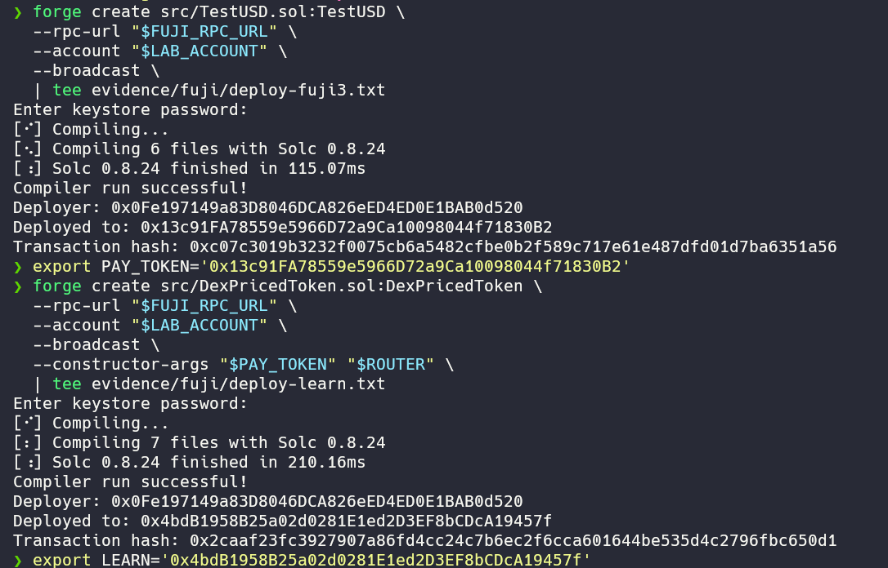
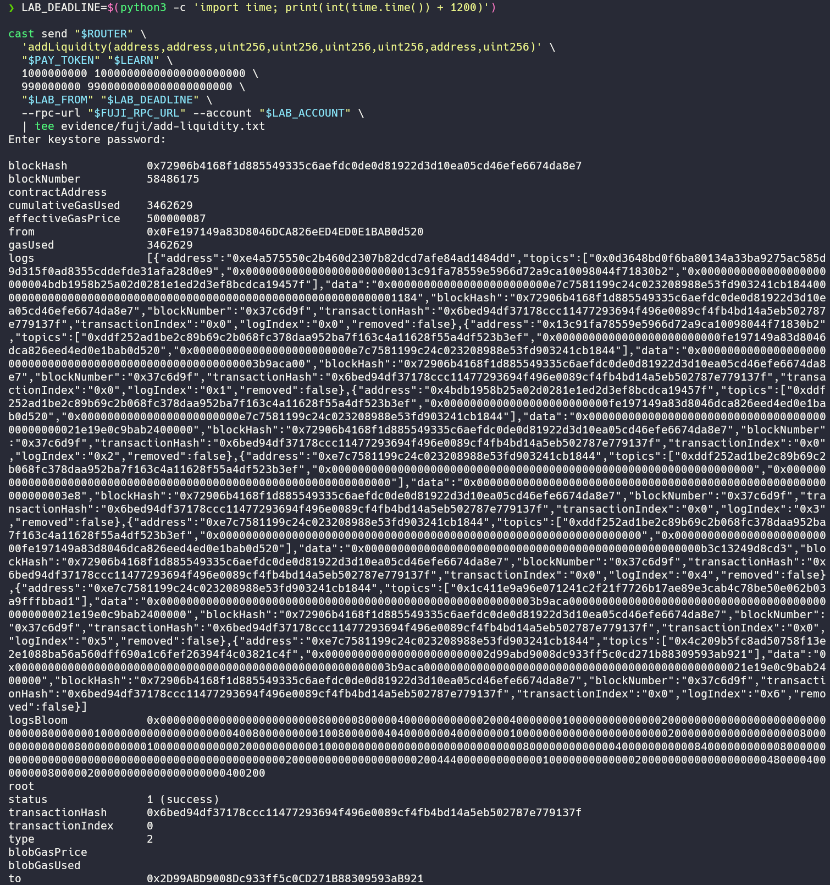
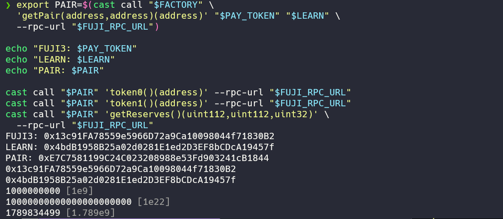
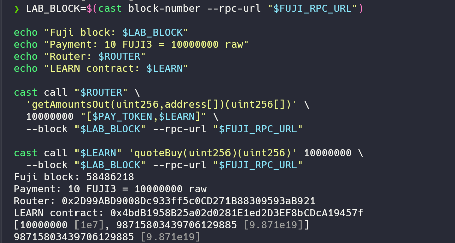
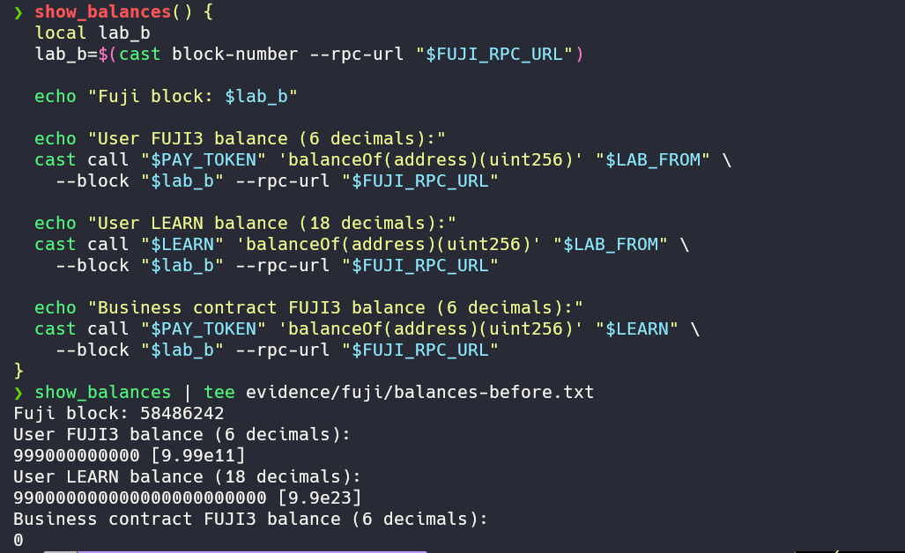
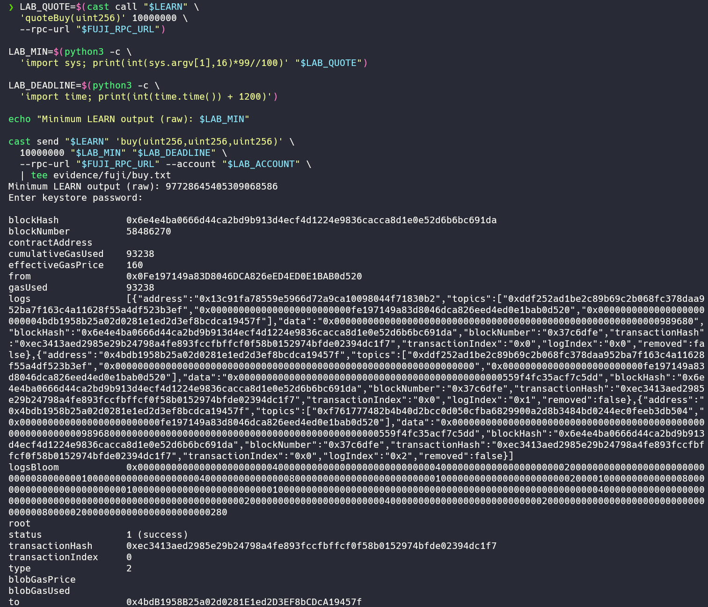
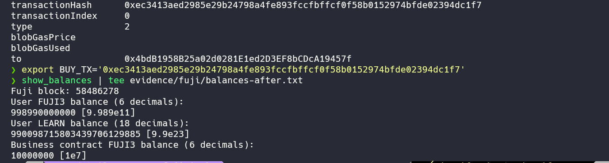

# Task 3：使用 DEX Oracle 获取代币价格

> 学员：dreaifekks · 网络：Avalanche Fuji C-Chain（chain ID `43113`）

本次在 **Pangolin V2** 创建 FUJI3 / LEARN 交易对并加入流动性。LEARN 合约在 `buy()` 中调用 Router 获取实时报价，用报价决定付费铸造数量：实际支付 **10 FUJI3**，获得 **98.715803439706129885 LEARN**。

## 1. DEX、Token 与部署地址

| 对象 | 名称 / 精度 | Fuji 地址与浏览器链接 |
| --- | --- | --- |
| Token A | Task3 Test USD / **FUJI3** / 6 | [`0x13c91FA78559e5966D72a9Ca10098044f71830B2`](https://testnet.snowtrace.io/address/0x13c91FA78559e5966D72a9Ca10098044f71830B2) |
| Token B / 业务合约 | Task3 Learn Token / **LEARN** / 18 | [`0x4bdB1958B25a02d0281E1ed2D3EF8bCDcA19457f`](https://testnet.snowtrace.io/address/0x4bdB1958B25a02d0281E1ed2D3EF8bCDcA19457f) |
| 交易对 | FUJI3 / LEARN | [`0xE7C7581199C24C023208988e53Fd903241cB1844`](https://testnet.snowtrace.io/address/0xE7C7581199C24C023208988e53Fd903241cB1844) |
| Pangolin Router | 测试网 Router | [`0x2D99ABD9008Dc933ff5c0CD271B88309593aB921`](https://testnet.snowtrace.io/address/0x2D99ABD9008Dc933ff5c0CD271B88309593aB921) |
| Pangolin Factory | 测试网 Factory | [`0xE4A575550C2b460d2307b82dCd7aFe84AD1484dd`](https://testnet.snowtrace.io/address/0xE4A575550C2b460d2307b82dCd7aFe84AD1484dd) |

DEX 地址来源：[Pangolin 官方 Avalanche V2 合约表](https://docs.pangolin.exchange/developers/contracts-and-integration-reference/avalanche-v2)。

## 2. 部署与交易

| 操作 | 区块 | 交易链接 | 状态 |
| --- | ---: | --- | --- |
| 部署 FUJI3 | 58486116 | [`0xc07c3019…a6351a56`](https://testnet.snowtrace.io/tx/0xc07c3019b3232f0075cb6a5482cfbe0b2f589c717e61e487dfd01d7ba6351a56) | 成功 |
| 部署 LEARN / 业务合约 | 58486131 | [`0x2caaf23f…fbc650d1`](https://testnet.snowtrace.io/tx/0x2caaf23fc3927907a86fd4cc24c7b6ec2f6cca601644be535d4c2796fbc650d1) | 成功 |
| 创建 Pair 并添加流动性 | 58486175 | [`0x6bed94df…e779137f`](https://testnet.snowtrace.io/tx/0x6bed94df37178ccc11477293694f496e0089cf4fb4bd14a5eb502787e779137f) | 成功 |
| 按 DEX 报价购买 | 58486270 | [`0xec3413ae…394dc1f7`](https://testnet.snowtrace.io/tx/0xec3413aed2985e29b24798a4fe893fccfbffcf0f58b0152974bfde02394dc1f7) | 成功 |



## 3. 创建交易对与添加流动性

先分别授权 Router 使用 FUJI3 和 LEARN，再调用 `addLiquidity()`。本次投入 **1,000 FUJI3 + 10,000 LEARN**，由 Router 通过 Factory 创建 Pair 并注入流动性。

`Factory.getPair(FUJI3, LEARN)` 返回上表 Pair；`token0 = FUJI3`、`token1 = LEARN`。在区块 `58486242`，`reserve0 = 1000000000`（1,000 FUJI3），`reserve1 = 10000000000000000000000`（10,000 LEARN）。





## 4. 获取 DEX 报价的核心代码

`quoteBuy()` 调用 Pangolin Router，查询 FUJI3 → LEARN 的实际兑换报价。

```solidity
function quoteBuy(uint256 paymentRaw) public view returns (uint256 tokenRaw) {
    require(paymentRaw > 0, "Zero payment");
    address[] memory path = new address[](2);
    path[0] = address(paymentToken);
    path[1] = address(this);
    uint256[] memory amounts = router.getAmountsOut(paymentRaw, path);
    require(amounts.length == 2 && amounts[1] > 0, "Invalid quote");
    return amounts[1];
}
```

在同一区块 **58486218**，两次查询结果一致：

| 查询 | 输入 raw | 输出 raw |
| --- | ---: | ---: |
| Router.getAmountsOut，路径 FUJI3 → LEARN | 10000000 | 98715803439706129885 |
| LEARN.quoteBuy | 10000000 | 98715803439706129885 |

输入为 **10 FUJI3**（6 decimals），输出为 **98.715803439706129885 LEARN**（18 decimals）；输入、输出分别按各自精度换算。



## 5. 在购买业务中使用报价

```solidity
function buy(uint256 paymentRaw, uint256 minTokensRaw, uint256 deadline)
    external nonReentrant returns (uint256 tokenRaw)
{
    require(block.timestamp <= deadline, "Expired");
    require(minTokensRaw > 0, "Zero minimum");
    tokenRaw = quoteBuy(paymentRaw);
    require(tokenRaw >= minTokensRaw, "Quote below minimum");
    paymentToken.safeTransferFrom(msg.sender, address(this), paymentRaw);
    _mint(msg.sender, tokenRaw);
    emit Purchased(msg.sender, paymentRaw, tokenRaw);
}
```

购买前，用户另外授权 **LEARN 业务合约**扣除 FUJI3。`buy()` 在交易执行时重新读取 DEX 报价，检查最低输出和截止时间，将 FUJI3 收到业务合约，再向购买者铸造 LEARN。

本次支付 `10000000` raw（10 FUJI3），最低输出设为查询报价的 99%。购买交易中的 `Purchased` 事件记录 `paidRaw = 10000000`、`mintedRaw = 98715803439706129885`，对应以下余额变化：

| 数据 | 购买前：区块 58486242 | 购买后：区块 58486278 | 变化 |
| --- | ---: | ---: | ---: |
| 用户 FUJI3 | 999,000 | 998,990 | −10 |
| 用户 LEARN | 990,000 | 990,098.715803439706129885 | +98.715803439706129885 |
| 业务合约持有 FUJI3 | 0 | 10 | +10 |

报价查询与购买发生在不同区块，本次实际铸造量与查询报价一致。`buy()` 按 DEX 报价收取 FUJI3 并铸造 LEARN。







本实现使用 AMM 即时报价，报价会受池子储备变化影响；最低输出用于限制本次购买可接受的数量下降。
