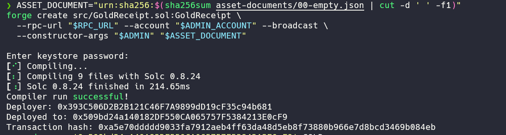
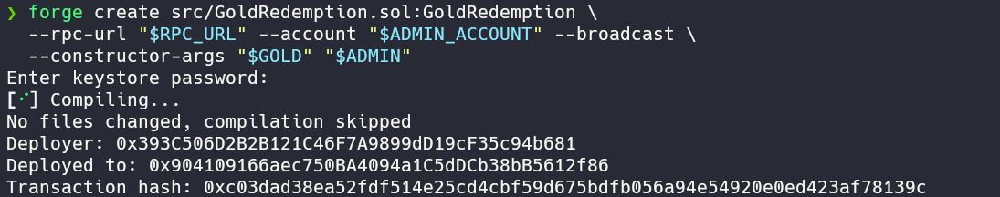
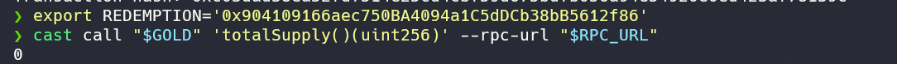
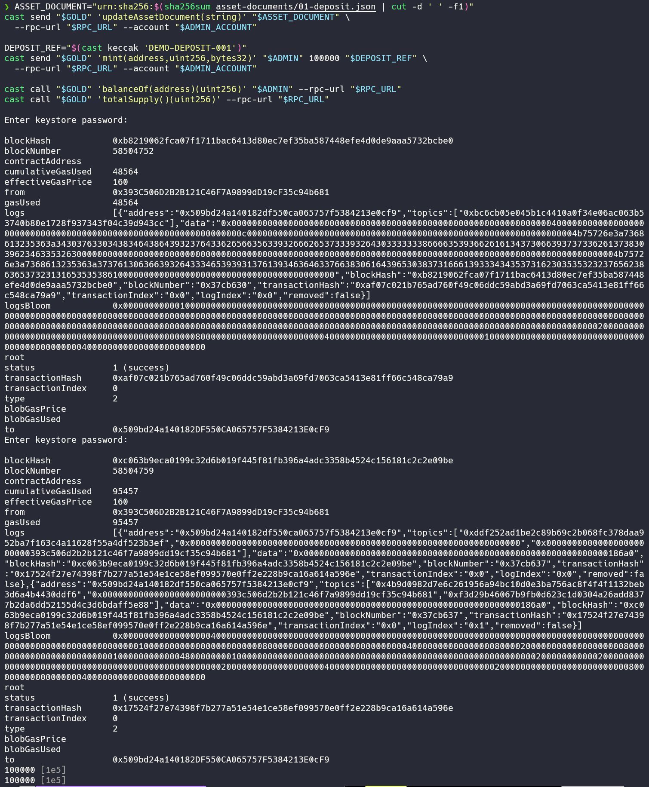
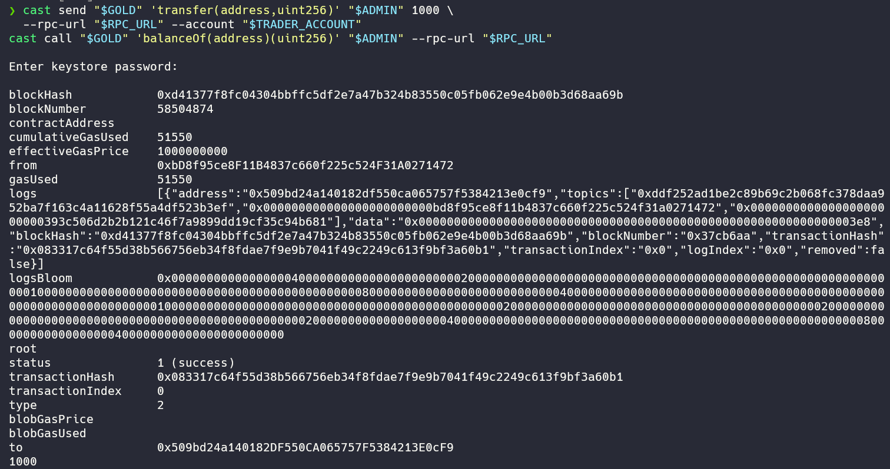
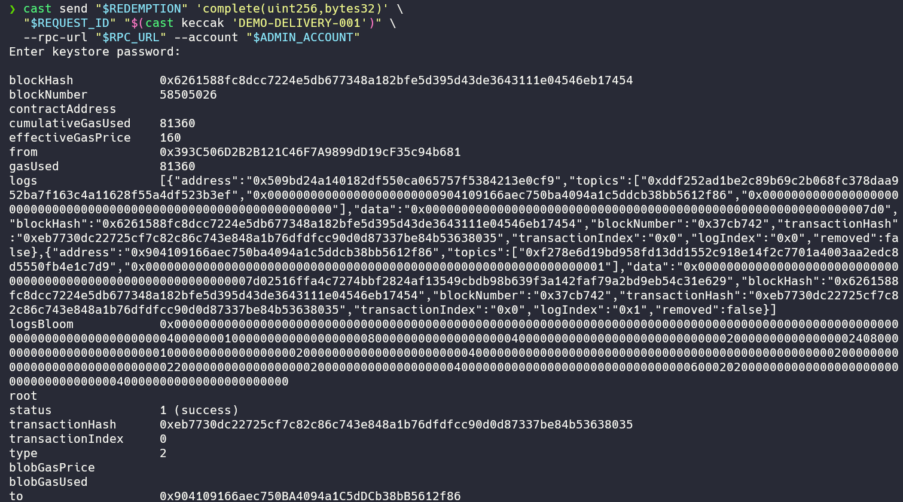
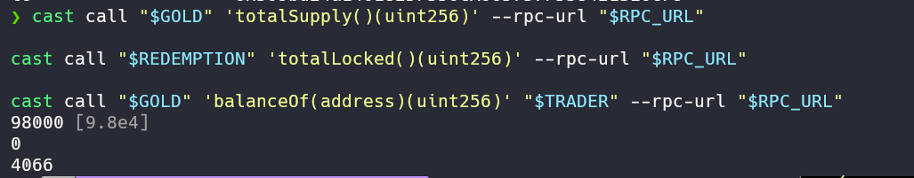
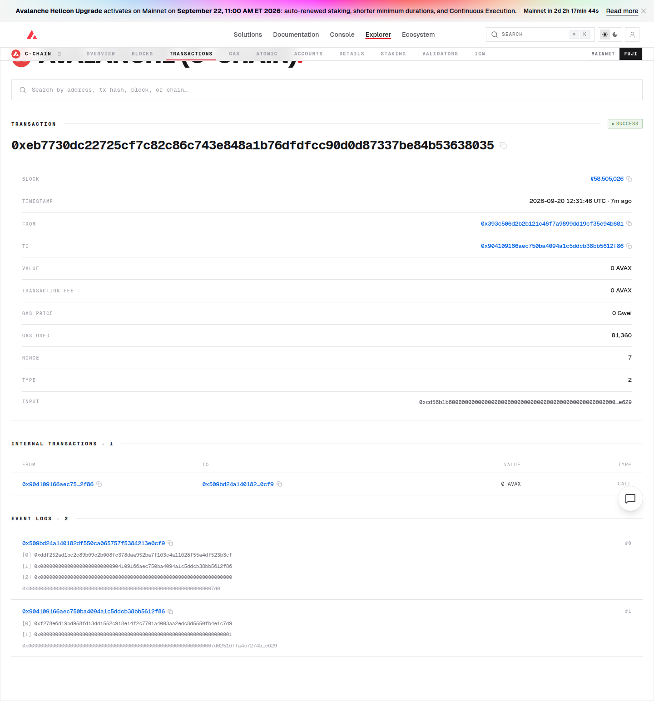

# Task5：黄金凭证与 DGR/WAVAX 流动池

> 学员：dreaifekks · 网络：Avalanche Fuji C-Chain · Chain ID：`43113`

## 1. 业务设计

本项目模拟黄金托管凭证：**1 DGR 对应对 1 克纯金含量的提取权**，采用 ERC-20，精度为 3，因此 `1000 raw = 1 DGR`。模拟托管方负责黄金入库验收、保管和资产报告，管理员根据入库凭证发行 Token。

发行表示黄金入库后取得对应凭证；转账表示提取权转移，黄金仍在托管方；提金时先锁定 Token，管理员确认模拟交付完成后销毁。普通用户也可以在 Pangolin 流动池中用 AVAX 买卖 DGR，买卖不改变 Token 总供应量。

资产报告包含初始零库存、模拟入库 100 克、提金后剩余 98 克三个 JSON 版本，合约保存 `urn:sha256:<文件摘要>`。本作业没有真实黄金托管，报告和交付均为模拟；链上引用可用于核对文档内容，不自动证明实物真实性。

## 2. 合约与账户

| 对象 | Fuji 地址 |
|---|---|
| Demo Gold Receipt / DGR / 3 decimals | [`0x509bd24a140182DF550CA065757F5384213E0cF9`](https://testnet.snowtrace.io/address/0x509bd24a140182DF550CA065757F5384213E0cF9) |
| GoldRedemption | [`0x904109166aec750BA4094a1C5dDCb38bB5612f86`](https://testnet.snowtrace.io/address/0x904109166aec750BA4094a1C5dDCb38bB5612f86) |
| Pangolin DGR/WAVAX Pair | [`0x46Bb4a2339d1E80e244e90272580B7aBFcf1e7b1`](https://testnet.snowtrace.io/address/0x46Bb4a2339d1E80e244e90272580B7aBFcf1e7b1) |
| 管理员 / 本次供应商 | `0x393C506D2B2B121C46F7A9899dD19cF35c94b681` |
| 交易者 | `0xbD8f95ce8F11B4837c660f225c524F31A0271472` |

使用已有的 Pangolin V2 Router `0x2D99ABD9008Dc933ff5c0CD271B88309593aB921`，池内另一种资产为 WAVAX `0xd00ae08403B9bbb9124bB305C09058E32C39A48c`。Router 自动包装/解包 AVAX。

## 3. 实现的功能

- ERC-20 名称、符号、余额、总供应量、转账与销毁；初始供应为 0。
- `mint(to, amount, depositRef)` 仅管理员可调用，同一入库凭证不能重复使用。
- `updateAssetDocument(document)` 仅管理员可调用。
- 发行、证明更新及赎回操作有事件；转账、发行、销毁同时记录 ERC-20 `Transfer` 事件。
- 用户申请提金时锁定 DGR；管理员开始处理后，可完成交付并销毁，或拒绝并退回。开始处理前用户可以取消。
- 通过 Pangolin 添加流动性、AVAX 买入和卖回 AVAX。流动池中的 DGR 是已经发行的凭证，swap 不触发 mint。

持有人也可直接调用 `burn` 注销凭证；本次实际销毁走的是完整提金流程。管理员不能通过提金合约直接销毁用户钱包或池子的 DGR。

## 4. 实际 Fuji 执行记录

本次按测试币预算，投入 **100 DGR + 0.05 AVAX** 建池，交易者用 **0.005 AVAX** 买入。

| 操作 | 区块 | 实际结果 | 交易 |
|---|---:|---|---|
| 部署 DGR | 58504523 | 初始供应为 0 | [部署交易](https://testnet.snowtrace.io/tx/0xa5e70ddddd9033fa7912aeb4ff63da48d5eb8f73880b966e7d8bcd3469b084eb) |
| 部署赎回合约 | 58504678 | 关联 DGR 合约 | [部署交易](https://testnet.snowtrace.io/tx/0xc03dad38ea52fdf514e25cd4cbf59d675bdfb056a94e54920e0ed423af78139c) |
| 入库发行 | 58504759 | 向管理员发行 100 DGR | [mint](https://testnet.snowtrace.io/tx/0x17524f27e74398f7b277a51e54e1ce58ef099570e0ff2e228b9ca16a614a596e) |
| 创建池并添加流动性 | 58504836 | 100 DGR + 0.05 AVAX | [addLiquidityAVAX](https://testnet.snowtrace.io/tx/0x272307a515da4ec8216ba356f9e2d1770056477ce43cede8e7bf1b33b03dcfab) |
| 买入 | 58504863 | 0.005 AVAX → 9.066 DGR | [swap 买入](https://testnet.snowtrace.io/tx/0x6c381a9f212756c990dde1b66d0386b95cfafae623dd3b7a0a8398644693157b) |
| 普通转账 | 58504874 | 交易者向管理员转账 1 DGR | [transfer](https://testnet.snowtrace.io/tx/0x083317c64f55d38b566756eb34f8fdae7f9e9b7041f49c2249c613f9bf3a60b1) |
| 卖出 | 58504885 | 2 DGR → 0.001180160984848484 AVAX | [swap 卖出](https://testnet.snowtrace.io/tx/0x03e2a7327e3d2996b2ccf2b9b6f16e3d3f876b130a783730f99e85e74a2aa438) |
| 申请提金 | 58504896 | 请求编号 1，锁定 2 DGR | [requestRedemption](https://testnet.snowtrace.io/tx/0xfd6c0fb0e70b96fe995b3704be2f63270ff338fe2c2111819944ceaeb1d85f24) |
| 开始处理 | 58505010 | 状态变为 Processing | [startProcessing](https://testnet.snowtrace.io/tx/0xc7f74273b421baf8a3f01d4023f75a87cf5fe2c96d8e54007a560939b0ed48c6) |
| 模拟交付完成并销毁 | 58505026 | 销毁锁定的 2 DGR | [complete / burn](https://testnet.snowtrace.io/tx/0xeb7730dc22725cf7c82c86c743e848a1b76dfdfcc90d0d87337be84b53638035) |
| 更新资产报告 | 58505032 | 报告更新为模拟剩余 98 克 | [updateAssetDocument](https://testnet.snowtrace.io/tx/0xf43473d005ed6d1e6e96e795ce0f8af39bcd6e998f07ae3be9586c968fda08ce) |

### 部署与初始状态







### 发行与转账

管理员确认模拟入库报告后发行 `100000 raw`；余额与总供应均为 100 DGR。



交易者买入后转给管理员 `1000 raw = 1 DGR`。



### 提金销毁与最终结果

`complete(1, deliveryRef)` 内调用 DGR 的 `burn(2000)`。该笔交易的 DGR `Transfer` 事件从赎回合约指向零地址，数量为 2000 raw；同时记录 `RedemptionCompleted`。





在区块 **58505032** 复核的余额：

| 项目 | DGR |
|---|---:|
| 总供应量 | 98 |
| 管理员持有 | 1 |
| 交易者持有 | 4.066 |
| 流动池持有 | 92.934 |
| 赎回合约锁定 | 0 |

`1 + 4.066 + 92.934 = 98`，与销毁后的总供应一致。申请编号 1 的状态为 `3 = Completed`。最终资产报告摘要为：

```text
urn:sha256:610ecfe7aadf16342fd9456c7fe00a2f3d15db5e45bad59d7726e43e092ece3c
```

### 区块浏览器截图

[Avalanche 官方 Fuji Explorer：本次销毁交易](https://build.avax.network/explorer/fuji/c-chain/tx/0xeb7730dc22725cf7c82c86c743e848a1b76dfdfcc90d0d87337be84b53638035)


