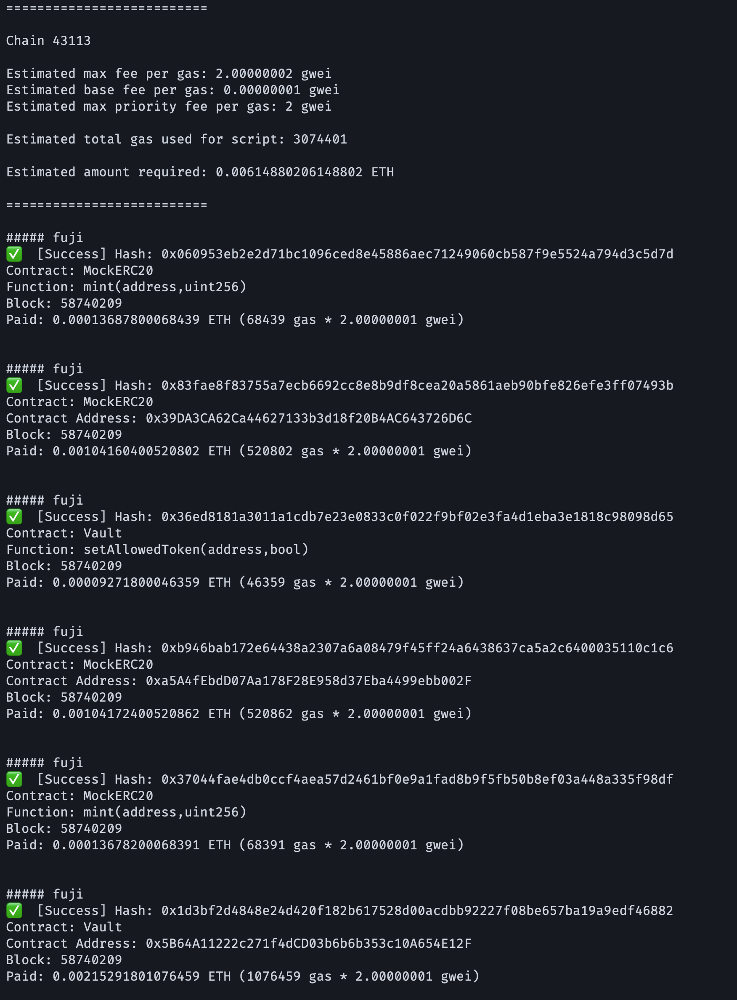
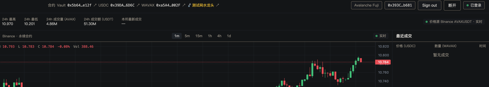
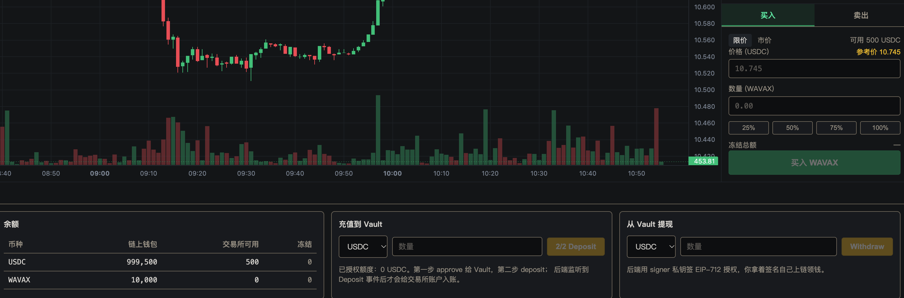
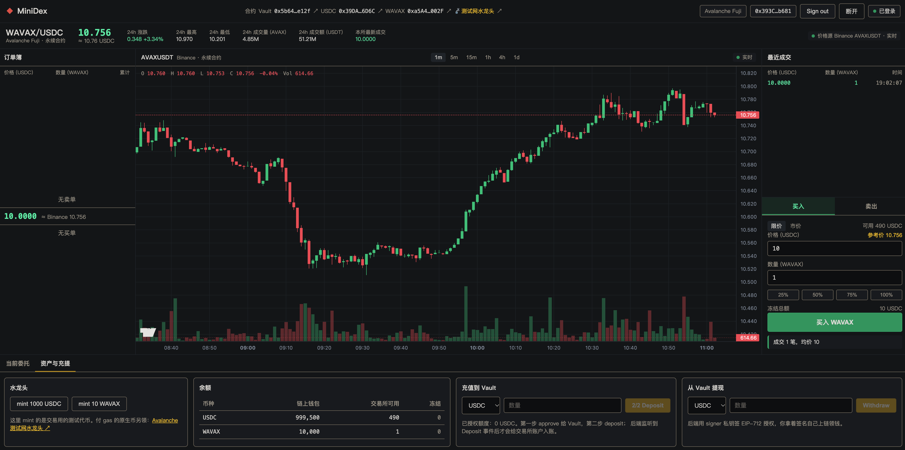
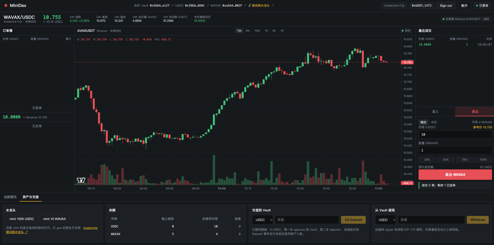
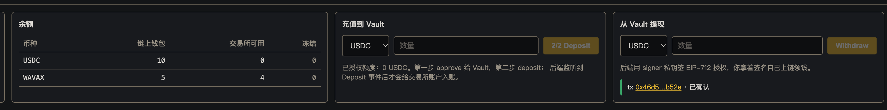

# Task7：Mini-DEX 撮合引擎、Fuji 部署与端到端演示

> 学员：dreaifekks · 网络：Avalanche Fuji C-Chain · Chain ID：`43113`
> 起点：课程仓库 [tubexchat/Mini-DEX](https://github.com/tubexchat/Mini-DEX) commit `992c94e`
> 本人代码：[dreaifekks/Mini-DEX@456455a](https://github.com/dreaifekks/Mini-DEX/commit/456455ad99094fa8835078bf3bd65dea256486c3)（分支 [`task7-dreaifekks`](https://github.com/dreaifekks/Mini-DEX/tree/task7-dreaifekks)）

后端和前端在本地运行（`localhost:8787` / `localhost:5173`），后端以链上模式连接 Fuji 上本人部署的合约。

## 必做 1：撮合引擎（拒绝 self-trade + 时间优先测试）

**改动**（`server/src/engine/orderbook.ts` 的 `match()`）：撮合时若对手挂单的 `owner` 与 taker 相同，跳过该挂单，既不撤销也不减少它的数量，继续检查同价档后面的单以及仍满足限价的下一档。

**新增测试**（`server/src/engine/orderbook.test.ts`，4 个）：

| 用例 | 断言 |
|---|---|
| 时间优先：同价同时间戳按提交顺序 | 三笔同价同 `ts` 卖单，市价买 1.5：先吃完第一笔，再吃第二笔一半，第三笔原样不动 |
| self-trade：同档跳过自己吃别人 | alice 的卖单在前、bob 在后，alice 买入只与 bob 成交，自己的卖单 remaining 不变 |
| self-trade：整档只有自己时看下一档 | 最优价只有 alice 自己，按下一档 bob 的价格成交，alice 的单仍是卖一 |
| self-trade：对手盘全是自己 | limit 单不成交只挂单；market 单不成交也不挂；自己原挂单不变 |

**测试结果**（本地，Node v22.22.3 / vitest 2.1.9 / forge 1.8.3）：

```
server    npm test           Test Files 4 passed, Tests 32 passed (32)   （原 28 + 新增 4）
server    npm run typecheck  exit 0
contracts forge test         13 passed, 0 failed, 0 skipped
server    npm run smoke      离线模式两地址登录 / 挂单 / 成交，SMOKE OK
```

## 必做 2：合约部署到 Fuji 与一笔 deposit

部署者 A `0x393C506D2B2B121C46F7A9899dD19cF35c94b681`，`forge script script/Deploy.s.sol --rpc-url fuji --broadcast`，7 笔交易全部成功，同在区块 `58740209`。

| 合约 | Fuji 地址 | 部署交易 |
|---|---|---|
| MockUSDC（6 decimals） | [`0x39DA3CA62Ca44627133b3d18f20B4AC643726D6C`](https://testnet.snowtrace.io/address/0x39DA3CA62Ca44627133b3d18f20B4AC643726D6C) | [`0x83fae8…7493b`](https://testnet.snowtrace.io/tx/0x83fae8f83755a7ecb6692cc8e8b9df8cea20a5861aeb90bfe826efe3ff07493b) |
| MockWAVAX（18 decimals） | [`0xa5A4fEbdD07Aa178F28E958d37Eba4499ebb002F`](https://testnet.snowtrace.io/address/0xa5A4fEbdD07Aa178F28E958d37Eba4499ebb002F) | [`0xb946ba…0c1c6`](https://testnet.snowtrace.io/tx/0xb946bab172e64438a2307a6a08479f45ff24a6438637ca5a2c6400035110c1c6) |
| Vault | [`0x5B64A11222c271f4dCD03b6b6b353c10A654E12F`](https://testnet.snowtrace.io/address/0x5B64A11222c271f4dCD03b6b6b353c10A654E12F) | [`0x1d3bf2…46882`](https://testnet.snowtrace.io/tx/0x1d3bf2d4848e24d420f182b617528d00acdbb92227f08be657ba19a9edf46882) |

Vault `owner` = A；`signer` = `0xB1A9d1c51fe05d4DC02A03A64a7A00e578A13A41`，是为本作业新生成的后端专用钥匙。两个代币已通过 `setAllowedToken` 上架（[USDC](https://testnet.snowtrace.io/tx/0x4e8ef506bae1c047ca4ecf85ff6498b9267ea2097794be244fc60d7f86dc867b) · [WAVAX](https://testnet.snowtrace.io/tx/0x36ed8181a3011a1cdb7e23e0833c0f022f9bf02e3fa4d1eba3e1818c98098d65)）。



**真实 deposit**：

| 操作 | 钱包 | 区块 | tx hash |
|---|---|---|---|
| **deposit 500 USDC** | A `0x393C…4b681` | 58743150 | [`0x0ebd56d38759929ed336e04c05e8bcb8a7f3aad22c51d8ca68f81774fe53dcbb`](https://testnet.snowtrace.io/tx/0x0ebd56d38759929ed336e04c05e8bcb8a7f3aad22c51d8ca68f81774fe53dcbb) |
| deposit 5 WAVAX | B `0xbD8f…1472` | 58743274 | [`0x25d5931d9ced4313016bea19b9b6530e1264df866a70a2186ab213353273cb09`](https://testnet.snowtrace.io/tx/0x25d5931d9ced4313016bea19b9b6530e1264df866a70a2186ab213353273cb09) |

Vault 事件核对（`cast logs`）：`Deposit(A, USDC, 500000000)`、`Deposit(B, WAVAX, 5e18)`；链上 `balances(A, USDC) = 500000000`、`balances(B, WAVAX) = 5e18`。

## 必做 3：端到端演示

两个独立钱包：A `0x393C506D2B2B121C46F7A9899dD19cF35c94b681`（部署者）、B `0xbD8f95ce8F11B4837c660f225c524F31A0271472`。后端 `.env`：`CHAIN_ID=43113`、`DEPOSIT_FROM_BLOCK=58740209`，启动时回放 Deposit 事件建账。

### 3.1 登录成功

A 连接 MetaMask → Switch to Avalanche Fuji → Sign in（EIP-712 签名，不花 gas）。顶栏显示 Fuji、地址 `0x393C…b681`、绿点「已登录」，中间是本人部署的三个合约地址。



### 3.2 余额显示

A 充值 500 USDC 后：链上钱包 999,500 USDC / 交易所可用 500 USDC；WAVAX 链上 10,000 / 交易所 0。「链上钱包」与「交易所可用」分开显示，后者来自后端监听到 Deposit 事件后的入账。



### 3.3 两个不同地址完成成交

B mint 10 WAVAX 并充值 5 WAVAX，挂限价卖单 **10 USDC × 1 WAVAX**；A 以限价 10 买入 1 WAVAX，撮合成交。两张截图分别在 A、B 登录态下截取，「最近成交」同为 `10.0000 × 1 · 19:02:07`。

| 钱包 | 截图里的余额（交易所可用） | 说明 |
|---|---|---|
| A `0x393C…b681` | USDC 490，WAVAX 1 | 买入提示「成交 1 笔，均价 10」 |
| B `0xbD8f…1472` | USDC 10，WAVAX 4 | B 从未充值过 USDC，这 10 USDC 全部来自与 A 的链下成交 |




### 3.4 withdraw 交易

B 提现 10 USDC：后端 signer 签 EIP-712 授权，B 自己调用 `Vault.withdraw` 上链。

| 操作 | 钱包 | 区块 | tx hash |
|---|---|---|---|
| **withdraw 10 USDC** | B `0xbD8f…1472` | 58743376 | [`0x46d5bc83ef9f4e081fbef38717028126caae4cd89365ace0674ccaed3dd7b52e`](https://testnet.snowtrace.io/tx/0x46d5bc83ef9f4e081fbef38717028126caae4cd89365ace0674ccaed3dd7b52e) |

Vault 事件：`Withdraw(B, USDC, 10000000, nonce=16934531699038742452)`。提现后 B 链上钱包 USDC 由 0 变为 10（`balanceOf(B) = 10000000`），交易所可用归 0。B 没有充过 USDC，这 10 USDC 是 Vault 共享托管池里 A 存入的那部分，说明链下成交的结果真实反映到了链上提现。


