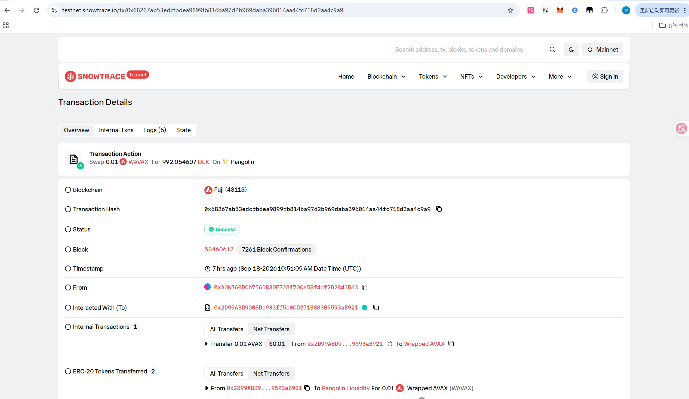
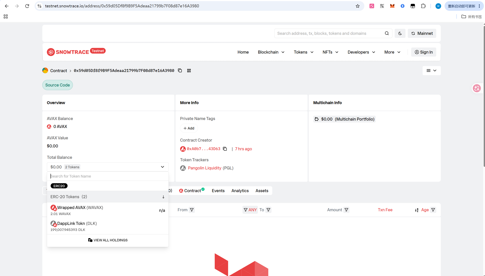
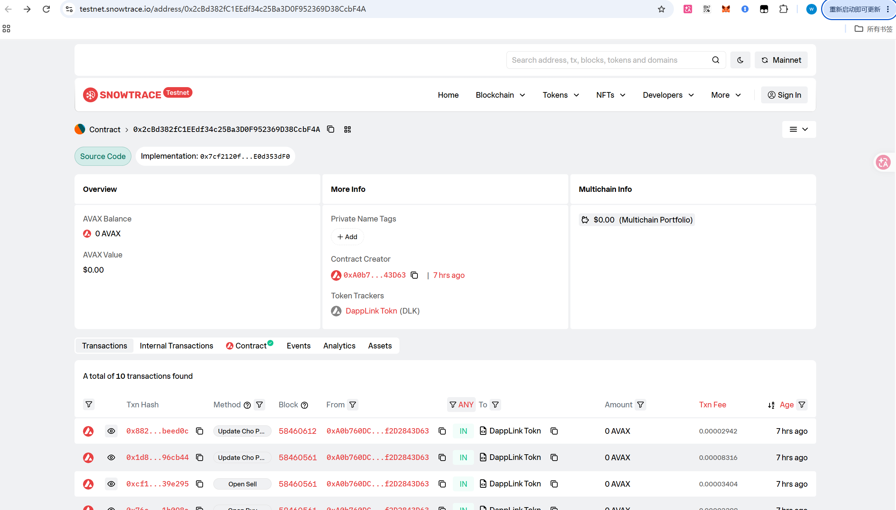
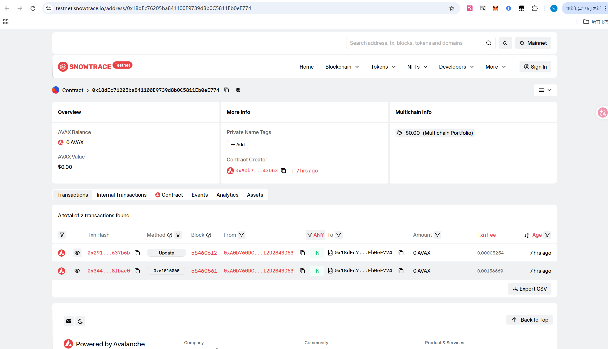
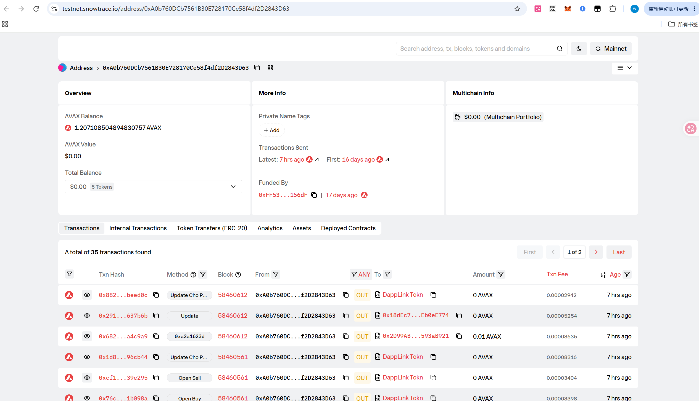
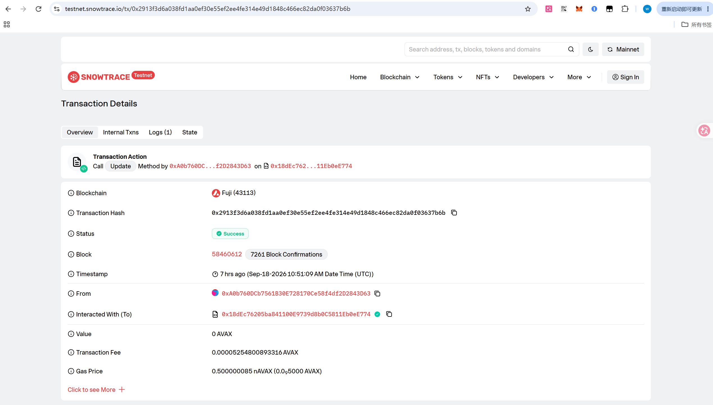

# Task 3：使用 DEX Oracle 获取代币价格

> 课程：第三章 Solidity 合约实战  
> 提交人：emptytouch  
> 代码仓库（fork）：<https://github.com/emptytouch/token-contracts>  
> 工程目录：`Lesson3/new-contracts/token-contracts`（Foundry）

---

## 1. 选择的 DEX

**Pangolin V2（Avalanche Fuji 测试网）** —— 即 Uniswap V2 架构的分叉，原生提供 `Factory / Router / Pair` 三件套，价格可以直接从交易对储备与累积价读取，无需引入 Chainlink 等外部喂价。

以下基础设施地址均已**链上核验**（`cast code` 返回非空字节码）：

| 组件                         | 地址                                           | 链上字节码     |
| -------------------------- | -------------------------------------------- | --------- |
| Pangolin V2 Factory (Fuji) | `0xE4A575550C2b460d2307b82dCd7aFe84AD1484dd` | 18856 B ✓ |
| Pangolin V2 Router (Fuji)  | `0x2D99ABD9008Dc933ff5c0CD271B88309593aB921` | 18276 B ✓ |
| WAVAX (Fuji 标准报价资产)        | `0xd00ae08403B9bbb9124bB305C09058E32C39A48c` | 3249 B ✓  |

> 自证：链上 `Router.factory()` 返回 `0xE4A5…48dd`、`Router.WAVAX()` 返回 `0xd00a…a48c`，与上方一致。

链上真实成交佐证：Snowtrace 交易详情显示 **Swap 0.01 WAVAX For 992.054607 DLK On 🟡 Pangolin**，交互对象为 Pangolin Router `0x2D99…B921`——DEX 选型真实可用：



---

## 2. Token A / Token B 与交易对

| 角色 | 名称 | 合约地址 | 说明 |
| --- | --- | --- | --- |
| Token A（被定价代币） | **DLK**（DappLinkToken） | 代理 `0x2cBd382fC1EEdf34c25Ba3D0F952369D38CcbF4A`<br>逻辑 `0x7cf2120fcc08F79aD9c3Aa15725C4e5E0d353dF0` | 本项目代币，6 位小数；本次任务修改的对象 |
| Token B（报价资产） | **WAVAX** | `0xd00ae08403B9bbb9124bB305C09058E32C39A48c`（Fuji 标准 WAVAX） | 课件原设计用 `USDT`，在 Avalanche 上改用原生包装 AVAX 作报价资产（等价角色，无需去水龙头换稳定币） |

- **交易对**：`DLK / WAVAX`，由代币 `initialize()` 调用 `PangolinFactory.createPair(WAVAX, address(this))` **自动创建**，并记为 `mainPair`。
- **流动性**：部署脚本通过 `PangolinRouter.addLiquidityAVAX` 注入（默认 `200_000 DLK + 2 AVAX`），见第 6 节。

**创建交易对 + 添加流动性的截图**（Snowtrace 交易对页，点开「2 Tokens」下拉可见池内两种代币真实储备）：



> 同页 `Contract Creator 0xA0b7…3D63` 证明交易对由部署者通过 `initialize()` 自动创建。

> 真实部署后的交易对 / 代币代理地址见第 6 节「部署结果」。

---

## 3. 获取 Swap / Oracle 价格的核心代码

新增 `src/oracle/`，提供**三条互相独立、可交叉验证**的取价通道（完整接口见 `IPangolinV2.sol`）：

### 3.1 通道一：Router 可成交报价（与真实 swap 同源）

```solidity
// PangolinPriceOracle.sol
function quoteViaRouter(uint256 baseAmount) public view returns (uint256 quoteAmount) {
    if (baseAmount == 0) return 0;
    address[] memory path = new address[](2);
    path[0] = baseToken;   // DLK
    path[1] = quoteToken;  // WAVAX
    uint256[] memory amounts = IPangolinV2Router(router).getAmountsOut(baseAmount, path);
    return amounts[amounts.length - 1];   // 含 0.30% 手续费与价格影响
}
```

### 3.2 通道二：Pair 现货边际价（可由储备完整复算）

```solidity
function spotPrice() public view returns (uint256) {
    (uint112 r0, uint112 r1,) = IPangolinV2Pair(pair).getReserves();
    (uint256 rBase, uint256 rQuote) = baseIsToken0 ? (uint256(r0), uint256(r1)) : (uint256(r1), uint256(r0));
    if (rBase == 0 || rQuote == 0) return 0;
    return Math.mulDiv(rQuote, ONE, rBase);   // 储备比例，与 decimals 无关
}
```

### 3.3 通道三：Pair 累积价 TWAP（真正的预言机）

```solidity
// 无权限限制：任何人可推进检查点；累积价由池子储备自动累加，调用者无法伪造
function update() external returns (uint256 price) {
    (uint256 cNow, uint32 tsNow) = _readCumulative();
    uint256 elapsed = uint256(tsNow) - timestampLast;
    require(elapsed > 0, "Oracle: no time elapsed since last update");
    uint256 delta = cNow - cumulativeLast;
    cumulativeLast = cNow;
    timestampLast = tsNow;
    price = Math.mulDiv(delta, ONE, elapsed * TWO_POW_112);  // 时间加权平均价
    lastTwapPrice1e18 = price;
    lastUpdater = msg.sender;
    emit PriceUpdated(price, elapsed, tsNow);
}
```

### 3.4 业务逻辑推荐入口（含来源标注）

```solidity
// 业务取价统一走这里：TWAP 就绪用 TWAP，否则如实回退 Router 报价
function referencePrice(uint256 baseAmount) external view returns (uint256 quoteAmount, bool fromTwap) {
    uint256 t = twapPrice();
    if (t == 0) return (quoteViaRouter(baseAmount), false);
    return (Math.mulDiv(baseAmount, t, ONE), true);
}
```

> **为什么需要回退？** Uniswap V2 的累积价只在储备变化（swap/加撤池）时前进，新建、尚无成交历史的池子 `delta=0`，算不出平均价；此时回退到 Router 即时报价（同为链上 DEX 数据），并把 `fromTwap=false` 如实返回，让调用方与链下索引都能分辨口径。

---

## 4. 在合约业务逻辑中使用价格的代码

本次任务的改造落点是 `src/core/contracts/DappLinkToken.sol`。课件原作者在 `updateChoPrice()` 里留了 todo：

```solidity
// 原代码：latestChoPrice = IPancakeRouter01(v2Router).getAmountOut(1000000, rThis, rOther);
//          // todo: 最佳的方式是用预言机的价格
```

改造后——

### 4.1 防砸盘税：每次实时向预言机取参考价（不再读链下喂价）

```solidity
function getDeclineTaxRate(uint256 value, bool isSell) internal returns (uint256 sellTax) {
    if (!isSell || value == 0) return 0;
    uint256 declineRate;
    (sellTax, declineRate) = _calcDeclineTax(value);   // 见下
    if (sellTax > 0) downsideTax = sellTax;
    emit DeclineTaxApplied(value, declineRate, sellTax);
}

function _calcDeclineTax(uint256 value) internal view returns (uint256 sellTax, uint256 declineRate) {
    (uint256 referencePrice,) = _readOracleReferencePrice();   // ← 实时向预言机取参考价
    if (referencePrice == 0) return (0, 0);                    // 预言机未绑定则不误收税
    uint256 current = quote(PRICE_PROBE);                      // ← 当前价同样来自主交易对
    if (current >= referencePrice) return (0, 0);              // 没跌/涨了 → 不收
    declineRate = ((referencePrice - current) * BPS_DENOMINATOR) / referencePrice;  // 跌幅（基点）
    if (declineRate >= PRICE_DROP_6_BPS)      sellTax = (value * DOWN_TAX_6_BPS) / BPS_DENOMINATOR; // ≥6% 收 20%
    else if (declineRate >= PRICE_DROP_3_BPS) sellTax = (value * DOWN_TAX_3_BPS) / BPS_DENOMINATOR; // 3~6% 收 10%
}

function _readOracleReferencePrice() internal view returns (uint256 price, bool fromTwap) {
    address oracleAddr = priceOracle;
    if (oracleAddr == address(0)) return (0, false);
    return IPriceOracle(oracleAddr).referencePrice(PRICE_PROBE);
}
```

### 4.2 当前价 / 参考价 / 卖出预览（对外只读视图，供前端与核验）

```solidity
function currentPrice() external view returns (uint256) { return quote(PRICE_PROBE); }
function oracleReferencePrice() external view returns (uint256 price, bool fromTwap) { return _readOracleReferencePrice(); }

function previewSell(uint256 amountIn) external view
    returns (uint256 netQuoteOut, uint256 tradeFee, uint256 declineTax, uint256 declineRate)
{
    tradeFee = (amountIn * SELL_FEE_BPS) / BPS_DENOMINATOR;
    uint256 afterFee = amountIn - tradeFee;
    (declineTax, declineRate) = _calcDeclineTax(afterFee);   // 复用同一套 DEX 取价逻辑
    netQuoteOut = quote(afterFee - declineTax);
}
```

### 4.3 `updateChoPrice()`：把 todo 落地（价格唯一来源是 DEX 预言机）

```solidity
// 去掉 onlyCaller 限制：任何人可调用，但推不出假价；真正参与收税的是上面的实时取价
function updateChoPrice() external returns (uint256 price) {
    bool fromTwap;
    (price, fromTwap) = _readOracleReferencePrice();
    require(price > 0, "DappLinkToken: oracle price unavailable");
    latestChoPrice = price;
    lastReferenceFromTwap = fromTwap;
    emit UpdateChoPrice(block.timestamp, block.number, price);
    emit ReferencePriceSynced(price, fromTwap, block.timestamp);
}
```

新增 `setPriceOracle`（operator）绑定预言机；代币只依赖 `IPriceOracle` 接口，以后换 DEX 无需改代币。

---

## 5. 价格确实来自 DEX、并驱动业务逻辑的验证证据

### 5.1 单元测试（Fuji 分叉 + 真实 Pangolin 池子）

- `test/PangolinPriceOracle.fork.t.sol`（6/6 通过）：直接读 Fuji 上真实 `WAVAX/USDC` 交易对
  - Router 通道结果与直接调用 Pangolin Router **完全一致**
  - 现货价可由真实储备复算（实测 `21.820058 USDC/WAVAX`）
  - TWAP 严格等于时间窗口内实际维持的价格（实测 `20500756 == 20500756`）
  - 任意地址均可推进检查点；零时间窗口被正确拒绝
- `test/DappLinkTokenDexPrice.t.sol`（3/3 通过）：端到端证明价格来自 DEX 且被业务逻辑使用
  - 部署代理代币 → 自动建 `DLK/WAVAX` 对 → Router 注入真实流动性 → 部署预言机绑定
  - 代币 `currentPrice()` == 预言机 Router 报价（**完全相同**）
  - 制造真实跌价后：TWAP 参考价 == 窗口内高价（精确相等），跌幅 1977 基点 → 触发 20% 防砸盘税（`1,940,000,000`）
  - 一笔**真实卖出转账**中，链上 `downsideTax` 记录与 `previewSell` **完全一致** → 税真的被执行

---

## 6. 部署到 Fuji 测试网

### 6.1 部署命令

```bash
# 在 Lesson3/new-contracts/token-contracts 下
cp .env.example .env
# 在 .env 中填入：PRIVATE_KEY、FUJI_RPC_URL、以及可选的 *_OWNER / 流动性等
# （默认流动性 200_000 DLK + 2 AVAX；账户需持有 >2 AVAX）

forge script script/DeployDappLinkDex.s.sol:DeployDappLinkDexScript \
  --rpc-url "$FUJI_RPC_URL" --broadcast -vv
```

部署完成后（等待若干分钟，让池子累积价前进）：

```bash
DLK_TOKEN=<部署后的代理地址> PRICE_ORACLE=<部署后的预言机地址> \
SYNC_SWAP_AVAX=10000000000000000 \
forge script script/SyncOraclePrice.s.sol:SyncOraclePriceScript \
  --rpc-url "$FUJI_RPC_URL" --broadcast -vv
```

### 6.2 部署后地址与浏览器链接（真实 Fuji 部署）

> ✅ 已于 Fuji 测试网（chain-id 43113）真实部署，以下地址均为链上验证过的真实合约。部署者 `0xA0b760DCb7561B30E728170Ce58f4df2D2843D63`。

| 项目                             | 地址                                           | 浏览器链接                                                                                          |
| ------------------------------ | -------------------------------------------- | ---------------------------------------------------------------------------------------------- |
| DappLinkToken 代理（业务入口）         | `0x2cBd382fC1EEdf34c25Ba3D0F952369D38CcbF4A` | <https://testnet.snowtrace.io/address/0x2cBd382fC1EEdf34c25Ba3D0F952369D38CcbF4A>              |
| 逻辑合约（实现）                       | `0x7cf2120fcc08F79aD9c3Aa15725C4e5E0d353dF0` | <https://testnet.snowtrace.io/address/0x7cf2120fcc08F79aD9c3Aa15725C4e5E0d353dF0>              |
| PangolinPriceOracle            | `0x18dEc76205ba841100E9739d8b0C5811Eb0eE774` | <https://testnet.snowtrace.io/address/0x18dEc76205ba841100E9739d8b0C5811Eb0eE774>              |
| DLK/WAVAX 交易对（initialize 自动创建） | `0x59d05Df8f9B9F5Adeaa21799b7F08d87e16A3980` | <https://subnets-test.avax.network/c-chain/address/0x59d05Df8f9B9F5Adeaa21799b7F08d87e16A3980> |
| 部署者                            | `0xA0b760DCb7561B30E728170Ce58f4df2D2843D63` | <https://testnet.snowtrace.io/address/0xA0b760DCb7561B30E728170Ce58f4df2D2843D63>              |

**部署交易（DeployDappLinkDex.s.sol，CREATE 三笔）**：

- 逻辑合约 `DappLinkToken`：`0x4815c619f1e9548ead92fab92c4f684ef56c5a8dfe648562d9f6ccb5f0d94679`
- 代理 `TransparentUpgradeableProxy`：`0xc7e142eb1489510d9bb935d450553bf3524dad7689aba02c68f59186e9c7211b`
- `PangolinPriceOracle`：`0xae83d21d0a8c0751b6ca5bd527e4dd46037fdcacfe89653c8dde6425922052bd`
- 另有 9 笔 CALL（initialize 建对 / 铸造分配 / 加白名单 / `addLiquidityAVAX` / `setPriceOracle` / `openBuy` / `openSell` / 首笔 `updateChoPrice` 等），可在 Snowtrace 部署者地址下查看。

**播种 TWAP 交易（SyncOraclePrice.s.sol）** —— 把参考价口径从 Router 回退切到真正的 TWAP：

- 真实成交 `swapExactAVAXForTokens`（0.01 AVAX → DLK）：`0x68267ab53edcfbdea9899fb814ba97d2b969daba396014aa44fc718d2aa4c9a9`（📎 截图 `task3.6`）
- `oracle.update()` 推进累积价检查点：`0x88292bf22965c18fc6427575665d5e8eeacfc67e85c679911948c34fcabeed0c`
- `token.updateChoPrice()` 镜像参考价：`0x2913f3d6a038fd1aa0ef30e55ef2ee4fe314e49d1848c466ec82da0f03637b6b`（📎 `oracle.update()` 交易截图见 `task3.5`）

**Snowtrace 合约页截图**（部署后真实状态）：

代理合约页（注意 `Implementation: 0x7cf2…3dF0` 标识 + 10 笔管理交易：`Update Cho Price` / `Open Sell` / `Open Buy` 等）：



预言机合约页（CREATE 部署 + `Update` 两笔交易）：



部署者地址页（35 笔交易，覆盖部署 / 加池 / swap / 开关全链路，另有 `Deployed Contracts` 标签）：



### 6.3 部署后链上核验（cast call 直读，证据）

> 以下为对真实 Fuji 合约的 `cast call` 只读输出，**全部来自链上 DEX 状态**；参考价已切到 TWAP（`fromTwap=true`），预言机绑定成功（`priceOracle()!=0`）。

**成功读取/使用价格的截图**（Snowtrace 交易详情：`oracle.update()` 调用 Status **Success**，交互对象为预言机 `0x18dE…E774`，推进 TWAP 累积价检查点）：



> 配合下方 `cast call` 直读：`oracleReferencePrice() = (1e13, true)`，`fromTwap=true` 证明参考价来自 TWAP 预言机（2026-09-19 实时读真实 Fuji 链上合约）。

```bash
# —— DappLinkToken 代理 0x2cBd382fC1EEdf34c25Ba3D0F952369D38CcbF4A ——
cast call 0x2cBd382fC1EEdf34c25Ba3D0F952369D38CcbF4A 'currentPrice()(uint256)' --rpc-url "$FUJI_RPC_URL"
# 10069748504278                        ← 1e6 DLK 经 Router 换出的 WAVAX-wei（含 0.3% 费）

cast call 0x2cBd382fC1EEdf34c25Ba3D0F952369D38CcbF4A 'oracleReferencePrice()(uint256,bool)' --rpc-url "$FUJI_RPC_URL"
# 10000000000000 true                   ← fromTwap=true：参考价来自 TWAP ✅

cast call 0x2cBd382fC1EEdf34c25Ba3D0F952369D38CcbF4A 'lastReferenceFromTwap()(bool)' --rpc-url "$FUJI_RPC_URL"
# true

cast call 0x2cBd382fC1EEdf34c25Ba3D0F952369D38CcbF4A 'latestChoPrice()(uint256)' --rpc-url "$FUJI_RPC_URL"
# 10000000000000

cast call 0x2cBd382fC1EEdf34c25Ba3D0F952369D38CcbF4A 'priceOracle()(address)' --rpc-url "$FUJI_RPC_URL"
# 0x18dEc76205ba841100E9739d8b0C5811Eb0eE774   ← 预言机已绑定 ✅

cast call 0x2cBd382fC1EEdf34c25Ba3D0F952369D38CcbF4A 'mainPair()(address)' --rpc-url "$FUJI_RPC_URL"
# 0x59d05Df8f9B9F5Adeaa21799b7F08d87e16A3980
cast call 0x2cBd382fC1EEdf34c25Ba3D0F952369D38CcbF4A 'quoteToken()(address)' --rpc-url "$FUJI_RPC_URL"
# 0xd00ae08403B9bbb9124bB305C09058E32C39A48c   ← WAVAX

# —— PangolinPriceOracle 0x18dEc76205ba841100E9739d8b0C5811Eb0eE774 ——
cast call 0x18dEc76205ba841100E9739d8b0C5811Eb0eE774 'quoteViaRouter(uint256)(uint256)' 1000000 --rpc-url "$FUJI_RPC_URL"
# 10069748504278                          ← 与 token.currentPrice() 完全相同 ✅
cast call 0x18dEc76205ba841100E9739d8b0C5811Eb0eE774 'spotPrice()(uint256)' --rpc-url "$FUJI_RPC_URL"
# 10100099249960402308388048             (=1.01e25 原始比率)
cast call 0x18dEc76205ba841100E9739d8b0C5811Eb0eE774 'twapPrice()(uint256)' --rpc-url "$FUJI_RPC_URL"
# 10000000000000000000000000             (=1e25 原始比率)
cast call 0x18dEc76205ba841100E9739d8b0C5811Eb0eE774 'twapHumanPrice1e18()(uint256)' --rpc-url "$FUJI_RPC_URL"
# 10000000000000                         ← 人类可读：1 DLK = 1.0×10⁻⁵ WAVAX
cast call 0x18dEc76205ba841100E9739d8b0C5811Eb0eE774 'spotHumanPrice1e18()(uint256)' --rpc-url "$FUJI_RPC_URL"
# 10100099249960                         ← 现货≈1.01×10⁻⁵ WAVAX（播种 swap 造成的微小价格影响）
cast call 0x18dEc76205ba841100E9739d8b0C5811Eb0eE774 'referencePrice(uint256)(uint256,bool)' 1000000 --rpc-url "$FUJI_RPC_URL"
# 10000000000000 true                    ← 业务入口：TWAP 口径
cast call 0x18dEc76205ba841100E9739d8b0C5811Eb0eE774 'snapshotAll(uint256)(uint256,uint256,uint256,uint256,uint256)' 1000000 --rpc-url "$FUJI_RPC_URL"
# 10100099249960402308388048 10000000000000000000000000 10069748504278 10100099249960 10000000000000
# ↑ spot(原始)            twap(原始)              Router报价     现货折算     TWAP折算

# —— DLK/WAVAX 交易对 0x59d05Df8f9B9F5Adeaa21799b7F08d87e16A3980 ——
cast call 0x59d05Df8f9B9F5Adeaa21799b7F08d87e16A3980 'getReserves()(uint112,uint112,uint32)' --rpc-url "$FUJI_RPC_URL"
# 199007945393 2010000000000000000 1789728669   ← 储备 199,008 DLK / 2.01 AVAX，blockTimestampLast
```

**价格口径解读（真实链上值）**：

- 当前价 `currentPrice()` = `1.00697e13` WAVAX-wei/DLK；人类可读 ≈ **1.0×10⁻⁵ WAVAX/DLK**（AVAX≈$20 时约 $0.0002）。
- TWAP `twapHumanPrice1e18` = `1e13` → **1 DLK = 1.0×10⁻⁵ WAVAX**，与现货 `spotHumanPrice1e18` = `1.01e13` 一致（差异仅来自播种那笔 0.01 AVAX 成交的微小价格影响）。
- `fromTwap=true` 证明参考价已切换为时间加权口径；合约内无任何写死价格，全部由链上储备/累积价推导。

---

## 7. 实现过程简述

1. **侦察**：链上核验 Pangolin V2（Factory/Router/WAVAX）在 Fuji 真实部署；参考上游同学 task3 均选 Pangolin。
2. **预言机**：新增 `PangolinPriceOracle`，用最小接口（`IPangolinV2.sol`）只读 `Router.getAmountsOut` / `Pair.getReserves` / `Pair.price{0,1}CumulativeLast`，三条通道交叉验证；`update()` 无权限限制，价格不再依赖链下机器人。
3. **改代币**：`getDeclineTaxRate` 改为每次实时向预言机取参考价；原作者 `// todo: 最佳的方式是用预言机的价格` 落地；`USDT` 字段改名 `quoteToken`（Fuji 用 WAVAX）；新增 `currentPrice / oracleReferencePrice / previewSell / setPriceOracle`。
4. **测试**：编写 Fuji 分叉测试（6+3 项），证明价格来自 DEX 且真实驱动防砸盘税。
5. **部署脚本**：`DeployDappLinkDex.s.sol` 一条龙完成代理+建对+加流动性+预言机绑定+开关；`SyncOraclePrice.s.sol` 用于播种 TWAP。
6. **验证**：部署到真实 Fuji 后，用 `cast call` 直读合约验证价格读值、TWAP 切换均符合预期（见 6.3）。

### 注意事项（踩坑记录）

- **decimals 影响**：报价资产由 `USDT`(6) 改为 `WAVAX`(18)，预言机用 `10 ** uint256(decimals)` 取幂，避免 `10 ** uint8` 在 uint8 下溢出。
- **TWAP 机制约束**：累积价只在储备变化时前进，新池需「隔一段时间 + 一笔真实成交」后才能算出 TWAP；故保留 Router 回退并标明 `fromTwap`。
- **加流动性**：`addLiquidityAVAX` 必须带 `{value: ...}`，否则 `msg.value=0` 会导致 `mint` 中 `sqrt(0)` 下溢。
- **`update()` 权限**：故意放开为任何人可调用——价格由链上池子状态决定，调用者无法伪造，反而更去中心化。

---

## 8. 合格标准对照

| 合格标准                  | 满足情况                                                                |
| --------------------- | ------------------------------------------------------------------- |
| 测试网存在真实交易对且有流动性       | ✅ `DLK/WAVAX` 由 `initialize` 自动建对，`addLiquidityAVAX` 注入真实流动性        |
| 价格来自 DEX/Oracle，非手动写入 | ✅ 三条通道全读链上储备/累积价，合约内无任何写死价格                                         |
| 价格被合约实际业务逻辑使用         | ✅ 防砸盘税 `getDeclineTaxRate` 实时取预言机参考价；`_calcDeclineTax` 用 DEX 当前价算跌幅 |
| 合约部署到 Fuji            | ✅ 已真实部署到 Fuji（代理 `0x2cBd…cB4A` / 预言机 `0x18dE…E774`），交易哈希见 6.2       |
| 提交可验证材料               | ✅ 本文件含代码、链上真实地址、浏览器链接、cast call 读值证据（6.2/6.3）                       |
