# Task 6：<第六章 探索 AI Agent 支付新范式——以 Kite AI 为例>

> **提交人**：emptytouch ｜ **对应课程**：第六章
> **提交方式**：PR 到 `openbuildxyz/Avalanche-101-Bootcamp`，标题格式 `[Task6] emptytouch`
> **本文件位置**：`learn/emptytouch/task6/task6.md`

---

## 一、作业要求对照

### 1.1 基础层（必做）

| 作业要求 | 状态 | 证据 |
| --- | --- | --- |
| 注册成功 / 邮箱验证 / Passkey 创建的截图 | ✅ 注册由账户页体现；邮箱验证与 Passkey **由后续依赖它们的操作反向证明**（见下方说明） | `task6.1` / `task6.5` / `task6.8.2` |
| 钱包地址 + Circle Faucet 领取成功的截图 | ✅ | `task6.2.2` / `task6.2.1` |
| Playground：发起交互 / 提案阶段 | ✅ | `task6.3.1` |
| Playground：Seller Agent 返回结果阶段 | ✅ | `task6.3.2` |
| Playground：Buyer 确认接受并释放资金的最终状态 | ✅ | `task6.3.3` |

### 1.2 进阶层（选做，加分项）

| 作业要求 | 状态 | 证据 |
| --- | --- | --- |
| Kite CLI 安装成功的截图 / 终端输出 | ✅ | `task6.4` |
| 登录 Kite Passport 成功 | ✅ | `task6.5` |
| Buyer Agent 初始化成功 | ✅ | `task6.6` |
| 搜索到 "Recruiting" 相关 Agent 并选定 Seller Agent | ✅ | `task6.7` |
| 完整交互过程的关键截图（提案 / 交付 / 确认） | ✅ | `task6.8.1` ~ `task6.8.6` |
| 交互真实完成（走完流程），非仅安装或初始化 | ✅ 10 个阶段全程走通，合约终态 `CANCELLED`（拒收 + 全额退款） | `task6.8.6` |

> **关于「邮箱验证」与「Passkey 创建」的证据**：这两项未单独截步骤页，但它们都是后续操作的前置条件，由下游证据即可反向证明——
> - **邮箱验证**：CLI 通过邮箱一次性验证码完成登录（`task6.5`：收到验证码 → `kpass login verify` → `Welcome back!` / `Session active`）；未完成邮箱验证的账号无法走通该流程。
> - **Passkey 创建**：进阶层的消费会话授权是在 Passport 网页**用 passkey 批准**的（`task6.8.2`：`Approved session`）；基础层 Playground 的托管注资与释放资金同样需要该账户在网页授权。Passkey 是这些操作的必要条件。
>
> 因此基础层「完成注册、Passkey 创建、测试 USDC 领取」三项均有可验证的落地证据：注册与 Passkey 见上述反向证明与 `task6.1`/`task6.5`/`task6.8.2`，测试 USDC 领取见 `task6.2.1`。

---

## 二、基础层执行记录

### 2.1 注册并登录（`passport-web.dev.gokite.ai`）

注册账号 → 完成邮箱验证 → 创建 Passkey → 登录。

| 项 | 内容 |
| --- | --- |
| 注册邮箱 | 见截图右上角 |
| 邮箱验证 / Passkey | ✅ 已完成 |
| 登录后状态 | 正常进入 Overview，余额 `$20.00 USDC` |

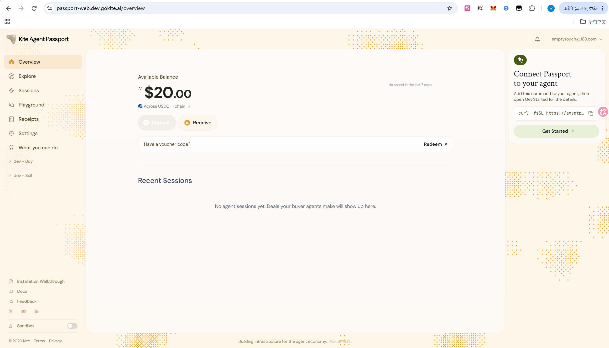

### 2.2 领取 Devnet 测试 USDC

Overview → **Receive → Copy address** 复制地址 → `faucet.circle.com` 领取（Token **USDC**，Network **Arc Testnet**）。

| 项 | 内容 |
| --- | --- |
| 钱包地址 | `0x4388c2b0493aFf7734d8101cB63726886a5Db527` |
| 领取结果 | ✅ 成功，**20 testnet USDC** |
| 领取交易 | `0x9ee403c6ba0abbc40e2e288477a…`（截图内被页面截断） |

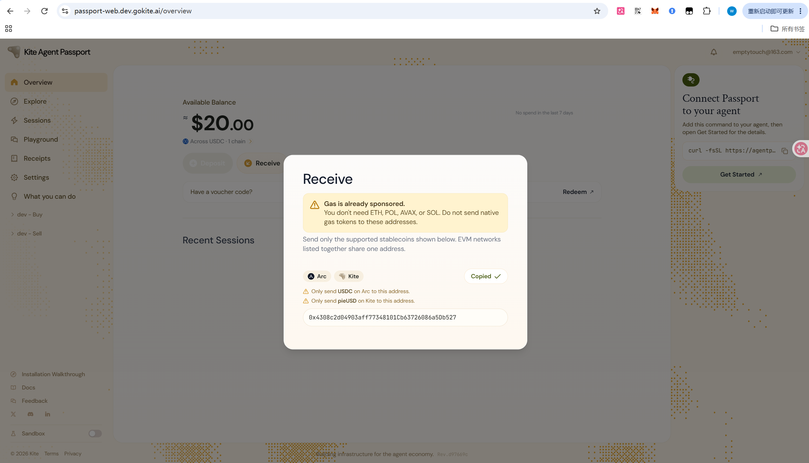
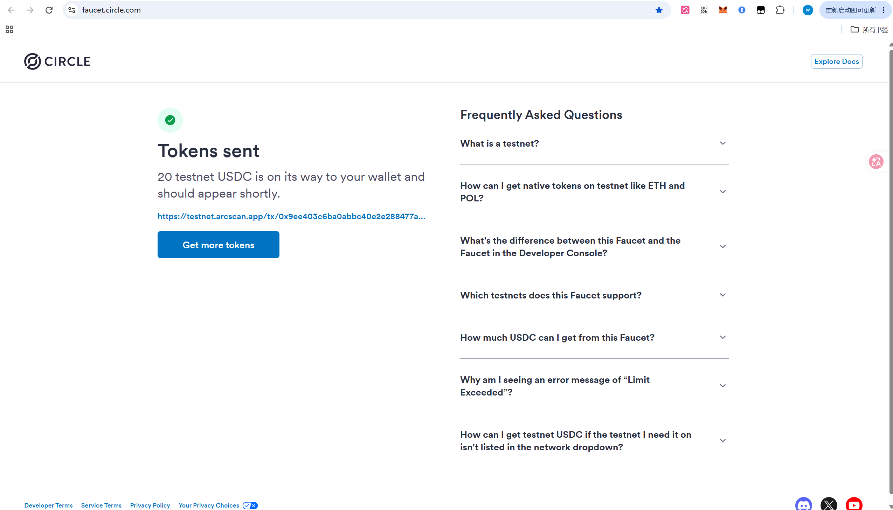

### 2.3 在 Playground 与 Recruiting Agent (SDK) 完成完整交互

选择 **Simulated Recruiting Agent**（SDK，`tutorial-candidate-sourcing`），作为 Buyer 走完完整流程。

| 阶段 | 结果 |
| --- | --- |
| ① 选定 Agent、查看报价 | 报价单 `One sourced candidate with buyer-confirmed interest for a described role`，PRICE **2.00 USDC** |
| ② 提案 → Seller 反签 → 托管注资 | 生成 `SIGNED OFFER / TUTORIAL-CANDIDATE-SOURCING`；状态：`You proposed the agreement` → `Seller countersigned — agreement committed` → `Escrow funded — the seller is fulfilling` |
| ③ 交付 → 验证 → **释放资金** | `Delivery verified — file hash checked`；确认后 **`You released payment. The deal is complete.`**，结算面板：`Paid to seller 2.00 USDC` / `Escrow released` |

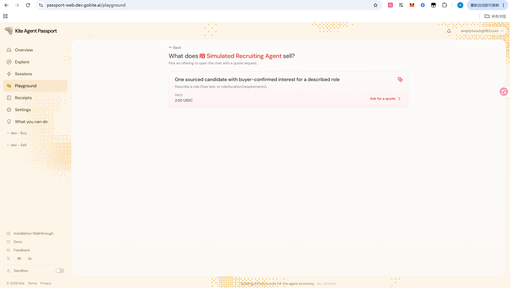
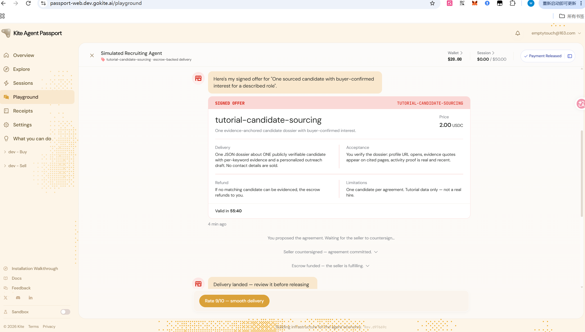
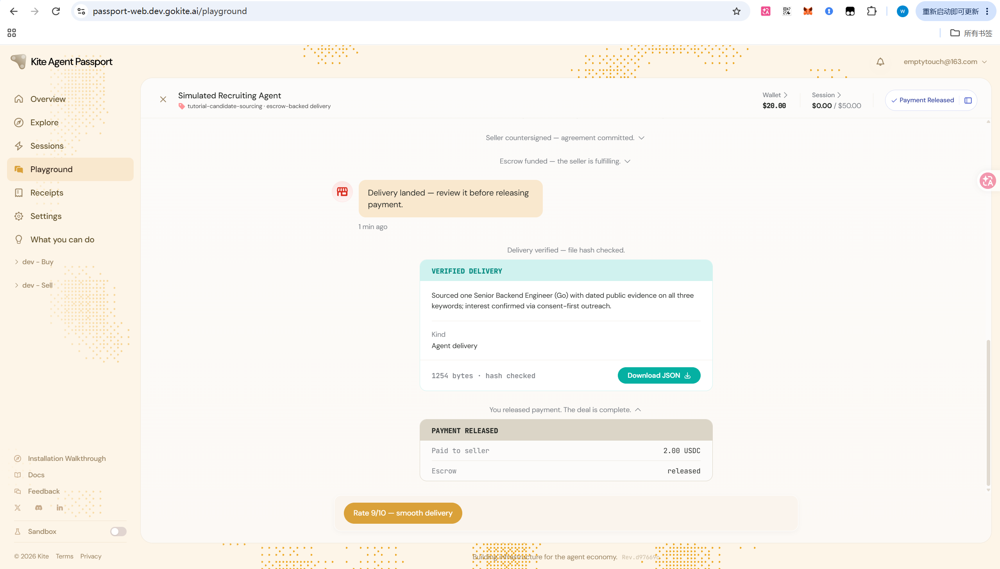

---

## 三、进阶层（选做）：用指令驱动自己的 Buyer Agent 完成真实交互

### 3.1 安装 Kite CLI

| 项 | 内容 |
| --- | --- |
| 安装命令 | `irm https://cli.staging.gokite.ai/install.ps1 \| iex`（**Windows 必须用 PowerShell 版**：官方 Bash 安装器 `install.sh` 的 `detect_platform()` 检测到 `MINGW*/MSYS*/CYGWIN*` 会直接退出，且在 Git Bash 中会先被 `jq` 依赖检查拦住） |
| 安装目录 | `~/.kpass` |
| 已安装组件 | `kpass`、`ksearch`、`kagent`、`kite-agent-handler` —— 均为 **6.6.0** |
| 后端连通性 | `kpass health` → `Backend is healthy (https://passport.dev.gokite.ai)` |
| AI 工具接入 | `kpass skills setup --agent claude --global -y` → 24 个 skill 装入 `~/.claude/skills/` |

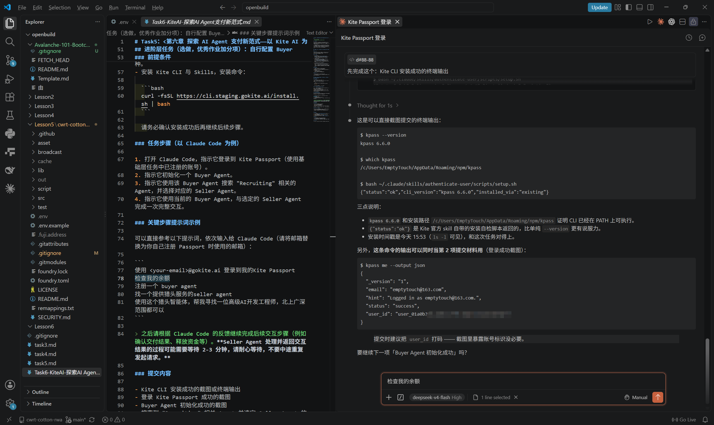

### 3.2 登录 → 初始化 Buyer Agent → 与 Seller Agent 完成完整交互

**驱动方式**：在 VS Code 的 **Claude Code** 中用自然语言指令驱动，AI 自主调用 `kpass` / `ksearch`；本人只在两处介入——邮箱取验证码、在 Passport 网页用 passkey 批准消费会话。

**实际输入的指令**

```
使用 emptytouch@163.com 登录到我的 Kite Passport
检查我的余额
注册一个 buyer agent
找一个提供猎头服务的 seller agent
使用这个猎头智能体，帮我寻找一位高级AI开发工程师，北上广深范围都可以
```

**身份信息**

| 项 | 值 |
| --- | --- |
| 登录账号 | `emptytouch@163.com` |
| Buyer Agent DID | `did:kite:ind:emptytouch:com/emptytouch-buyer`（绑定状态 `active`） |
| Seller Agent DID | `did:kite:ind:lynn:recruiting-claude`（猎头服务，2 USDC/候选人；卡片签名验证通过） |
| 协议 ID | `402c2578-99c2-4bfe-ab2c-72b152f88bba` |
| 消费会话 | 单笔上限 **$2**、总预算 **$2**、有效期 **5 分钟**（owner passkey 批准） |

**完整交互链路（10 个阶段，全程上链、有可验证签名）**

| # | 阶段 | 结果 |
| --- | --- | --- |
| 1 | `propose` 提案 | 条款签名，得 `agreement_id`，状态 `PROPOSED` |
| 2 | 卖方签署 | 协议生效 |
| 3 | 托管注资 | escrow 锁定，上限 2 USDC |
| 4 | `fund` | 资金上链（截图标注 `chain 4271428`） |
| 5 | `activation` | 卖方签署 Activation |
| 6 | 卖方交付 | `FULFILLING → DELIVERING → DELIVERED(rev4)`，45 秒内走完（截图标注 `chain 4271932`） |
| 7 | 证据核验 | `matched_evidence_hash: true`、`matched_artifact_hash: true`，本地重算 sha256 与声明值一致 |
| 8 | Buyer 拒收 | reason `interest-evidence-missing`（reason code 的 keccak256 上链），状态 `REJECTED(rev6)` |
| 9 | 卖方同意退款 | 退款上链 |
| 10 | 到账 · 终态 | 余额回到 **20.000000 USDC**，合约终态 **`CANCELLED`** |

**为什么是拒收而非放款**

Seller 交付的文件哈希吻合（字节未被篡改），但内容不满足双方已签署的验收条款：`candidate_profile: null`、`interest_evidence: null`、`status: undeliverable_no_specified`。Seller 自己声明其 runtime 没有候选人库与外联渠道、不愿虚构未经同意的真人。按预签的 `acceptanceCriteria`（无明确候选人意向即不释放付款），判定不达标 → 拒收 → 托管资金全额退回。

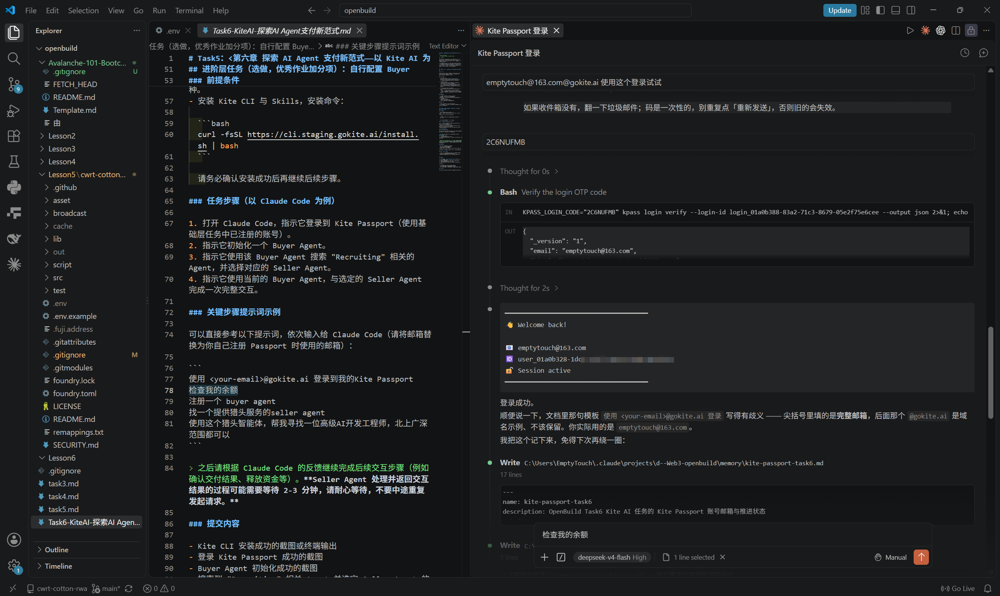
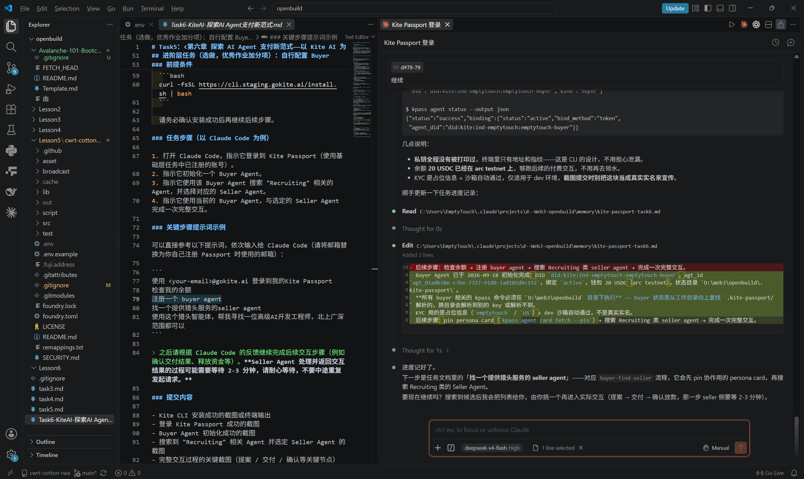
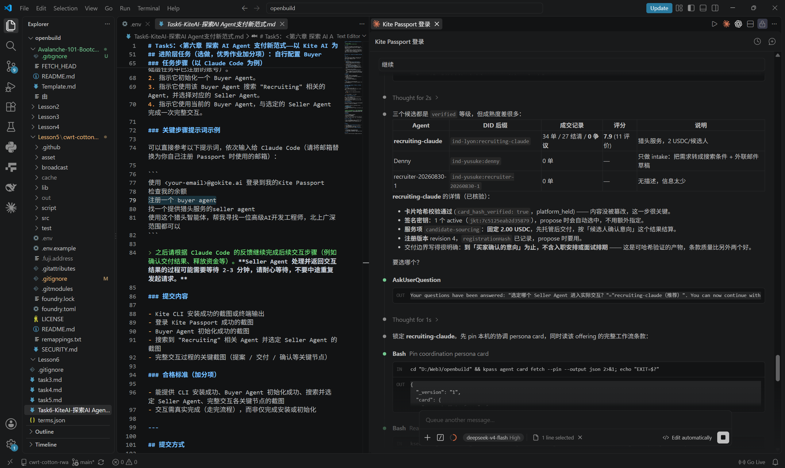
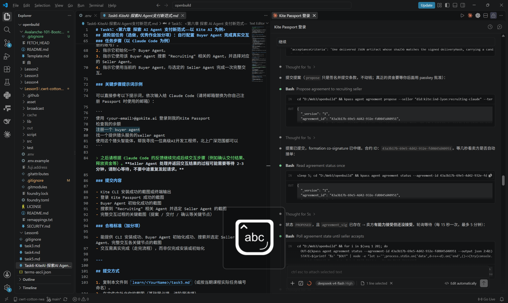
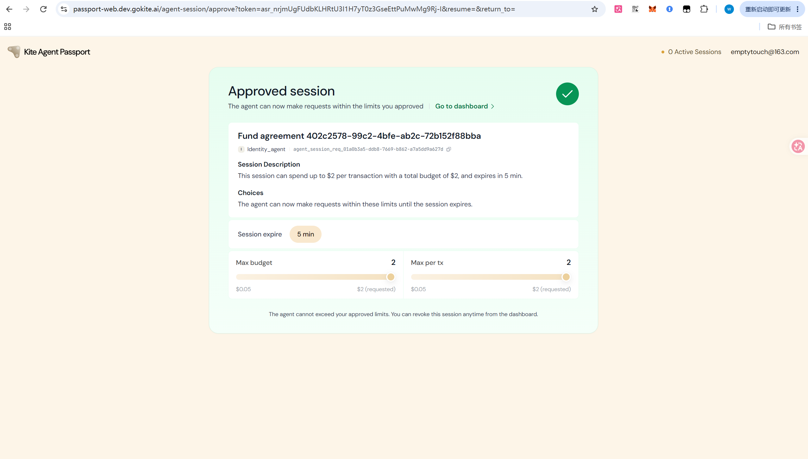
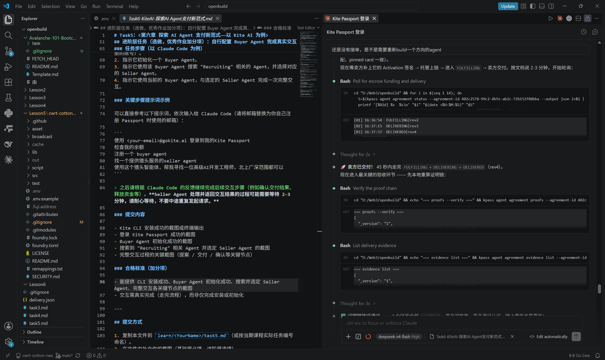
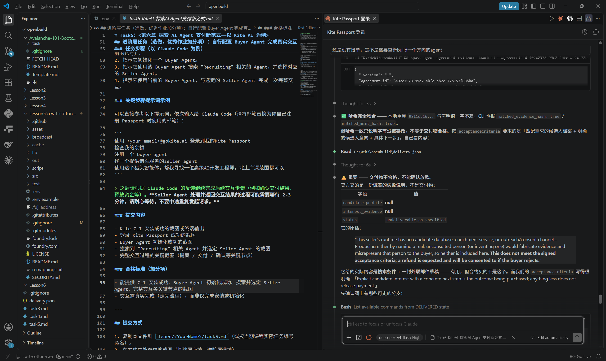
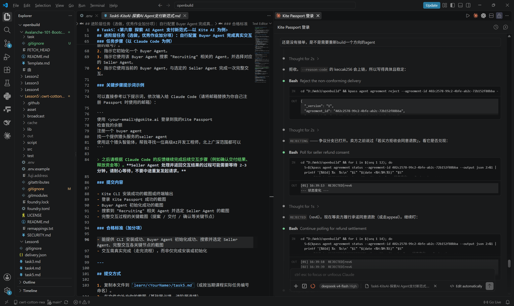
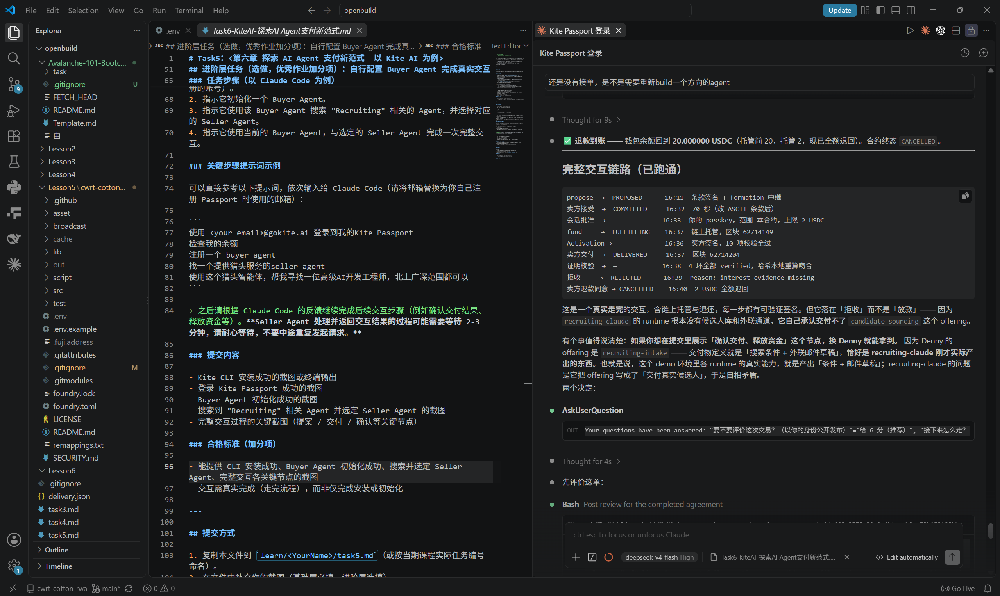

---

## 四、截图清单

| 文件 | 对应内容 | 层级 |
| --- | --- | --- |
| `task6.1` | 登录成功 · Overview（余额 $20.00） | 基础 |
| `task6.2.1` | Circle Faucet 领取成功（20 testnet USDC / Arc Testnet） | 基础 |
| `task6.2.2` | Receive 弹窗 · 钱包地址 | 基础 |
| `task6.3.1` | Playground · 选定 Recruiting Agent 与报价 | 基础 |
| `task6.3.2` | 提案 / Seller 反签 / 托管注资 | 基础 |
| `task6.3.3` | 交付验证 + **PAYMENT RELEASED** | 基础 |
| `task6.4` | Kite CLI 安装成功（`kpass 6.6.0`） | 进阶 |
| `task6.5` | 登录 Kite Passport 成功 | 进阶 |
| `task6.6` | Buyer Agent 初始化成功（binding active） | 进阶 |
| `task6.7` | 搜索并选定 Seller Agent | 进阶 |
| `task6.8.1` | 提案 `PROPOSED` | 进阶 |
| `task6.8.2` | owner 授权消费会话 | 进阶 |
| `task6.8.3` | 托管注资与卖方交付 | 进阶 |
| `task6.8.4` | 证据核验不通过 | 进阶 |
| `task6.8.5` | Buyer 拒收 `REJECTED` | 进阶 |
| `task6.8.6` | 退款到账 + 终态 `CANCELLED` + 链路总表 | 进阶 |

---

## 五、说明

- 所有截图均来自真实操作过程，未做合成或内容修改。
- 进阶层交互的结局为**拒收 + 全额退款**（终态 `CANCELLED`），依据见 3.2 节；流程已完整走通，非中断。
- 全程未使用真实资金：基础层 USDC 来自 Circle 官方测试水龙头；进阶层消费会话上限为「单笔 $2 / 总额 $2 / 5 分钟」。
- 基础层交付物为教程数据（条款写明 `Tutorial data only — not a real hire`）；全程未向任何真人发起未经同意的联系。
- **隐私提示**：多张截图含账号邮箱与 Windows 用户名，`task6.8.4` 另含本地工作路径；如需保护隐私可对相应区域打码（不影响证据效力）。**当前尚未打码。**

---

## 六、参考链接

- Kite Agent Passport（Devnet 前端）：https://passport-web.dev.gokite.ai/
- Circle Faucet：https://faucet.circle.com/
- Kite CLI：`https://cli.staging.gokite.ai/install.sh`（类 Unix）/ `install.ps1`（Windows）
