# Task 7 交付说明（Mini-DEX）

**结论：必做 3 项全部完成（60 分）；进阶 6 项全部完成（8 + 10 + 8 + 8 + 10 + 8 = 52 分，按「最多 40 分」上限计分）。**

本文件按 `task7.md` 的条目顺序编排，每一条都附可复现的命令或可在 Snowtrace 上核对的链上数据。
文中所有地址、哈希、余额、区块号均为**实测值**（2026-09-23 从 Fuji RPC 与本地 SQLite 读取），不是示例。

---

**仓库**：<https://github.com/emptytouch/Mini-DEX>

**提交记录**（`emptytouch` 的 3 笔为本次 task7 作业提交）：

| SHA | 日期 | 作者 | 提交说明 | 对应交付 |
|:--:|---|---|---|---|
| `af803e1` | 2026-09-23 | emptytouch | docs: 功能完善说明、交付说明、操作手册、安全审查报告 | 文档（DELIVERABLES / RUNBOOK / SECURITY-REVIEW） |
| `0cd5cdc` | 2026-09-23 | emptytouch | feat(server): 时间优先与自成交防护、IOC/FOK、做市、WS 私有频道、SQLite 落库 | 必做 1 + 进阶 4.1 / 4.3 / 4.5 / 4.6 |
| `1e7e314` | 2026-09-23 | emptytouch | feat(contracts): Vault 增加单笔提现限额与金库偿付校验 | 必做 2 + 进阶 4.4 |

---

## 一、必做 1：撮合引擎（20 分）

### 1.1 `npm test` 全部通过

**61 个用例，7 个测试文件，全绿。**

```
✓ src/fixed.test.ts            ( 4 tests)
✓ src/ledger.test.ts           ( 3 tests)
✓ src/marketmaker.test.ts      ( 9 tests)
✓ src/engine/orderbook.test.ts (24 tests)
✓ src/auth.test.ts             ( 3 tests)
✓ src/ws.test.ts               ( 6 tests)   ← 进阶 4.5 私有 orders 频道
✓ src/store.test.ts            (12 tests)   ← 进阶 4.6 持久化 + 提现重复扣款回归

Test Files  7 passed (7)
     Tests  61 passed (61)
```

复现：`cd server && npm test && npm run typecheck`

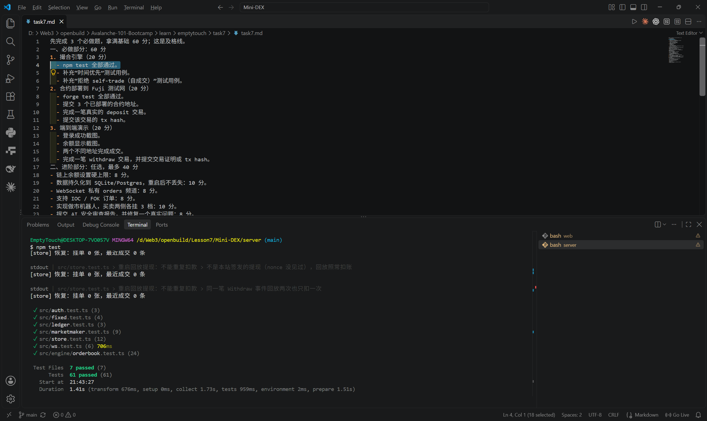

### 1.2 补充「时间优先」测试用例

作业要求「加一个」，实际加了两个，覆盖同价多 maker 的两个方向：

| 用例 | 位置 | 断言 |
|---|---|---|
| `时间优先：同价 FIFO` | [orderbook.test.ts:57](../server/src/engine/orderbook.test.ts#L57) | 同价先挂的 `a` 先成交 |
| `时间优先：买侧同价多 maker 按提交顺序被吃` | [orderbook.test.ts:147](../server/src/engine/orderbook.test.ts#L147) | 3 个同价卖单，市价买 2 个，按 `a → b` 顺序成交 |

撮合规则：先比价格（买高者优先 / 卖低者优先），价格相同再比挂单时间（`seq` 递增）。成交价一律取 **maker 的挂单价**。

### 1.3 补充「拒绝 self-trade」测试用例

| 用例 | 断言 |
|---|---|
| `拒绝 self-trade：同地址的挂单不会被自己成交` | alice 自己买自己的卖单 → 0 成交；bob 来买才成交 |
| `拒绝 self-trade：market 单也不会吃自己的挂单` | 市价单同样跳过自己的挂单 |
| `拒绝 self-trade：整档都是自己的单时跳过该档，继续吃下一档` | 卖一全是 alice 的、卖二是 bob 的 → alice 出价 105 应吃到 bob 的 101 |
| `拒绝 self-trade：同档混合时跳过自己的单，别人的单按时间优先` | 同档 `alice, bob, carol`，alice 来买 → 吃 bob 再吃 carol，且顺序不乱 |

> **顺带修掉了一个真实缺陷。** 原实现用 `break outer` 处理「整档都是自己的单」，会直接**终止整个撮合循环**：alice 自己的 `sell@100` 会挡住她 `buy@105` 去吃 bob 的 `sell@101`，一次成交都发生不了。改成按下标遍历价位、整档是自己的就 `pi++` 跳到下一档。回归用例就是上表第 3 条，详情见 [SECURITY-REVIEW.md](SECURITY-REVIEW.md) 问题 1。

---

## 二、必做 2：合约部署到 Fuji 测试网（20 分）

### 2.1 `forge test` 全部通过

```
Suite result: ok. 22 passed; 0 failed; 0 skipped
```

复现：`cd contracts && forge test`

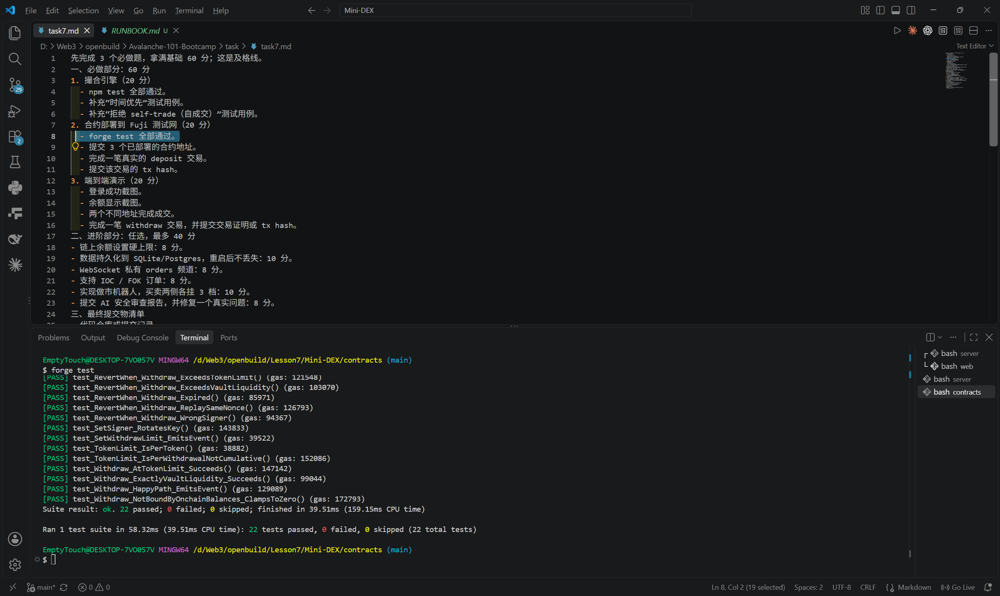

### 2.2 三个合约地址（Avalanche Fuji，chainId 43113）

| 合约 | 地址 | Snowtrace |
|---|---|---|
| `Vault` | `0xBf448A2b6D987BCbA9591E6f72D0156Bef1503f0` | [查看](https://testnet.snowtrace.io/address/0xBf448A2b6D987BCbA9591E6f72D0156Bef1503f0) |
| `MockERC20` USDC（6 位小数） | `0xb268B7f56726b9256ffF6C27F90513238360aBA7` | [查看](https://testnet.snowtrace.io/address/0xb268B7f56726b9256ffF6C27F90513238360aBA7) |
| `MockERC20` WAVAX（18 位小数） | `0x9497e2f5438d8aE167b0BA5B9bC328D03e4E1204` | [查看](https://testnet.snowtrace.io/address/0x9497e2f5438d8aE167b0BA5B9bC328D03e4E1204) |

- 部署区块：`58552276`（`OwnershipTransferred` 在 `58552279`，owner 转为本人钱包）
- 部署者 / `Vault.owner`：`0xA0b760DCb7561B30E728170Ce58f4df2D2843D63`（本人钱包，非公开测试键）
- 后端签名地址（`Vault.signer`）：`0xa00551d66d5a3c059ACf0770C6F9B966731FC8Da`

`cast call` 实测的链上状态：

```
owner()             = 0xA0b760DCb7561B30E728170Ce58f4df2D2843D63   ✅ 本人钱包
signer()            = 0xa00551d66d5a3c059ACf0770C6F9B966731FC8Da   ✅ 与 server/.env 一致
allowedTokens(USDC) = true
allowedTokens(WAVAX)= true
withdrawLimit(USDC) = 0    （0 = 不限；演示 4.4 时曾设为 50，已还原）
withdrawLimit(WAVAX)= 0
```

### 2.3 真实的 deposit 交易

链上共 8 笔 `Deposit`（全部可在 Snowtrace 核对）：

| 交易哈希 | 谁 | 金额 | 区块 |
|---|---|---|---|
| **`0x288b51395c278c283c8d61107bf98f19ef710a6b28bfb9fd97bae41ebbc65a19`** | A | **5000 USDC** | `58624501` |
| `0x82e1d1addd342d45d7f7d5b1bb8dcc98c4e6506260c814c83eb110fb09ebbbd6` | A | 500 USDC | `58624371` |
| `0xfe72fe14578eeffd47f4d94999ef596504b85da2b132d44e9412e8d6bd9f8b5a` | B | 500 USDC | `58623244` |
| `0x121a6e175bfd1a09ea77f8bb20ad95f42126489893eeb49988948849a88ed99e` | A | 500 USDC | `58622977` |
| `0xb8796ebb7714bf440c471e40d14b74f5b8ef45f7bf287fd16f6e0c5ec330ea3b` | A | 500 USDC | `58552318` |
| `0xe73242d1d17ca7e2b270ec04da10b20594f343fe7963e31f11f373ef19f5040e` | A | 5 WAVAX | `58552325` |
| `0x451e493908e5e55e8a0f806dcbb845ea91813ef5e5bd5f9c74b2ac79cd1f6ae3` | B′ | 500 USDC | `58552333` |
| `0xd59680ab0a790a8693850ed2388182843efc35868fb73a7eff8aefad6c7d71bf` | B′ | 5 WAVAX | `58552338` |

> 取 `0x288b5139…` 作为提交的 deposit tx hash：金额最大、最近、且由本人钱包（也是 Vault owner）发起。
> `B′` = `0x90F79bf6EB2c4f870365E785982E1f101E93b906`，是本机 anvil 账户在早期联调时用的；保留在表里是为了账目完整。

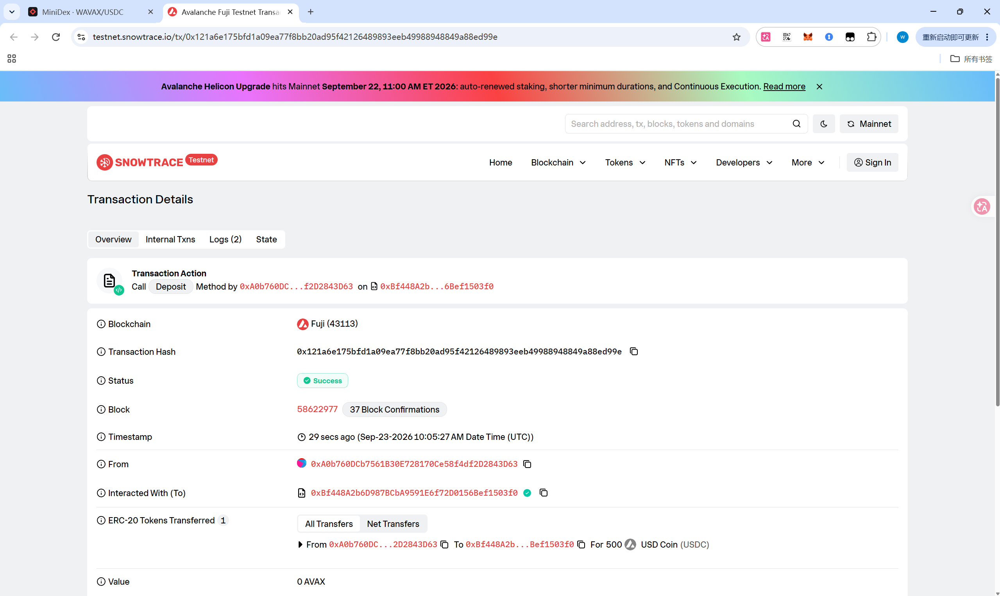

**账目自洽校验**（这条比单个哈希更能说明问题）：

```
链上 Deposit 合计  USDC 7500 / WAVAX 10
链上 Withdraw 合计 USDC  490 / WAVAX  1
净流入金库         USDC 7010 / WAVAX  9
金库实测 balanceOf USDC 7010 / WAVAX  9   ✅ 完全吻合
```

### 2.4 部署方式

```bash
# 1. 把已充好 AVAX 的私钥填进 contracts/.env 的 PRIVATE_KEY（该文件已 gitignore）
# 2. 一键部署，脚本会自动查余额、记录部署区块、打印待粘贴的 env 行
bash scripts/deploy-fuji.sh
```

---

## 三、必做 3：端到端演示（20 分）

演示用两个 MetaMask 账户，都是真实钱包地址：

| 角色 | 地址 | 说明 |
|---|---|---|
| **账户 A** | `0xA0b760DCb7561B30E728170Ce58f4df2D2843D63` | 部署者 / Vault owner |
| **账户 B** | `0x9750Af96716784390A76420312D57fdadEB4B988` | 第二个账户 |

### 3.1 登录成功（截图）

EIP-712 `Login` 结构签名换 JWT（`personal_sign` 风格，不花 gas）。

**📸 截图**：顶栏同时拍到钱包地址 + 「已登录」状态。

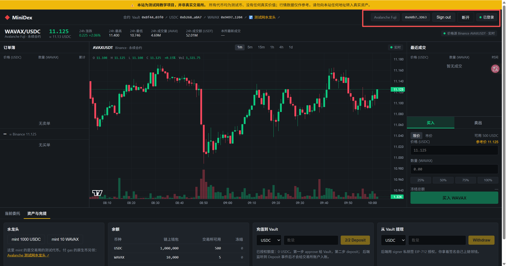

### 3.2 余额显示（截图）

由后端监听 `Vault.Deposit` 事件记入链下账本。当前实测余额：

```
账户 A   USDC 5683.76751350（锁 0）      WAVAX 29.499（锁 1.0000）
账户 B   USDC  488.805      （锁 0）      WAVAX  1.0000（锁 0）
```

两个数字都能对上账：

- **B 的 WAVAX = 1.0000**，而 B 从未充值过 WAVAX —— 这一枚是买来的；
- **B 的 USDC = 500 − 11.195 = 488.805**，正好等于下面那笔成交的成交额。

**📸 截图**：余额表里 USDC / WAVAX 的「可用 + 冻结」两栏。

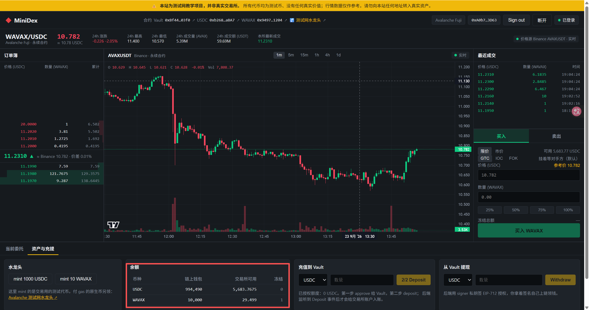

### 3.3 两个不同地址完成一笔成交

| 项 | 值 |
|---|---|
| 时间 | 2026-09-23（B 充值 USDC 后 4.6 秒） |
| 挂单方（maker） | 账户 A，限价卖 `11.195` |
| 吃单方（taker） | 账户 B，市价买 |
| 成交量 | `1.0000 WAVAX @ 11.195 USDC` |

成交前后 B 的余额变化完全对得上：`500 → 488.805 USDC`（−11.195）、`0 → 1.0000 WAVAX`（+1）。

> **这项要以截图为准。** 作业要求的是「两个不同地址完成成交」的**截图**，所以请在浏览器里按
> RUNBOOK §8 用 A 挂单、切到 B 市价买入，把「最近成交」列表和订单簿拍进同一张图。
> 上面这条记录是同一套流程在链下账本里留下的、可供交叉核对的痕迹。
>
> **注意**：做市模块开着时价差只有 1 个 tick，用户单会被做市账户抢先吃掉，演示不出两个真实地址互成交。
> 这一步必须在 `MARKET_MAKER=`（关掉做市）的实例上做。

**📸 截图**（按成交时序，三张连起来看）：

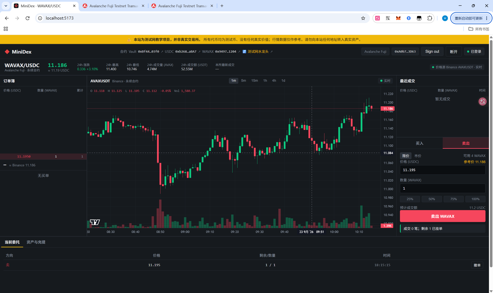

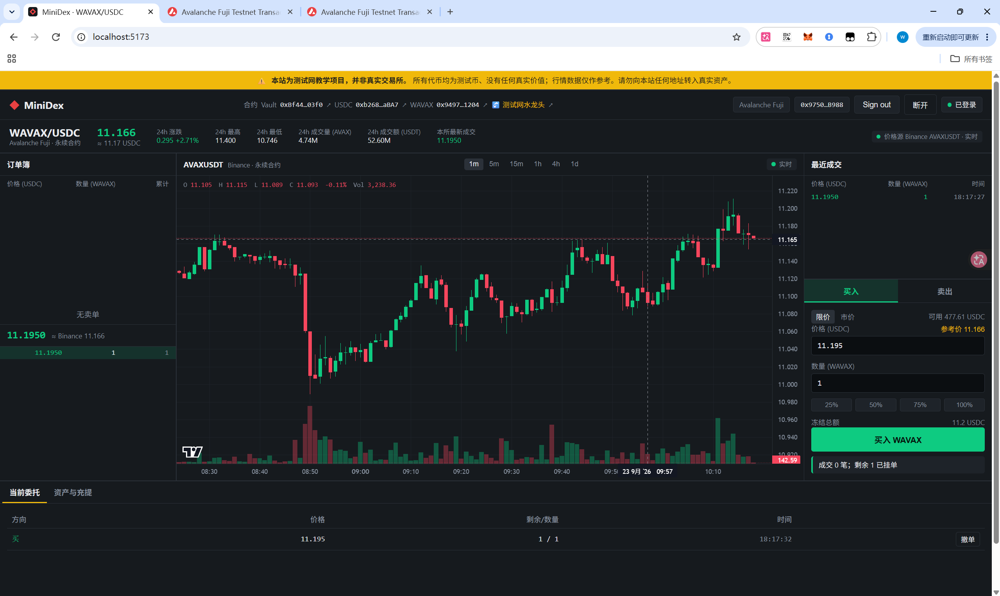

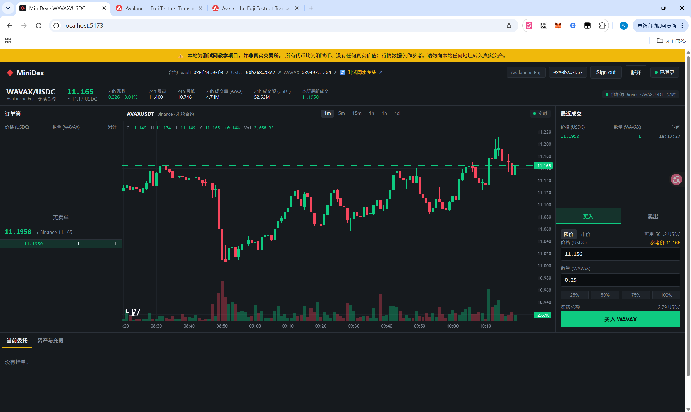

### 3.4 withdraw 交易

链上共 3 笔 `Withdraw`：

| 交易哈希 | 谁 | 金额 | 区块 | 备注 |
|---|---|---|---|---|
| **`0x14bc8b70bb4c43daae00fbe7635b52124472dea9ed27f8c5cf9cc7ce5df43b69`** | A | **40 USDC** | `58624589` | **在单笔限额 50 之下提的（见 §4.4）** |
| `0x1801b319e5a432f89d04ceff65c2dc505b26a437b595b27e276528d7f5fcb968` | A | 450 USDC | `58623051` | 常规提现 |
| `0x5128e47a19e4f43f3be3f2c95bc8251aa43cc9b6c0aafad3bd7073dcde676469` | B′ | 1 WAVAX | `58552339` | 早期联调 |

> 取 `0x14bc8b70…` 作为提交的 withdraw tx hash：它是在「单笔限额 50 USDC」生效期间提的 40 USDC，
> 一笔交易同时证明了「提现能上链」和「限额被正确执行」。

流程：链下扣账 → 后端签 EIP-712 `Withdraw` 授权 → 用户自己调 `Vault.withdraw` 上链。

**📸 截图**：提现卡片 + 交易成功状态 + Snowtrace 交易详情页。

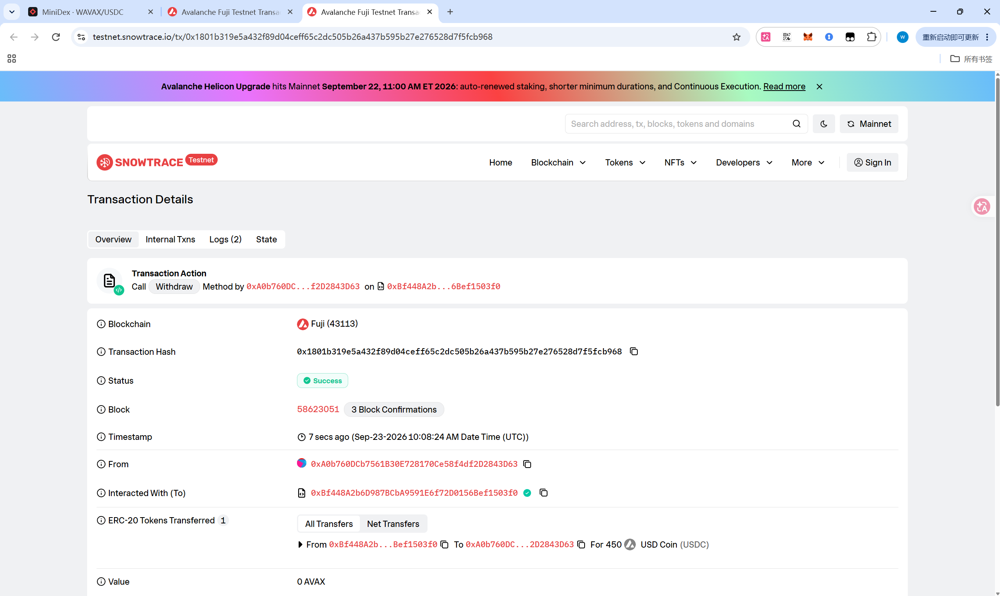

---

## 四、进阶项（6 项全做；按「最多 40 分」上限计）

### 4.1 做市机器人：买卖两侧各挂 3 档（10 分）

`MARKET_MAKER=1 MM_LEVELS=3`，每 2 秒拉一次 Binance 的 `AVAXUSDT` 盘口，镜像到本所订单簿（增量撤旧单 / 挂新单）。

实测逐档价格比对（`node scripts/mm-compare.mjs`，脚本会自动重抓直到对齐做市刷新时刻）：

```
第 1 次抓取：0/3 档一致，最大价差 0.0040
第 2 次抓取：3/3 档一致，最大价差 0.0000

档位 |  本所买 / Binance买   |  本所卖 / Binance卖
 1   |  11.225 / 11.22500000 |  11.226 / 11.22600000   ✅
 2   |  11.224 / 11.22400000 |  11.227 / 11.22700000   ✅
 3   |  11.223 / 11.22300000 |  11.228 / 11.22800000   ✅
```

**关于「第 1 次对不上」**：本所盘口是每 2 秒镜像一次的**快照**，不是实时转发；脚本问的是 Binance **此刻**的盘口。
两者天然差最多一个刷新间隔，所以行情在动时第 1 次会有价差（上例 0.0040 ≈ 两个 tick，买卖两侧同向偏移，
这是「快照时差」的特征，而非镜像错误）。脚本会等本所刚刷新后的瞬间再抓一次，通常第 2 次即全绿。
另外本所价格去掉尾随 0（`11.22`）、Binance 固定 8 位小数（`11.22000000`），是同一个价，脚本按数值比较。

- 代码：`server/src/marketmaker.ts`；单元测试 9 个（`marketmaker.test.ts`），覆盖增量挂撤、余额封顶 `capByBalance`、REST 主机故障转移。
- 数量按 `MM_SCALE`（默认 5%）缩放，并夹在 `MM_MIN_QTY ~ MM_MAX_QTY` 之间。

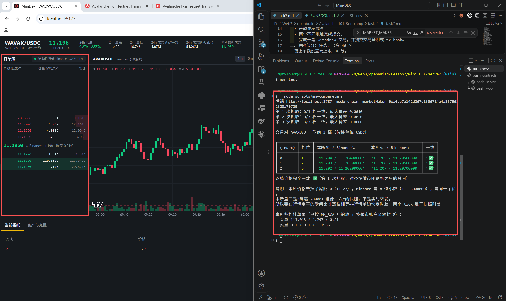

### 4.2 AI 安全审查 + 修复一个真实问题（8 分）

报告：**[SECURITY-REVIEW.md](SECURITY-REVIEW.md)** —— 7 个发现，其中 **3 个已修复**（要求是修复 1 个）：

| # | 发现 | 严重度 | 状态 |
|:--:|---|:--:|:--:|
| 1 | 自成交防护会中断整个撮合（见 §1.3） | 高 | **已修复** + 回归用例 |
| 2 | `/auth/nonce` 未登录即可无限堆积 → 内存 DoS | 中 | **已修复** + 3 个用例 |
| 7 | 重启回放把同一笔提现**重复扣款** | 高 | **已修复** + 3 个用例 |
| 3 | `/withdraw` 先扣链下再上链，用户不提交则资金消失 | 高 | 仅报告（问题 7 已落第一步） |
| 4 | 做市账户虚拟注资 → 链下余额链上无抵押 | 高 | 由 §4.4 的偿付能力上限兜住 |
| 5 | `JWT_SECRET` 有可用默认值 | 高 | 仅报告 |
| 6 | 无限流 | 低 | 仅报告 |

**问题 7 是实测发现的，不是走查猜的**：对账时发现账本总额与「金库链上余额 + 做市虚拟注资」差了**恰好 40 USDC**，
而 40 正好是最后一笔提现的金额。根因是提现「先扣链下、后上链」，签发时拿不到 tx hash，没法用
`processed_events`（键是 `txHash:logIndex`）去重，于是重启回放又扣了一遍。修法是引入 `debited_nonces` 表按
后端自己生成的 nonce 认领。详见 [SECURITY-REVIEW.md §7](SECURITY-REVIEW.md)。


### 4.3 IOC / FOK 订单（8 分）

`Order` 增加 `tif: "GTC" | "IOC" | "FOK"`，`POST /orders` 透传并校验；前端下单面板有限期选择器。

- **IOC**：能成交多少成交多少，剩余立即作废（不挂单）。`market` 单默认就是 IOC。
- **FOK**：先做一次**无副作用的试算** `fillableQty()`，可成交量 < 下单量就整单作废、簿上一笔不动 —— 避免「先部分成交再回滚」的中间态。

7 个新用例（`orderbook.test.ts` 的 `IOC` / `FOK` 两个 describe）：IOC 部分成交后作废、IOC 完全吃不到、
market 默认 IOC、FOK 全额成交、FOK 流动性不足整单作废且簿无痕迹、FOK 不把够不着的价位算进可成交量、
FOK 也不吃自己的单。

前端实拍（下单面板的限期选择器，三种 TIF 各一张）：

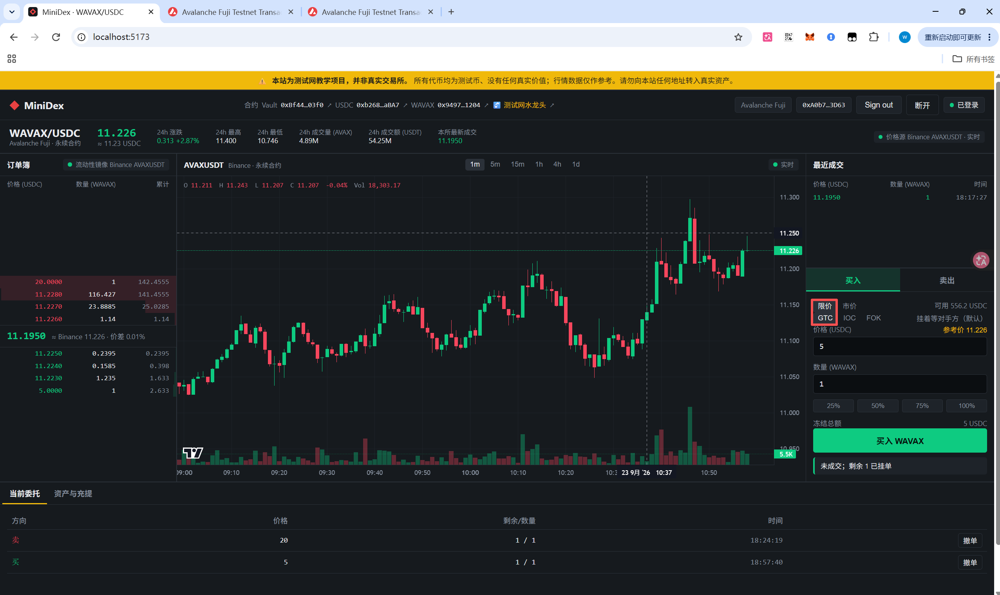

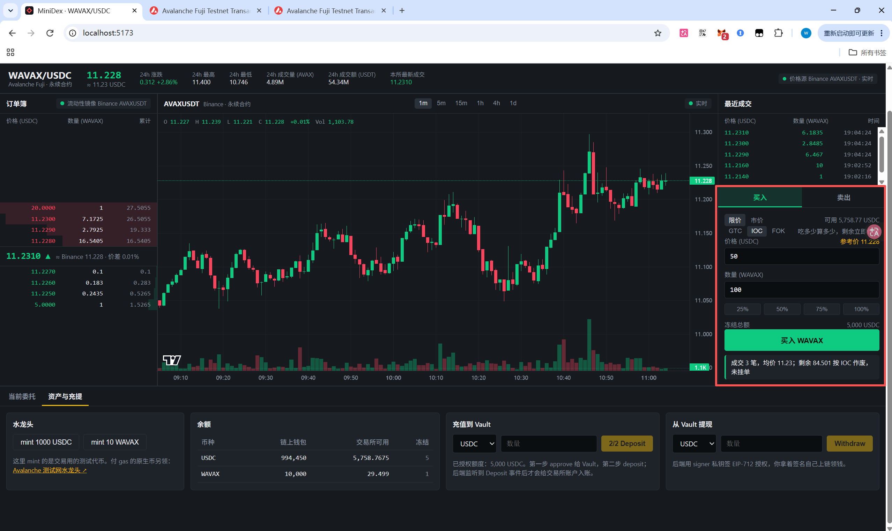

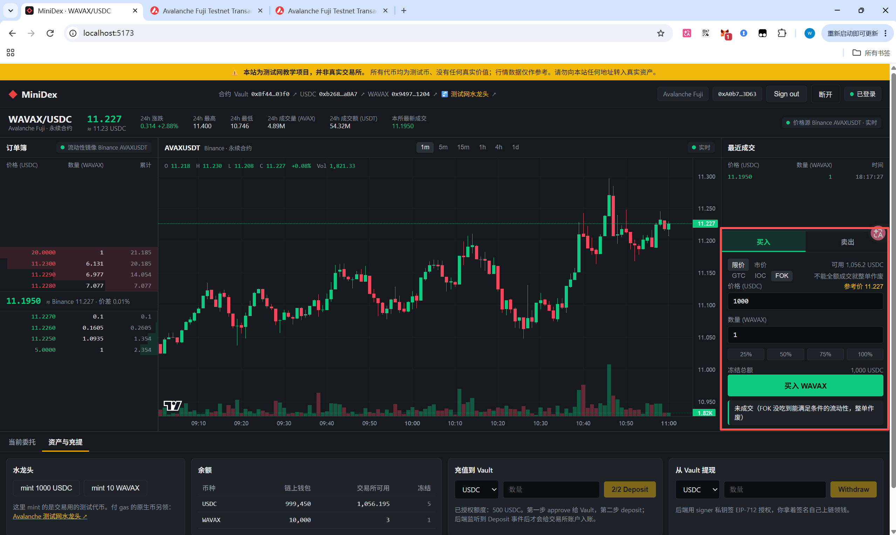

### 4.4 链上余额硬上限（8 分）

语义：**金库偿付上限 + 全局限额**（不做 per-user 链上 `balances` 封顶 —— 交易盈利在链上没有充值记录，按 per-user 封顶会让盈利取不出来）。

`contracts/src/Vault.sol` 在 `withdraw` 里加了两道 require：

```solidity
uint256 limit = withdrawLimit[token];
require(limit == 0 || amount <= limit, "Vault: exceeds token limit");
require(IERC20(token).balanceOf(address(this)) >= amount, "Vault: insufficient vault liquidity");
```

外加 `setWithdrawLimit(address token, uint256 limit)`（`onlyOwner`，默认 0 = 不限）。

**服务端预检**：`/withdraw` 先 `chain.checkWithdrawable()`，通过了才 `ledger.debit()`。顺序不能反 —— 先扣再发现链上提不出来，用户两头落空。旧版 Vault 没有 `withdrawLimit` 时降级为「不限」并只警告一次。

**链上实测证据（Fuji，三笔连续交易）**：

| 交易哈希 | 事件 | 区块 |
|---|---|---|
| `0x1f2b23bb0367ebc2d96f433a2f57309e56a1718753d69a0c55fae6e75d9b5cf0` | `WithdrawLimitSet(USDC, 50000000)` = 50 USDC | `58624544` |
| `0x14bc8b70bb4c43daae00fbe7635b52124472dea9ed27f8c5cf9cc7ce5df43b69` | `Withdraw(A, USDC, 40)` → **限额内，放行上链** | `58624589` |
| `0x5c2aff559fd11eb0ab72e25d914d75b7080c6e58393519ebf8aad52bf4074fc9` | `WithdrawLimitSet(USDC, 0)` = 还原为不限 | `58624724` |

`forge test` 新增 9 个用例覆盖：超金库持币 revert 且 nonce 不消耗、正好等于持币可提、默认限额为 0、
超单笔限额 revert、等于限额可提、限额是「单笔」非「累计」、限额按代币分别计、非 owner 设置被拒、事件正确发出。

操作命令：`bash scripts/set-withdraw-limit.sh USDC 50`（不带参数则查当前限额）。


### 4.5 WebSocket 私有 orders 频道（8 分）

原来只有公共频道（`orderbook` / `trade` 广播给所有人）+ 私有 `balance`。这轮把**挂单**也做成私有推送。

服务端（`server/src/ws.ts`）：连接发 `{type:"auth", token}` 认证通过后

1. 立刻补发**这条连接自己的**余额 + 挂单快照（重连后不用额外 GET 就能自愈）；
2. 此后该地址的挂单变化（下单 / 被成交 / 撤单）由 `routes.ts` 主动推给**它自己的连接**。

隔离靠 `authed: Map<WebSocket, address>`，`sendTo()` 只遍历地址匹配的连接 —— 别人的连接、未认证的连接一条都收不到。地址比较统一小写；同一条连接重新认证会换绑地址。

前端（`web/src/lib/ws.ts` + `MyOrders.tsx`）：新增 `orders` 消息分支，`MyOrders` 优先渲染推送来的列表，
原来 3 秒一次的 `GET /orders` 轮询**降级为兜底**（只有在还没收到过推送时才轮询）。

**6 个用例**（`server/src/ws.test.ts`，起真的 http server + 真的 ws 连接，不是 mock）：

| 用例 | 验的是什么 |
|---|---|
| 认证通过后补发本人余额 + 挂单快照 | 私有快照只在认证后发，且查的是本人数据 |
| `sendOrders` 只推给该地址自己的连接 | **核心**：Bob 的连接和未登录连接的收件箱保持为空 |
| 大小写不同的地址算同一个人 | `0xABC…` 推给 `0xabc…` 认证的连接 |
| 改 token 重新认证会换绑地址 | 旧地址的推送不再送达 |
| 公共频道不受影响 | `orderbook` / `trade` 仍然发给所有人 |
| token 无效时 | 只回 `auth ok:false`，不发任何私有快照 |


### 4.6 SQLite 数据持久化（10 分）

用 Node 22.5+ **内置**的 `node:sqlite`（`DatabaseSync`），不引第三方依赖、不需要原生编译。
落库内容：账本余额、订单簿挂单、最近成交、链上事件游标、已扣款的提现 nonce。
默认写到 `server/data/mini-dex.sqlite`（已 gitignore），`DB_PATH=:memory:` 可退回纯内存。

**这一项顺带修掉了「重启后余额漂移」的老问题**（详见 §七）。

几个不那么显然的点：

- **bigint 存成十进制字符串**。SQLite 的 `INTEGER` 是 64 位，而 8 位定点的 WAVAX 数量很容易越过 `2^63`，存整数会静默截断。
- **挂单的冻结额不落库，恢复时算出来**：`买单价 × 剩余量`（卖单就是剩余量）。和 `placeOrder` 里的算法一致，省一张表也少一处不一致的可能。
- **恢复顺序有讲究**：先 load + restore，再做链上回放和做市注资。反了就会重复计账。做市账户的虚拟注资也加了 `ledger.has()` 判断 —— 只在账户不存在时注资，否则每次重启白送一份。
- **回放幂等**：每笔链上事件用 `txHash:logIndex` 记进 `processed_events`，且和余额写在**同一个事务**里。
- **提现要用 nonce 单独去重**（本轮的实测修复，见 §4.2 问题 7）。
- **Vite 5 不认 `node:sqlite`**（它自带的内置模块清单比这个模块早，还会先把 `node:` 前缀去掉再查表），所以 `store.ts` 里用 `createRequire` 在运行时加载，绕开打包器的静态分析；类型仍走静态 `import type`。

**12 个用例**（`server/src/store.test.ts`）：金额精度 roundtrip（`2^70`）、全量 roundtrip、空账户不落库、
事件去重、游标只前进，4 个**真·重启**用例（真 SQLite 文件 → 关掉 → 重开），以及 §4.2 问题 7 的 3 个回归用例。

| 重启用例 | 验的是什么 |
|---|---|
| 挂单 + 余额活过重启，恢复后撤单能正确解冻 | 冻结额重建算对了（撤单后 available 回到 10000） |
| 同价挂单的先后次序不变 | 时间优先没丢：重启后第三方吃单，先挂的先成交 |
| 最近成交也活过重启 | `trades` 环形缓冲落库 |
| 重启后新挂单排在老单后面 | `seq` 计数器从恢复的最大值继续，不会撞车 |
| 实时提现扣过的钱，重启回放不会再扣一次 | 走真实 `POST /withdraw` + 重开库 + 回放事件，余额必须仍是 60 |

另外跑了一次**真机重启验证**（起 server → 水龙头 → 挂单 → `taskkill` → 重启）：

```
[store] 恢复：挂单 1 张，最近成交 0 条
[before] balances = {"USDC":{"available":"9930","locked":"70"}}
[after]  balances = {"USDC":{"available":"9930","locked":"70"}}
[after]  orders   = [{"id":"14473578","price":"10","qty":"7","remaining":"7"}]   # 同一张单
cancelled -> 14473578
balances  -> {"USDC":{"available":"10000","locked":"0"}}                          # 冻结正确释放
```


---

## 五、链上数据核对表（全部实测，可逐条复核）

```
Vault           0xBf448A2b6D987BCbA9591E6f72D0156Bef1503f0   部署于区块 58552276
  owner()       0xA0b760DCb7561B30E728170Ce58f4df2D2843D63
  signer()      0xa00551d66d5a3c059ACf0770C6F9B966731FC8Da
  balanceOf     USDC 7010        WAVAX 9
  withdrawLimit USDC 0（不限）    WAVAX 0（不限）

链上事件合计     Deposit 8 笔 / Withdraw 3 笔 / WithdrawLimitSet 2 笔
                 Deposit  USDC 7500  WAVAX 10
                 Withdraw USDC  490  WAVAX  1
                 净流入 = 7010 USDC / 9 WAVAX  ✅ 与金库实测余额一致

账户 A 钱包      994490 USDC / 10000 WAVAX（链上）
账户 B 钱包      500 USDC / 0 WAVAX（链上）
```

---

## 六、复现清单

```bash
# 全部测试：61 个 server 用例 + 22 个合约用例
cd server    && npm test && npm run typecheck
cd contracts && forge test

# 前端
cd web && npm install && npm run dev     # http://localhost:5173

# 做市（进阶 4.1）：server/.env 里 MARKET_MAKER=1 MM_LEVELS=3，重启后端后
cd server && node scripts/mm-compare.mjs

# 链上余额硬上限（进阶 4.4）
bash scripts/set-withdraw-limit.sh            # 查当前限额
bash scripts/set-withdraw-limit.sh USDC 50    # 设单笔限额 50
bash scripts/set-withdraw-limit.sh USDC 0     # 还原为不限

# 持久化（进阶 4.6）
cd server
npm run dev                              # 默认落库到 server/data/mini-dex.sqlite
DB_PATH=:memory: npm run dev             # 退回纯内存（老行为，重启即丢）
rm -rf data && npm run dev               # 清库重来
```

---

## 七、已知边界（诚实交代）

1. **做市账户是虚拟注资**（`MM_SEED_USDC=100000` / `MM_SEED_WAVAX=10000`），链上没有对应的 `deposit`。
   因此账本总债权大于金库链上存量，极端情况下最后一个提现者会因金库不足被 §4.4 的第二道 require 拒绝
   （这是**有意的**：宁可拒绝，也不能让链下先扣、链上 revert 两头落空）。生产环境应让做市账户真实充值。

2. **提现超时未上链不会自动退款**。用户拿到授权后在 MetaMask 里拒绝，链下余额已扣、授权 10 分钟后过期，
   目前不会退回（[SECURITY-REVIEW.md](SECURITY-REVIEW.md) 问题 3）。问题 7 的修复已经落了「按 nonce 记录」
   这一步，自动退款仍未实现。

3. **盘中强杀进程**时，最后一次落库之后的成交会丢。落库是每次状态变更后同步做的，窗口极小；
   真要严格得上 WAL + 每笔成交一个事务 + 启动时对账。

4. **链上重组（reorg）没处理**：`processed_events` 记了 `txHash:logIndex`，但没记 `blockHash`，
   重组后的事件不会被撤销重放。

5. **当前库里有 40 USDC 的历史欠账**。§4.2 问题 7 那个重复扣款的缺陷在修复前已经在本机执行过一次，
   所以 A 的余额比实际少 40 USDC（`0x14bc8b70…` 那笔被扣了两遍）。这是**修复前**遗留的数据，
   不影响代码正确性。要对齐的话，停掉后端后执行：

   ```bash
   cd server
   node -e "
   const {DatabaseSync}=require('node:sqlite');
   const db=new DatabaseSync('./data/mini-dex.sqlite');
   const A='0xa0b760dcb7561b30e728170ce58f4df2d2843d63';
   const r=db.prepare(\"SELECT available FROM balances WHERE address=? AND asset='USDC'\").get(A);
   const fixed=(BigInt(r.available)+4000000000n).toString();   // +40 USDC（8 位定点）
   db.prepare(\"UPDATE balances SET available=? WHERE address=? AND asset='USDC'\").run(fixed,A);
   console.log('USDC',r.available,'->',fixed);
   db.close();"
   ```

   也可以不动 —— 40 USDC 是测试网代币，且不影响任何一条作业要求的证明。

---