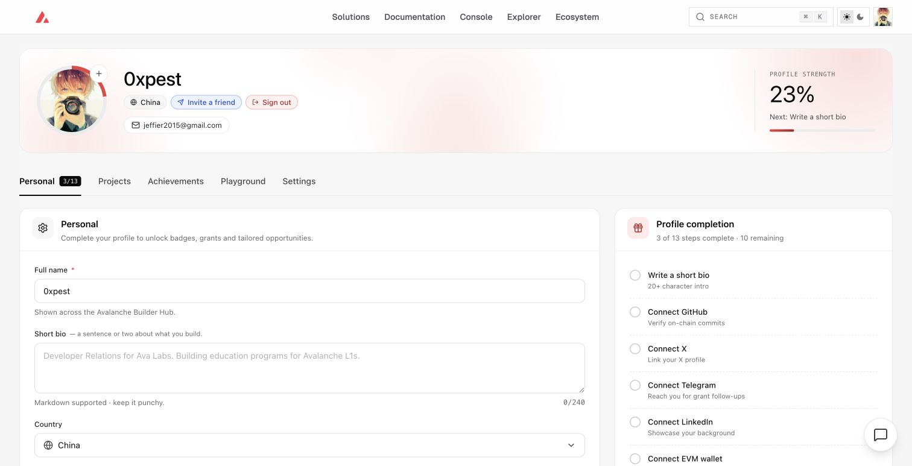
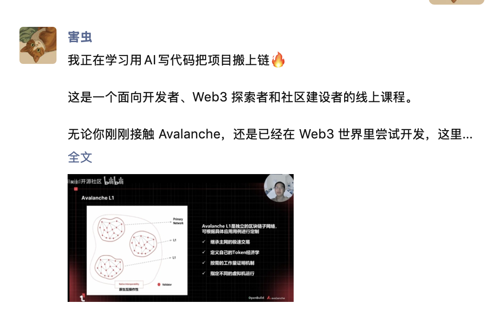

# Task 1：第一章 Avalanche 零基础入门知识

> 对应课程：第一章
> 截止提交：9 月 6 日 24:00:00（UTC+8）

## 任务一：注册 BuilderHub

注册地址：https://build.avax.network/?ref=ZETMV&utm_source=team1

## 任务二：转发课程报名链接

报名链接：https://luma.com/1b83zb0x

转发平台：微信朋友圈

## 学习收获

Avalanche 的 Primary Network 由 P-Chain、X-Chain 和 C-Chain 组成。其中 C-Chain 兼容 EVM，可以直接使用 Solidity、OpenZeppelin、Hardhat 等以太坊开发工具。Avalanche 还支持创建可定制验证者、Gas 机制和访问规则的 L1，能够适配 RWA、支付等对性能与合规有不同要求的场景。
