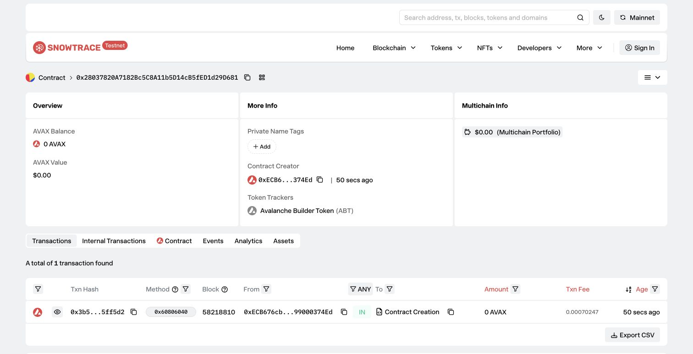

# Task 2：第二章 Vibe Coding 开发你的第一个 DApp

> 对应课程：第二章
> 截止提交：9 月 6 日 24:00:00（UTC+8）

## 任务成果

使用 Scaffold-ETH 2（Hardhat）和 OpenZeppelin Contracts 在 Avalanche Fuji 测试网部署 ERC20 合约。

| 项目 | 内容 |
| --- | --- |
| 网络 | Avalanche Fuji 测试网（chainId `43113`） |
| 合约名 | `AvalancheBuilderToken` |
| 代币 | Avalanche Builder Token（ABT） |
| 初始供应量 | 1,000,000 ABT（18 位小数） |
| 合约地址 | [`0x28037820A7182Bc5C8A11b5D14cB5fED1d29D681`](https://testnet.snowtrace.io/address/0x28037820A7182Bc5C8A11b5D14cB5fED1d29D681) |
| 部署交易 | [`0x3b5fd723a37d3f468c9a614b67ab8bc614ad6e3c40128a633cb10140b05ff5d2`](https://testnet.snowtrace.io/tx/0x3b5fd723a37d3f468c9a614b67ab8bc614ad6e3c40128a633cb10140b05ff5d2) |
| 部署区块 | `58218810` |
| 部署者 / Owner | `0xECB676cbBaab2d9dD22bb25781cce199000374Ed` |

## 合约功能

- 部署时向 Owner 铸造 1,000,000 ABT；
- Owner 可以通过 `mint(address,uint256)` 增发；
- 持币者可以通过 `burn(uint256)` 销毁自己的代币。

```solidity
contract AvalancheBuilderToken is ERC20, ERC20Burnable, Ownable {
    uint256 public constant INITIAL_SUPPLY = 1_000_000 ether;

    constructor(address initialOwner)
        ERC20("Avalanche Builder Token", "ABT")
        Ownable(initialOwner)
    {
        _mint(initialOwner, INITIAL_SUPPLY);
    }

    function mint(address to, uint256 amount) external onlyOwner {
        _mint(to, amount);
    }
}
```

## 部署成功截图



## 链上核验

```text
transaction status: success
name: Avalanche Builder Token
symbol: ABT
totalSupply: 1000000000000000000000000
owner: 0xECB676cbBaab2d9dD22bb25781cce199000374Ed
contract bytecode: 2387 bytes
```

## 测试

Scaffold-ETH 2 项目中的 3 项 Hardhat 测试全部通过，覆盖初始供应量与元数据、Owner 铸币权限和持币者销毁功能：

```text
AvalancheBuilderToken
  ✔ mints the initial supply to the owner
  ✔ allows only the owner to mint
  ✔ allows holders to burn their tokens

3 passing
```
