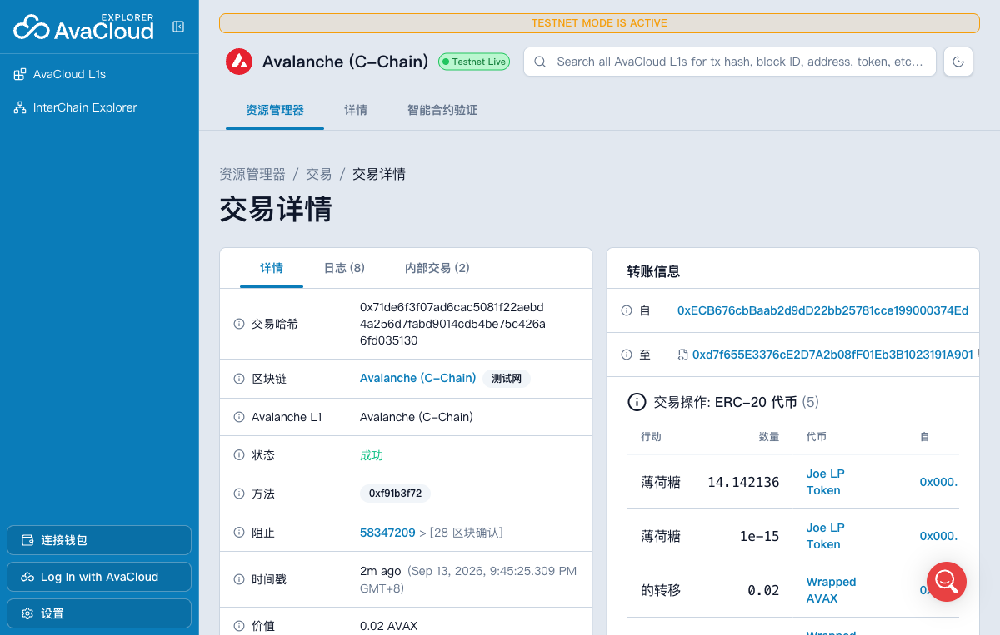
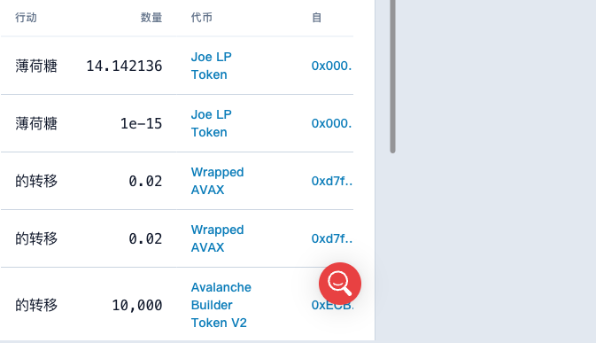
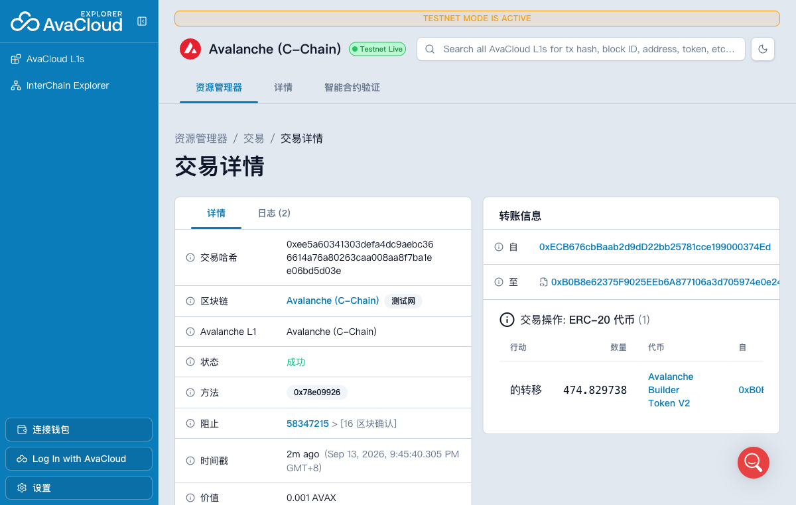

# Task 3：使用 DEX Oracle 获取代币价格

> 对应课程：第三章 Solidity 合约实战

## 任务成果

本任务使用 Avalanche Fuji 测试网上的 **LFJ（原 Trader Joe）V1**。我部署了 Task 2 代币的升级版本 `AvalancheBuilderTokenV2`，创建 `ABTv2/WAVAX` 交易对并添加真实流动性。合约通过 LFJ Router 的 `getAmountsOut` 获取实时 Swap 报价，`buyWithAVAX` 使用该报价计算并发送用户实际购买的 ABTv2 数量，价格没有手动写入。

| 项目 | 内容 |
| --- | --- |
| 网络 | Avalanche Fuji Testnet（chainId `43113`） |
| DEX | LFJ（Trader Joe）V1 |
| Token A | Avalanche Builder Token V2（ABTv2）[`0xB0B8...0e24`](https://subnets-test.avax.network/c-chain/token/0xB0B8e62375F9025EEb6A877106a3d705974e0e24) |
| Token B | Wrapped AVAX（WAVAX）[`0xd00a...A48c`](https://subnets-test.avax.network/c-chain/token/0xd00ae08403B9bbb9124bB305C09058E32C39A48c) |
| ABTv2/WAVAX Pair | [`0xA9fA...8a46`](https://subnets-test.avax.network/c-chain/token/0xA9fA1FC6C6bf9855c7E202EB8efF1b6436998a46) |
| LFJ V1 Router | [`0xd7f6...A901`](https://subnets-test.avax.network/c-chain/address/0xd7f655E3376cE2D7A2b08fF01Eb3B1023191A901) |
| LFJ V1 Factory | [`0xF5c7...7C2C`](https://subnets-test.avax.network/c-chain/address/0xF5c7d9733e5f53abCC1695820c4818C59B457C2C) |
| 部署者 / Owner | [`0xECB6...74Ed`](https://subnets-test.avax.network/c-chain/address/0xECB676cbBaab2d9dD22bb25781cce199000374Ed) |

## 链上交易

| 操作 | Fuji 交易 |
| --- | --- |
| 部署 ABTv2 | [`0xf1ab...ebda`](https://subnets-test.avax.network/c-chain/tx/0xf1ab70dd4303b7f01c6e1c98864e49777ac614bafe4abab6f0eb77beac63ebda) |
| 授权 LFJ Router | [`0x2ac3...99f3`](https://subnets-test.avax.network/c-chain/tx/0x2ac33c636125ca7976937a8adfc3db3db7af7c60d91fdd22dff02f8b7bee99f3) |
| 创建 Pair 并添加流动性 | [`0x71de...5130`](https://subnets-test.avax.network/c-chain/tx/0x71de6f3f07ad6cac5081f22aebd4a256d7fabd9014cd54be75c426a6fd035130) |
| 转入合约销售库存 | [`0xd04a...5db7`](https://subnets-test.avax.network/c-chain/tx/0xd04a0d72eb6ca7b8ec9ff49e03d2c528f04375ca7e9602744d28edf54eed5db7) |
| 使用 DEX 报价购买 | [`0xee5a...d03e`](https://subnets-test.avax.network/c-chain/tx/0xee5a60341303defa4dc9aebc366614a76a80263caa008aa8f7ba1ee06bd5d03e) |

添加流动性交易向 Pair 注入了 `10,000 ABTv2` 和 `0.02 WAVAX`，并向部署者铸造约 `14.142136` JLP。Pair 的两个 reserve 均非零。





## 获取 DEX Swap 价格的核心代码

`quoteTokensForAVAX` 将 WAVAX 和当前 ABTv2 组成兑换路径，直接调用 LFJ Router 获取报价。Router 根据真实 Pair reserves、0.3% 交易费和本次交易的价格影响计算输出数量。

```solidity
function quoteTokensForAVAX(uint256 avaxAmount) public view returns (uint256 tokenAmount) {
    if (avaxAmount == 0) revert ZeroInput();
    if (pair() == address(0)) revert PairUnavailable();

    address[] memory path = new address[](2);
    path[0] = wavax();
    path[1] = address(this);
    tokenAmount = ILFJRouter(dexRouter).getAmountsOut(avaxAmount, path)[1];
}
```

## 在实际业务中使用 DEX 价格

`buyWithAVAX` 使用上述实时报价决定买家收到的代币数量。函数同时检查用户设置的最小输出和合约销售库存，防止滑点超限或库存不足。

```solidity
function buyWithAVAX(uint256 minTokensOut)
    external
    payable
    nonReentrant
    returns (uint256 tokensOut)
{
    tokensOut = quoteTokensForAVAX(msg.value);
    if (tokensOut < minTokensOut) revert InsufficientOutput(minTokensOut, tokensOut);

    uint256 inventory = balanceOf(address(this));
    if (inventory < tokensOut) revert InsufficientInventory(inventory, tokensOut);

    _transfer(address(this), msg.sender, tokensOut);
    emit TokensPurchased(msg.sender, msg.value, tokensOut);
}
```

Demo 购买向合约支付 `0.001 AVAX`。当时 LFJ Router 返回 `474.829737581559270371 ABTv2`，合约随后向买家实际转出相同数量。合约现有 `0.001 AVAX` 收款余额，证明报价已经进入实际业务逻辑。



## 链上读取结果

```text
name: Avalanche Builder Token V2
symbol: ABTv2
owner: 0xECB676cbBaab2d9dD22bb25781cce199000374Ed
dexRouter: 0xd7f655E3376cE2D7A2b08fF01Eb3B1023191A901
pair: 0xA9fA1FC6C6bf9855c7E202EB8efF1b6436998a46
pair reserves: 10,000 ABTv2 / 0.02 WAVAX
spot price: 0.000002 AVAX per ABTv2
quote for 0.001 AVAX: 474.829737581559270371 ABTv2
```

ABTv2 和 WAVAX 都使用 18 位小数。报价函数直接传递 wei 数量并返回 ABTv2 最小单位，业务逻辑不需要使用浮点数，也不会因 decimals 换算丢失精度。

## 实现与测试说明

完整 Foundry 项目位于 [`learn/jeffierw/task3`](./task3)，包括合约、LFJ 接口、部署脚本和单元测试。部署脚本依次完成合约部署、Router 授权、流动性创建、销售库存注入和真实报价购买。

本地 `forge test` 共 5 项测试全部通过，覆盖：

- 初始供应量与 Owner；
- 报价来自 Pair reserves；
- `buyWithAVAX` 使用实时 DEX 报价；
- reserves 变化会改变购买数量；
- 最小输出滑点保护。

> 学习用途说明：AMM 即时价格可能被单笔交易操纵。生产环境应使用 TWAP、Chainlink 或价格偏离保护，不能直接把低流动性的 Spot Price 用于高价值业务。
