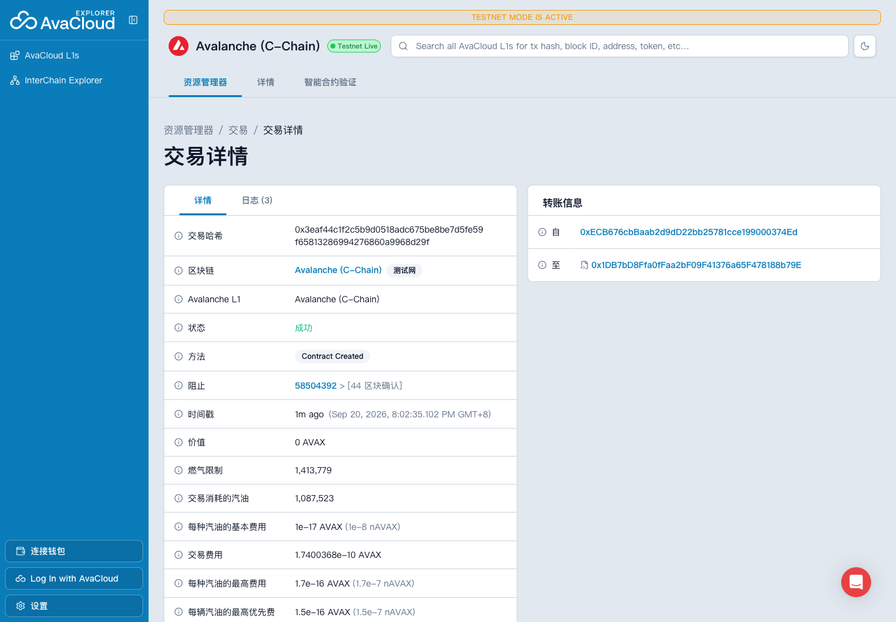
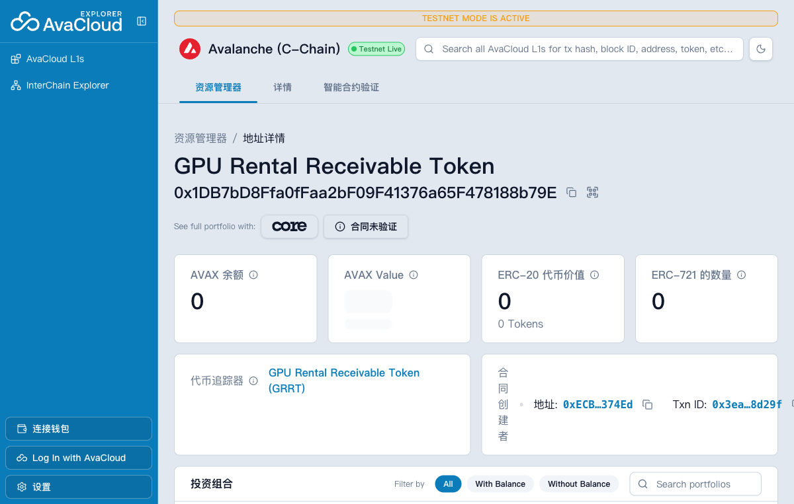
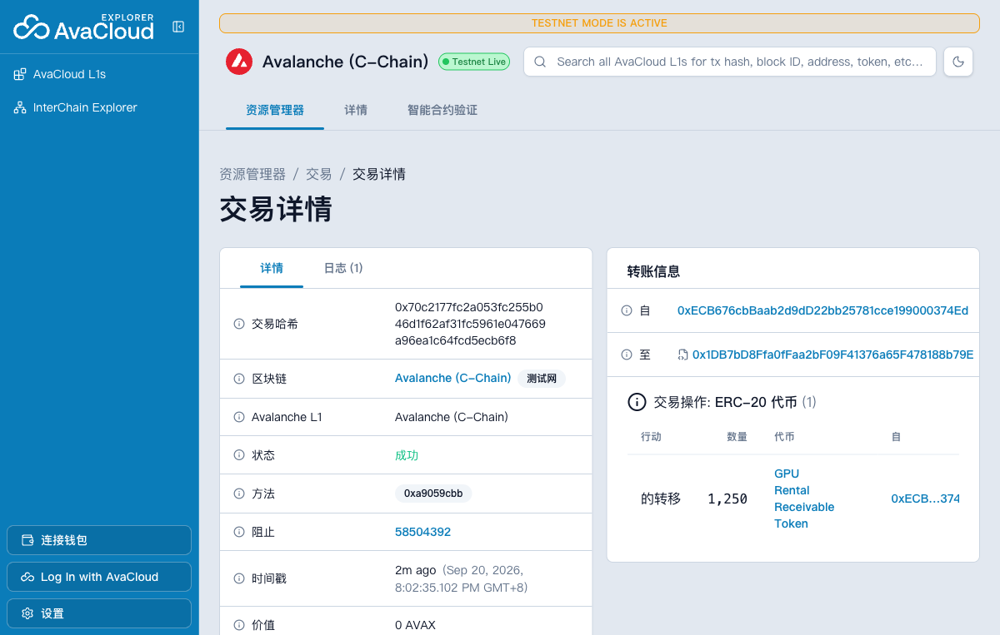
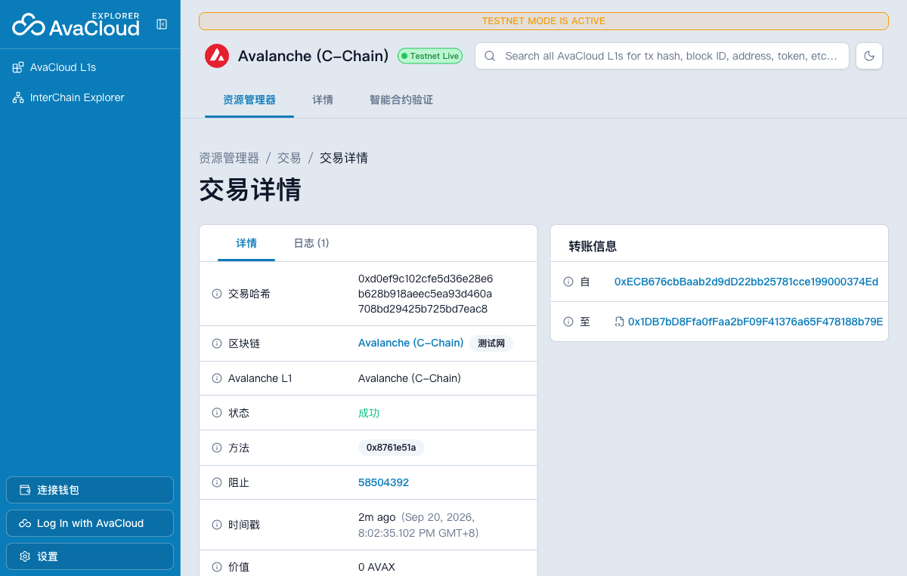

# Task 5：GPU 服务器设备租赁应收账款凭证

> 本项目仅用于技术学习和业务模拟，不对应真实资产，不构成募集、兑付承诺或投资建议。

## 学员信息

| 项目 | 内容 |
| --- | --- |
| GitHub 用户名 | `jeffierw` |
| 作业仓库 | [jeffierw/Avalanche-101-Bootcamp](https://github.com/jeffierw/Avalanche-101-Bootcamp) |
| Task 5 代码 | [`learn/jeffierw/task5`](https://github.com/jeffierw/Avalanche-101-Bootcamp/tree/codex/task5-jeffierw/learn/jeffierw/task5) |

## RWA 业务设计

本项目模拟将一笔已经签署租赁合同、已经出具账单的 GPU 服务器设备租金应收款映射为链上 ERC-20 Token。它不是对未来收入的预测，而是对一笔已确认债权的模拟记录。

| 问题 | 设计 |
| --- | --- |
| Token 对应什么现实资产？ | GPU 服务器设备租赁合同产生的已确认租金应收款 |
| 谁托管资产并提供证明？ | 模拟的设备运营方 `Avalanche RWA Lab` 托管设备，合同、设备序列号和账单共同构成资产证明 |
| 1 Token 对应多少资产？ | `1 GRRT` 对应面值 `1 USDC` 的已确认租金应收款；GRRT 使用 6 位小数 |
| 发行代表什么？ | 运营方核验租赁合同和账单后，将等额应收款凭证发行给权益持有人 |
| 转让代表什么？ | 应收款收益权凭证在地址之间转移；线下法律权利是否随之转移仍需真实法律协议支持 |
| 销毁代表什么？ | 对应租金已结算或凭证已兑付，持有人销毁不再流通的凭证 |

本次模拟资产总面值为 `10,000 USDC`，因此授权发行账户铸造 `10,000 GRRT`。随后转账 `1,250 GRRT`，并以租金结算为业务含义销毁 `500 GRRT`，最终总供应量为 `9,500 GRRT`。

## 资产证明

模拟证明文件为 [`asset-proof.json`](./asset-proof.json)，包含：

- 模拟设备型号、序列号和托管地点；
- 租赁合同编号和租金账单编号；
- 账期和已确认应收款面值；
- Token 与应收款的映射规则；
- 学习用途及无真实兑付承诺声明。

文件的 SHA-256 为：

```text
3fba4da68c8587e569f67fd643ffb8a4fb655d16712be5e00249cb3cadd6a3a1
```

合约最终保存：

```text
sha256:3fba4da68c8587e569f67fd643ffb8a4fb655d16712be5e00249cb3cadd6a3a1
```

真实 RWA 系统可以把审计报告、合同摘要或仓单上传到 IPFS，再将不可篡改的 URI 或哈希写入合约。链上哈希只能证明某份文件没有变化，不能独立证明文件内容真实，也不能替代托管、审计和法律执行。

## 合约功能与权限

合约 [`GPURentalReceivableToken.sol`](./src/GPURentalReceivableToken.sol) 基于 OpenZeppelin `ERC20`、`ERC20Burnable` 和 `AccessControl`：

- 名称：`GPU Rental Receivable Token`
- 符号：`GRRT`
- 精度：`6`
- `mint(address,uint256)`：只有 `MINTER_ROLE` 可以发行，触发 `ReceivableIssued`
- `burn(uint256)`：持有人销毁自己的 Token，触发 `ReceivableBurned`
- `transfer(address,uint256)`：使用 ERC-20 标准转账并触发 `Transfer`
- `updateAssetDocument(string)`：只有 `DOCUMENT_ROLE` 可以更新证明，触发 `AssetDocumentUpdated`
- `assetDocument()`：查询当前资产证明摘要
- `balanceOf()` / `totalSupply()`：查询余额和总供应量
- `DEFAULT_ADMIN_ROLE`：管理发行与资产证明角色

发行权限与证明维护权限被拆成两个角色，实际项目可分别交给受监管发行主体和独立审计或托管主体。课程演示中两个角色均授予部署账户。

## Fuji 部署信息

| 项目 | 内容 |
| --- | --- |
| 网络 | Avalanche Fuji Testnet |
| Chain ID | `43113` |
| RPC | `https://api.avax-test.network/ext/bc/C/rpc` |
| 合约地址 | [`0x1DB7...b79E`](https://subnets-test.avax.network/c-chain/address/0x1DB7bD8Ffa0fFaa2bF09F41376a65F478188b79E) |
| 部署者 / Admin | [`0xECB6...74Ed`](https://subnets-test.avax.network/c-chain/address/0xECB676cbBaab2d9dD22bb25781cce199000374Ed) |
| 转账接收方 | [`0x119B...4435`](https://subnets-test.avax.network/c-chain/address/0x119B4976Ca5d34a7ED501B8Fba9f629aD58a4435) |

### 链上交易

| 操作 | 数量 | Fuji 交易 |
| --- | ---: | --- |
| 部署合约 | - | [`0x3eaf...d29f`](https://subnets-test.avax.network/c-chain/tx/0x3eaf44c1f2c5b9d0518adc675be8be7d5fe59f65813286994276860a9968d29f) |
| 发行 | `10,000 GRRT` | [`0x056f...c511`](https://subnets-test.avax.network/c-chain/tx/0x056fe5f9cdd2c7c73e006b22a1b986fddd4fafe20c2fee85ac60862035b6c511) |
| 转账 | `1,250 GRRT` | [`0x70c2...b6f8`](https://subnets-test.avax.network/c-chain/tx/0x70c2177fc2a053fc255b046d1f62af31fc5961e047669a96ea1c64fcd5ecb6f8) |
| 销毁 | `500 GRRT` | [`0x09e1...b3a3`](https://subnets-test.avax.network/c-chain/tx/0x09e1db68383e1df9eaf0cbdd47b1d5061b5977f895891b68ca0385975c38b3a3) |
| 更新资产证明 | - | [`0xd0ef...eac8`](https://subnets-test.avax.network/c-chain/tx/0xd0ef9c102cfe5d36e28e6b628b918aeec5ea93d460a708bd29425b725bd7eac8) |

五笔交易的 receipt `status` 均为 `1`。

### 链上最终状态

```text
name: GPU Rental Receivable Token
symbol: GRRT
decimals: 6
totalSupply: 9,500 GRRT
admin balance: 8,250 GRRT
recipient balance: 1,250 GRRT
admin has MINTER_ROLE: true
admin has DOCUMENT_ROLE: true
assetDocument: sha256:3fba4da68c8587e569f67fd643ffb8a4fb655d16712be5e00249cb3cadd6a3a1
```

## 截图材料

### 合约部署成功



### 区块浏览器合约页面



### Token 发行


### Token 转账



### Token 销毁


### 资产证明更新



## 测试与逐项验证

执行：

```bash
cd learn/jeffierw/task5
forge test -vv
```

结果：`10 passed; 0 failed; 0 skipped`。

| 官方要求 | 测试 / 验证 | 结果 |
| --- | --- | --- |
| 合约部署成功 | `testDeploymentAndInitialTokenInformation` + Fuji 部署 receipt | ✅ |
| 初始 Token 信息正确 | 名称、符号、精度、初始供应量、角色和证明断言 | ✅ |
| 授权账户可以发行 | `testAuthorizedAccountCanMint` + Fuji mint 交易 | ✅ |
| 非授权账户不能发行 | `testUnauthorizedAccountCannotMint` | ✅ |
| 持有人可以转账 | `testHolderCanTransfer` + Fuji transfer 交易 | ✅ |
| Token 可以销毁 | `testHolderCanBurnAndSupplyChanges` + Fuji burn 交易 | ✅ |
| 总供应量和余额正确 | 测试断言 + Fuji RPC 重新读取 | ✅ |
| 授权账户可以更新证明 | `testAuthorizedAccountCanUpdateAssetDocument` + Fuji 更新交易 | ✅ |
| 非授权账户不能更新证明 | `testUnauthorizedAccountCannotUpdateAssetDocument` | ✅ |
| 错误操作被拒绝 | 零数量发行、空证明、超额销毁测试 | ✅ |
| 证明文件和链上哈希一致 | 本地 `shasum -a 256` 与 `assetDocument()` 对比 | ✅ |
| 部署代码与本地产物一致 | 去除编译元数据后比对 Fuji runtime bytecode 与本地 artifact | ✅ |

## 本地复现

依赖版本：OpenZeppelin Contracts `v5.0.2`、forge-std `v1.9.7`。

```bash
cd learn/jeffierw/task5
forge install OpenZeppelin/openzeppelin-contracts@v5.0.2 --no-commit
forge install foundry-rs/forge-std@v1.9.7 --no-commit
forge test -vv

# 使用自己的 Fuji 测试钱包私钥
export PRIVATE_KEY=0x...
forge script script/DeployAndDemonstrate.s.sol:DeployAndDemonstrate \
  --rpc-url fuji \
  --broadcast \
  -vv
```

## 风险边界

这个 Demo 只验证“资产信息摘要 + 角色权限 + Token 生命周期”的技术流程。生产级 RWA 还必须解决：

- 资产和合同是否真实、是否重复融资；
- Token 持有人是否依法取得债权及兑付顺序；
- 托管方、审计方和发行方的准入与持续披露；
- KYC/AML、司法辖区和证券监管要求；
- 稳定币收款、违约处理、冻结、强制赎回和争议解决；
- 管理员私钥泄露、权限轮换和多签治理。

因此，链上 Token 只是现实权利的数字化记录。没有可信托管、法律合同和可执行的兑付安排，Token 本身不能让现实资产自动变得可信。
