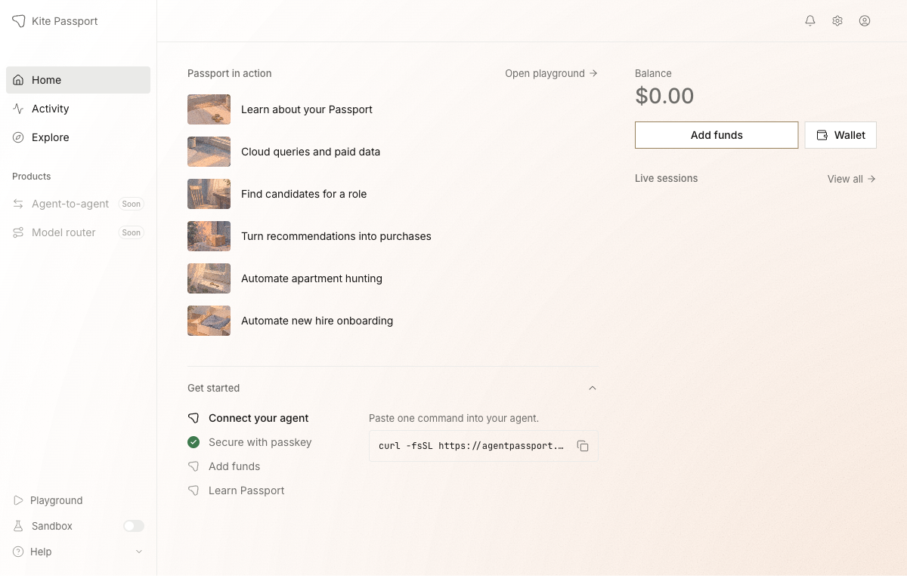
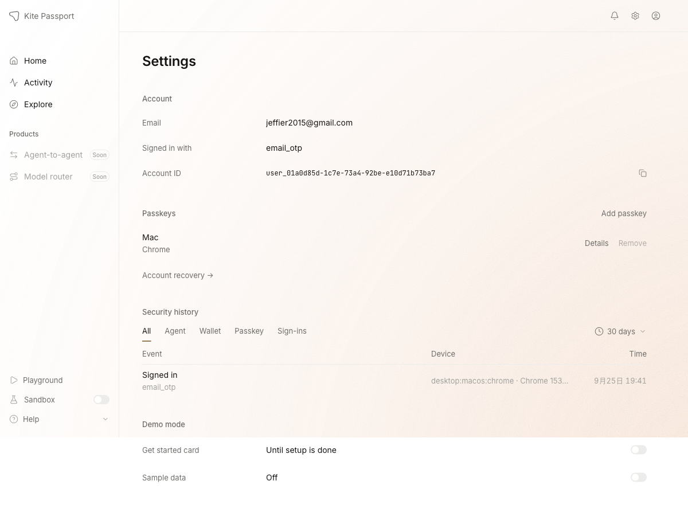
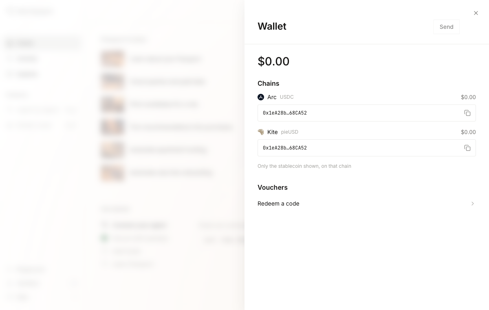
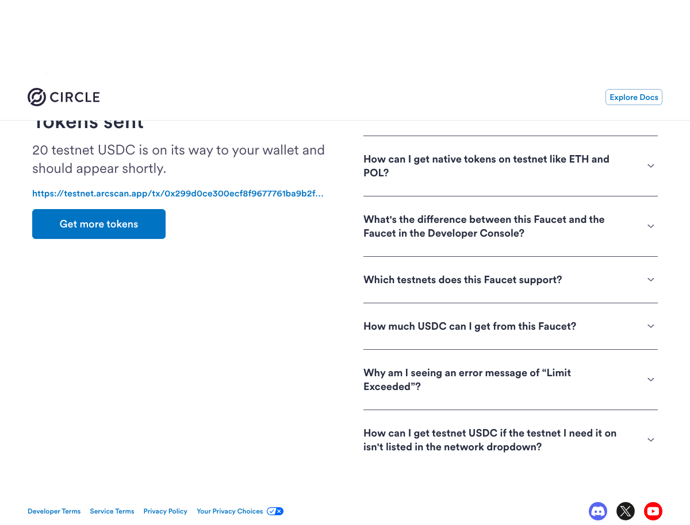
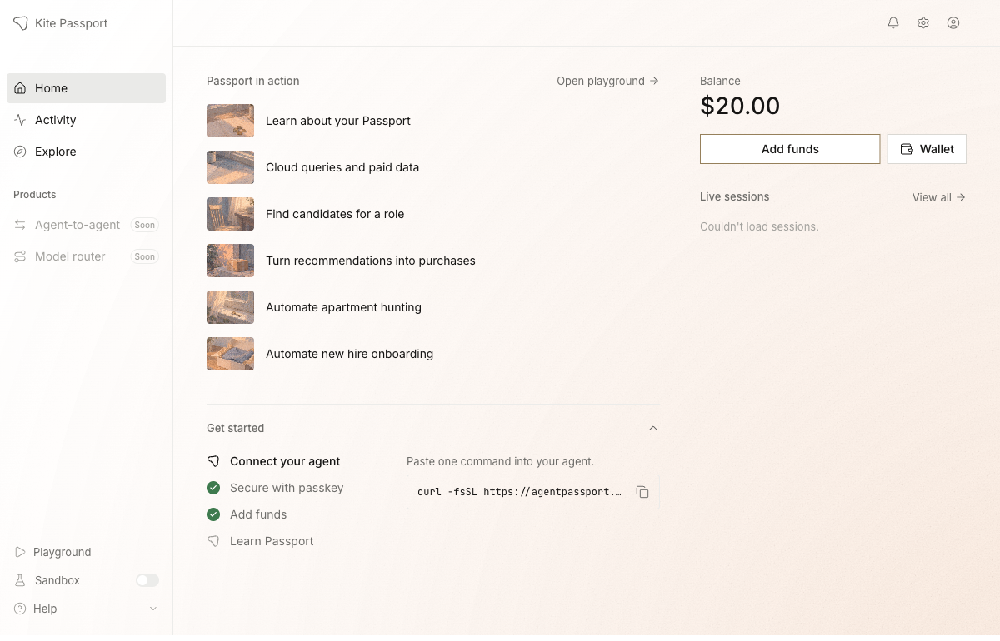
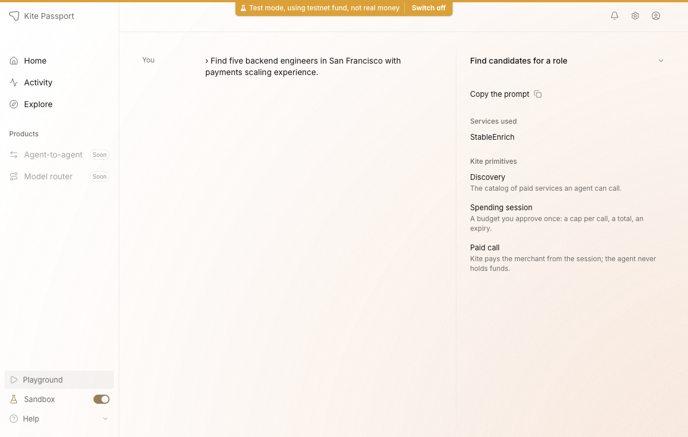
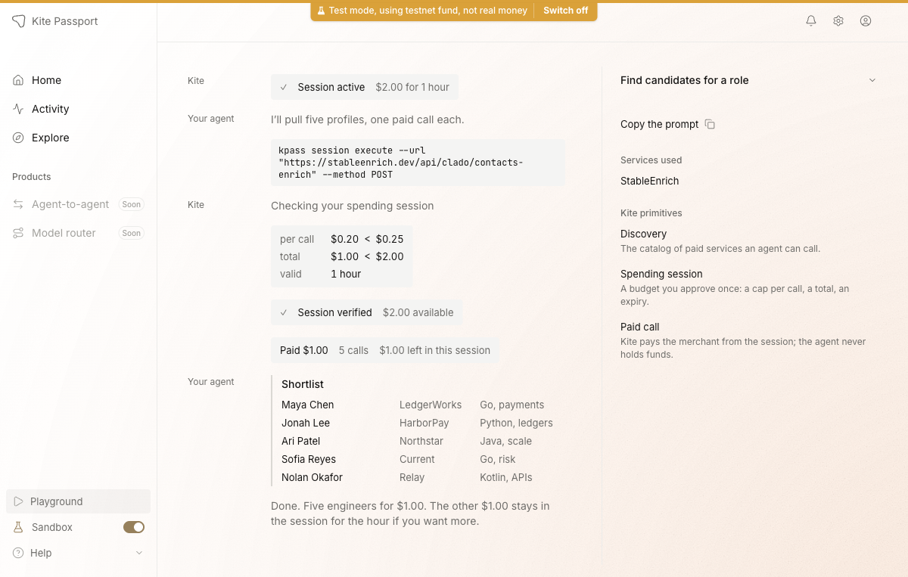
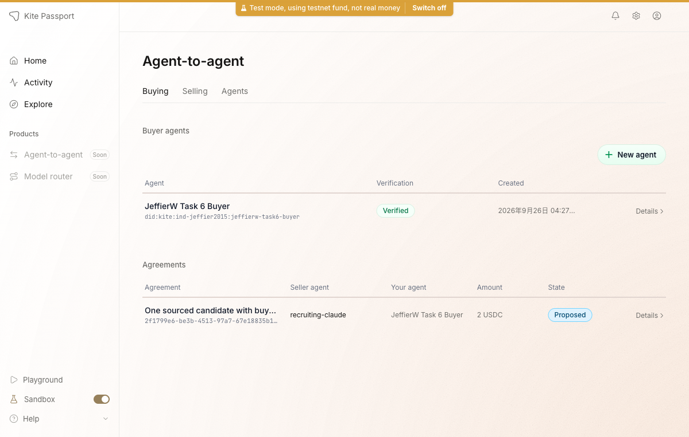

# Task 6：探索 AI Agent 支付新范式——以 Kite AI 为例

> 提交人：jeffierw
>
> 环境：Kite Passport Devnet / Arc Testnet
>
> 完成日期：2026-09-26

## 完成情况

| 项目 | 状态 | 说明 |
| --- | --- | --- |
| 注册并登录 Kite Agent Passport | ✅ | Passport 首页与账户信息可正常访问 |
| 创建 Passkey | ✅ | 已创建 `Mac / Chrome` Passkey |
| 领取 Arc Testnet USDC | ✅ | Circle Faucet 成功发送 20 testnet USDC |
| Playground 体验 Agent 支付 | ✅ | 完成当前新版 `Find candidates for a role` 教程流程 |
| 安装 Kite CLI 与 Skills | ✅ | `kpass` / `kagent` / `ksearch` 版本均为 `6.7.0`，Skills 版本为 `3.4.0` |
| 初始化 Buyer Agent | ✅ | Runtime key 已绑定，Buyer Agent 为 Verified |
| 搜索并验证 Recruiting Seller | ✅ | 已验证 Agent Card、签名密钥、Registration 与 Offering |
| 创建真实 Agreement Proposal | ✅ | Buyer formation signature 已 relay，Agreement 当前为 `PROPOSED` |
| Advanced Seller 反签及结算 | ⏳ | Seller 尚未 countersign，未擅自执行后续授权、入金或确认交付 |

## 基础层

### 1. Passport 登录与 Passkey

已登录 Kite Passport，并确认账户首页可正常访问。



账户设置中显示已创建 `Mac / Chrome` Passkey。



### 2. 领取 Arc Testnet USDC

Passport 钱包地址：

```text
0x1eA28b8961f8F1104f294d8ee2134BDB7868CA52
```



通过 Circle Faucet 领取了 20 testnet USDC。交易哈希：

```text
0x299d0ce300ecf8f9677761ba9b2f8bea4b47845380371f659f0ade812e4368ad
```

[Arc Testnet Explorer 交易记录](https://testnet.arcscan.app/tx/0x299d0ce300ecf8f9677761ba9b2f8bea4b47845380371f659f0ade812e4368ad)



返回 Passport 后，Overview 显示余额为 `$20.00`。



### 3. Playground Agent 支付流程

当前 Passport Playground 已不再提供任务文档中的旧版 `Recruiting Agent (SDK)` 手动签约页面，而是提供新版 `Find candidates for a role` 教程。新版流程演示了：

1. Agent 发现候选人数据服务 `StableEnrich`；
2. 请求总额 `$2.00`、有效期 1 小时的 Spending Session；
3. 校验单次调用上限 `$0.25` 与总预算 `$2.00`；
4. 执行 5 次付费调用，共支付 `$1.00`；
5. 返回 5 位候选人的 shortlist，未使用的 `$1.00` 保留在 Session 中。

流程开始时的请求页面：



Session 校验、付费调用和最终结果：



> 说明：页面顶部明确标注 `Test mode, using testnet fund, not real money`。因此这里记录的是官方 Playground 的教程结果，不将动画中的 `Paid $1.00` 表述为已经独立验证的真实链上结算。

## 进阶层：Codex + Kite CLI

### 1. CLI、认证与 Buyer Agent

本次使用 Codex 完成 Kite CLI 与官方 Skills 的安装和配置。版本检查结果：

```text
kpass  6.7.0
kagent 6.7.0
ksearch 6.7.0
skills  3.4.0
```

使用同一个 Passport 账户完成 CLI 认证，并创建本任务专用 Buyer Agent：

| 字段 | 值 |
| --- | --- |
| Buyer UID | `jeffierw-task6-buyer` |
| Buyer DID | `did:kite:ind-jeffier2015:jeffierw-task6-buyer` |
| Runtime address | `0x041F2830A92C378B080C6B106a9337CDa11c407d` |
| Runtime binding | Active / Verified |

### 2. Seller Discovery 与验证

通过目录搜索选定 `recruiting-claude`，并在创建协议前逐项验证其公开资料：

| 字段 | 值 |
| --- | --- |
| Seller DID | `did:kite:ind-lyon:recruiting-claude` |
| Offering | `candidate-sourcing` |
| Price | `2 USDC` |
| Workflow | `standard/v1` |
| Payout address | `0x8D0bFEb94FbBFB57b885B9920ffC1081f024d5C7` |
| Agent Card hash | `sha256:6ea12498ef11507bfe9f9948034ff6b1c7234fd7bba6171279370f518abe14c9` |
| Registration hash | `sha256:15ac3bbdfc809d0d3a056d0a5bb01b55344daa0ea44078ab012faa261f0466da` |
| Active signing keys | 1 |

协议要求保存在 [`terms.json`](terms.json)，内容包括目标岗位、地域范围、交付格式、验收条件、价格、收款地址和 Registration Basis。

### 3. Agreement Proposal

Buyer 已签署并成功 relay formation proposal：

| 字段 | 值 |
| --- | --- |
| Agreement ID | `2f1799e6-be3b-4513-97a7-67e18835b124` |
| Proposal ID | `prop_6d10f91a9bf08e81b342b68627987c74` |
| Terms hash | `sha256:724c08393cda5064c628e4364e00b781e6d58e6b000bebaac8b110b9e3919ec9` |
| Price | `2 USDC` |
| Current state | `PROPOSED — awaiting seller acceptance` |



截至提交时，Seller 尚未 countersign，Agreement 的 `revision` 仍为 `0`。在 `COMMITTED` 之前，Kite 协议不允许安全地申请 Agreement-scoped Spending Session 或执行 Escrow Funding。因此我没有伪造交付结果，也没有把未发生的资金释放写成已完成。

进阶链路的真实进度如下：

```text
CLI authentication
  → Buyer Agent initialized and bound
  → Seller discovered and verified
  → Terms created and signed
  → Proposal relayed
  → PROPOSED (waiting for Seller countersign)
```

## 安全与可复核性

- 本地 JWT、Runtime private key 与浏览器自动化缓存均通过根目录 `.gitignore` 排除，不提交任何密钥。
- Faucet 结果可通过 Arc Testnet Explorer 独立核验。
- Advanced Proposal 的 DID、Agreement ID、Terms hash 和 Registration hash 均保留，便于后续继续跟踪。
- 只有在 Seller 反签、交付物哈希与签名证据核验通过后，才会确认交付并释放 Escrow。

## 总结

本次完成了 Task 6 的账户、Passkey、测试币领取和当前新版 Playground 教程；同时完成了进阶层的 CLI 配置、Buyer Agent 初始化、Seller Discovery/验证及真实 Agreement Proposal。由于外部 Seller 尚未反签，进阶真实结算链路按事实停在 `PROPOSED`，未虚构后续状态。
