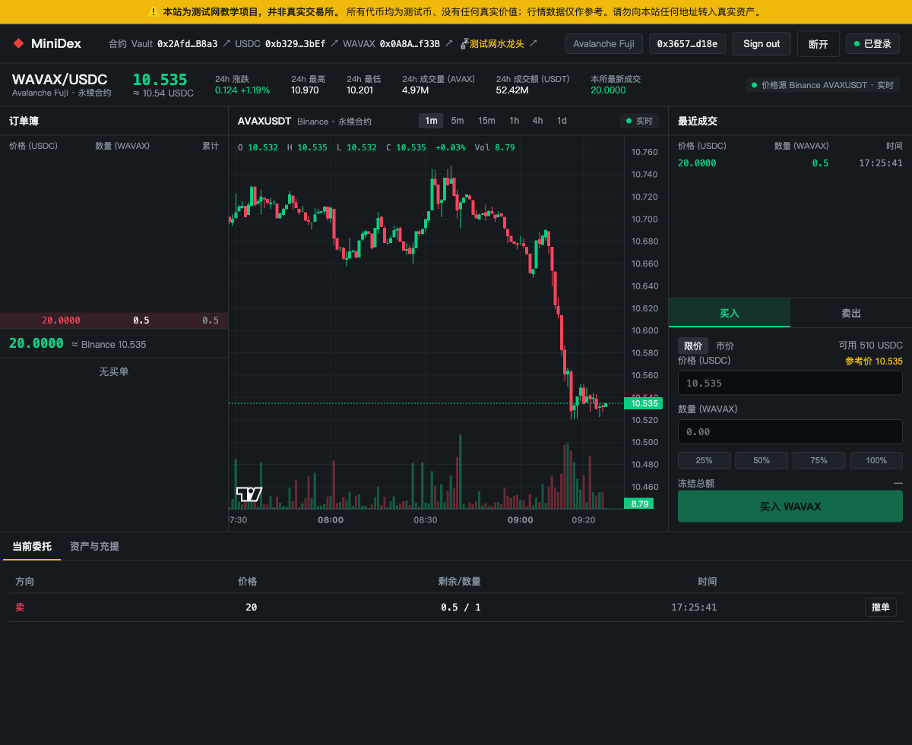
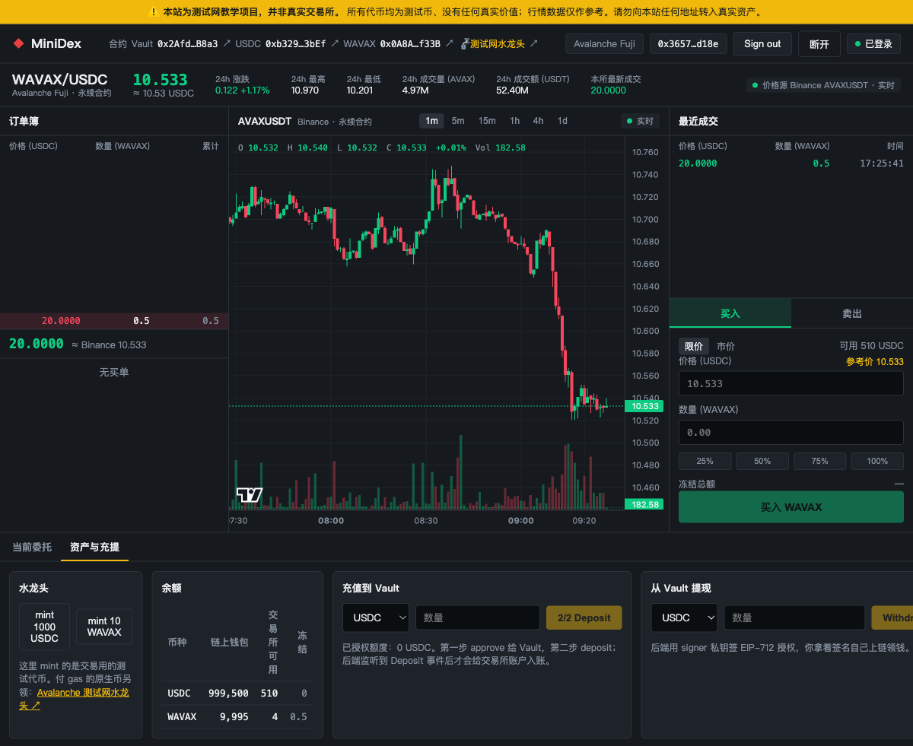

# Task7 - Mini DEX

## 代码

- 仓库：[jeffierw/Mini-DEX](https://github.com/jeffierw/Mini-DEX/tree/codex/task7-jeffierw)
- 提交：[569820f](https://github.com/jeffierw/Mini-DEX/commit/569820f51b5f3b320fe9010c1cb14a06a3faff01)
- 完整验证记录：[task7-evidence.md](https://github.com/jeffierw/Mini-DEX/blob/569820f51b5f3b320fe9010c1cb14a06a3faff01/proof/task7-evidence.md)

## 一、撮合引擎

实现了 self-trade prevention：撮合时跳过 taker 自己的 maker 单，不移动被跳过订单，因此不会破坏同价格档其他订单的 FIFO 顺序；若最优价格档只有自己的订单，会继续寻找下一个可成交价格档。

新增测试覆盖：

- 时间优先：同价订单按进入顺序成交；
- 拒绝自成交，同时保持其他 maker 的 FIFO；
- 最优档全部为自有订单时继续搜索下一档。

验证结果：

```text
server npm test       31 passed
server typecheck      passed
web pnpm test         10 passed
web production build passed
```

## 二、Fuji 合约部署

网络：Avalanche Fuji C-Chain（Chain ID `43113`）

部署账户：[`0x36570Cc5a1239075904Abd58094F4CA5f4C4d18e`](https://testnet.snowtrace.io/address/0x36570Cc5a1239075904Abd58094F4CA5f4C4d18e)

| 合约 | 地址 | 部署交易 |
| --- | --- | --- |
| MockUSDC | [`0xb3296A1967a31cEe0013B55Ce35E7Af5764c3bEf`](https://testnet.snowtrace.io/address/0xb3296A1967a31cEe0013B55Ce35E7Af5764c3bEf) | [`0x1e81…0e6a`](https://testnet.snowtrace.io/tx/0x1e81f75b7a1988bdb5896319f1bbf005c9eb9ff6b489bb776bc3dd03f2790e6a) |
| MockWAVAX | [`0x0A8A4Ba56813907f3d8Dd26Bd6eE1DE67A5bf33B`](https://testnet.snowtrace.io/address/0x0A8A4Ba56813907f3d8Dd26Bd6eE1DE67A5bf33B) | [`0xa50d…9419`](https://testnet.snowtrace.io/tx/0xa50d7c66d7bd01efbb251aa11645ee4836ce83941ab149323c4768ffb6609419) |
| Vault | [`0x2Afdb08712624bB815518fD56Be82BFb4D1BB8a3`](https://testnet.snowtrace.io/address/0x2Afdb08712624bB815518fD56Be82BFb4D1BB8a3) | [`0x602f…9960`](https://testnet.snowtrace.io/tx/0x602fab3a34b58a371cd84544b3d814fe008101c278c25903ba8bdcc73cd19960) |

部署及初始化共 7 笔交易，receipt 均为 `status = 1`；三个地址均已确认存在合约字节码。

```text
forge test: 13 passed, 0 failed
```

真实充值交易：

| 用户 | 资产 | 数量 | 交易 |
| --- | --- | ---: | --- |
| Alice | USDC | 500 | [`0xc929…f0e9`](https://testnet.snowtrace.io/tx/0xc92924f2240a6d712b1f6fc3ff7f9ee56f70db4b8340e881c3c0b4af609ef0e9) |
| Alice | WAVAX | 5 | [`0x2169…f9d9`](https://testnet.snowtrace.io/tx/0x2169a74ec043f45ef07025e5c2fe501271cce876bc7370d14d17cda89afbf9d9) |
| Bob | USDC | 1,000 | [`0x9e81…178b`](https://testnet.snowtrace.io/tx/0x9e813373c1435a4c6e88c23fe30b17206b60b63aafdec54c367622b0fad9178b) |

## 三、端到端演示

参与成交的两个不同地址：

- Alice：`0x36570Cc5a1239075904Abd58094F4CA5f4C4d18e`
- Bob：`0x8f9A7b16302f50809482723BC67194d7aA328db2`

成交过程：Alice 挂出 `1 WAVAX @ 20 USDC` 的限价卖单，Bob 使用市价单买入 `0.5 WAVAX`。最终成交 `0.5 WAVAX @ 20 USDC`，Alice 为 maker，Bob 为 taker。

成交后、提现前：

- Alice 可用余额：`510 USDC`；
- Bob 可用余额：`990 USDC + 0.5 WAVAX`。

Bob 随后从 Vault 提现 `0.1 WAVAX`：

- 提现交易：[`0xcb4cbb24543c53016acfef04b1f27f4b486a20ea1edc892c3981e21939452ed0`](https://testnet.snowtrace.io/tx/0xcb4cbb24543c53016acfef04b1f27f4b486a20ea1edc892c3981e21939452ed0)
- 区块：`58741112`
- 结果：receipt 成功并产生 Vault `Withdraw` 事件；Bob 链上 WAVAX 增加 `0.1`，Vault 余额由 `5` 变为 `4.9 WAVAX`。

### 登录及成交



### 钱包及交易所余额



## 四、进阶项：AI 安全审查与修复

对服务端 npm 依赖进行了审查。原依赖树存在 6 个已知漏洞，其中包含 Vitest 工具链的 critical 漏洞，以及旧版 Hono 的多个漏洞。

处理内容：

- `hono`：`^4.6.14` → `^4.13.9`；
- `vitest`：`^2.1.8` → `^4.1.11`；
- 增加兼容的 `vite` 显式开发依赖；
- 更新 lockfile，并完整回归服务端测试与类型检查。

修复后结果：`npm audit` 为 `found 0 vulnerabilities`。

完整报告：[security-review.md](https://github.com/jeffierw/Mini-DEX/blob/569820f51b5f3b320fe9010c1cb14a06a3faff01/proof/security-review.md)。该报告是依赖层面的安全审查，不声称替代专业的合约或应用安全审计。
