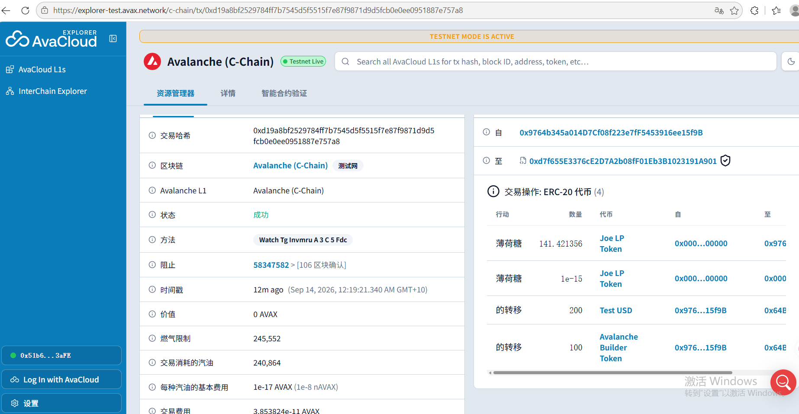
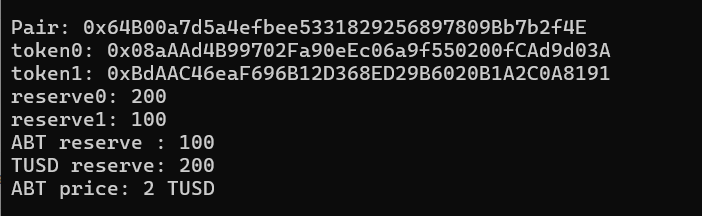
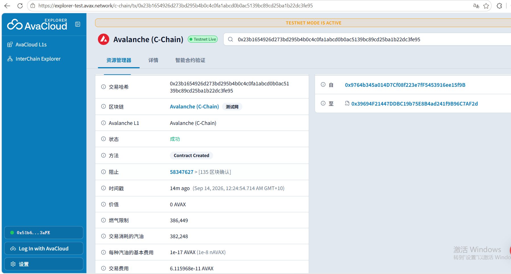
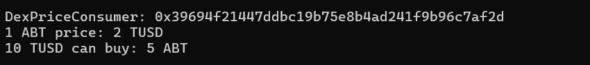

# Task 3 - 使用 DEX Oracle 获取代币价格

## 1. DEX

本任务使用 Avalanche Fuji 测试网中的 Trader Joe / LFJ V1。

- DEX: Trader Joe / LFJ V1
- Network: Avalanche Fuji
- Factory V1: `0xF5c7d9733e5f53abCC1695820c4818C59B457C2C`
- Router V1: `0xd7f655E3376cE2D7A2b08fF01Eb3B1023191A901`

---

## 2. Token Pair

### Token A - Avalanche Builder Token

- Name: Avalanche Builder Token
- Symbol: ABT
- Address: `0xbdaac46eaf696b12d368ed29b6020b1a2c0a8191`

### Token B - Test USD

- Name: Test USD
- Symbol: TUSD
- Address: `0x08aaad4b99702fa90eec06a9f550200fcad9d03a`

---

## 3. Pair

在 Trader Joe / LFJ V1 Factory 中创建了 ABT/TUSD Pair。

- Pair Address: `0x64B00a7d5a4efbee5331829256897809Bb7b2f4E`
- Pair Creation Tx: `0x583c38ebf5e6c8bab00a330d7e6f884d6f888e3d4d9ef7992a66ec550a0b3bdf`

---

## 4. Add Liquidity

向 ABT/TUSD Pair 添加：

- 100 ABT
- 200 TUSD

Add Liquidity Transaction:

`0xd19a8bf2529784ff7b7545d5f5515f7e87f9871d9d5fcb0e0ee0951887e757a8`

Liquidity screenshot:



---

## 5. Read DEX Price from Pair Reserves

通过 Pair 的：

- `token0()`
- `token1()`
- `getReserves()`

读取链上流动性数据。

实际读取结果：

```text
token0 = TUSD
token1 = ABT

reserve0 = 200 TUSD
reserve1 = 100 ABT
```

因此：

```text
1 ABT = 200 / 100 = 2 TUSD
```

Pair reserves screenshot:



---

## 6. Solidity DEX Price Logic

部署 `DexPriceConsumer` 合约，从 Trader Joe Pair 获取 ABT/TUSD 的实时储备量，并根据 `token0` / `token1` 的顺序判断 ABT 和 TUSD 对应的 reserve。

核心代码：

```solidity
function getABTPriceInTUSD() public view returns (uint256) {
    IJoePair joePair = IJoePair(pair);

    address token0 = joePair.token0();
    address token1 = joePair.token1();

    (
        uint112 reserve0,
        uint112 reserve1,

    ) = joePair.getReserves();

    require(reserve0 > 0 && reserve1 > 0, "No liquidity");

    uint256 abtReserve;
    uint256 tusdReserve;

    if (token0 == abt && token1 == tusd) {
        abtReserve = uint256(reserve0);
        tusdReserve = uint256(reserve1);
    } else if (token0 == tusd && token1 == abt) {
        tusdReserve = uint256(reserve0);
        abtReserve = uint256(reserve1);
    } else {
        revert("Invalid pair tokens");
    }

    return (tusdReserve * 1e18) / abtReserve;
}
```

该价格不是手动写死，而是每次调用时从 DEX Pair 的 reserves 中获取。

---

## 7. Use DEX Price in Business Logic

为了证明 DEX 价格实际用于业务逻辑，实现了：

```solidity
function quoteABTForTUSD(
    uint256 tusdAmount
) external view returns (uint256) {
    uint256 price = getABTPriceInTUSD();

    require(price > 0, "Invalid price");

    return (tusdAmount * 1e18) / price;
}
```

当前 DEX 价格：

```text
1 ABT = 2 TUSD
```

调用：

```text
quoteABTForTUSD(10 TUSD)
```

结果：

```text
5 ABT
```

说明业务计算使用的是从 DEX Pair 动态读取的价格。

---

## 8. Deploy DexPriceConsumer to Avalanche Fuji

DexPriceConsumer Address:

`0x39694f21447ddbc19b75e8b4ad241f9b96c7af2d`

Deployment Transaction:

`0x23b1654926d273bd295b4b0c4c0fa1abcd0b0ac5139bc89cd25ba1b22dc3fe95`

Deployment screenshot:



---

## 9. Successful Price Read / Business Use

实际读取结果：

```text
DexPriceConsumer: 0x39694f21447ddbc19b75e8b4ad241f9b96c7af2d
1 ABT price: 2 TUSD
10 TUSD can buy: 5 ABT
```

Screenshot:



---

## 10. Summary

本任务完成了以下流程：

1. 在 Avalanche Fuji 上部署 ABT 和 TUSD。
2. 使用 Trader Joe / LFJ V1 创建 ABT/TUSD Pair。
3. 添加 100 ABT + 200 TUSD 流动性。
4. 从 Pair 的 `getReserves()` 获取链上价格。
5. 根据 `token0` / `token1` 判断 ABT 和 TUSD 对应的 reserve。
6. 计算得到当前价格 `1 ABT = 2 TUSD`。
7. 在 `DexPriceConsumer` 合约业务逻辑中实际使用 DEX 价格。
8. 验证 `10 TUSD = 5 ABT`。
9. 将合约部署至 Avalanche Fuji 并完成链上验证。

> Note: 本任务使用 Pair reserves 作为 DEX spot price 演示。实际生产环境中，spot price 容易受到短时价格操纵，应考虑使用 TWAP 或更加稳健的 Oracle 方案。