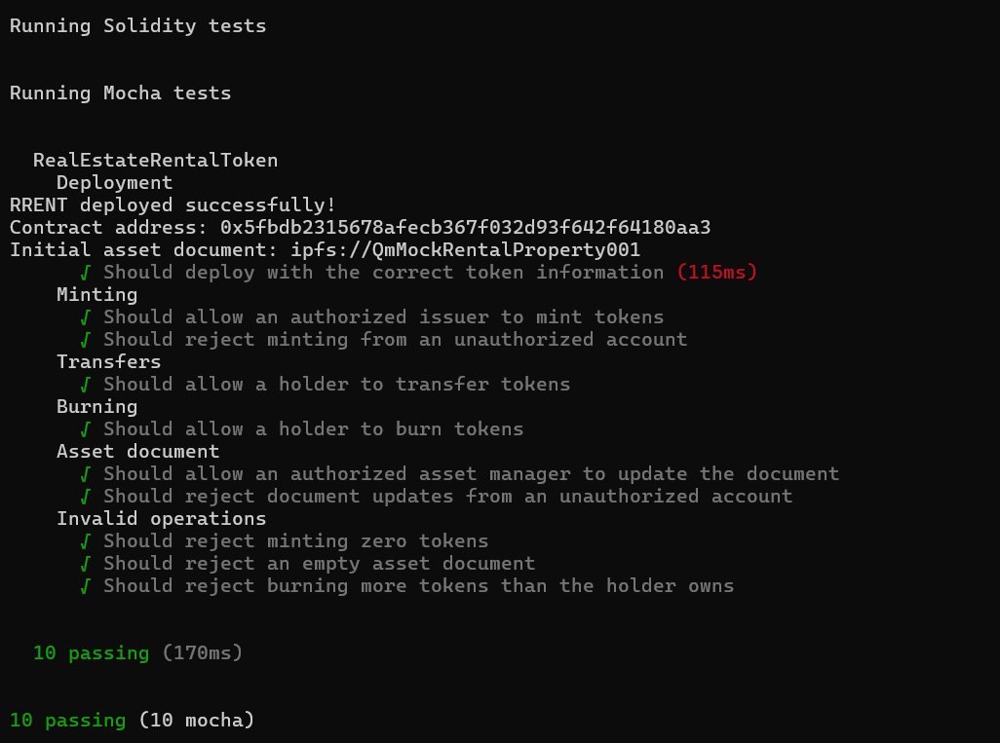

\# Task 5 - RWA Token on Avalanche Fuji


GitHub: \*\*kKassidy\*\*


\## 1. Project


\### Real Estate Rental Income Token (RRENT)


This project implements an educational Real World Asset (RWA) token on Avalanche Fuji.


\*\*Project Repository:\*\*


https://github.com/kKassidy/avalanche-rwa-rental-token


> This project is for technical education and RWA workflow simulation only.  

> RRENT does not represent real property ownership, securities, investment products, or legally enforceable rental income rights.


\---


\## 2. RWA Business Design


\### What real-world asset/right does the token represent?


RRENT represents simulated accounting units of real-estate rental income rights.


It does \*\*not\*\* represent ownership of the underlying real estate.


\### Who manages the asset and provides proof?


In this simulation, an asset manager / SPV is responsible for managing the underlying rental asset and providing supporting asset documentation.


The smart contract stores an `assetDocument` reference that can represent an IPFS URI, document hash, rental agreement, asset report, or other off-chain proof.


For this educational deployment, mock IPFS-style references are used.


Initial asset document:


`ipfs://QmMockRentalProperty001`


Updated asset document:


`ipfs://QmMockRentalProperty001-Updated`


These are simulated references and do not represent actual uploaded property documents.


\### How much real-world right does each token represent?


`1 RRENT = 1 simulated rental-income-right accounting unit`


\### Business meaning of token operations


| Operation | Business Meaning |

| --- | --- |

| Mint | Issue new simulated rental-income-right accounting units |

| Transfer | Transfer tokenized rights between holders |

| Burn | Redeem or cancel existing tokenized rights |

| totalSupply | Total outstanding tokenized rights |

| balanceOf | Tokenized-right balance held by an address |

| updateAssetDocument | Update the off-chain asset-proof reference |


\---


\## 3. Smart Contract Design


Contract:


`RealEstateRentalToken.sol`


Token:


\- Name: `Real Estate Rental Income Token`

\- Symbol: `RRENT`

\- Standard: ERC-20

\- Initial supply: `0`


The contract uses OpenZeppelin:


\- `ERC20`

\- `ERC20Burnable`

\- `AccessControl`


\### Roles


`DEFAULT\_ADMIN\_ROLE`


Controls role administration.


`ISSUER\_ROLE`


Only authorized issuers can mint new RRENT.


`ASSET\_MANAGER\_ROLE`


Only authorized asset managers can update the asset-document reference.


\### Core Functions


\- `mint(address to, uint256 amount)`

\- `burn(uint256 amount)`

\- `transfer(address to, uint256 amount)`

\- `balanceOf(address account)`

\- `totalSupply()`

\- `updateAssetDocument(string calldata newDocument)`

\- `assetDocument()`


The contract also emits events for minting, burning, and asset-document updates.


\---


\## 4. Avalanche Fuji Deployment


\*\*Network:\*\* Avalanche Fuji C-Chain


\*\*Chain ID:\*\* `43113`


\*\*Contract Address:\*\*


`0x30f205898a059d2d0cfcc65e4e86ecb479cb339b`


\*\*Deployer:\*\*


`0x9764b345a014D7Cf08f223e7fF5453916ee15f9B`


\*\*Deployment Transaction:\*\*


[View Deployment Transaction on Avalanche Fuji Explorer](https://subnets-test.avax.network/c-chain/tx/0x34c4d10193a43fc99e9c45fb06b5bf2ccd686b2a9c503e238553f00709804dbf)

`0x34c4d10193a43fc99e9c45fb06b5bf2ccd686b2a9c503e238553f00709804dbf`


\### Deployment Evidence


!\[RRENT deployment](./images/task5-deploy.png)


\---


\## 5. On-chain Interaction


\### Mint


The authorized issuer minted:


`100,000 RRENT`


Transaction:


[View Mint Transaction on Avalanche Fuji Explorer](https://subnets-test.avax.network/c-chain/tx/0xe360e6faebd6f6c166e547d24a4388ec4240545a40507f821e3bd80d2f768c52)

`0xe360e6faebd6f6c166e547d24a4388ec4240545a40507f821e3bd80d2f768c52`


Result:


\- Holder balance: `100,000 RRENT`

\- Total supply: `100,000 RRENT`


!\[RRENT mint](./images/task5-mint.png)


\### Transfer


Transferred:


`1,000 RRENT`


Transaction:


[View Transfer Transaction on Avalanche Fuji Explorer](https://subnets-test.avax.network/c-chain/tx/0x584f002eac6fa71dc6a4909a33b09c5f79aac4344754a9cc83fc4ccd34a58d96)

`0x584f002eac6fa71dc6a4909a33b09c5f79aac4344754a9cc83fc4ccd34a58d96`


This transaction is a technical demonstration of ERC-20 rights transfer. The recipient used for this Fuji test was the RRENT contract address itself; it does not represent a real beneficiary.


Result:


\- Sender balance: `99,000 RRENT`

\- Recipient balance: `1,000 RRENT`

\- Total supply: `100,000 RRENT`


!\[RRENT transfer](./images/task5-transfer.png)


\### Burn


Burned:


`500 RRENT`


Transaction:


[View Burn Transaction on Avalanche Fuji Explorer](https://subnets-test.avax.network/c-chain/tx/0x9d6676aeda60889eafa5b230d0df40a91339b6da375345c7db85471d2af979ec)

`0x9d6676aeda60889eafa5b230d0df40a91339b6da375345c7db85471d2af979ec`


Result:


\- Holder balance: `98,500 RRENT`

\- Total supply: `99,500 RRENT`


!\[RRENT burn](./images/task5-burn.png)


\### Asset Document Update


The authorized asset manager updated the simulated asset-proof reference.


Before:


`ipfs://QmMockRentalProperty001`


After:


`ipfs://QmMockRentalProperty001-Updated`


Transaction:


[View Asset Document Update Transaction on Avalanche Fuji Explorer](https://subnets-test.avax.network/c-chain/tx/0x971d3dcda0776299b83c262492f8894951419e4596c4af841498c04ddaea8867)

`0x971d3dcda0776299b83c262492f8894951419e4596c4af841498c04ddaea8867`


\---


\## 6. Automated Tests


The Hardhat test suite covers:


\- deployment

\- token name and symbol

\- initial total supply

\- initial asset document

\- authorized mint

\- unauthorized mint rejection

\- transfer

\- burn

\- supply and balance changes

\- authorized asset-document update

\- unauthorized asset-document update rejection

\- invalid mint rejection

\- empty asset-document rejection

\- insufficient-balance burn rejection


Test result:


```text

10 passing

0 failing

```

### Test Evidence




Run:


```bash

yarn workspace @se-2/hardhat test

```


\---


\## 7. Final On-chain State


After the Fuji interaction tests:


| Item | Result |

| --- | ---: |

| Total Supply | 99,500 RRENT |

| Deployer Balance | 98,500 RRENT |

| Test Recipient Balance | 1,000 RRENT |

| Asset Document | `ipfs://QmMockRentalProperty001-Updated` |


\---


\## 8. Source Code


Full project source code:


https://github.com/kKassidy/avalanche-rwa-rental-token


Main implementation:


`packages/hardhat/contracts/RealEstateRentalToken.sol`


Deployment script:


`packages/hardhat/deploy/01\_deploy\_real\_estate\_rental\_token.ts`


Automated tests:


`packages/hardhat/test/RealEstateRentalToken.ts`


\---


\## Disclaimer


This implementation is an educational RWA technical simulation only.


It does not tokenize a real property, does not constitute an offering of securities or an investment product, and does not create legally enforceable rental income rights.

