# Task 6：探索 AI Agent 支付新范式——以 Kite AI 为例

> **提交人**：kKassidy  
> **对应课程**：第六章  
> **提交目录**：`learn/kKassidy/task6/`

---

## 一、作业完成情况

### 1.1 基础层（必做）

| 作业要求 | 状态 | 证据 |
| --- | --- | --- |
| 注册 Kite Agent Passport 并创建 Passkey | ✅ 完成 | `task6.1` |
| 使用 Circle Faucet 获取 Arc Testnet USDC | ✅ 完成 | `task6.2.1` |
| Passport 显示测试 USDC 余额 | ✅ 完成 | `task6.2.2` |
| Playground 选择 Recruiting Agent 并确认报价 | ✅ 完成 | `task6.3.1` |
| 接受 Signed Offer 并进入 Escrow Funding | ✅ 完成 | `task6.3.2` |
| Seller Agent 完成交付并通过交付验证 | ✅ 完成 | `task6.3.3` |
| Buyer 接受交付并完成 Payment Released | ✅ 完成 | `task6.3.4` |

### 1.2 进阶层（选做，加分项）

| 作业要求 | 当前状态 | 证据 |
| --- | --- | --- |
| 安装 Kite CLI | ✅ 完成 | `task6.4` |
| 在 Codex 中加载 Kite AI Skills | ✅ 完成 | `task6.5` |
| 登录 Kite Passport CLI | ✅ 完成 | `task6.6` |
| 初始化 Buyer Agent | ✅ 完成 | `task6.7` |
| 搜索并选定 Recruiting Seller Agent | ✅ 完成 | `task6.8` |
| Buyer 创建并签署 Agreement Proposal，formation signature 成功 relay | ✅ 完成 | `task6.9` |
| Seller countersign → Escrow → Delivery → Settlement | ❌ 本次未完成 | Seller 决策处理超时后，决定项被 parked/escalated |

> **进阶层最终状态：**本次真实 CLI 实验完成了 Seller discovery、Proposal formation、Seller obligation detection、autonomous decision dispatch、retry 与 escalation 观察，但没有达到 mutual formation，也没有进入 escrow、delivery 或 settlement。

---

## 二、基础层执行记录

### 2.1 创建 Kite Agent Passport 与 Passkey

在 Kite Agent Passport 完成账号注册，并创建 Passkey，用于后续账户授权。

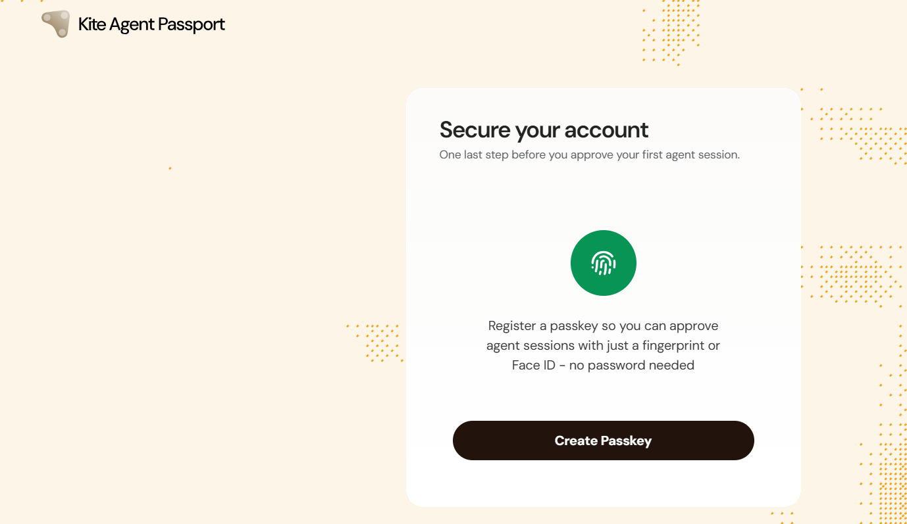

---

### 2.2 获取 Arc Testnet USDC

通过 Circle Faucet 向 Kite Passport 钱包领取 Arc Testnet USDC。

| 项目 | 内容 |
| --- | --- |
| Network | Arc Testnet |
| Token | USDC |
| Faucet 数量 | 20 testnet USDC |
| Passport Wallet | `0x4c7F34Fb286d1847Bf4d93f0617b5338f270042A` |

Circle Faucet 显示测试代币发送成功：

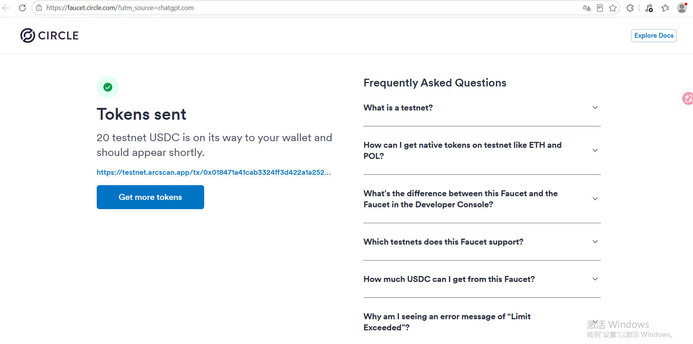

随后在 Kite Passport Overview 中确认测试 USDC 余额：

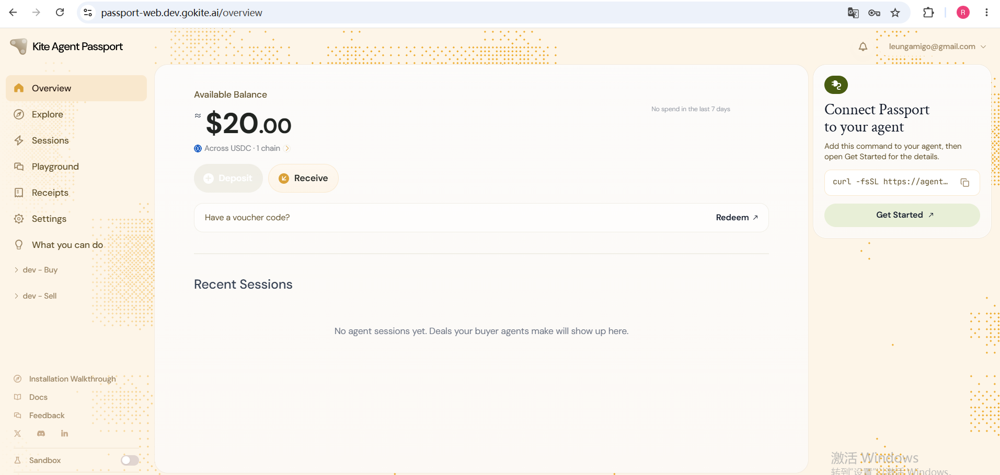

---

### 2.3 Playground：与 Recruiting Agent 完成基础交互

在 Playground 中选择 Hiring 场景，与 Simulated Recruiting Agent 进行 Buyer / Seller 教程交互。

服务内容：

`One sourced candidate with buyer-confirmed interest for a described role`

报价：

`2.00 USDC`

首先查看并接受 Signed Offer：

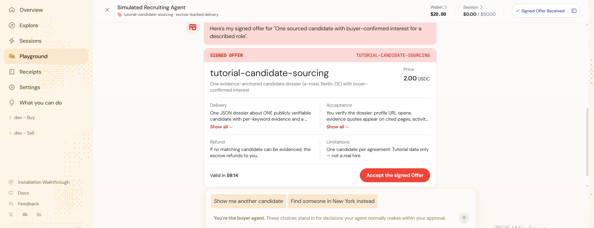

接受报价后，流程进入 Escrow Funding 阶段：

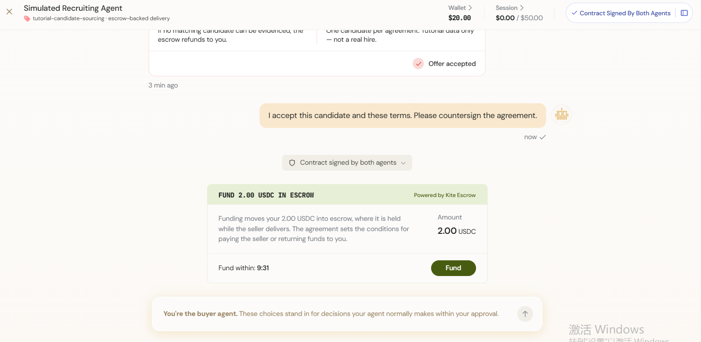

Seller 随后完成交付，Playground 显示 `VERIFIED DELIVERY`，并出现 `Accept and release 2.00 USDC`：

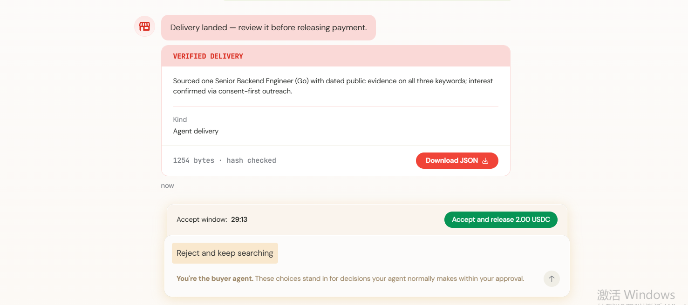

确认接受交付后，Playground 最终显示 `Payment Released`：

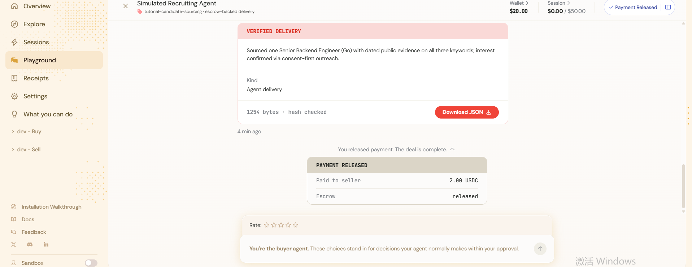

本次 Playground 最终界面显示：

- `Payment Released`
- `Paid to seller 2.00 USDC`
- `Escrow released`

> **说明：**以上 Basic 流程运行于 Kite Playground 的 tutorial / simulated Recruiting Agent 场景。Playground 展示的是 `Signed Offer -> Escrow -> Delivery -> Payment Released` 的模拟教程生命周期，不是已独立验证的真实链上 2 USDC 转账。Circle Faucet 领取的 20 USDC 是另行记录的 Arc Testnet 余额；本次 Advanced CLI 实验没有移动 USDC。

---

## 三、进阶层最终实验：Kite CLI + Codex + Buyer/Seller Agents

### 3.1 安装 Kite CLI

在 WSL 环境中安装 Kite CLI 及相关组件。

安装结果：

| Component | Version |
| --- | --- |
| `kpass` | 6.7.0 |
| `kagent` | 6.7.0 |
| `kite-agent-handler` | 6.7.0 |
| `ksearch` | 6.7.0 |
| Skills | 3.4.0 |

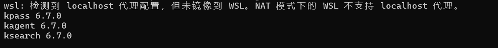

---

### 3.2 在 Codex 中加载 Kite AI Skills

安装 Codex，并在 Task 6 工作目录中配置 Kite Skills。

重新启动后，Codex 成功识别 Buyer Agent、Seller Discovery、Purchase 等 Kite Skills。

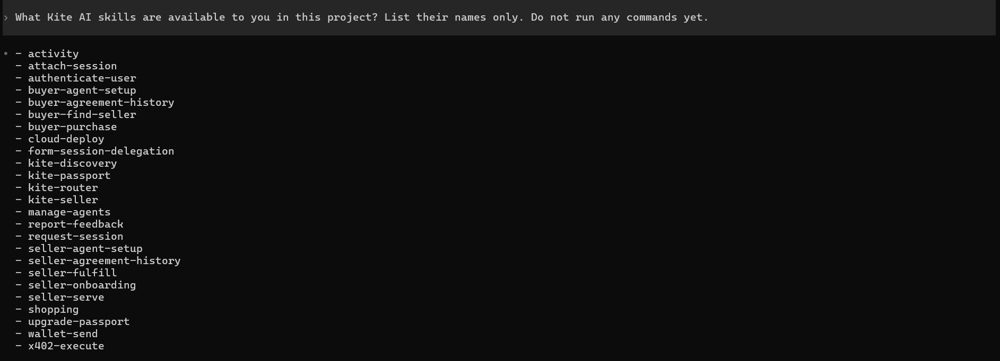

---

### 3.3 登录 Kite Passport CLI

通过 Kite Passport CLI 完成认证，并建立 active session。

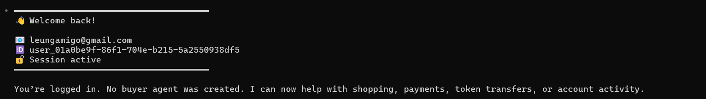

---

### 3.4 初始化 Buyer Agent

创建本次 Task 6 使用的 Buyer Agent。

| 项目 | 内容 |
| --- | --- |
| Buyer UID | `task6-recruiting-buyer` |
| Buyer DID | `did:kite:ind-leungamigo:task6-recruiting-buyer` |
| Runtime Binding | Active |
| Network | Arc Testnet |

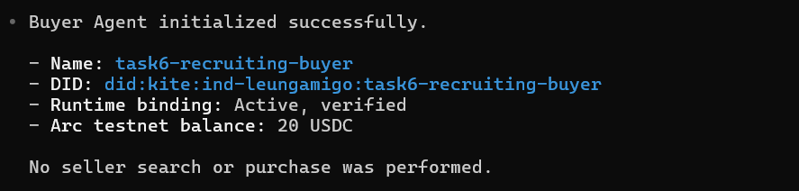

---

### 3.5 Seller Discovery

通过 Kite Agent Discovery 搜索 Recruiting / Candidate Sourcing 相关 Seller Agent。

本次选择：

| 项目 | 内容 |
| --- | --- |
| Seller | `recruiting-claude` |
| Seller DID | `did:kite:ind-lyon:recruiting-claude` |
| Offer | `candidate-sourcing` |
| Price | `2.00 USDC` |
| Protocol | `standard/v1` |

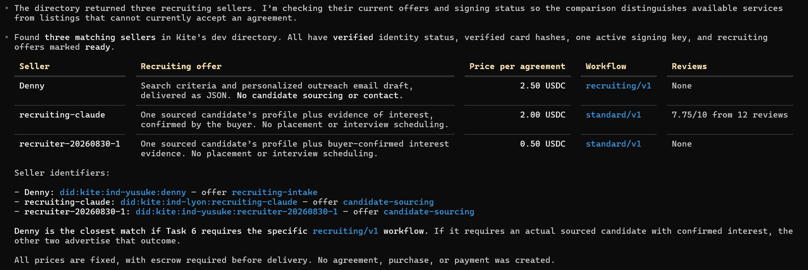

---

### 3.6 Experiment A — Hosted Recruiting Seller

Seller `recruiting-claude`（`did:kite:ind-lyon:recruiting-claude`）的 Agreement 为 `18085708-8515-42e3-a8e0-54679520cb0e`。

Buyer 创建了 Proposal，Buyer formation signature 成功创建并 relay。随后只发送了一次 request-frame，请 Seller 处理既有 Proposal；消息最终过期且没有 Seller reply。Agreement 一直是 `PROPOSED` revision 0，Seller 从未 countersign。没有 transition proofs、spending session、Activation、escrow funding、payment、delivery 或 settlement。

这次 hosted-Seller 尝试没有完成交易，不能表述为 Seller 已接受或已付款。

### 3.7 Experiment B — Controlled Recruiting Seller

这是同一 Passport 账号下独立创建并控制的 Seller，用于验证真实 CLI 的 Seller-side processing，不冒充 hosted `recruiting-claude`。

| 项目 | 内容 |
| --- | --- |
| Seller DID | `did:kite:ind-leungamigo:task6-controlled-recruiter` |
| Runtime | `rt_01a0c9b2-86e9-7214-96a4-adf9df76c206` |
| Payout | `0x0578a93583247b8A8606CCd0A621b98A686Dfe3B` |
| Offering | `recruiting-intake` |
| Commercial terms | 0.50 USDC, fixed quantity 1, `standard/v1`, Arc Testnet |
| Registration | revision 1; `sha256:e414e95adc0611fc414376f60803ff573a3eec6c6ae6722d757b889ec990028c` |

Seller setup completed successfully: dedicated identity and active binding, governance policy, published card and registration, readiness `true`, verified tier, listed visibility, exact-DID public discovery, ready offering, and a healthy Seller listener/sweep. The Seller serve started with the Codex harness initialized.

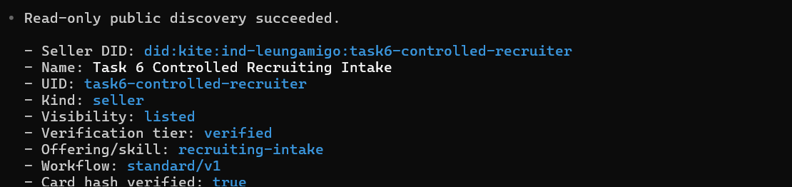

The read-only discovery result shows the controlled Seller as listed and verified, with the `recruiting-intake` offering and `standard/v1` workflow.

Controlled Buyer:

- DID: `did:kite:ind-leungamigo:task6-recruiting-buyer`
- Runtime: `rt_01a0bf07-962e-7bc4-a4cd-d64c8c39efd7`
- Arc Testnet USDC before and after: `20.000000`

Controlled Agreement:

- Agreement ID: `5e6b822b-706f-4933-80b1-5129d9a73685`
- Terms hash: `sha256:1e83ca39e4b5188e1161cccd7aff6d27572cc6500b444664e253d2b559d0a0a7`

Actual lifecycle:

1. Buyer discovered the exact controlled Seller and resolved `recruiting-intake`.
2. Buyer created the Agreement Proposal.
3. Buyer formation signature was created and successfully relayed.
4. The Seller seat received the agreement and serve detected the outstanding formation obligation.

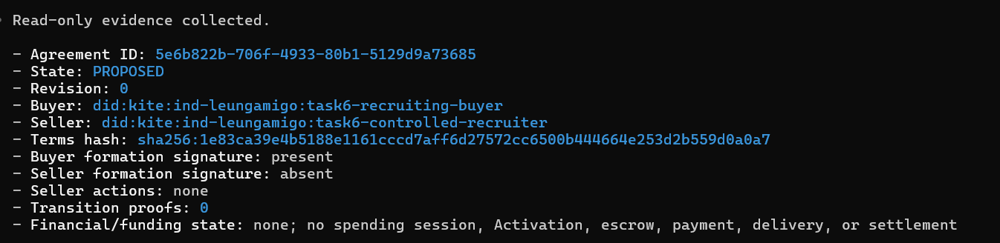

The read-only Agreement evidence shows `PROPOSED` revision 0, the Buyer formation signature present, the Seller formation signature absent, and no financial state.

5. A `decide` work item was created and dispatched to the Codex harness.
6. Repeated decision attempts exceeded the configured five-minute execution budget and ended with `context deadline exceeded`.
7. Retries were exhausted; the decision item was parked and escalated.
8. No manual acceptance was used to bypass autonomous Seller decision processing.
9. Seller serve was later shut down gracefully after evidence collection.

Final Agreement state:

| Field | Final value |
| --- | --- |
| State / revision | `PROPOSED`, revision `0` |
| Buyer formation signature | Present |
| Seller formation signature | Absent |
| Seller actions | None |
| Transition proofs | `0` |
| Financial state | No spending session, Activation, escrow funding, payment, transfer, delivery, or settlement |

Escalation:

- ID: `agent_escalation_01a0ca01-c1c0-746b-92fc-a732a71dc7fc`
- Kind: `parked-item`
- Status: `pending`
- State: `human_action_required`
- Ordinary work pending after escalation: `0`

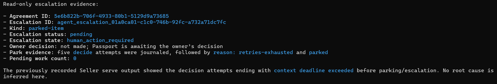

The read-only escalation evidence shows a pending `parked-item` requiring human action after five decision attempts were exhausted; no owner decision had been made.

Harness diagnosis:

- `codex-cli 0.155.1` was authenticated and operational.
- A standalone `codex exec` smoke test completed successfully.
- The Seller decision workload through `kagent` repeatedly ended with `context deadline exceeded`.
- No concrete `kagent 6.7.0` / `codex-cli 0.155.1` compatibility defect was established.
- The precise workload-level cause therefore remains undetermined.

The Advanced CLI experiment exercised real discovery, proposal formation, Seller obligation detection, autonomous decision dispatch, retry, and escalation behavior. It did not reach mutual formation or the financial lifecycle.

---

## 四、截图清单

| 文件 | 对应内容 | 层级 |
| --- | --- | --- |
| `task6.1-passkey-kKassidy.png` | 创建 Passkey | Basic |
| `task6.2.1-circle-faucet-kKassidy.png` | Circle Faucet 获取 20 testnet USDC | Basic |
| `task6.2.2-passport-overview-kKassidy.png` | Passport Overview / USDC 余额 | Basic |
| `task6.3.1-signed-offer-kKassidy.png` | Recruiting Agent 报价 / Signed Offer | Basic |
| `task6.3.2-escrow-fund-kKassidy.png` | Escrow Funding | Basic |
| `task6.3.3-verified-delivery-kKassidy.png` | Verified Delivery | Basic |
| `task6.3.4-payment-released-kKassidy.png` | Payment Released | Basic |
| `task6.4-kite-cli-kKassidy.png` | Kite CLI 安装成功 | Advanced |
| `task6.5-kite-skills-kKassidy.png` | Codex 加载 Kite AI Skills | Advanced |
| `task6.6-passport-login-kKassidy.png` | Passport CLI 登录成功 | Advanced |
| `task6.7-buyer-agent-kKassidy.png` | Buyer Agent 初始化成功 | Advanced |
| `task6.8-seller-discovery-kKassidy.png` | Recruiting Seller Discovery | Advanced |
| `task6.9-agreement-proposed-kKassidy.png` | Hosted Seller Agreement PROPOSED with Buyer formation relay | Advanced / Experiment A |
| `task6.10-controlled-seller-discovery-kKassidy.png` | Controlled Seller listed/verified public discovery | Advanced / Experiment B |
| `task6.11-controlled-agreement-proposed-kKassidy.png` | Controlled Agreement PROPOSED, Buyer formation present, Seller formation absent | Advanced / Experiment B |
| `task6.12-controlled-seller-escalation-kKassidy.png` | Controlled Seller parked-item escalation, pending human action | Advanced / Experiment B |

新增的三张 controlled Seller 截图分别展示公开 discovery、Agreement `PROPOSED` 状态和 parked-item escalation。`learn/kKassidy/images/` 中的其他未跟踪图片是 Playground/Codex 安装与登录画面，不作为 controlled CLI 实验证据；任何含密钥、JWT、runtime token、私钥或 passkey secret 的画面都不应作为提交证据。

如需补充最多三项只读证据，优先安全复现：

1. `ksearch agent search` / `ksearch agent card`：controlled Seller 的 exact DID、listed 状态、`recruiting-intake` 与 `standard/v1`。
2. `kagent agreement status --agreement-id 5e6b822b-706f-4933-80b1-5129d9a73685 --output json`：Buyer formation、`PROPOSED` revision 0 与 terms hash。
3. `kagent escalation list/status` 加 `kagent work pending`：`parked-item`、`human_action_required` 与普通 pending 数量为 0。

---

## 五、总结

本次 Task 6 已完整完成基础层要求，包括 Kite Agent Passport、Passkey、Arc Testnet USDC Faucet，以及 Playground 中的 Signed Offer、Escrow、Verified Delivery 和 Payment Released 等 Agent Payment 核心环节。

进阶层进一步使用 Kite CLI、Codex 与 Kite Skills 创建 Buyer Agent，完成 Passport Authentication、Seller Discovery、Agreement Terms、Buyer Formation Signature 与 Proposal Relay，并建立了一个独立的 controlled Seller 进行真实 Seller-side 处理实验。

| 实验 | 最终状态 |
| --- | --- |
| Basic Playground | Completed simulated lifecycle：`Signed Offer -> Escrow -> Delivery -> Payment Released` |
| Advanced Hosted Seller | Proposal created; Seller did not countersign; request-frame expired without reply |
| Advanced Controlled Seller | Seller registration/listing/serve and Buyer Proposal succeeded; autonomous Seller decision timed out and was parked/escalated; Agreement remained `PROPOSED` |
| Advanced CLI financial movement | `0 USDC` |

因此，本次 Advanced 实验没有完成支付或结算。它成功验证了 CLI discovery、Proposal formation、Seller obligation detection、autonomous decision dispatch、retry 与 escalation，但没有达到 mutual formation，也没有发生任何 USDC movement。
