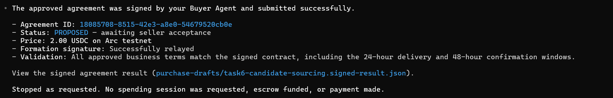

# Task 6：探索 AI Agent 支付新范式——以 Kite AI 为例

> **提交人**：kKassidy  
> **对应课程**：第六章  
> **提交目录**：`learn/kKassidy/task6/`

---

## 一、作业完成情况

### 1.1 基础层（必做）

| 作业要求 | 状态 | 证据 |
| --- | --- | --- |
| 注册 Kite Agent Passport 并创建 Passkey | ✅ 完成 | `task6.1` |
| 使用 Circle Faucet 获取 Arc Testnet USDC | ✅ 完成 | `task6.2.1` |
| Passport 显示测试 USDC 余额 | ✅ 完成 | `task6.2.2` |
| Playground 选择 Recruiting Agent 并确认报价 | ✅ 完成 | `task6.3.1` |
| 接受 Signed Offer 并进入 Escrow Funding | ✅ 完成 | `task6.3.2` |
| Seller Agent 完成交付并通过交付验证 | ✅ 完成 | `task6.3.3` |
| Buyer 接受交付并完成 Payment Released | ✅ 完成 | `task6.3.4` |

### 1.2 进阶层（选做，加分项）

| 作业要求 | 当前状态 | 证据 |
| --- | --- | --- |
| 安装 Kite CLI | ✅ 完成 | `task6.4` |
| 在 Codex 中加载 Kite AI Skills | ✅ 完成 | `task6.5` |
| 登录 Kite Passport CLI | ✅ 完成 | `task6.6` |
| 初始化 Buyer Agent | ✅ 完成 | `task6.7` |
| 搜索并选定 Recruiting Seller Agent | ✅ 完成 | `task6.8` |
| Buyer 创建并签署 Agreement Proposal，formation signature 成功 relay | ✅ 完成 | `task6.9` |
| Seller countersign → Escrow → Delivery → Settlement | ⏳ 后续继续 | 当前等待 Seller acceptance |

> **进阶层当前进度：**截至本次提交，Buyer 已完成 Agreement Proposal 的创建、签署与 relay，协议当前处于 `PROPOSED — awaiting seller acceptance`。Seller 在本次观察窗口内尚未 countersign，因此暂未进入 Advanced escrow/payment 阶段。后续将继续完成剩余 Agent-to-Agent 流程，并补充最终执行结果与证据。

---

## 二、基础层执行记录

### 2.1 创建 Kite Agent Passport 与 Passkey

在 Kite Agent Passport 完成账号注册，并创建 Passkey，用于后续账户授权。


---

### 2.2 获取 Arc Testnet USDC

通过 Circle Faucet 向 Kite Passport 钱包领取 Arc Testnet USDC。

| 项目 | 内容 |
| --- | --- |
| Network | Arc Testnet |
| Token | USDC |
| Faucet 数量 | 20 testnet USDC |
| Passport Wallet | `0x4c7F34Fb286d1847Bf4d93f0617b5338f270042A` |

Circle Faucet 显示测试代币发送成功：


随后在 Kite Passport Overview 中确认测试 USDC 余额：


---

### 2.3 Playground：与 Recruiting Agent 完成基础交互

在 Playground 中选择 Hiring 场景，与 Simulated Recruiting Agent 进行 Buyer / Seller 教程交互。

服务内容：

`One sourced candidate with buyer-confirmed interest for a described role`

报价：

`2.00 USDC`

首先查看并接受 Signed Offer：


接受报价后，流程进入 Escrow Funding 阶段：


Seller 随后完成交付，Playground 显示 `VERIFIED DELIVERY`，并出现 `Accept and release 2.00 USDC`：


确认接受交付后，Playground 最终显示 `Payment Released`：


本次 Playground 最终界面显示：

- `Payment Released`
- `Paid to seller 2.00 USDC`
- `Escrow released`

> **说明：**以上 Basic 流程运行于 Kite Playground 的 tutorial / simulated Recruiting Agent 场景。这里记录的是 Playground 展示的完整教程状态流，不将其中的 `Payment Released` 单独表述为已经独立验证的真实链上 2 USDC 转账。Circle Faucet 领取的 20 USDC 为 Arc Testnet 测试代币。

---

## 三、进阶层：Kite CLI + Codex + Buyer Agent

### 3.1 安装 Kite CLI

在 WSL 环境中安装 Kite CLI 及相关组件。

安装结果：

| Component | Version |
| --- | --- |
| `kpass` | 6.7.0 |
| `kagent` | 6.7.0 |
| `kite-agent-handler` | 6.7.0 |
| `ksearch` | 6.7.0 |
| Skills | 3.4.0 |


---

### 3.2 在 Codex 中加载 Kite AI Skills

安装 Codex，并在 Task 6 工作目录中配置 Kite Skills。

重新启动后，Codex 成功识别 Buyer Agent、Seller Discovery、Purchase 等 Kite Skills。


---

### 3.3 登录 Kite Passport CLI

通过 Kite Passport CLI 完成认证，并建立 active session。


---

### 3.4 初始化 Buyer Agent

创建本次 Task 6 使用的 Buyer Agent。

| 项目 | 内容 |
| --- | --- |
| Buyer UID | `task6-recruiting-buyer` |
| Buyer DID | `did:kite:ind-leungamigo:task6-recruiting-buyer` |
| Runtime Binding | Active |
| Network | Arc Testnet |


---

### 3.5 Seller Discovery

通过 Kite Agent Discovery 搜索 Recruiting / Candidate Sourcing 相关 Seller Agent。

本次选择：

| 项目 | 内容 |
| --- | --- |
| Seller | `recruiting-claude` |
| Seller DID | `did:kite:ind-lyon:recruiting-claude` |
| Offer | `candidate-sourcing` |
| Price | `2.00 USDC` |
| Protocol | `standard/v1` |


---

### 3.6 创建并签署 Agreement Proposal

Buyer 针对 Senior Backend Engineer (Go) 招聘需求生成协议条款，并执行 Agreement Proposal。

Buyer formation signature 已成功 relay。

| 项目 | 内容 |
| --- | --- |
| Agreement ID | `18085708-8515-42e3-a8e0-54679520cb0e` |
| Seller | `did:kite:ind-lyon:recruiting-claude` |
| Offer | `candidate-sourcing` |
| Price | `2.00 USDC` |
| Status | `PROPOSED — awaiting seller acceptance` |



截至本次提交，在观察窗口内 Seller 尚未 countersign。

当前 Advanced 执行链路：

```text
Kite CLI / Skills
        ↓
Passport Authentication
        ↓
Buyer Agent
        ↓
Seller Discovery
        ↓
Agreement Terms
        ↓
Buyer Formation Signature
        ↓
Proposal Relayed
        ↓
PROPOSED — awaiting seller acceptance
```

Buyer 侧 Proposal 与 formation signature 已成功提交。当前没有进行 Advanced escrow funding 或 payment。

**后续计划：**

待继续执行 Advanced 流程后，将在本作业基础上补充：

```text
Seller Countersign
        ↓
Escrow Funding
        ↓
Seller Delivery
        ↓
Buyer Verification
        ↓
Accept / Reject
        ↓
Payment Release / Refund
        ↓
Final State
```

并追加对应截图与最终执行结果。

---

## 四、截图清单

| 文件 | 对应内容 | 层级 |
| --- | --- | --- |
| `task6.1-passkey-kKassidy.png` | 创建 Passkey | Basic |
| `task6.2.1-circle-faucet-kKassidy.png` | Circle Faucet 获取 20 testnet USDC | Basic |
| `task6.2.2-passport-overview-kKassidy.png` | Passport Overview / USDC 余额 | Basic |
| `task6.3.1-signed-offer-kKassidy.png` | Recruiting Agent 报价 / Signed Offer | Basic |
| `task6.3.2-escrow-fund-kKassidy.png` | Escrow Funding | Basic |
| `task6.3.3-verified-delivery-kKassidy.png` | Verified Delivery | Basic |
| `task6.3.4-payment-released-kKassidy.png` | Payment Released | Basic |
| `task6.4-kite-cli-kKassidy.png` | Kite CLI 安装成功 | Advanced |
| `task6.5-kite-skills-kKassidy.png` | Codex 加载 Kite AI Skills | Advanced |
| `task6.6-passport-login-kKassidy.png` | Passport CLI 登录成功 | Advanced |
| `task6.7-buyer-agent-kKassidy.png` | Buyer Agent 初始化成功 | Advanced |
| `task6.8-seller-discovery-kKassidy.png` | Recruiting Seller Discovery | Advanced |
| `task6.9-agreement-proposed-kKassidy.png` | Agreement PROPOSED | Advanced |

---

## 五、总结

本次 Task 6 已完整完成基础层要求，包括 Kite Agent Passport、Passkey、Arc Testnet USDC Faucet，以及 Playground 中的 Signed Offer、Escrow、Verified Delivery 和 Payment Released 等 Agent Payment 核心环节。

进阶层进一步使用 Kite CLI、Codex 与 Kite Skills 创建 Buyer Agent，并完成 Passport Authentication、Seller Discovery、Agreement Terms、Buyer Formation Signature 与 Proposal Relay。

截至本次提交，Advanced Agreement 当前状态为：

`PROPOSED — awaiting seller acceptance`

Seller 尚未在本次观察窗口内 countersign，因此本次阶段性提交没有将 Advanced escrow/payment 描述为已经完成。后续将继续执行剩余 Agent-to-Agent 流程，并在完成后更新本作业的最终状态和相关证据。
