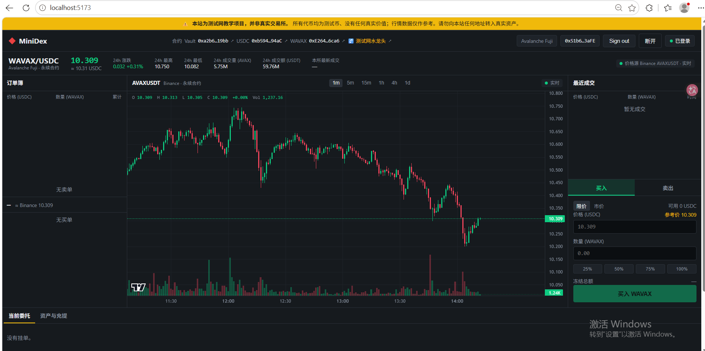
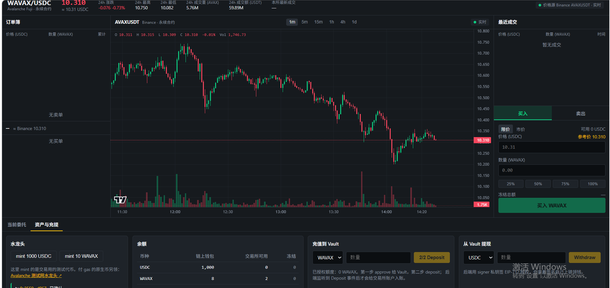
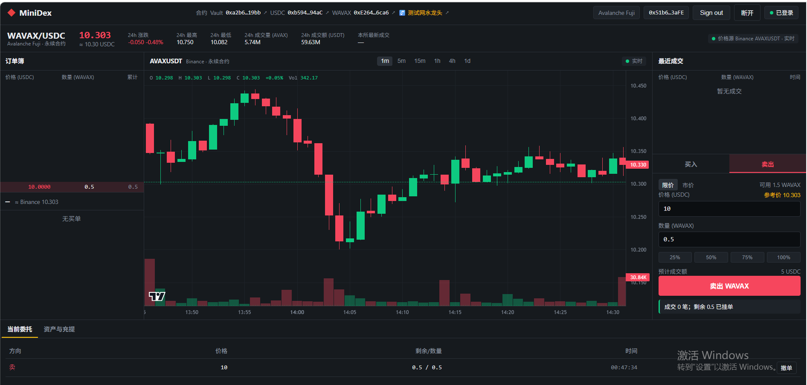
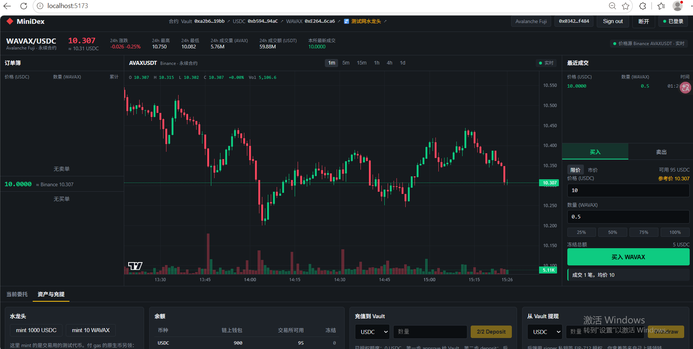
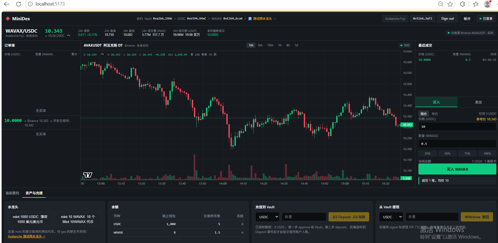

# Task7 - Perp DEX 实战

## 代码仓库

- Repository: https://github.com/kKassidy/Mini-DEX
- Matching Engine commit: `a65345a`
- Fuji Deployment commit: `4d1d43c`

---

## 1. 撮合引擎

已完成撮合引擎测试，并补充：

- 时间优先（FIFO / Price-Time Priority）测试
- Self-trade（自成交）拒绝测试

测试结果：

```text
Test Files  5 passed (5)
Tests       48 passed (48)


```

Self-trade protection 在订单真正进入撮合流程前进行检查，拒绝会实际与同一 owner 的挂单发生撮合的 incoming order，并保持订单簿和账户状态不被部分修改。

---

## 2. 合约部署到 Avalanche Fuji

### Forge 测试

```text
Ran 13 tests for test/Vault.t.sol:VaultTest
Suite result: ok. 13 passed; 0 failed; 0 skipped
```

### Fuji 合约地址

- Vault: `0xa2b6d2fCC478343c476B24F02200742359E419bb`
- USDC: `0xb5941598c52f45f4EC74CE1024071b25215094aC`
- WAVAX: `0xE264Ba0984957f1aa80e7a536Dae61A9EF1F6ca6`

Network: Avalanche Fuji (Chain ID `43113`)

### Deposit

完成一笔真实 Fuji 链上 deposit：

- Token: WAVAX
- Amount: `2 WAVAX`
- Transaction Hash: `0xac2a2b6620fb6ff05031e453f4e459b05916f2282b58711f7febe508eccf5cfa`
- Block: `58711655`

---

## 3. 端到端演示

### 登录成功

钱包连接 Avalanche Fuji，并通过签名完成登录：



### 余额显示

Deposit 后前端能够正确显示链上钱包余额及交易所可用余额：



### 两个不同地址完成成交

本次成交使用两个不同的钱包地址：

- Seller / Maker: `0x51b682f07424b124992C0a42600dCa15c4383aFE`
- Buyer / Taker: `0x0342ed8eaC11a52C247C9428c450A7288b72f484`
- Trade: `0.5 WAVAX @ 10 USDC`
- Quote Amount: `5 USDC`

卖方挂单：



买方成交：



卖方成交后的余额 / 成交记录：



成交后的余额变化与交易一致：

- Seller: `2 WAVAX → 1.5 WAVAX`，获得 `5 USDC`
- Buyer: `100 USDC → 95 USDC`，获得 `0.5 WAVAX`

### Withdraw

完成一笔真实 Fuji 链上 withdraw：

- Token: USDC
- Amount: `1 USDC`
- Transaction Hash: `0xea0d9ab9f7142191db60ddefa5054882e71273d886c5fdf3dfd8be8c00edb599`
- Block: `58713546`

Withdraw 后链上 USDC 钱包余额为 `1001 USDC`。

---

## 基础任务完成情况

- [x] `npm test` 全部通过
- [x] 时间优先测试
- [x] Self-trade 拒绝测试
- [x] `forge test` 全部通过
- [x] 3 个 Fuji 合约地址
- [x] 真实 Deposit + tx hash
- [x] 登录成功截图
- [x] 余额显示截图
- [x] 两个不同地址完成成交
- [x] 真实 Withdraw + tx hash

---

## 进阶项：AI 安全审查 + 修复真实问题（8 分）

本项工作对应 8 分进阶评分项，独立于基础任务的 Self-trade 要求。

- 修复提交：[2bfa39f — [Task7] Fix dust deposit ingestion DoS](https://github.com/kKassidy/Mini-DEX/commit/2bfa39f)
- 安全报告：[SECURITY_REVIEW.md（main）](https://github.com/kKassidy/Mini-DEX/blob/main/SECURITY_REVIEW.md)；[修复提交中的报告快照](https://github.com/kKassidy/Mini-DEX/blob/2bfa39f/SECURITY_REVIEW.md)

### 发现与修复

AI 辅助源码安全审查发现：合法的 dust WAVAX 存款可能中断存款事件处理或恢复。WAVAX 使用 18 位小数，链下账本使用 8 位小数，小于 `10^10 wei` 的存款换算后为 `0n`。此前该值传入 `Ledger.credit(0)` 会抛出异常，可能阻止实时批次中后续有效事件入账，或中断历史重放，使恢复不完整。

修复在 `server/src/chain.ts` 中仅跳过换算金额为 `0n` 的 Deposit 事件，使用 `continue` 而非 `return`，确保后续事件继续处理。`Ledger.credit` 的金额必须为正的不变量保持不变，无关错误不会被静默吞掉。

### 回归验证与范围

- 新增 `server/src/chain.test.ts`，8 个新增链事件测试通过；服务端完整测试共 6 个文件、56 个测试通过。
- 覆盖历史重放 dust + 有效存款、实时 dust + 有效存款、换算边界、正常 WAVAX/USDC 存款、无关回调错误，以及提现行为保持不变。
- Typecheck 与 `git diff --check` 均通过。

上述问题使用 mocked/in-memory 输入复现；报告未声称存在真实链上利用交易。审查还识别了其他问题，但本补丁未修复这些问题，也不将其列为已完成的进阶任务。
