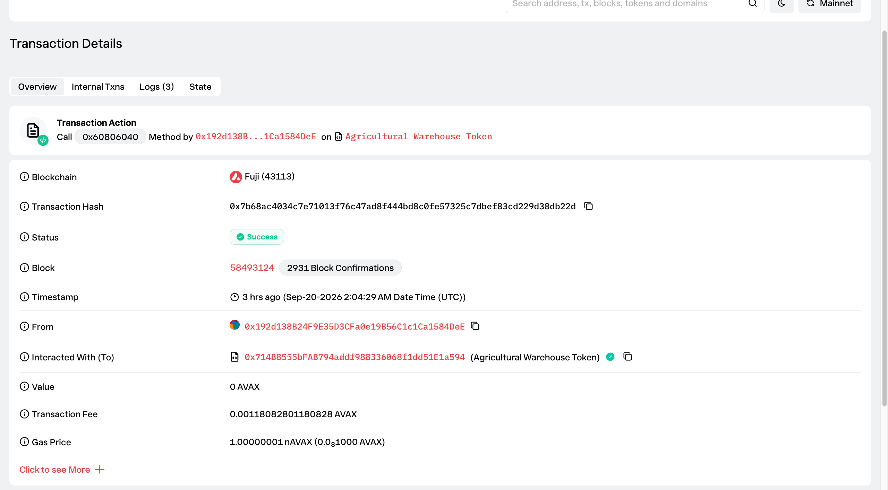
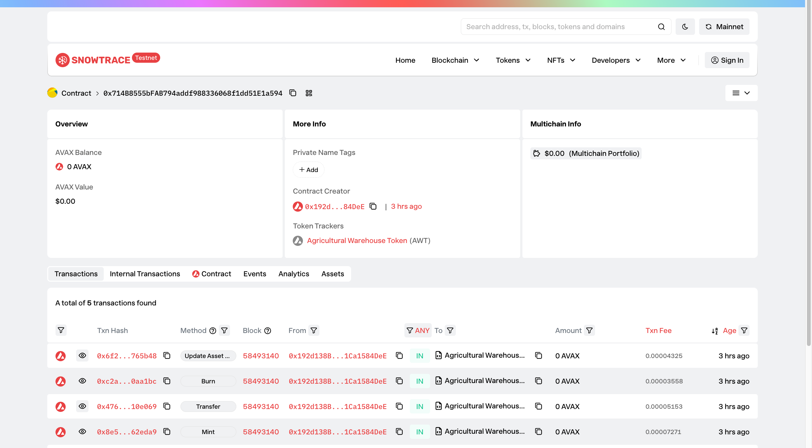
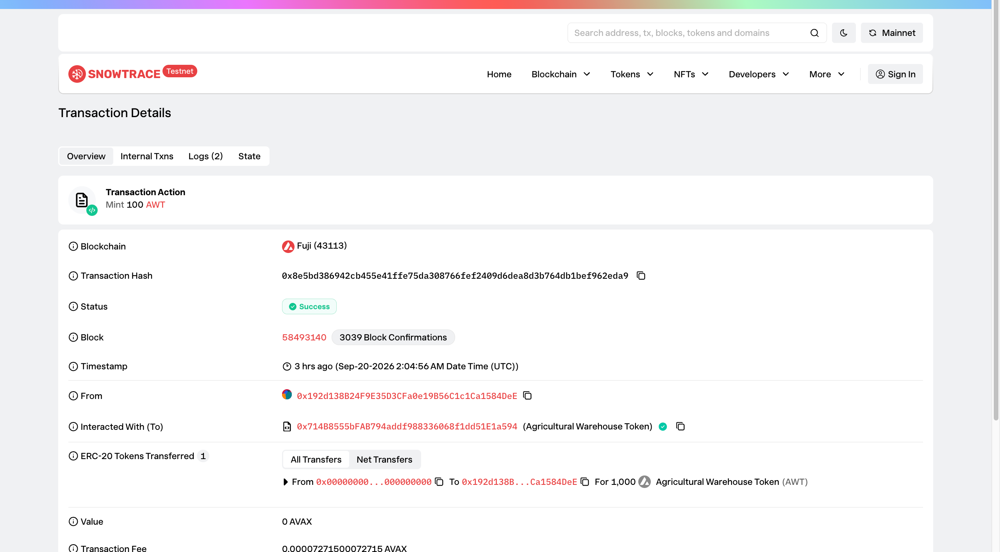
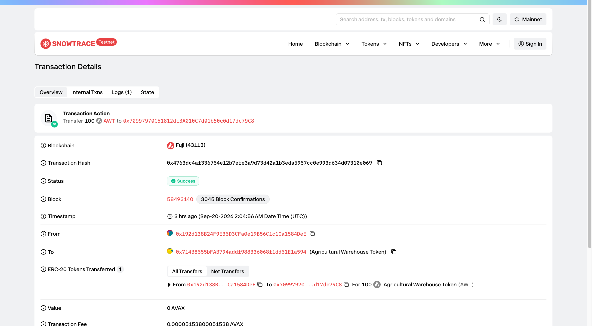
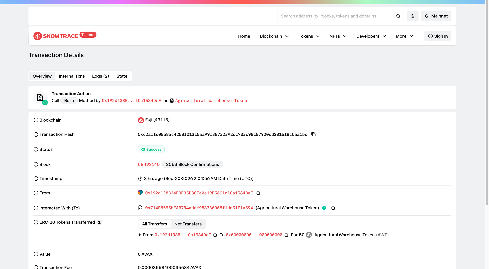

# Task 5 Avalanche RWA Token 合约实战

> 对应课程：RWA Token 合约实战  
> GitHub 用户名：`lucasoffchain`  
> 代码仓库：[https://github.com/lucasoffchain/ava-rwa](https://github.com/lucasoffchain/ava-rwa)  
> **本作业仅用于技术学习和业务模拟，不涉及真实资产募集、投资建议或金融产品发行。**

## 1. 学员信息


| 项目         | 内容                                                                                                                                  |
| ---------- | ----------------------------------------------------------------------------------------------------------------------------------- |
| GitHub 用户名 | `lucasoffchain`                                                                                                                     |
| 作业项目仓库     | [https://github.com/lucasoffchain/ava-rwa](https://github.com/lucasoffchain/ava-rwa)                                                |
| 主合约        | `[src/AgriculturalWarehouseToken.sol](https://github.com/lucasoffchain/ava-rwa/blob/main/src/AgriculturalWarehouseToken.sol)`       |
| 测试         | `[test/AgriculturalWarehouseToken.t.sol](https://github.com/lucasoffchain/ava-rwa/blob/main/test/AgriculturalWarehouseToken.t.sol)` |


## 2. RWA 业务场景：农产品仓单

选择场景：**农产品仓单**（Grade A 咖啡豆电子仓单）。

### 2.1 该 Token 对应的现实资产是什么？

`Agricultural Warehouse Token`（`AWT`）对应指定仓库中保管、并经质检合格的 **Grade A 咖啡豆**实物仓单权益。

### 2.2 谁负责资产托管或提供资产证明？

- **实物托管**：持牌仓储机构负责入库、保管与出库。
- **资产证明**：独立检验/审计机构出具数量、等级与定期盘点报告。
- **本作业实现**：链上仅保存模拟的 IPFS URI 作为报告索引，不连接真实托管系统。


### 2.3 一个 Token 对应多少现实资产或收益权？

`1 AWT = 1 千克咖啡豆仓单权益`。合约 `decimals()` 为 `0`，不允许拆分为不足一千克的单位。

### 2.4 Token 的发行、转让、销毁分别代表什么业务行为？


| 链上操作          | 业务含义                               |
| ------------- | ---------------------------------- |
| 发行 `mint`     | 咖啡豆确认入库后，按实际千克数铸造仓单 Token          |
| 转让 `transfer` | 仓单权益在账户之间转移                        |
| 销毁 `burn`     | 持有人提取实物或完成线下赎回时销毁 Token，避免同一资产重复流通 |


### 2.5 资产证明信息的作用

合约保存 `assetDocument`（如 `ipfs://...` 报告 URI/哈希）。真实 RWA 项目中，它可作为链上可审计的报告索引，供投资者与审计方追踪版本；**合约本身不验证线下报告真实性**，真实性仍依赖托管与审计流程。

## 3. 合约功能说明

基于 OpenZeppelin `ERC20` + `ERC20Burnable` + `AccessControl`：


| 功能             | 实现                                                                          |
| -------------- | --------------------------------------------------------------------------- |
| Token 名称 / 符号  | `Agricultural Warehouse Token` / `AWT`                                      |
| 发行             | `mint(address to, uint256 amount)`，仅 `MINTER_ROLE`                          |
| 销毁             | `burn` / `burnFrom`                                                         |
| 转账 / 余额 / 总供应量 | 标准 ERC-20                                                                   |
| 资产证明更新         | `updateAssetDocument(string)`，仅 `ASSET_MANAGER_ROLE`                        |
| 资产证明查询         | `assetDocument()`                                                           |
| 关键事件           | `TokensIssued`、`TokensRedeemed`、`AssetDocumentUpdated`，以及 ERC-20 `Transfer` |


## 4. Avalanche Fuji 部署信息


| 项目        | 内容                                                                                                                                                                             |
| --------- | ------------------------------------------------------------------------------------------------------------------------------------------------------------------------------ |
| 网络名称      | Avalanche Fuji C-Chain                                                                                                                                                         |
| Chain ID  | `43113`                                                                                                                                                                        |
| RPC       | `https://api.avax-test.network/ext/bc/C/rpc`                                                                                                                                   |
| 部署账户      | `0x192d138B24F9E35D3CFa0e19B56C1c1Ca1584DeE`                                                                                                                                   |
| 合约地址      | `[0x714B8555bFAB794addf988336068f1dd51E1a594](https://testnet.snowtrace.io/address/0x714B8555bFAB794addf988336068f1dd51E1a594)`                                                |
| 部署交易      | `[0x7b68ac4034c7e71013f76c47ad8f444bd8c0fe57325c7dbef83cd229d38db22d](https://testnet.snowtrace.io/tx/0x7b68ac4034c7e71013f76c47ad8f444bd8c0fe57325c7dbef83cd229d38db22d)`     |
| Routescan | [https://43113.testnet.routescan.io/address/0x714B8555bFAB794addf988336068f1dd51E1a594](https://43113.testnet.routescan.io/address/0x714B8555bFAB794addf988336068f1dd51E1a594) |


### 交互交易


| 操作                 | 交易哈希                                                                                                                                                                       |
| ------------------ | -------------------------------------------------------------------------------------------------------------------------------------------------------------------------- |
| 发行 `mint(1000)`    | `[0x8e5bd386942cb455e41ffe75da308766fef2409d6dea8d3b764db1bef962eda9](https://testnet.snowtrace.io/tx/0x8e5bd386942cb455e41ffe75da308766fef2409d6dea8d3b764db1bef962eda9)` |
| 转账 `transfer(100)` | `[0x4763dc4af336754e12b7efe3a9d73d42a1b3eda5957cc0e993d634d07310e069](https://testnet.snowtrace.io/tx/0x4763dc4af336754e12b7efe3a9d73d42a1b3eda5957cc0e993d634d07310e069)` |
| 销毁 `burn(50)`      | `[0xc2affc08b8ac4250f01315aa99f38732392c1703c98187920cd2015f8c0aa1bc](https://testnet.snowtrace.io/tx/0xc2affc08b8ac4250f01315aa99f38732392c1703c98187920cd2015f8c0aa1bc)` |
| 更新资产证明             | `[0x6f2a2a452863b07ab377c9b36e169accf4aeff0383a585493b16666938765b48](https://testnet.snowtrace.io/tx/0x6f2a2a452863b07ab377c9b36e169accf4aeff0383a585493b16666938765b48)` |


### 链上校验结果

- `name`：`Agricultural Warehouse Token`
- `symbol`：`AWT`
- `totalSupply`：`950`
- 部署者余额：`850`
- 接收方 `0x70997970C51812dc3A010C7d01b50e0d17dc79C8` 余额：`100`
- `assetDocument`：`ipfs://bafy-example-coffee-custody-report-v2`


## 5. 测试说明

本地使用 Foundry，覆盖任务要求场景：

- 合约部署成功、初始 Token 信息正确
- 授权账户可发行；非授权账户不可发行
- 持有人可转账；Token 可销毁
- 总供应量与账户余额变化正确
- 非授权账户不可修改资产证明
- 超余额销毁、空文档、重复文档、无效管理员等错误操作被拒绝

```bash
forge test -vv
# 14 passed
```


## 6. 截图材料


| 说明           | 文件                                                  |
| ------------ | --------------------------------------------------- |
| 合约部署成功       |  |
| 区块浏览器 / 部署交易 |      |
| Token 发行     |              |
| Token 转账     |      |
| Token 销毁     |              |

## 7. 风险边界

- 合约不验证咖啡豆是否真实存在、质量是否达标，也不能阻止虚假或过期报告。
- Token 不自动产生收益，也不保证可按任何价格出售或赎回。
- 管理员可增减授权账户；正式项目应使用多签、时间锁、发行上限与职责分离。
- 资产丢失、重复质押、法律权属、赎回执行与监管合规属于链下风险。

