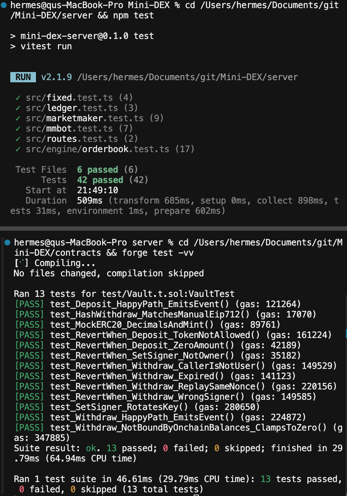
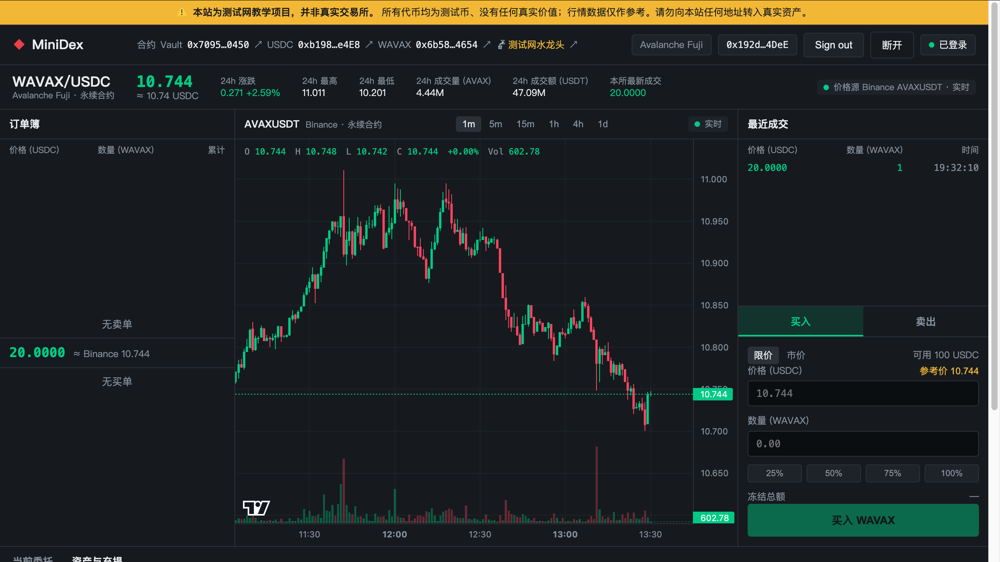
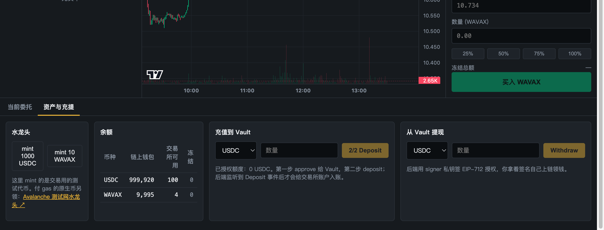
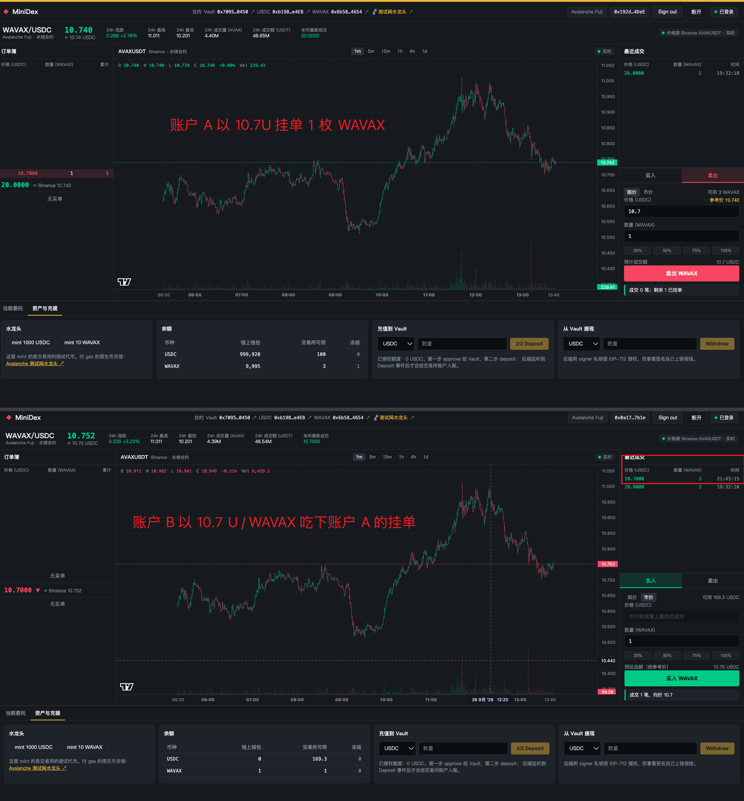

# Task 7 提交记录

- 代码仓库：<https://github.com/lucasoffchain/Mini-DEX>

## npm test 与 forge test 全绿

上：`server` 下 `npm test`，6 个文件 42 个用例全部通过。下：`contracts` 下 `forge test -vv`，13 个用例全部通过。



## 1. 撮合引擎

- `server/src/engine/orderbook.ts`：新增自成交拒绝（`SelfTradeError`）。撮合前按撮合顺序预演，taker 吃完之前会碰到同一地址的挂单就整单拒绝，簿不变、不产生部分成交。
- `server/src/routes.ts`：订单被拒时把下单前冻结的余额退回。
- 新增测试（`server/src/engine/orderbook.test.ts`、`server/src/routes.test.ts`）：
  - 时间优先：同价多单按提交顺序成交，部分成交的单保持队首，后来的单排队尾
  - 时间优先：撤掉队首后下一个最早的单接上
  - 拒绝自成交：limit 单吃到自己挂单整单拒绝，簿不变
  - 拒绝自成交：先吃别人再碰到自己也整单拒绝，不能部分成交
  - 自成交检查只看真正会成交的部分（数量 / 价格够不着自己的单则正常成交）
  - 接口层：自成交被拒后余额与下单前一致；不同地址正常成交并结算

```
$ cd server && npm test
 ✓ src/fixed.test.ts (4 tests)
 ✓ src/ledger.test.ts (3 tests)
 ✓ src/marketmaker.test.ts (9 tests)
 ✓ src/mmbot.test.ts (7 tests)
 ✓ src/engine/orderbook.test.ts (17 tests)
 ✓ src/routes.test.ts (2 tests)
 Test Files  6 passed (6)
      Tests  42 passed (42)
```

## 2. Fuji 合约

```
$ cd contracts && forge test
Suite result: ok. 13 passed; 0 failed; 0 skipped
```

| 合约 | 地址 | 部署 tx |
| --- | --- | --- |
| Vault | [0x7095da9ba2e20Abf6bE497D1b0378abE7f420450](https://testnet.snowtrace.io/address/0x7095da9ba2e20Abf6bE497D1b0378abE7f420450) | [0xec131d77…56e7ea](https://testnet.snowtrace.io/tx/0xec131d77f8223e05b3fb0d296ad2baf0705c687ece2e2941f98399f60756e7ea) |
| USDC (MockERC20, 6 位) | [0xb198Bf2460F12bc65E811042df7c2582e439e4E8](https://testnet.snowtrace.io/address/0xb198Bf2460F12bc65E811042df7c2582e439e4E8) | [0xf0d54042…3281a0](https://testnet.snowtrace.io/tx/0xf0d540423197efc859a073ca3a71eb067aab8b4becf77ef3c85d12700c3281a0) |
| WAVAX (MockERC20, 18 位) | [0x6b5895E0c80a41139F07dE2A9F5F3673931d4654](https://testnet.snowtrace.io/address/0x6b5895E0c80a41139F07dE2A9F5F3673931d4654) | [0xb258154d…a148a](https://testnet.snowtrace.io/tx/0xb258154dc75e553c817128c97c7bc3fcf0ce5a26dec3968779ff67b93baa148a) |

- 部署者：`0x192d138B24F9E35D3CFa0e19B56C1c1Ca1584DeE`，Vault 部署区块 58743953
- Vault.signer（后端签 Withdraw 授权）：`0xF19Ae9528424B3d23faC15913fBB7194B10C2467`

**Deposit tx**（A 充值 100 USDC）：[0x391c2965b23247e1b227c679f7a11633345ced023a37d355b8ed50a2a7a91fa0](https://testnet.snowtrace.io/tx/0x391c2965b23247e1b227c679f7a11633345ced023a37d355b8ed50a2a7a91fa0)

## 3. 端到端演示

两个地址：A `0x192d138B24F9E35D3CFa0e19B56C1c1Ca1584DeE`，B `0x0a170f2eff9606FAc7645E59b8D164710b847b1e`。
由 `server/scripts/fuji-demo.ts`（`npm run fuji:demo`）对着链上模式的 server 跑出：

| 步骤 | tx hash |
| --- | --- |
| A deposit 100 USDC | [0x391c2965…a91fa0](https://testnet.snowtrace.io/tx/0x391c2965b23247e1b227c679f7a11633345ced023a37d355b8ed50a2a7a91fa0) |
| A deposit 5 WAVAX | [0x63d88d75…f3c7](https://testnet.snowtrace.io/tx/0x63d88d7537a8bea299a1132715425dc8381bb169d1e0b645cf3de2f5becdf3c7) |
| B deposit 200 USDC | [0x4cfd5933…c977](https://testnet.snowtrace.io/tx/0x4cfd5933181864a82a39a918d65e9124395f2d662e50a6cf1cc7f1600715c977) |
| 成交（链下）：A sell limit 1 WAVAX @ 20（maker）× B buy market 1 WAVAX（taker）→ 1 @ 20 | — |
| **B withdraw 1 WAVAX** | [0x3fb6acf4bf365a1ecc21a929d3a085530f9ec902a03f41231a11094fa214c82f](https://testnet.snowtrace.io/tx/0x3fb6acf4bf365a1ecc21a929d3a085530f9ec902a03f41231a11094fa214c82f) |
| **A withdraw 20 USDC** | [0x8677dafb1d901853b50a3d55d3f996aaf7a6ad280a521b2d923e7c636d724bfe](https://testnet.snowtrace.io/tx/0x8677dafb1d901853b50a3d55d3f996aaf7a6ad280a521b2d923e7c636d724bfe) |

成交后交易所余额：A = 100 USDC / 4 WAVAX，B = 180 USDC / 0 WAVAX（B 买到的 1 WAVAX 已提到链上）。

### 登录成功

账户 A 用 MetaMask 在 Avalanche Fuji 上签 EIP-712 登录，右上角显示 `0x192d…4DeE` / 已登录；右侧"最近成交"里是 A、B 之间那笔 1 WAVAX @ 20。



### 余额显示

链上钱包 999,920 USDC / 9,995 WAVAX；交易所可用 100 USDC / 4 WAVAX（充值 100 USDC + 5 WAVAX，卖出 1 WAVAX 得 20 USDC，再提走 20 USDC）。



### 两地址成交（网页端）

上：账户 A `0x192d…4DeE` 限价卖出 1 WAVAX @ 10.7，挂单后 WAVAX 可用 3、冻结 1。
下：账户 B `0x0a17…7b1e` 市价买入 1 WAVAX，吃下 A 的挂单，"成交 1 笔，均价 10.7"；最近成交新增 10.7 × 1（21:45:15），B 交易所余额变为 169.3 USDC / 1 WAVAX。



## 4. 进阶：做市机器人，买卖两侧各 3 档

- `server/src/mmbot.ts`：报价逻辑（参考价 → 两侧各 3 档梯子；只挂不吃；Binance / 本所盘口 / 兜底价三级回退）
- `server/scripts/mm-bot.ts`：独立进程，EIP-712 登录后通过 HTTP API 增量挂撤单（`npm run mm:bot`）
- `server/src/mmbot.test.ts`：7 个用例，含"和撮合引擎联动后簿上两侧各 3 档、mid 跳动后先撤后挂不自成交"

离线模式实跑输出：

```
[mm-bot] mid=10.8455 (binance) 撤 0 挂 6 | 买 [1@10.8346, 1@10.8238, 1@10.8129] 卖 [1@10.8564, 1@10.8672, 1@10.8781]
GET /orderbook → {"bids":[["10.8346","1"],["10.8238","1"],["10.8129","1"]],"asks":[["10.8564","1"],["10.8672","1"],["10.8781","1"]]}
```
