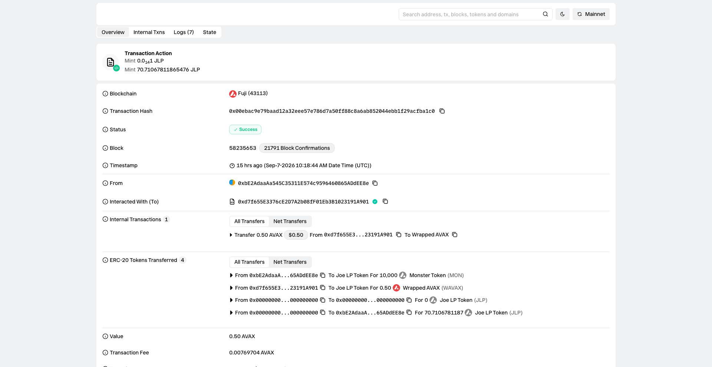
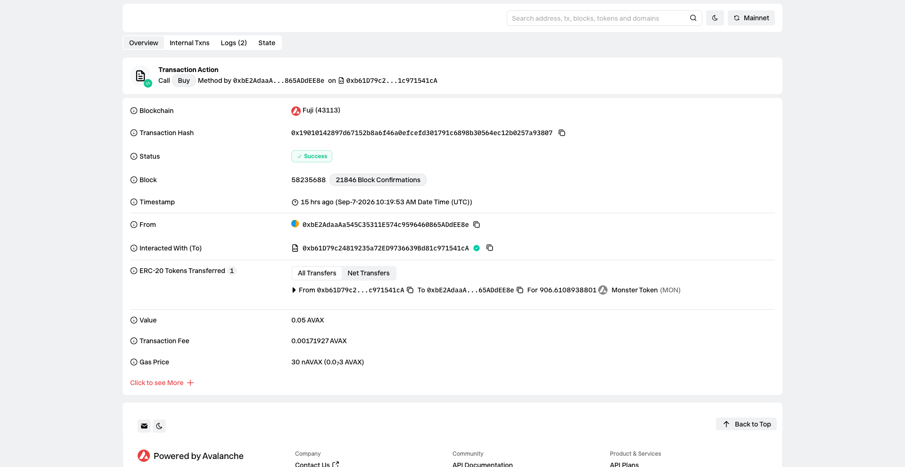

# Task 3：使用 DEX Oracle 获取代币价格

> 对应课程：第三章 Solidity 合约实战  
> 截止提交：<9月13日> 24:00:00 (UTC+8)  
> 学员：monstersquad227


## 使用的 DEX 与地址

| 项目 | 内容 |
| --- | --- |
| DEX 名称 | **LFJ (Pangolin) V1** |
| 网络 | Avalanche Fuji C-Chain (43113) |
| Factory V1 | `0xF5c7d9733e5f53abCC1695820c4818C59B457C2C` |
| Router V1 | `0xd7f655E3376cE2D7A2b08fF01Eb3B1023191A901` |
| WAVAX (Token B) | `0xd00ae08403B9bbb9124bB305C09058E32C39A48c` |


---

## Token A 与 Token B

| Token | 名称 | 合约地址 | Decimals |
| --- | --- | --- | --- |
| Token A | MonsterToken (MON) | `0x864FD7584ab2E9CF5e6B10BC59D81c0144D919ea` | 18 |
| Token B | WAVAX | `0xd00ae08403B9bbb9124bB305C09058E32C39A48c` | 18 |

> MON 与 WAVAX 均为 18 位精度，价格计算无需额外精度换算。

---

## 交易对

| 项目 | 内容 |
| --- | --- |
| 交易对 | MON / WAVAX |
| 交易对地址 | `0x3a67C1f5a08A968B6c5d6Cc67F5a59E55d082201` |
| 创建交易对 Tx | `0x1652dc3006d9bfdf5a68c3f2db95f5ddac357d12987742a2edb3e331bd101c00` |
| 添加流动性 Tx | `0x00ebac9e79baad12a32eee57e786d7a50ff88c8a6ab852044ebb1f29acfba1c0` |
| Explorer | [Snowtrace Pair](https://testnet.snowtrace.io/address/0x3a67C1f5a08A968B6c5d6Cc67F5a59E55d082201) |

初始流动性：10,000 MON + 0.5 AVAX → 初始价格 1 MON = 0.00005 AVAX

---

## 添加流动性或创建交易对的截图



---

## 获取 Swap/Oracle 价格的核心代码

业务合约 `DEXPricedTokenSale` 中，价格获取采用**双通道**设计，无任何硬编码价格常量：

### 方式一：Pair Oracle — 读取交易对储备量

```solidity
/// @notice DEX 预言机价格：1 MON = ? WAVAX（18 位精度）
///         直接来自交易对储备量 rWAVAX / rMON
function getTokenPriceInAVAX() public view returns (uint256) {
    (uint112 r0, uint112 r1, ) = pair.getReserves();
    (uint256 rMON, uint256 rWAVAX) = pair.token0() == address(mon) ? (r0, r1) : (r1, r0);
    require(rMON > 0 && rWAVAX > 0, "Sale: pair has no liquidity");
    return (rWAVAX * PRECISION) / rMON;
}
```

### 方式二：Router Quoter — 获取含手续费的 Swap 报价

```solidity
/// @notice Router 报价：支付 avaxAmount 能兑换多少 MON（含 0.3% 手续费的真实 Swap 报价）
function getQuoteForAVAX(uint256 avaxAmount) public view returns (uint256) {
    address[] memory path = new address[](2);
    path[0] = wavax;
    path[1] = address(mon);
    return router.getAmountsOut(avaxAmount, path)[1];
}

/// @notice Router 报价：购买 monAmount 需要支付多少 WAVAX
function getQuoteForMON(uint256 monAmount) public view returns (uint256) {
    address[] memory path = new address[](2);
    path[0] = address(mon);
    path[1] = wavax;
    return router.getAmountsOut(monAmount, path)[1];
}
```


---

## 使用价格的合约核心代码

### 核心业务函数 `buy()`—— 购买数量完全由 DEX 报价决定

```solidity
/// @notice 核心业务：用 AVAX 购买 MON
///         购买数量完全由 DEX 的 Router Swap 报价决定（含手续费与滑点），价格未写死
function buy() external payable {
    require(msg.value > 0, "Sale: zero AVAX");

    // 价格来源 1：交易对储备的边际价格，记入事件作为链上证据
    uint256 dexPrice = getTokenPriceInAVAX();
    // 价格来源 2：Router 的真实 Swap 报价（决定购买数量）
    uint256 monOut = getQuoteForAVAX(msg.value);

    require(monOut > 0, "Sale: zero output");
    require(monOut <= mon.balanceOf(address(this)), "Sale: insufficient MON inventory");

    mon.transfer(msg.sender, monOut);
    emit Bought(msg.sender, msg.value, monOut, dexPrice);
}
```

关键设计点：
- `buy()` 不接收任何价格参数，购买数量由 `getQuoteForAVAX(msg.value)` 实时从 DEX Router 获取
- 每次成交都在 `Bought` 事件中记录 `dexPrice`，作为 "价格来自 DEX 且被实际使用" 的链上证据
- 合约内没有任何诸如 `price = 0.00005 ether` 之类的写死价格

---

## 部署后的合约地址

| 合约 | 地址 | Explorer |
| --- | --- | --- |
| MonsterToken (MON) | `0x864FD7584ab2E9CF5e6B10BC59D81c0144D919ea` | [Snowtrace](https://testnet.snowtrace.io/address/0x864FD7584ab2E9CF5e6B10BC59D81c0144D919ea) |
| DEXPricedTokenSale | `0xb61D79c24819235a72ED9736639Bd81c971541cA` | [Snowtrace](https://testnet.snowtrace.io/address/0xb61D79c24819235a72ED9736639Bd81c971541cA) |
| MON/WAVAX Pair | `0x3a67C1f5a08A968B6c5d6Cc67F5a59E55d082201` | [Snowtrace](https://testnet.snowtrace.io/address/0x3a67C1f5a08A968B6c5d6Cc67F5a59E55d082201) |

---

## 成功读取或使用价格的截图

### 链上价格读取验证（cast 终端输出）

```
$ cast call 0xb61D79c24819235a72ED9736639Bd81c971541cA "getTokenPriceInAVAX()(uint256)"
50000000000000 [5e13]
→ 1 MON = 0.00005 AVAX

$ cast call 0xb61D79c24819235a72ED9736639Bd81c971541cA "getQuoteForAVAX(uint256)(uint256)" 100000000000000000
1662497915624478906119 [1.662e21]
→ 0.1 AVAX 可购买约 1662 MON（含 0.3% 手续费）

$ cast call 0x3a67C1f5a08A968B6c5d6Cc67F5a59E55d082201 "getReserves()(uint112,uint112,uint32)"
10000000000000000000000 [1e22]   ← MON 储备
500000000000000000 [5e17]        ← WAVAX 储备
→ 价格 = 0.5 / 10,000 = 0.00005 AVAX/MON ✓
```

### buy() 交易验证（链上 Bought 事件）

| 项目 | 内容 |
| --- | --- |
| 购买交易 | `0x19010142897d67152b8a6f46a0efcefd301791c6898b30564ec12b0257a93807` |
| 支付 AVAX | 0.05 AVAX |
| 获得 MON | 906.61 MON |
| Bought 事件中的 dexPrice | 50000000000000 (1 MON = 0.00005 AVAX) |



---

## 实现过程说明

### 整体思路

1. **选择 DEX**：通过 `cast` 链上验证 LFJ V1 在 Fuji 的 Factory/Router 地址真实可用（Factory 有 4730+ 个交易对，Router 的 `getAmountsOut()` 正常返回报价）

2. **部署 Token A**：自实现标准 ERC20 合约 `MonsterToken`（MON），18 位精度，与 WAVAX 精度一致，避免价格计算中的精度换算问题

3. **创建交易对并添加流动性**：调用 `factory.createPair(MON, WAVAX)` 创建交易对，通过 Router 的 `addLiquidityAVAX` 添加 10,000 MON + 0.5 AVAX 流动性，使交易对具备可用的价格发现能力

4. **编写业务合约**：`DEXPricedTokenSale` 中所有价格相关的函数（`getTokenPriceInAVAX`、`getQuoteForAVAX`、`getQuoteForMON`）均通过调用 DEX 的 Pair 和 Router 合约**实时获取**，函数内部没有任何常量价格。`buy()` 函数接收用户 AVAX，调用 `getQuoteForAVAX(msg.value)` 从 DEX Router 获取实时购买数量，并将成交时的 DEX 价格写入 `Bought` 事件

5. **部署并验证**：部署到 Fuji 后，通过 `cast call` 验证价格读取，通过 `cast send` 执行 `buy()` 交易并解析 `Bought` 事件确认价格被实际使用
