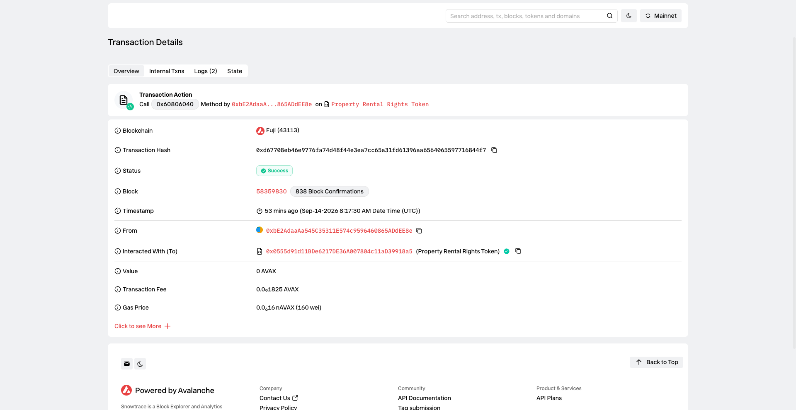
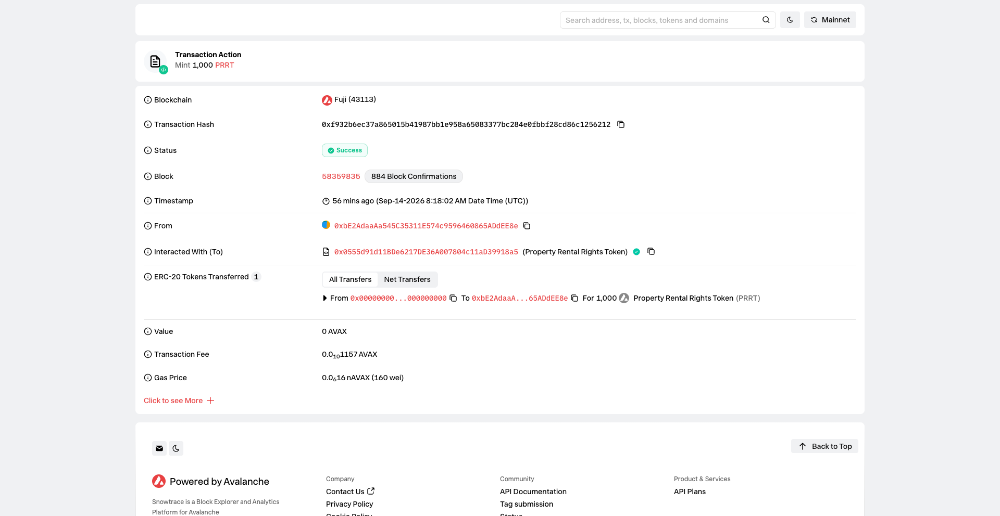
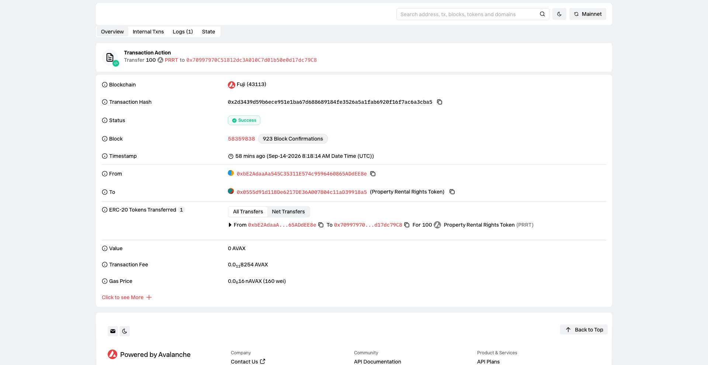
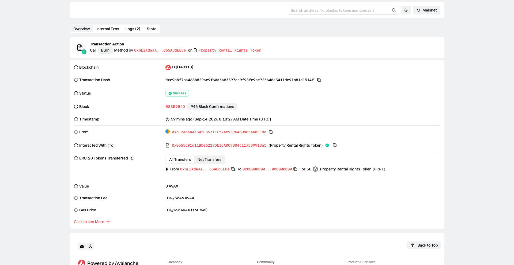

# Task 5：Avalanche RWA Token 合约实战 — 房地产租金收益权

> 对应课程：第五章 Avalanche RWA Token 合约实战  
> 截止提交：<9月20日> 24:00:00 (UTC+8)  
> 学员：monstersquad227

---

## 一、学员信息

| 项目 | 内容 |
| --- | --- |
| GitHub 用户名 | monstersquad227 |
| 作业项目仓库 | [Avalanche-101-Bootcamp](https://github.com/monstersquad227/Avalanche-101-Bootcamp) |

---

## 二、RWA 业务场景 — 房地产租金收益权

### 2.1 现实资产简介

本 Token 对应的现实资产为 **商业写字楼租金收益权**。

具体场景：一处位于城市核心商圈的甲级写字楼，建筑面积约 5,000 平方米，已与多家企业签订长期租赁合同。资产管理方将该物业未来一年的净租金收益打包为链上 RWA Token，向投资者发行。

### 2.2 资产托管方

| 角色 | 说明 |
| --- | --- |
| 资产管理方 | 合约部署者（Admin），负责审核并证明底层物业的真实性 |
| 资产托管方 | 与 Admin 为同一实体，在真实场景中应是持牌的房地产资产管理公司 |
| Token 发行方 | 持有 MINTER_ROLE 的地址，负责按资产份额发行 Token |

### 2.3 Token 对应关系

| 项目 | 内容 |
| --- | --- |
| Token 名称 | Property Rental Rights Token |
| Token 符号 | PRRT |
| Decimals | 18 |
| 锚定规则 | 1 PRRT = 对应物业年度净租金收益的 1/10,000 份额 |
| 示例 | 持有 100 PRRT 即拥有该物业 1% 的年度净租金收益权 |

### 2.4 业务行为映射

| 链上操作 | 业务含义 |
| --- | --- |
| `mint(to, amount)` | 资产管理方将新的租金收益权打包上链，向投资者发行 Token |
| `transfer(to, amount)` | 持有者在二级市场转让租金收益权 |
| `burn(amount)` | 持有者赎回收益权（退出投资）或物业被出售后回购销毁 |
| `updateAssetDocument(uri)` | 物业信息变更（续租、重新评估、新增物业）时更新链上证明 |

---

## 三、合约信息

### 3.1 合约地址与交易

| 项目 | 内容 |
| --- | --- |
| 网络 | **Avalanche Fuji C-Chain** |
| Chain ID | **43113** |
| 合约地址 | `0x0555d91d11BDe6217DE36A007804c11aD39918a5` |
| 部署交易 | `0xd67708eb46e9776fa74d48f44e3ea7cc65a31fd61396aa6564065597716844f7` |
| 区块浏览器 | [Snowtrace](https://testnet.snowtrace.io/address/0x0555d91d11BDe6217DE36A007804c11aD39918a5) |
| 部署者 | `0xbE2AdaaAa545C35311E574c9596460865ADdEE8e` |

### 3.2 合约源码

代码仓库路径：`./contract/src/PropertyRentalToken.sol`

---

## 四、功能说明

合约基于 **OpenZeppelin ERC20 + AccessControl**，实现了以下功能：

| 功能 | 函数 | 权限控制 | 说明 |
| --- | --- | --- | --- |
| Token 发行 | `mint(to, amount)` | 仅 MINTER_ROLE | 资产管理方发行租金收益权 Token |
| Token 销毁 | `burn(amount)` | 任何持有者 | 持有者赎回收益权 |
| Token 转账 | `transfer(to, amount)` | 任何持有者 | ERC20 标准转账（继承自 OpenZeppelin） |
| 余额查询 | `balanceOf(addr)` | 公开 | ERC20 标准查询 |
| 总供应量查询 | `totalSupply()` | 公开 | ERC20 标准查询 |
| 发行权限控制 | `mint()` 使用 `onlyRole(MINTER_ROLE)` | 合约层 | 非授权账户无法发行 Token |
| 资产证明更新 | `updateAssetDocument(uri)` | 仅 DEFAULT_ADMIN_ROLE | 更新链上资产证明文档引用 |
| 资产证明查询 | `assetDocument()` | 公开 | 返回当前资产证明 URI |
| 角色查询 | `isMinter(addr)` / `isAdmin(addr)` | 公开 | 查询地址权限 |

### 事件

| 事件 | 触发时机 |
| --- | --- |
| `TokensMinted(address to, uint256 amount)` | 发行 Token 时 |
| `TokensBurned(address from, uint256 amount)` | 销毁 Token 时 |
| `AssetDocumentUpdated(address updater, string oldDoc, string newDoc)` | 更新资产证明时 |

### 资产证明信息

资产证明存储在合约的 `assetDocument` 字段中，当前值为：

```
ipfs://QmAssetProof/CommercialOfficeBuilding/LeaseAgreement/2024
```

在真实 RWA 项目中，该字段可指向：
- **不动产权证书扫描件**（IPFS 存储）
- **租赁合同**（证明租金收入的真实性）
- **第三方评估报告**（证明物业价值）
- **审计报告**（证明租金流水）

该字段仅 `DEFAULT_ADMIN_ROLE` 可修改，确保资产证明的可信度和防篡改性。

---

## 五、材料

### 5.1 合约部署



```
Transaction: 0xd67708eb46e9776fa74d48f44e3ea7cc65a31fd61396aa6564065597716844f7
Status:      success
Contract:    0x0555d91d11BDe6217DE36A007804c11aD39918a5
```

### 5.2 Token 发行（Mint）



```
$ cast send 0x0555d91d11BDe6217DE36A007804c11aD39918a5 "mint(address,uint256)" \
  0xbE2AdaaAa545C35311E574c9596460865ADdEE8e 1000000000000000000000

Transaction: 0xf932b6ec37a865015b41987bb1e958a65083377bc284e0fbbf28cd86c1256212
Status:      success
Minted:      1000 PRRT to deployer
```

### 5.3 Token 转账（Transfer）



```
$ cast send 0x0555d91d11BDe6217DE36A007804c11aD39918a5 "transfer(address,uint256)" \
  0x70997970C51812dc3A010C7d01b50e0d17dc79C8 100000000000000000000

Transaction: 0x2d3439d59b6ece951e1ba67d688689184fe3526a5a1fab6920f16f7ac6a3cba5
Status:      success
Transferred: 100 PRRT from deployer to test address
```

### 5.4 Token 销毁（Burn）



```
$ cast send 0x0555d91d11BDe6217DE36A007804c11aD39918a5 "burn(uint256)" \
  50000000000000000000

Transaction: 0xc9b8f7ba4888829ae9f60a5a83397cc9f93fc9be72564de5411dc91b81d1514f
Status:      success
Burned:      50 PRRT from deployer
```

### 5.5 最终链上状态

```
Name:        Property Rental Rights Token
Symbol:      PRRT
TotalSupply: 950 PRRT (1000 minted - 50 burned)
Deployer:    850 PRRT
TestAddr:    100 PRRT
AssetDoc:    ipfs://QmAssetProof/CommercialOfficeBuilding/LeaseAgreement/2024
Admin:       true (deployer)
Minter:      true (deployer)
```

### 5.6 测试结果

全部 **25 个测试用例通过**（0 失败，0 跳过）：

```
$ forge test -vvv
Ran 25 tests for test/PropertyRentalToken.t.sol:PropertyRentalTokenTest
[PASS] test_Deployment_Success
[PASS] test_InitialRoles
[PASS] test_InitialAssetDocument
[PASS] test_Mint_ByMinter
[PASS] test_Mint_MultipleRecipients
[PASS] test_Revert_Mint_ByStranger
[PASS] test_Revert_Mint_ByInvestor
[PASS] test_Transfer_BetweenHolders
[PASS] test_Revert_Transfer_InsufficientBalance
[PASS] test_Burn_ByHolder
[PASS] test_Burn_EntireBalance
[PASS] test_Revert_Burn_ExceedsBalance
[PASS] test_TotalSupply_TracksMintAndBurn
[PASS] test_Balance_TracksTransfers
[PASS] test_UpdateAssetDocument_ByAdmin
[PASS] test_Revert_UpdateAssetDocument_ByStranger
[PASS] test_Revert_UpdateAssetDocument_ByInvestor
[PASS] test_Revert_Mint_ToZeroAddress
[PASS] test_Revert_Mint_ZeroAmount
[PASS] test_Revert_Burn_ZeroAmount
[PASS] test_Event_TokensMinted
[PASS] test_Event_TokensBurned
[PASS] test_Event_AssetDocumentUpdated
[PASS] test_AdminCanGrantMinterRole
[PASS] test_NewMinterCanMint

Suite result: ok. 25 passed; 0 failed; 0 skipped
```

### 5.7 测试覆盖场景

1. 合约部署成功
2. 初始 Token 信息正确（名称、符号、精度、初始 supply=0）
3. 授权账户可以发行 Token
4. 非授权账户不能发行 Token
5. 持有人可以转账
6. Token 可以被销毁
7. 总供应量和账户余额变化正确
8. 非授权账户不能修改资产证明信息
9. 错误操作能够被合约拒绝（mint to zero、mint 0、burn 0、超额 burn、超额 transfer）
10. 事件正确触发（TokensMinted、TokensBurned、AssetDocumentUpdated）
11. 角色管理（admin 可授予/撤销 minter 角色）


## 六、合约架构设计说明

### 权限模型

```
DEFAULT_ADMIN_ROLE (0x00)
├── 可管理角色（grant/revoke）
├── 可更新资产证明（updateAssetDocument）
│
MINTER_ROLE (keccak256("MINTER_ROLE"))
├── 可发行 Token（mint）
└── 由 DEFAULT_ADMIN_ROLE 授予/撤销
```

### 核心设计决策

1. **分离 Admin 与 Minter 角色**：资产管理方（Admin）和 Token 发行方（Minter）可以是不同实体，符合真实 RWA 项目中的职责分离要求

2. **资产证明链上存储**：`assetDocument` 字段存储 IPFS URI，既保证信息透明度，又避免了将大文件直接上链的 Gas 成本

3. **基于 OpenZeppelin**：使用经过审计的 ERC20 和 AccessControl 实现，降低安全风险

4. **事件驱动**：所有关键操作均触发事件，便于链下系统追踪资产变动
