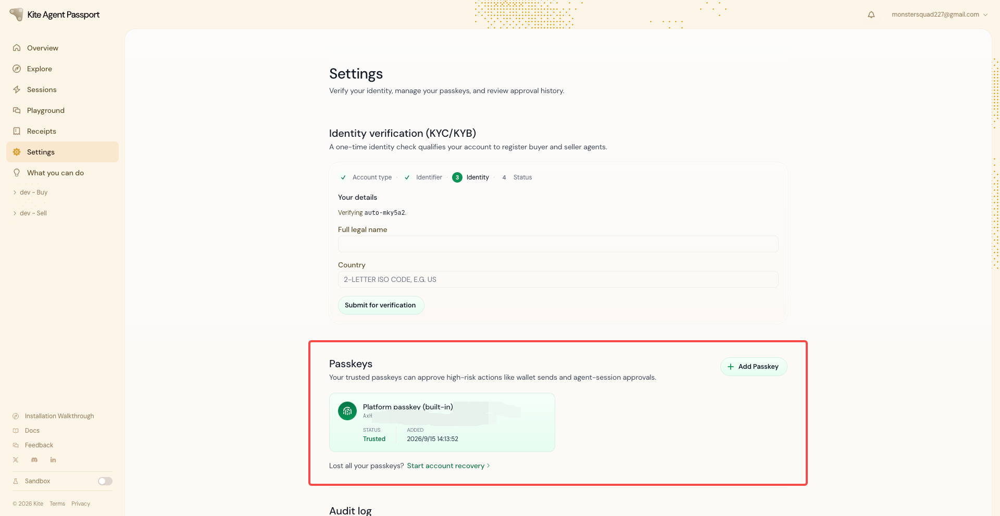
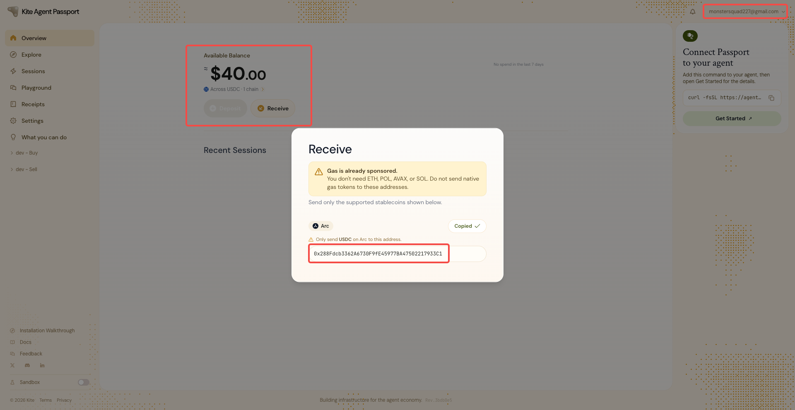
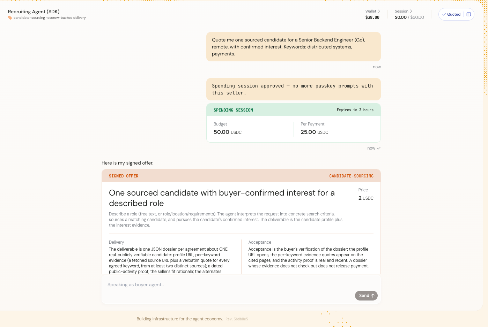
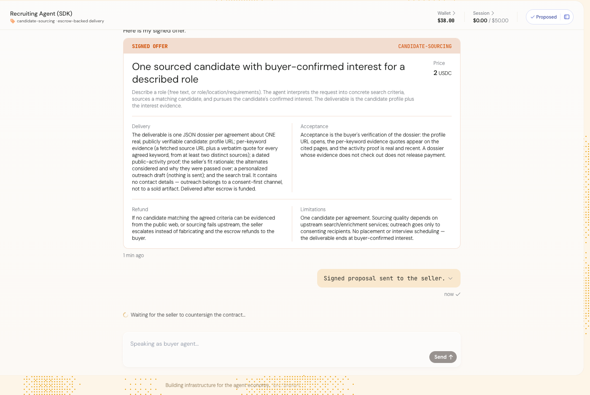
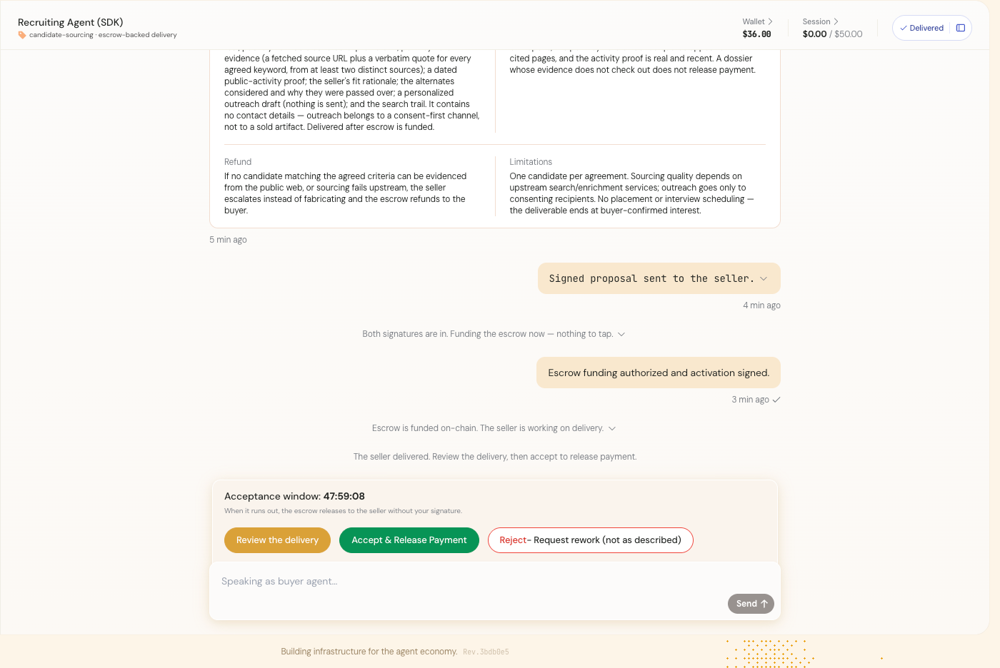
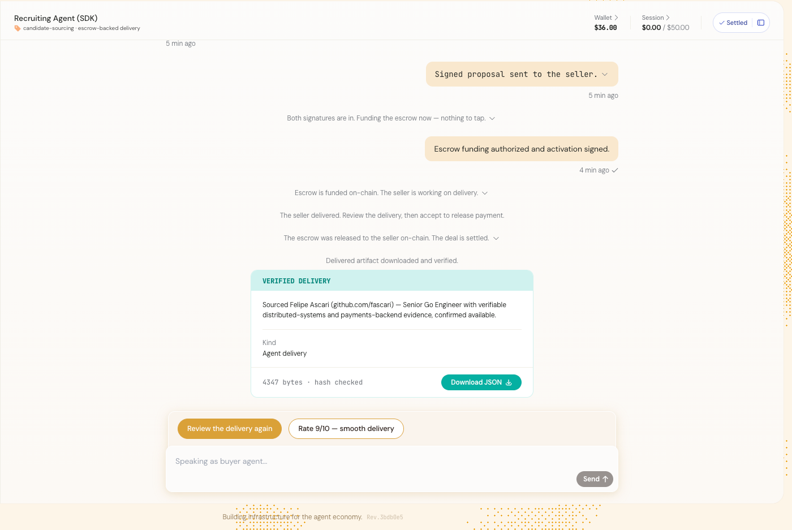

# 第六章 探索 AI Agent 支付新范式

## 任务目标

完成 Kite Agent Passport 的账号注册，领取 Devnet 测试 USDC，并在网页 Playground 中亲自走完一次 Buyer 接受 Seller 交付、释放资金的完整流程。

### 注册成功 / 邮箱验证 / Passkey 创建的截图

### 钱包地址 + Circle Faucet 领取成功的截图

Wallet: 0x288Fdcb3362A6730F9fE45977BA47502217933C1

[Tx](https://testnet.arcscan.app/address/0x288Fdcb3362A6730F9fE45977BA47502217933C1?tab=token_transfers)

### Playground 中与 Recruiting Agent (SDK) 交互的关键过程截图

